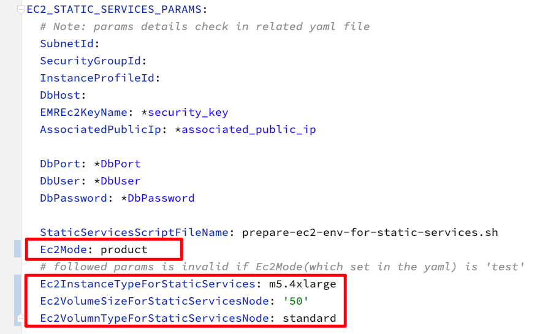

# How to deploy a Kylin4 Cluster on EC2

## Target

1. Deploy Kylin4 on Ec2 with Spark Standalone mode.
2. Removed the dependency of hadoop and start quickly.
3. Support to scale worker nodes for Spark Standalone Cluster quickly and conveniently.
4. Improve performance for query in using  `Local Cache + Soft Affinity` feature (`Experimental Feature`), please check the [details](https://mp.weixin.qq.com/s/jEPvWJwSClQcMLPm64s4fQ).
5. Support to monitor cluster status with prometheus server and granfana.
6. Create a Kylin4 cluster on EC2 in 10 minutes.

## Structure

When cluster was created, services and nodes will like below:


- Services are created as the number order from 1 to 4.
- Every machine node is presented by a white box. 
- `Kylin Node` and `Spark Worker` Node can be scaled.
- Whole cluster will has only one RDS and only one the machine node which contains `Prometheus Server` and `Hive MetaStore` service.

## Quick Start

1. Initialize aws account credential on local mac, please check [details](#localaws).
   
2. Download the source code: 
   
   ```shell
   git clone https://github.com/Kyligence/kylin-tpch.git && cd kylin-tpch && git checkout deploy-kylin-on-aws
   ```
   
3. Modify the `kylin-tpch/kylin_config.yml`.
   
   1. Set the `AWS_REGION`.
   
   2. Set the `IAMRole`,please check [details](#IAM).
   
   3. Set the `S3_URI`, please check [details](#S3).
   
   4. Set the `KeyName`,please check [details](#keypair).
   
   5. Set the `CIDR_IP`, make sure that the `CIDR_IP` match the pattern `xxx.xxx.xxx.xxx/16[|24|32]`.
   
      > Note: 
      >
      > 1. this `CIDR_IP` is the specified IPv4 or IPv6 CIDR address range which an inbound rule can permit instances to receive traffic from.
      >
      > 2. In one word, it will let your mac which ip is in the `CIDR_IP` to access instances.
   
4. Init local env.

```She
$KYLIN_TPCH_HOME/bin/init.sh
```

> Note: Following the information into a python virtual env and get the help messages. 

5. Execute commands to deploy a `default` cluster.

```shell
$ python ./deploy.py --type deploy
```

After `default` cluster is ready, you will see the message `Kylin Cluster already start successfully.` in the console. 

6. Execute commands to list nodes of cluster.

```shell
$ python ./deploy.py --type list
```

Then you can check the `public ip` of Kylin Node.

You can access `Kylin` web by `http://{kylin public ip}:7070/kylin`.

7. Destroy the `default` cluster.

```shell
$ python ./deploy.py --type destroy
```


## Quick Start For Multiple Clusters

> Pre-steps is same as Quick Start steps which is from 1 to 5.

1. Modify the config `CLUSTER_INDEXES` for multiple cluster.

   > Note:
   >
   > 1. `CLUSTER_INDEXES` means that cluster index is in the range of `CLUSTER_INDEXES`. 
   > 2. If user create multiple clusters, `default` cluster always be created. If `CLUSTER_INDEXES` is (1, 3), there will be 4 cluster which contains the cluster 1, 2, 3 and `default` will be created if user execute the commands.
   > 3. Configs for multiple clusters always are same as the `default` cluster to read from `kylin-tpch/kylin_configs.yaml`

2. Copy `kylin.properties.template` for expecting clusters to deploy, please check the [details](#cluster). 

3. Execute commands to deploy `all` clusters.

   ```shell
   python ./deploy.py --type deploy --cluster all
   ```

4. Destroy all clusters.

   ```shell
   python ./deploy.py --type destroy --cluster all
   ```


## Prerequisites 

### Download source code & checkout to branch of `deploy-kylin-on-aws`

commands:

```shell
git clone https://github.com/Kyligence/kylin-tpch.git && cd kylin-tpch && git checkout deploy-kylin-on-aws
```

### Initiliaze an AWS Account

#### I. Create an `IAM` role<a name="IAM"></a> 

> Note: 
>
> ​	`IAM` role must have the access  which contains `AmazonEC2RoleforSSM` , `AmazonSSMFullAccess` and `AmazonSSMManagedInstanceCore`.
>
> ​	This `IAM` Role will be used to initialize every ec2 instances which are for creating an kylin4 cluster on aws. And it will configure in `Initilize Env of Local Mac` part.

#### II. Create a `User` 

> Note:
>
> ​	The `User` who is created in aws will be used to execute some operations on EC2 instance. So the `User` must has some authorities as below.

| Services            | Access level                                           | Resources     | Request condition |
| ------------------- | ------------------------------------------------------ | ------------- | ----------------- |
| **Cloudformation**  | **Limited**: List, Read,Write                          | All Resources | None              |
| **EC2**             | **Limited**: Read                                      | All Resources | None              |
| **IAM**             | **Limited**: List, Read, Write, Permissions management | All Resources | None              |
| **RDS**             | **Limited**: List, Write, Tagging                      | All Resources | None              |
| **S3**              | **Limited**: Write, Permissions management, Tagging    | All Resources | None              |
| **SNS**             | **Limited**: List                                      | All Resources | None              |
| **STS**             | **Limited**: Write                                     | All Resources | None              |
| **Systems Manager** | **Limited**: Write                                     | All Resources | None              |

#### III. Login the created `User` to create key pair and Access Key<a name="keypair"></a>

> Note:
>
> ​	To deploy EC2 instances for Kylin4 Cluster need key pair and access key.

##### 1. Create a new `Key Pair` in the `EC2 -> Key pairs`


##### 2. Genrate a new `Access Key` which in the `My Security Credentials`

> Note: 
>
> ​	Please download the generated the csv file of `Access Key`  immediately. Get the `Access Key `  and `Secret Key` to initilize local mac to access aws.


### Initialize a S3 direcotry<a name="S3"></a> 

#### I. Create a directory on S3

> Note: 
>
> ​	This directory will store tars, scripts and jars below. And it will also be the root path of working dir for kylin4.

Example: make a directory named `kylin4-aws-test` . You can also create a directory named what you like.


#### **(Optional)** II. Manually Download packages & Upload them to the S3 path which suffix is `*/tar`

> Note:
>
> ​	This step will automatically do by tools. So you can skip this step, or you want to check packages by yourself.


> Create the directory named `tar` **in the path which was created by yourself**.  
>
> As example, the full path would be `s3://.../kylin4-aws-test/tar`.

1. Download Kylin4 package by [official website](https://kylin.apache.org/download/).
2. Download Hadoop, [version 3.2.0](https://archive.apache.org/dist/hadoop/common/hadoop-3.2.0/hadoop-3.2.0.tar.gz).
3. Download Spark with hadoop3.2, [version 3.1.1](https://archive.apache.org/dist/spark/spark-3.1.1/spark-3.1.1-bin-hadoop3.2.tgz).
4. Download Hive, [version 2.3.9](https://archive.apache.org/dist/hive/hive-2.3.9/apache-hive-2.3.9-bin.tar.gz).
5. Download Zookeeper, [version 3.4.9.](https://archive.apache.org/dist/zookeeper/zookeeper-3.4.9/zookeeper-3.4.9.tar.gz)
6. Download JDK, [version 1.8_301](https://www.oracle.com/java/technologies/javase/javase8u211-later-archive-downloads.html).
7. Download Node Exporter, [version 1.3.1.](https://github.com/prometheus/node_exporter/releases/download/v1.3.1/node_exporter-1.3.1.linux-amd64.tar.gz)
8. Download Prometheus Server, [version 2.31.1](https://github.com/prometheus/prometheus/releases/download/v2.31.1/prometheus-2.31.1.linux-amd64.tar.gz).
9. Download Kylin4 package with local cache + soft affinity feature by [public website.](https://s3.cn-north-1.amazonaws.com.cn/public.kyligence.io/kylin/tar/apache-kylin-4.0.0-bin-spark3-soft.tar.gz)


> Note: 
>   	If you want to use Kylin4 with local cache + soft affinity feature, please download the `experimental` package above.


#### (Optional) III. Upload  `kylin-tpch/backup/jars/*` to the S3 Path which suffix is `*/jars`

> Note:
>
> ​	This step will automatically do by tools. So you can skip this step, or you want to check jars by yourself.


> Create the directory named `jars` **in the path which was created by yourself**.  
>
> As example, the full path would be `s3://.../kylin4-aws-test/jars`.

Kylin4 needed extra jars

- Basic jars
    - commons-configuration-1.3.jar
    - mysql-connector-java-5.1.40.jar
- Local Cache + Soft Affinity feature needed jars
    - alluxio-2.6.1-client.jar
    - kylin-soft-affinity-cache-4.0.0-SNAPSHOT.jar


#### (Optional) IV. Upload `kylin-tpch/backup/scripts/*` to the S3 Path which suffix is `*/scripts`

> Note:
>
> ​	This step will automatically do by tools. So you can skip this step, or you want to check scripts by yourself.


> Create the directory named `scripts` **in the path which was created by yourself**.  
>
> As example, the full path would be `s3://.../kylin4-aws-test/scripts`.

Scripts:

- prepare-ec2-env-for-kylin4.sh
- prepare-ec2-env-for-spark-master.sh
- prepare-ec2-env-for-spark-slave.sh
- prepare-ec2-env-for-static-services.sh
- prepare-ec2-env-for-zk.sh


### Initilize Env Of Local Mac

#### I.  Initilize a aws account on local mac to access AWS<a name="localaws"></a>

> Use `Access Key` and `Secret Key ` above to Initilize a aws account on local mac. 

```shell
$ aws configure
AWS Access Key ID : *************
AWS Secret Access Key : *************
Default region name : cn-northwest-1
Default output format : json
```

> Note:
>
> 1. If this command got the response `-bash: aws: command not found`, please check in  [Getting started with the AWS CLI](https://docs.aws.amazon.com/cli/latest/userguide/cli-chap-getting-started.html).
> 2. Region name can be in [Available Regions](https://docs.aws.amazon.com/AWSEC2/latest/UserGuide/using-regions-availability-zones.html#concepts-available-regions).
> 3. Default output format is `json`.

#### II. Init a Python virtual env

> Note: 
>
> ​	Make sure that your mac already has a Python which version is 3.6.6 or later.  

commands: 

```shell
$ ./bin/init.sh
```

> Note: Follow the information after `./bin/init.sh` to activate the python virtual env.

#### III. Configure the `kylin-tpch/kylin_configs.yaml`

**Required parameters**:

- `AWS_REGION`: Current region for EC2 instances.
- `IAMRole`: IAM role which has the access to aws authority. This parameter will be set to created **name** of IAM role.
- `S3_URI`: the prefix path of storing `jars/scripts/tar`. As example, this parameter will be set to `s3://.../kylin4-aws-test`.
- `KeyName`: Security key name is a set of security credentials that you use to prove your identity when connecting to an instance. This parameter will be set to created **name** of  `key pair` .
- `CIDR_IP`:  An inbound rule permits instances to receive traffic from the specified IPv4 or IPv6 CIDR address range, or from the instances associated with the specified security group.
- `DB_IDENTIFIER`: this param should be only one in the `RDS -> Databases` . And it will be the name of created RDS database.
- `DB_PORT`: this param will be the port of created RDS database, default is `3306`.
- `DB_USER`: this param will be a login ID for the master user of your DB instance, default is `root`.
- `DB_PASSWORD`: this param will be the password of `DB_USER` to access DB instance. default is `123456test`, it's strongly suggest you to change it.

#### IV. Configure the `kylin.properties` in `backup/properties` directories.<a name="cluster"></a>

1. The `kylin.properties` is for starting kylin instance in the cluster.
2. Default cluster will check the `kylin.properties` in the `kylin-tpch/backup/properties/default`, and other specific cluster will check the related num directory such as `1`, `2` and `3`.
3. User need to create new dir for the cluster num in `kylin-tpch/backup/properties`, and name it to the `${cluster num}`, such as `1`, `2` ,`3`  and so on. The range of cluster num must be in `CLUSTER_INDEXES` which is configured in the `kylin-tpch/kylin_configs.yml`.
4. Follow the `2.` step, copy the `kylin.properties.template` which is in `kylin-tpch/backup/properties/templates` to the related `${cluster num} ` directories， and rename the template to `kylin.properties`. 
5. The range of cluster nums must match the the config `CLUSTER_INDEXES`, such as `CLUSTER_INDEXES: (1, 3)` then the directories must be `1`, `2`,`3` in the `kylin-tpch/backup/properties`.


6. Cusomize the config which you want to change except the config which contains `{{ }}` mark.

7. If the related `kylin.properties` was filled with cluster information, a file named `.rendered` will create in the directory.


7. **(Important !!!)** If you want to re-fill the `kylin.properties` for a `kylin` node in specify cluster,  you need to remove the `.rendered` file and re-copy the `kylin.propertie.template` . Redo steps from `3` to `6`.

## Advanced Configs

> Note:
>
> ​	If you want quickly to start Kylin4 Cluster on aws, then skip this part and jump to the part of  [`Run`](#run) directly. 

### Advaced Params

There are `9` modules params for tools.  Introductions as below:

- EC2_VPC_PARAMS: this params of module are for creating a vpc.

- EC2_RDS_PARAMS: this params of module are for creating a RDS.

- EC2_STATIC_SERVICES_PARAMS: this params of module are for creating a Prometheus Server and other static services.

- EC2_ZOOKEEPERS_PARAMS: this params of module are for creating a Zookeeper Cluster.

- EC2_SPARK_MASTER_PARAMS: this params of module are for creating a Spark Master node.

- EC2_KYLIN4_PARAMS: this params of module are for creating a Kylin4.

- EC2_SPARK_WORKER_PARAMS: this params of module are for creating **Spark Workers**, default is **3** spark workers for all clusters.

- EC2_KYLIN4_SCALE_PARAMS: this params of module are for scaling **Kylin4 nodes**, the range of **Kylin4 nodes** is related to `KYLIN_SCALE_UP_NODES` and `KYLIN_SCALE_DOWN_NODES`.

  > Note:
  >
  > 	1. `KYLIN_SCALE_UP_NODES` is for the range of kylin nodes to scale up. 
  > 	1. `KYLIN_SCALE_DOWN_NODES` is for the range of kylin nodes to scale down.
  > 	1. The range of `KYLIN_SCALE_UP_NODES` must be contain the range of `KYLIN_SCALE_DOWN_NODES`.
  > 	1. **They are effective to all clusters which is not only `default cluster` but also other cluster which index is in `${CLUSTER_INDEXES}`.**

- EC2_SPARK_SCALE_SLAVE_PARAMS: this params of module are for scaling **Spark workers**, the range of **Spark Workers ** is related to `SPARK_WORKER_SCALE_UP_NODES` and `SPARK_WORKER_SCALE_DOWN_NODES`.

  > Note:
  >
  > 	1. `SPARK_WORKER_SCALE_UP_NODES` is for the range for spark workers to scale up. **It's effective to all clusters which is not only `default cluster` but also other cluster which index is in `${CLUSTER_INDEXES}`.**
  > 	1. `SPARK_WORKER_SCALE_DOWN_NODES` is for the range for spark workers to scale down. **It's effective to all clusters which is not only `default cluster` but also other cluster which index is in `${CLUSTER_INDEXES}`.**
  > 	1. The range of `SPARK_WORKER_SCALE_UP_NODES` must be contain the range of `SPARK_WORKER_SCALE_DOWN_NODES`.
  > 	1. **They are effective to all clusters which is not only `default cluster` but also other cluster which index is in `${CLUSTER_INDEXES}`.**

### Customize Configs

User also can customize the params in `kylin-tpch/kylin_configs.yaml` to create an expected instances. Such as **the type of instance**, **the volume size of instance** and **the volumn type of instance** and so on.

1. If you want to customize configs for instances, you must modify the `EC2Mode` from `test` to `product` in the ``kylin-tpch/kylin_configs.yml`.
2. `Ec2Mode` is only in the parms of `EC2_STATIC_SERVICES_PARAMS`, `EC2_ZOOKEEPERS_PARAMS`, `EC2_SPARK_MASTER_PARAMS`, `EC2_KYLIN4_PARAMS`, `EC2_SPARK_WORKER_PARAMS`, `EC2_KYLIN4_SCALE_PARAMS` and `EC2_SPARK_SCALE_SLAVE_PARAMS`.
3. So instances can be customized to effect `Monitor Node`(`EC2_STATIC_SERVICES_PARAMS`), `Zookeeper Nodes`(`EC2_ZOOKEEPERS_PARAMS`), `Spark Master Node` ( `EC2_SPARK_MASTER_PARAMS`), `Kylin4 Node`( `EC2_KYLIN4_PARAMS`), `Spark workers `(`EC2_SPARK_WORKER_PARAMS`), `Kylin4 scale nodes`(`EC2_KYLIN4_SCALE_PARAMS`) and `Spark scale workers`(`EC2_SPARK_SCALE_SLAVE_PARAMS`).
4. Now`Ec2Mode` **only effect** the related params are `Ec2InstanceTypeFor*`,`Ec2VolumeSizeFor*`  and `Ec2VolumnTypeFor`* in the params modules.
5. If you don't change `ENABLE_LOCAL_CACHE_SOFT_AFFINITY` from `"false"` to `"true"` then cluster will created normally without `Local Cache + Soft Affinity` feature!


#### Example

As an example in `EC2_STATIC_SERVICES_PARAMS`:

- change `Ec2Mode `  from `test`to `product`
- change `Ec2InstanceTypeForStaticServices`  from `m5.2xlarge` to `m5.4xlarge`.
- change `Ec2VolumeSizeForStaticServicesNode`  from `'20'` to `'50'.`
- change `Ec2VolumnTypeForStaticServicesNode` from `gp2` to `standard`.
- Then create the node of static service node will be a ``m5.4xlarge` and it attach a volume which size is `50` and type is `standard`.




## Monitor

Current tool also support the feature of monitor for cluster.

1. User can execute `python ./deploy.py --type list` to get the `public ip` of `Static Service` .
2. User can access the `public ip` of `Static Service` and the port is `9090` to access `Prometheus` server.
3. User can access the `public ip` of `Static Service` and the port is `3000` to access `Granfana` server.

### Quick Start For Prometheus

1. Input a `Metric`, user can get the available metric from the metric exploer.


2. Execute a query to generate a dashboad.


3. Add a new panel for a new query.


More details about `PromQL` for metric exploer, please check [official website](https://prometheus.io/docs/prometheus/latest/querying/).

#### Spark Metric In Prometheus

>  Note:
>
> 1. Current tool support to monitor spark metrics, more detail in [Spark Metrics](https://spark.apache.org/docs/3.1.1/monitoring.html#executor-metrics).
> 2. Spark metrics is start with `metrics` in Prometheus server.
>
> 

 ### Quick Start For Granfana

1. Login into dashboard with default user and password which are all `admin` at the first time.
2. Configure the connection to prometheus server.


> Just config the url with syntax `http://${private ip of static service}:9090` . The `private ip of static service` can be from the `python ./deploy.py --type list` command.

3. Add a new panel.


4. Add a new panel or other.


5. Edit & Apply the panel.


More details about the usage of Granfana in [official website](https://grafana.com/docs/grafana/latest/).

## Run<a name="run"></a>

Command:

```shell
python ./deploy.py --type [deploy|destroy|list|scale] --scale-type [up|down] --node-type [kylin|spark_worker] [--cluster {1..6}|all|default]
```

- deploy: create cluster(s).

- destroy: destroy created cluster(s).

- list: list alive nodes which are with stack name, instance id, private ip and public ip.

- scale: Must be used with `--scale-type` and `--node-type`.

  > Note:
  >
  > 1. Current support to scale up/down `kylin` or `spark_worker` for specific cluster.
  > 2. Before scale up/down `kylin` or `spark_worker` nodes, Cluster services must be ready.
  > 2. If you want to scale a `kylin` or `spark_worker` node to a specify cluster, please add the `--cluster ${cluster num}` to specify the expected node add to the cluster `${cluster num}`.

### Command of deploy

- Deploy default cluster

```shell
$ python ./deploy.py --type deploy [--cluster default]
```

- Deploy a cluster with specific cluster index. 

```shell
$ python ./deploy.py --type deploy --cluster ${cluster num}
```

> Note: the `${cluster num}` must be in the range of `CLUSTER_INDEXES`.

- Deploy all cluster which contain default cluster and all cluster which index in the range of `CLUSTER_INDEXES`.

```sHe
$ python ./deploy.py --type deploy --cluster all
```

### Command of destroy

> Note:
>
> ​		Destroy all cluster will not delete vpc, rds and monitor node. So if user don't want to hold the env, please set the `ALWAYS_DESTROY_ALL` to be `'true'`.

- Destroy default cluster

```shell
$ python ./deploy.py --type destroy [--cluster default]
```

- Destroy a cluster with specific cluster index. 

```shell
$ python ./deploy.py --type destroy --cluster ${cluster num}
```

> Note: the `${cluster num}` must be in the range of `CLUSTER_INDEXES`.

- Destroy all cluster which contain default cluster and all cluster which index in the range of `CLUSTER_INDEXES`.

```shell
$ python ./deploy.py --type destroy --cluster all
```

### Command of list

- List nodes which are with **stack name**, **instance id**, **private ip** and **public ip** in **available stacks** .

```shell
$ python ./deploy.py --type list
```

### Command of scale

> Note:
>
> 1. Scale command must be used with `--scale-type` and `--node-type`.
> 2. If scale command not specify a cluster num, then the scaled node(kylin or spark worker) will be add to `default`cluster.
> 3. Scale command **not support** to **scale** node (kylin or spark worker) to **all clusters** at **one time**. It means that `python ./deploy.py --type scale --scale-type up[|down] --node-type kylin[|spark_worker] --cluster all` is invalid commad.
> 4. Scale params which are `KYLIN_SCALE_UP_NODES`, `KYLIN_SCALE_DOWN_NODES`, `SPARK_WORKER_SCALE_UP_NODES` and `SPARK_WORKER_SCALE_DOWN_NODES` effect on all cluster. So if user want to scale node for a specify cluster, then modify the scale params before **every run time.**
> 5. **(Important!!!)** Current cluster is created with default `3` spark workers and `1` kylin node. The `3` spark workers can not be scaled down. The `1`  kylin node also can not be scaled down.
> 6. **(Important!!!)** Cluster can only scale up or down the range of nodes which is in  `KYLIN_SCALE_UP_NODES`, `KYLIN_SCALE_DOWN_NODES`, `SPARK_WORKER_SCALE_UP_NODES` and `SPARK_WORKER_SCALE_DOWN_NODES` . Not the default `3` spark workers and `1` kylin node in the cluster.
> 7. **(Important!!!)**  If user don't want to create a cluster with `3` default spark workers, then user can remove the useless node module in the `Ec2InstanceOfSlave0*` of `kylin-tpch/cloudformation_templates/ec2-cluster-spark-slave.yaml`. User need to know about the syntax of cloudformation as also.

- Scale up/down kylin/spark workers in default cluster

```shell
python ./deploy.py --type scale --scale-type up[|down] --node-type kylin[|spark_worker] [--cluster default]
```

- Scale up/down kylin/spark workers in a specific cluster

```shell
python ./deploy.py --type scale --scale-type up[|down] --node-type kylin[|spark_worker] --cluster ${cluster num}
```

> Note: the `${cluster num}` must be in the range of `CLUSTER_INDEXES`.


## Notes

1. Current tool already open the port for some services. You can access the service by `public ip` of related EC2 instance.
   1. `SSH`: 22
   2. `Granfana`:  3000
   3. `Prmetheus`:  9090, 9100
   4. `Kylin`: 7070
   5. `Spark`: 8080. 4040.
2. More about cloudformation syntax, please check [aws website](https://docs.aws.amazon.com/AWSCloudFormation/latest/UserGuide/Welcome.html).
3. Current Kylin version is 4.0.0.
4. Current Spark version is 3.1.1.
