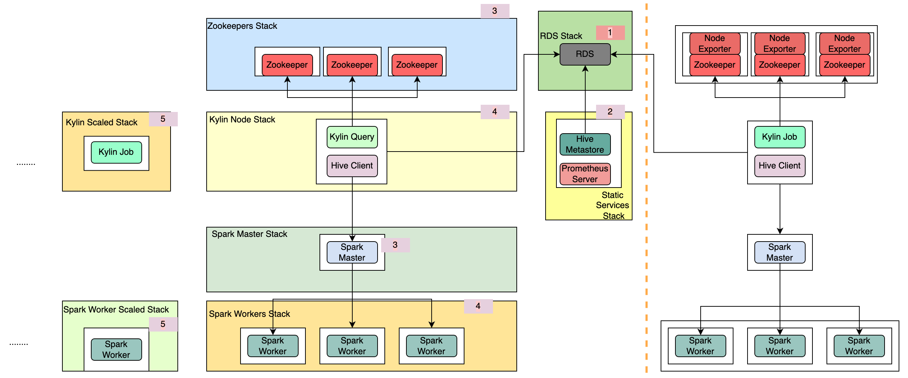

# How to deploy a Kylin4 Cluster on EC2

## Target

1. Deploy Kylin4 on Ec2 with Spark Standalone mode in `10` minutes.
2. Support to scale nodes (Kylin & Spark Worker) quickly and conveniently.
3. Improve performance for query of Kylin4 in using  `Local Cache + Soft Affinity` feature (`Experimental Feature`), please check the [details](https://kylin.apache.org/blog/2021/10/21/Local-Cache-and-Soft-Affinity-Scheduling/).
4. Support to monitor status of cluster with `prometheus server` and `granfana`.

## Architecture

When cluster created, services and nodes will like below:



- Services are created as the number order from 1 to 4.
- Every machine node is presented by a white box. 
- `Kylin Node` and `Spark Worker` Node can be scaled.
- Whole cluster will has only one RDS and only one the machine node which contains `Prometheus Server` and `Hive MetaStore` service.

## Quick Start

1. Initialize aws account credential on local machine, please check [details](./readme/prerequisites.md#localaws).
   
2. Download the source code: 
   
   ```shell
   git clone https://github.com/apache/kylin.git && cd kylin && git checkout kylin4_on_cloud
   ```
   
3. Modify the `kylin_config.yml`.
   
   1. Set the `AWS_REGION`.
   
   2. Set the `IAMRole`,please check [details](./readme/prerequisites.md#IAM).
   
   3. Set the `S3_URI`, please check [details](./readme/prerequisites.md#S3).
   
   4. Set the `KeyName`,please check [details](./readme/prerequisites.md#keypair).
   
   5. Set the `CIDR_IP`, make sure that the `CIDR_IP` match the pattern `xxx.xxx.xxx.xxx/16[|24|32]`.
   
      > Note: 
      >
      > 1. this `CIDR_IP` is the specified IPv4 or IPv6 CIDR address range which an inbound rule can permit instances to receive traffic from.
      >
      > 2. In one word, it will let your mac which ip is in the `CIDR_IP` to access instances.
   
4. Init local env.

```shell
$ bin/init.sh
```

> Note: Following the information into a python virtual env and get the help messages. 

5. Execute commands to deploy a `default` cluster, please check [details](./readme/prerequisites.md#cluster).

```shell
$ python deploy.py --type deploy
```

After `default` cluster is ready, you will see the message `Kylin Cluster already start successfully.` in the console. 

6. Execute commands to list nodes of cluster.

```shell
$ python deploy.py --type list
```

Then you can check the `public ip` of Kylin Node.

You can access `Kylin` web by `http://{kylin public ip}:7070/kylin`.


7. Destroy the `default` cluster.

```shell
$ python deploy.py --type destroy
```

## Notes

1. More details about `quick start for mutilple clusters`, see document [quick start for mutilple clusters](./readme/quick_start_for_multiple_clusters.md)
1. More details about `commands` of tool, see document [commands](./readme/commands.md).
2. More details about `prerequisites` of tool, see document [prerequisites](./readme/prerequisites.md).
3. More details about `advanced configs` of tool, see document [advanced configs](./readme/advanced_configs.md).
4. More details about `monitor services` supported by tool, see document [monitor](./readme/monitor.md).
5. Current tool already open the port for some services. You can access the service by `public ip` of related EC2 instance.
   1. `SSH`: 22
   2. `Granfana`:  3000
   3. `Prmetheus`:  9090, 9100
   4. `Kylin`: 7070
   5. `Spark`: 8080. 4040.
6. More about cloudformation syntax, please check [aws website](https://docs.aws.amazon.com/AWSCloudFormation/latest/UserGuide/Welcome.html).
7. Current Kylin version is 4.0.0.
8. Current Spark version is 3.1.1.
