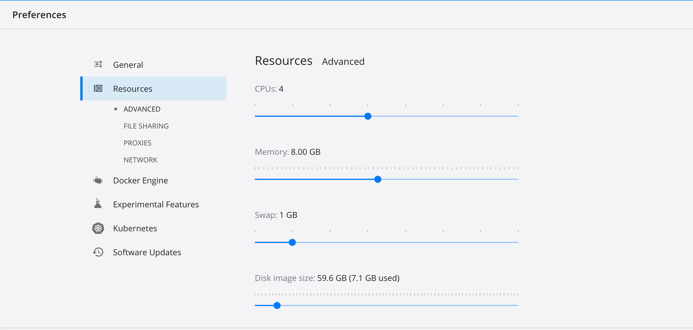
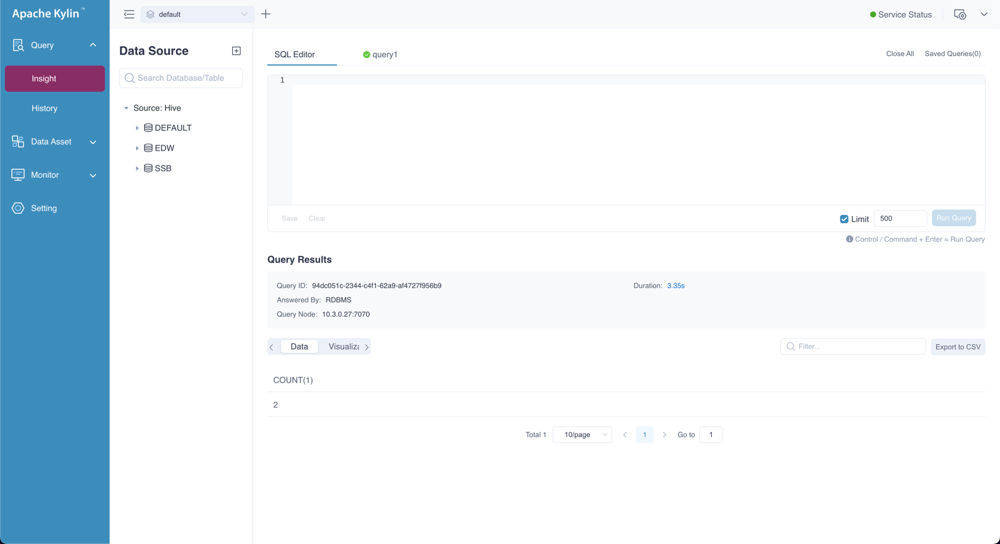
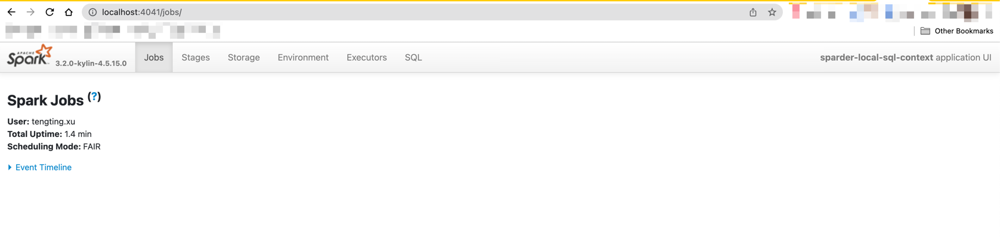
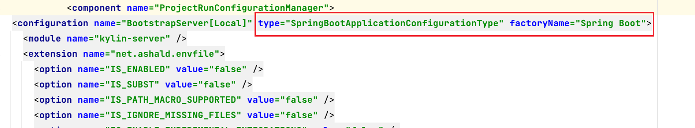

### Requirements

1. JDK 1.8 + version, Docker 3.8 version and above

2. Executing `mvn clean install -DskipTests` by manually and make sure compile is ok.

3. Install Docker Desktop on local machine and configure the Docker resource, as follows is the lowest requirement：

   

### Usage

1) Executing `./dev-support/local/local.sh init` to initialize env.

- Current step will download the spark to local, and if download failed will notify user to download by the scripts.

  > Note: If the spark already exists, the spark will delete and re-download it.

- Current step will load the `run configuration` automatically to IDEA.

- Current step will install frontend env.

*Executing Result*

* Run Configuration for IDEA Debug*

3) Executing `./dev-support/sandbox/sandbox.sh up` to download images and start the container。

*Container started successfully*

4) After start IDEA Debug and access to `http://localhost:8080/` to check Kylin started successfully.

* Run into Kylin web and enjoy.

* Access to `http://localhost:4041/` to check sparder started successfully.
  

### Other Usage

1) `./dev-support/sandbox/sandbox.sh stop`        : Stop the running containers

2) `./dev-support/sandbox/sandbox.sh start`       : Start all stopped containers

3) `./dev-support/sandbox/sandbox.sh ps`          : List all containers

4) `./dev-support/sandbox/sandbox.sh down`        : Stop all containers and delete them

5) `./dev-support/sandbox/sandbox.sh interactive` : Enter in specific container

### FAQ

1) After executing `sandbox.sh init` and runConfiguration has nothing change. Then replace `type="SpringBootApplicationConfigurationType" factoryName="Spring Boot"` to `type="Application" factoryName="Application"` in `.idea/runconfigurations/BootstrapServer_local.xml`.

