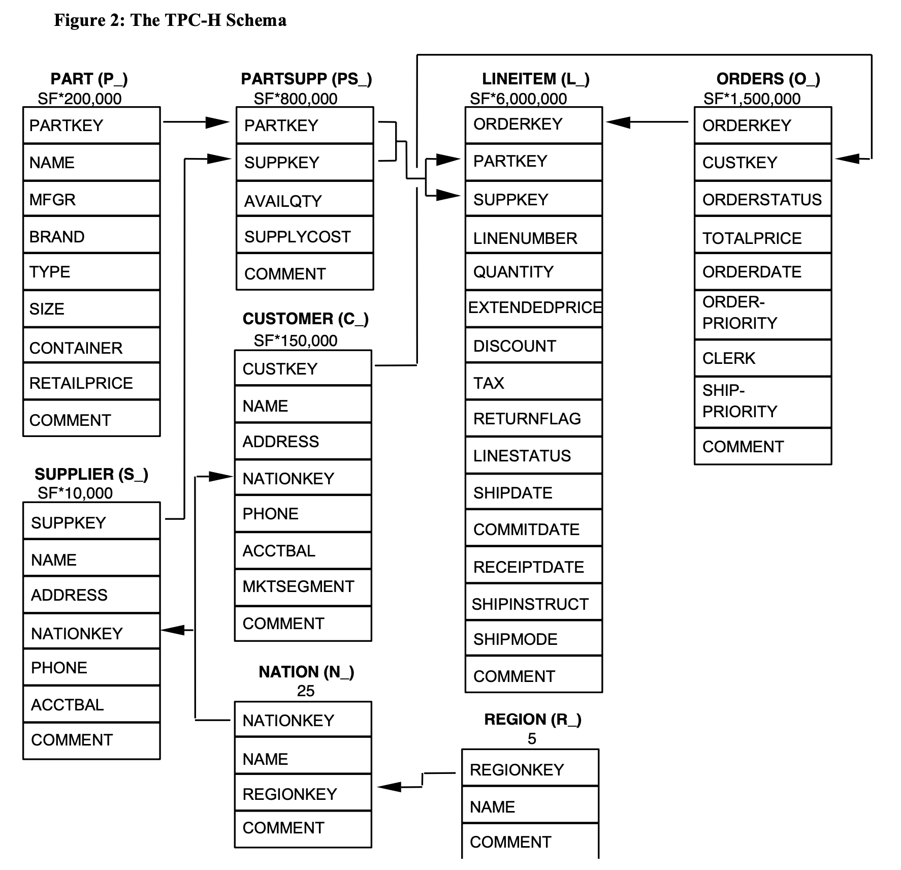

# Modeling of Kylin 5.0.0 for TPC-H

---

# Background

### What is TPC-H ?




# How to create Kylin model based on query pattern


### Query 1 : Pricing Summary Report Query

#### Original Version
```sql
select 
       l_returnflag,
       l_linestatus,
       sum(l_quantity)                                       as sum_qty,
       sum(l_extendedprice)                                  as sum_base_price,
       sum(l_extendedprice * (1 - l_discount))               as sum_disc_price,
       sum(l_extendedprice * (1 - l_discount) * (1 + l_tax)) as sum_charge,
       avg(l_quantity)                                       as avg_qty,
       avg(l_extendedprice)                                  as avg_price,
       avg(l_discount)                                       as avg_disc,
       count(*)                                              as count_order
from tpch_cn.lineitem
where l_shipdate <= '1998-12-01' - interval 'DELTA' day -- DELTA is randomly selected within [60. 120].
group by l_returnflag,
         l_linestatus
order by l_returnflag,
         l_linestatus;
```

#### Modified Version

```sql
select l_returnflag,
       l_linestatus,
       sum(l_quantity)                                       as sum_qty,
       sum(l_extendedprice)                                  as sum_base_price,
       sum(l_extendedprice * (1 - l_discount))               as sum_disc_price,
       sum(l_extendedprice * (1 - l_discount) * (1 + l_tax)) as sum_charge,
       avg(l_quantity)                                       as avg_qty,
       avg(l_extendedprice)                                  as avg_price,
       avg(l_discount)                                       as avg_disc,
       count(*)                                              as count_order
from tpch_cn.lineitem
where l_shipdate <= '1998-09-01'
group by l_returnflag,
         l_linestatus
order by l_returnflag,
         l_linestatus;
```


### Query 2 : Minimum Cost Supplier Query

#### Original Version

```sql
select s_acctbal,
       s_name,
       n_name,
       p_partkey,
       p_mfgr,
       s_address,
       s_phone,
       s_comment
from tpch_cn.part,
     tpch_cn.supplier,
     tpch_cn.partsupp,
     tpch_cn.nation,
     tpch_cn.region
where p_partkey = ps_partkey
  and s_suppkey = ps_suppkey
  and p_size = 15          -- SIZE is randomly selected within [1. 50];
  and p_type like '%BRASS' -- TYPE is randomly selected within the list Syllable 3 defined for Types in Clause 4.2.2.13;
  and s_nationkey = n_nationkey
  and n_regionkey = r_regionkey
  and r_name = 'EUROPE'    -- REGION is randomly selected within the list of values defined for R_NAME in 4.2.3.
  and ps_supplycost
    = ( -- 关连子查询
          select min(ps_supplycost)
          from tpch_cn.partsupp,
               tpch_cn.supplier,
               tpch_cn.nation,
               tpch_cn.region
          where p_partkey = ps_partkey -- p_partkey 是外部的 Join Key
            and s_suppkey = ps_suppkey
            and s_nationkey = n_nationkey
            and n_regionkey = r_regionkey
            and r_name = 'EUROPE')
order by s_acctbal desc,
         n_name,
         s_name, 
         p_partkey
limit 100;
```

#### Modified Version
```sql

select 
       s_acctbal,
       s_name,
       n_name,
       p_partkey,
       p_mfgr,
       s_address,
       s_phone,
       s_comment
from
    tpch_cn.partsupp 
    join tpch_cn.part on p_partkey = ps_partkey
    join tpch_cn.supplier on s_suppkey = ps_suppkey
    join tpch_cn.nation on s_nationkey = n_nationkey
    join tpch_cn.region on n_regionkey = r_regionkey
where 
  p_size = 15    
  and p_type like '%BRASS'
  and r_name = 'EUROPE'
  and ps_supplycost
    = (
          select
              min(ps_supplycost)
          from tpch_cn.partsupp
               join tpch_cn.supplier on s_suppkey = ps_suppkey
               join tpch_cn.nation on s_nationkey = n_nationkey
               join tpch_cn.region on n_regionkey = r_regionkey
          where p_partkey = ps_partkey
            and r_name = 'EUROPE'
    )
order by s_acctbal desc,
         n_name,
         s_name,
         p_partkey
limit 100;
```


### Query 3

#### Original Version

```sql
select l_orderkey,
       sum(l_extendedprice * (1 - l_discount)) as revenue,
       o_orderdate,
       o_shippriority
from tpch_cn.customer,
     tpch_cn.orders,
     tpch_cn.lineitem
where c_mktsegment = 'BUILDING'  -- SEGMENT is randomly selected within the list of values defined for Segments in Clause 4.2.2.13;
  and c_custkey = o_custkey
  and l_orderkey = o_orderkey
  and o_orderdate < '1995-03-15' -- DATE is a randomly selected day within [1995-03-01 .. 1995-03-31].
  and l_shipdate > '1995-03-15'
group by 
    l_orderkey,
    o_orderdate,
    o_shippriority
order by 
    revenue desc, 
    o_orderdate
limit 10;
```

#### Modified Version
```sql
select l_orderkey,
       sum(l_extendedprice * (1 - l_discount)) as revenue,
       o_orderdate,
       o_shippriority
from tpch_cn.lineitem 
        join tpch_cn.orders on  l_orderkey = o_orderkey
        join tpch_cn.customer on c_custkey = o_custkey
where c_mktsegment = 'BUILDING'  -- SEGMENT is randomly selected within the list of values defined for Segments in Clause 4.2.2.13;
  and o_orderdate < '1995-03-15' -- DATE is a randomly selected day within [1995-03-01 .. 1995-03-31].
  and l_shipdate > '1995-03-15'
group by l_orderkey,
         o_orderdate,
         o_shippriority
order by revenue desc, o_orderdate
limit 10;
```


### Query 4

#### Original Version

```sql
select o_orderpriority,
       count(*) as order_count
from tpch_cn.orders
where o_orderdate >= '1993-07-01' -- DATE is the first day of a randomly selected month between the first month of 1993 and the 10th month of 1997.
  and o_orderdate < DATE '1993-07-01' + interval '3' month
  and exists ( -- exists subquery
        select *
        from tpch_cn.lineitem
        where l_orderkey = o_orderkey
          and l_commitdate < l_receiptdate
        )
group by o_orderpriority
order by o_orderpriority; 
```

#### Modified Version

### Local Supplier Volume Query (Q5)

#### Original Version

```sql
select n_name,
       sum(l_extendedprice * (1 - l_discount)) as revenue
from tpch_cn.customer,
     tpch_cn.orders,
     tpch_cn.lineitem,
     tpch_cn.supplier,
     tpch_cn.nation,
     tpch_cn.region
where c_custkey = o_custkey
  and l_orderkey = o_orderkey
  and l_suppkey = s_suppkey
  and c_nationkey = s_nationkey  -- Table Ring
  and s_nationkey = n_nationkey 
  and n_regionkey = r_regionkey
  and r_name = 'ASIA'                  -- REGION is randomly selected within the list of values defined for R_NAME in C;aise 4.2.3;
  and o_orderdate >= date '1994-01-01' -- DATE is the first of January of a randomly selected year within [1993 .. 1997].
  and o_orderdate < date '1994-01-01' + interval '1' year
group by n_name
order by revenue desc;
```

#### Modified Version

```sql
select n1.n_name,
       sum(l_extendedprice * (1 - l_discount)) as revenue
from tpch_cn.lineitem 
    join tpch_cn.orders on l_orderkey = o_orderkey
    join tpch_cn.customer on o_custkey = c_custkey
    join tpch_cn.supplier on l_suppkey = s_suppkey
    join tpch_cn.nation as n1 on s_nationkey = n1.n_nationkey
    join tpch_cn.region as r1 on n1.n_regionkey = r1.r_regionkey
    join tpch_cn.nation as n2 on c_nationkey = n2.n_nationkey
    join tpch_cn.region as r2 on n2.n_regionkey = r2.r_regionkey
where 
    r1.r_name = 'ASIA'              
    and o_orderdate >= date '1994-01-01' 
    and o_orderdate < date '1995-01-01' 
group by n1.n_name
order by revenue desc;
```


### Forecasting Revenue Change Query (Q6)

#### Original Version

```sql
select sum(l_extendedprice * l_discount) as revenue 
from tpch_cn.lineitem
where l_shipdate >= '1994-01-01'                     -- DATE is the first of January of a randomly selected year within [1993 .. 1997];
  and l_shipdate < DATE '1994-01-01' + interval '1' year
  and l_discount between 0.06 - 0.01 and 0.06 + 0.01 -- DISCOUNT is randomly selected within [0.02 .. 0.09];
  and l_quantity < 24 -- QUANTITY is randomly selected within [24 .. 25].
;
```

#### Modified Version

```sql
select sum(l_extendedprice * l_discount) as revenue 
from tpch_cn.lineitem
where l_shipdate >= '1994-01-01'                     -- DATE is the first of January of a randomly selected year within [1993 .. 1997];
  and l_shipdate < DATE '1995-01-01'
  and l_discount between 0.06 - 0.01 and 0.06 + 0.01 
  and l_quantity < 24
;
```


### Volume Shipping Query (Q7)(Bugged)

> This query cannot be answered because Query engine has a bug at 5.0.0-beta

#### Original Version

```sql
select supp_nation,
       cust_nation,
       l_year,
       sum(volume) as revenue
from ( -- subquery
         select n1.n_name                          as supp_nation,
                n2.n_name                          as cust_nation,
                l_shipdate                         as l_year, -- extract(year from l_shipdate) as l_year,
                l_extendedprice * (1 - l_discount) as volume
         from tpch_cn.supplier,
              tpch_cn.lineitem,
              tpch_cn.orders,
              tpch_cn.customer,
              tpch_cn.nation n1,
              tpch_cn.nation n2
         where s_suppkey = l_suppkey
           and o_orderkey = l_orderkey
           and c_custkey = o_custkey
           and s_nationkey = n1.n_nationkey
           and c_nationkey = n2.n_nationkey
           and (
                 (n1.n_name = 'FRANCE' and n2.n_name = 'GERMANY') -- NATION1 is randomly selected within the list of values defined for N_NAME in Clause 4.2.3;
                 or
                 (n1.n_name = 'GERMANY' and n2.n_name = 'FRANCE') -- NATION2 is randomly selected within the list of values defined for N_NAME in Clause 4.2.3 and must be dif- ferent from the value selected for NATION1 in item 1 above.
             )
           and l_shipdate between '1995-01-01' and '1996-12-31'
    ) as shipping
group by supp_nation,
         cust_nation,
         l_year
order by supp_nation,
         cust_nation,
         l_year;
```

#### Modified Version

```sql
select supp_nation,
       cust_nation,
       l_year,
       sum(volume) as revenue
from ( -- subquery
         select n1.n_name                          as supp_nation,
                n2.n_name                          as cust_nation,
                l_shipdate                         as l_year,
                l_extendedprice * (1 - l_discount) as volume
         from tpch_cn.lineitem
              join tpch_cn.supplier on s_suppkey = l_suppkey
              join tpch_cn.orders on o_orderkey = l_orderkey
              join tpch_cn.customer on c_custkey = o_custkey
              join tpch_cn.nation n1 on s_nationkey = n1.n_nationkey
              join tpch_cn.nation n2 on c_nationkey = n2.n_nationkey
         where 
            (
                 (n1.n_name = 'FRANCE' and n2.n_name = 'GERMANY') -- NATION1 is randomly selected within the list of values defined for N_NAME in Clause 4.2.3;
                 or
                 (n1.n_name = 'GERMANY' and n2.n_name = 'FRANCE') -- NATION2 is randomly selected within the list of values defined for N_NAME in Clause 4.2.3 and must be dif- ferent from the value selected for NATION1 in item 1 above.
             )
           and l_shipdate between '1995-01-01' and '1996-12-31'
    ) as shipping
group by supp_nation,
         cust_nation,
         l_year
order by supp_nation,
         cust_nation,
         l_year;
```

### National Market Share Query (Q8)

#### Original Version

```sql

select o_year,
    sum(
        case 
            when nation = 'BRAZIL' 
               then volume 
            else 0 
        end) / sum(volume) -- NATION is randomly selected within the list of values defined for N_NAME in Clause 4.2.3;
        as mkt_share
from ( -- subquery
         select year(o_orderdate)                  as o_year,
                l_extendedprice * (1 - l_discount) as volume,
                n2.n_name                          as nation
         from tpch_cn.part,
              tpch_cn.supplier,
              tpch_cn.lineitem,
              tpch_cn.orders,
              tpch_cn.customer,
              tpch_cn.nation n1,
              tpch_cn.nation n2,
              tpch_cn.region
         where p_partkey = l_partkey
           and s_suppkey = l_suppkey
           and l_orderkey = o_orderkey
           and o_custkey = c_custkey
           and c_nationkey = n1.n_nationkey
           and n1.n_regionkey = r_regionkey
           and r_name = 'AMERICA' -- REGION is the value defined in Clause 4.2.3 for R_NAME where R_REGIONKEY corresponds to N_REGIONKEY for the selected NATION in item 1 above;
           and s_nationkey = n2.n_nationkey
           and o_orderdate between '1995-01-01' and '1996-12-31'
           and p_type = 'ECONOMY ANODIZED STEEL' -- TYPE is randomly selected within the list of 3-syllable strings defined for Types in Clause 4.2.2.13.
    ) as all_nations 
group by o_year
order by o_year;
```

#### Modified Version

```sql
select year(o_orderdate)                  as o_year,
        sum(case
               when n2.n_name = 'BRAZIL'
                   then l_extendedprice * (1 - l_discount)
               else 0
           end) 
        / sum(l_extendedprice * (1 - l_discount)) as mkt_share
from
    tpch_cn.lineitem
        join tpch_cn.part on p_partkey = l_partkey
        join tpch_cn.supplier on s_suppkey = l_suppkey
        join tpch_cn.orders on l_orderkey = o_orderkey
        join tpch_cn.customer on o_custkey = c_custkey
        join tpch_cn.nation n1 on c_nationkey = n1.n_nationkey
        join tpch_cn.nation n2 on s_nationkey = n2.n_nationkey
        join tpch_cn.region on n1.n_regionkey = r_regionkey
where
    r_name = 'AMERICA'
    and o_orderdate between '1995-01-01' and '1996-12-31'
    and p_type = 'ECONOMY ANODIZED STEEL'
group by
    year(o_orderdate)
order by
    year(o_orderdate);
```

### Product Type Profit Measure Query (Q9)

#### Original Version
```sql

select nation,
       o_year,
       sum(amount) as sum_profit
from ( -- subquery
         select n_name                                                          as nation,
                year(o_orderdate)                                               as o_year,
                l_extendedprice * (1 - l_discount) - ps_supplycost * l_quantity as amount
         from tpch_cn.part,
              tpch_cn.supplier,
              tpch_cn.lineitem,
              tpch_cn.partsupp,
              tpch_cn.orders,
              tpch_cn.nation
         where s_suppkey = l_suppkey
           and ps_suppkey = l_suppkey
           and ps_partkey = l_partkey
           and p_partkey = l_partkey
           and o_orderkey = l_orderkey
           and s_nationkey = n_nationkey
           and p_name like '%green%'
    ) as profit -- COLOR is randomly selected within the list of values defined for the generation of P_NAME in Clause 4.2.3.
group by nation,
         o_year
order by nation,
         o_year
        desc;
```

#### Modified Version

```sql
 select n_name as nation,
        year(o_orderdate)  as o_year,
        sum(l_extendedprice * (1 - l_discount) - ps_supplycost * l_quantity) as amount_profit
 from tpch_cn.part,
      tpch_cn.supplier,
      tpch_cn.lineitem,
      tpch_cn.partsupp,
      tpch_cn.orders,
      tpch_cn.nation
 where s_suppkey = l_suppkey
   and ps_suppkey = l_suppkey
   and ps_partkey = l_partkey
   and p_partkey = l_partkey
   and o_orderkey = l_orderkey
   and s_nationkey = n_nationkey
   and p_name like '%green%'
group by n_name, year(o_orderdate)
order by n_name, year(o_orderdate);
```


### Returned Item Reporting Query (Q10)

#### Original Version
```sql

select c_custkey,
       c_name,
       sum(l_extendedprice * (1 - l_discount)) as revenue,
       c_acctbal,
       n_name,
       c_address,
       c_phone,
       c_comment
from tpch_cn.customer,
     tpch_cn.orders,
     tpch_cn.lineitem,
     tpch_cn.nation
where c_custkey = o_custkey
  and l_orderkey = o_orderkey
  and o_orderdate >= date '1993-10-01' -- DATE is the first day of a randomly selected month from the second month of 1993 to the first month of 1995.
  and o_orderdate < date '1993-10-01' + interval '3' month
  and l_returnflag = 'R'               -- be returned by customer
  and c_nationkey = n_nationkey
group by c_custkey,
         c_name,
         c_acctbal,
         c_phone,
         n_name,
         c_address,
         c_comment
order by revenue desc
limit 20;
```

#### Modified Version

### Important Stock Identification Query (Q11)

#### Original Version
```sql
select ps_partkey,
       sum(ps_supplycost * ps_availqty) as value 
from tpch_cn.partsupp,
     tpch_cn.supplier,
     tpch_cn.nation
where ps_suppkey = s_suppkey
  and s_nationkey = n_nationkey
  and n_name = 'GERMANY' -- NATION is randomly selected within the list of values defined for N_NAME in Clause 4.2.3;
group by 
    ps_partkey
        having sum(ps_supplycost * ps_availqty) > ( 
            select 
                sum(ps_supplycost * ps_availqty) * (0.0001 / 50) -- FRACTION is chosen as 0.0001 / SF.
            from tpch_cn.partsupp,
                 tpch_cn.supplier,
                 tpch_cn.nation
            where ps_suppkey = s_suppkey
              and s_nationkey = n_nationkey
              and n_name = 'GERMANY' 
        )
order by value desc;
 ```

#### Modified Version
```sql
select ps_partkey,
       sum(ps_supplycost * ps_availqty) as _value 
from tpch_cn.partsupp
     join tpch_cn.supplier on ps_suppkey = s_suppkey
     join tpch_cn.nation on s_nationkey = n_nationkey
where 
    n_name = 'GERMANY' 
group by 
    ps_partkey
having sum(ps_supplycost * ps_availqty) > ( 
            select 
                sum(ps_supplycost * ps_availqty) * 0.005
            from tpch_cn.partsupp 
                join tpch_cn.supplier on ps_suppkey = s_suppkey
                join tpch_cn.nation on s_nationkey = n_nationkey
            where n_name = 'GERMANY'
        )
order by _value desc;
```


### Shipping Modes and Order Priority Query (Q12)

#### Original Version

```sql
select l_shipmode,
       sum(case
               when o_orderpriority = '1-URGENT'
                   or o_orderpriority = '2-HIGH' then 1
               else 0
           end) as high_line_count,
       sum(case
               when o_orderpriority <> '1-URGENT'
                   and o_orderpriority <> '2-HIGH' then 1
               else 0
           end) as low_line_count
from tpch_cn.orders,
     tpch_cn.lineitem
where o_orderkey = l_orderkey
  and l_shipmode in ('MAIL', 'SHIP') -- SHIPMODE1 is randomly selected within the list of values defined for Modes in Clause 4.2.2.13; SHIPMODE2 is randomly selected within the list of values defined for Modes in Clause 4.2.2.13 and must be different from the value selected for SHIPMODE1 in item 1;
  and l_commitdate < l_receiptdate
  and l_shipdate < l_commitdate
  and l_receiptdate >= '1994-01-01'  -- DATE is the first of January of a randomly selected year within [1993 .. 1997].
  and l_receiptdate < date '1995-01-01' + interval '1' year
group by l_shipmode
order by l_shipmode;
```

```sql
select l_shipmode,
       sum(case
               when o_orderpriority = '1-URGENT'
                   or o_orderpriority = '2-HIGH' then 1
               else 0
           end) as high_line_count,
       sum(case
               when o_orderpriority <> '1-URGENT'
                   and o_orderpriority <> '2-HIGH' then 1
               else 0
           end) as low_line_count
from tpch_cn.lineitem join
     tpch_cn.orders on o_orderkey = l_orderkey
where  l_shipmode in ('MAIL', 'SHIP')
  and l_commitdate < l_receiptdate
  and l_shipdate < l_commitdate
  and l_receiptdate >= '1994-01-01'
  and l_receiptdate < date '1995-01-01' + interval '1' year
group by l_shipmode
order by l_shipmode;
```

case
when orders.o_orderpriority = '1-URGENT'
or orders.o_orderpriority = '2-HIGH' then 1
else 0
end

case
when orders.o_orderpriority <> '1-URGENT'
and orders.o_orderpriority <> '2-HIGH' then 1
else 0
end

#### Modified Version

### Customer Distribution Query (Q13)

#### Original Version

```sql
select c_count,
       count(*) as custdist
from 
( -- subquery
   select c_custkey, count(o_orderkey) as c_count
   from tpch_cn.customer 
       left outer join tpch_cn.orders 
         on c_custkey = o_custkey 
                and o_comment not like '%special%requests%'
        -- WORD1 is randomly selected from 4 possible values: special, pending, unusual, express.
        -- WORD2 is randomly selected from 4 possible values: packages, requests, accounts, deposits.
   group by c_custkey
) as c_orders
group by 
    c_count
order by 
    custdist desc,
    c_count desc;
```

#### Modified Version

```sql
select c_count,
       count(*) as custdist
from (
   select 
        c_custkey, 
        count(o_orderkey) as c_count
   from 
       tpch_cn.customer 
       left join tpch_cn.orders on c_custkey = o_custkey 
   where 
       o_comment not like '%special%requests%'
   group by
       c_custkey
) as c_orders
group by 
    c_count
order by 
    custdist desc,
    c_count desc;
```

### Promotion Effect Query (Q14)

#### Original Version

 ```sql

select 100.00 * sum(case
                        when p_type like 'PROMO%' 
                            then l_extendedprice * (1 - l_discount)
                        else 0
    end) / sum(l_extendedprice * (1 - l_discount)) as promo_revenue
from tpch_cn.lineitem,
     tpch_cn.part
where l_partkey = p_partkey
  and l_shipdate >= '1995-09-01' -- DATE is the first day of a month randomly selected from a random year within [1993 .. 1997].
  and l_shipdate < '1995-10-01'
```

#### Modified Version

case
when p_type like 'PROMO%'
then lineitem.l_extendedprice * (1 - lineitem.l_discount)
else 0
end

### Top Supplier Query (Q15)

#### Original Version

```sql

WITH revenue(supplier_no, total_revenue) as ( 
    SELECT l_suppkey,
           SUM(l_extendedprice * (1 - l_discount))
    FROM tpch_cn.lineitem
    WHERE l_shipdate >= '1996-01-01' -- DATE is the first day of a randomly selected month between the first month of 1993 and the 10th month of 1997.
      AND l_shipdate < date '1996-01-01' + interval '3' month
    GROUP BY l_suppkey)
SELECT s_suppkey,
       s_name,
       s_address,
       s_phone,
       total_revenue
FROM tpch_cn.supplier,
     revenue
WHERE s_suppkey = supplier_no
  AND total_revenue = ( 
    SELECT MAX(total_revenue)
    FROM revenue)
ORDER BY s_suppkey;
```

#### Modified Version

```sql
WITH revenue(supplier_no, total_revenue) as ( 
    SELECT 
        l_suppkey,
        SUM(l_extendedprice * (1 - l_discount))
    FROM 
        tpch_cn.lineitem
    WHERE 
        l_shipdate >= '1996-01-01'
        AND l_shipdate < '1996-04-01'
    GROUP BY 
        l_suppkey
)
SELECT s_suppkey,
       s_name,
       s_address,
       s_phone,
       total_revenue
FROM 
    tpch_cn.supplier 
        join revenue on s_suppkey = supplier_no
WHERE 
    total_revenue = (
        SELECT MAX(total_revenue)
        FROM revenue
    )
ORDER BY 
    s_suppkey;
```

### Parts/Supplier Relationship Query (Q16)

#### Original Version

```sql

select p_brand,
       p_type,
       p_size,
       count(distinct ps_suppkey) as supplier_cnt
from tpch_cn.partsupp,
     tpch_cn.part
where p_partkey = ps_partkey
  and p_brand <> 'Brand#45'                    -- BRAND = Brand#MN where M and N are two single character strings representing two numbers randomly and independently selected within [1 .. 5];
  and p_type not like 'MEDIUM POLISHED%'       -- TYPE is made of the first 2 syllables of a string randomly selected within the list of 3-syllable strings defined for Types in Clause 4.2.2.13;
  and p_size in (49, 14, 23, 45, 19, 3, 36, 9) -- SIZE is randomly selected as a set of eight different values within [1 .. 50]
  and ps_suppkey not in (
    select s_suppkey
    from tpch_cn.supplier
    where s_comment like '%Customer%Complaints%'
    )
group by p_brand,
         p_type,
         p_size
order by supplier_cnt desc,
         p_brand,
         p_type,
         p_size;
```

#### Modified Version

```sql
select p_brand,
       p_type,
       p_size,
       count(distinct ps_suppkey) as supplier_cnt
from tpch_cn.partsupp
    join tpch_cn.part on p_partkey = ps_partkey
where  
    p_brand <> 'Brand#45'                    
    and p_type not like 'MEDIUM POLISHED%'       
    and p_size in (49, 14, 23, 45, 19, 3, 36, 9) 
    and ps_suppkey not in (
        select 
            s_suppkey
        from 
            tpch_cn.supplier
        where 
            s_comment like '%Customer%Complaints%'
    )
group by p_brand,
         p_type,
         p_size
order by supplier_cnt desc,
         p_brand,
         p_type,
         p_size;
```


### Small-Quantity-Order Revenue Query (Q17)

#### Original Version

```sql

select sum(l_extendedprice) / 7.0 as avg_yearly
from tpch_cn.lineitem,
     tpch_cn.part
where p_partkey = l_partkey
  and p_brand = 'Brand#23'    -- BRAND = 'Brand#MN' where MN is a two character string representing two numbers randomly and independently selected within [1 .. 5];
  and p_container = 'MED BOX' -- CONTAINER is randomly selected within the list of 2-syllable strings defined for Containers in Clause 4.2.2.13.
  and l_quantity < (
    select 0.2 * avg(l_quantity)
    from tpch_cn.lineitem
    where l_partkey = p_partkey
    );
```

#### Modified Version


### Large Volume Customer Query (Q18)

#### Original Version

```sql

select c_name,
       c_custkey,
       o_orderkey,
       o_orderdate,
       o_totalprice,
       sum(l_quantity)
from tpch_cn.customer,
     tpch_cn.orders,
     tpch_cn.lineitem
where o_orderkey in (
      select l_orderkey
      from tpch_cn.lineitem
      group by l_orderkey
      having sum(l_quantity) > 312 -- QUANTITY is randomly selected within [312..315]
    ) 
  and c_custkey = o_custkey
  and o_orderkey = l_orderkey
group by c_name,
         c_custkey,
         o_orderkey,
         o_orderdate,
         o_totalprice
order by o_totalprice desc,
         o_orderdate
limit 100;
```

```sql
select c_name,
       c_custkey,
       o_orderkey,
       o_orderdate,
       o_totalprice,
       sum(l_quantity)
from tpch_cn.lineitem
    join tpch_cn.orders on o_orderkey = l_orderkey 
    join tpch_cn.customer on c_custkey = o_custkey
where o_orderkey in (
      select 
          l_orderkey
      from 
          tpch_cn.lineitem
      group by 
          l_orderkey
      having 
          sum(l_quantity) > 312
    ) 
group by c_name,
         c_custkey,
         o_orderkey,
         o_orderdate,
         o_totalprice
order by o_totalprice desc,
         o_orderdate
limit 100;
```

#### Modified Version

### Discounted Revenue Query (Q19)

#### Original Version

```sql
select sum(l_extendedprice * (1 - l_discount)) as revenue
from tpch_cn.lineitem,
     tpch_cn.part
where (
            p_partkey = l_partkey
        and p_brand = 'Brand#12'
        and p_container in ('SM CASE', 'SM BOX', 'SM PACK', 'SM PKG')
        and l_quantity >= 1 and l_quantity <= 1 + 5 -- QUANTITY1 is randomly selected within [1..10].
        and p_size between 1 and 5
        and l_shipmode in ('AIR', 'AIR REG')
        and l_shipinstruct = 'DELIVER IN PERSON'
    )
   or (
            p_partkey = l_partkey
        and p_brand = 'Brand#23'
        and p_container in ('MED BAG', 'MED BOX', 'MED PKG', 'MED PACK')
        and l_quantity >= 10 and l_quantity <= 10 + 15 -- QUANTITY2 is randomly selected within [10..20].
        and p_size between 1 and 10
        and l_shipmode in ('AIR', 'AIR REG')
        and l_shipinstruct = 'DELIVER IN PERSON'
    )
   or (
            p_partkey = l_partkey
        and p_brand = 'Brand#34'
        and p_container in ('LG CASE', 'LG BOX', 'LG PACK', 'LG PKG')
        and l_quantity >= 20 and l_quantity <= 20 + 25 -- QUANTITY3 is randomly selected within [20..30].
        and p_size between 1 and 15
        and l_shipmode in ('AIR', 'AIR REG')
        and l_shipinstruct = 'DELIVER IN PERSON'
    );
```

```sql
select sum(l_extendedprice * (1 - l_discount)) as revenue
from tpch_cn.lineitem join tpch_cn.part on p_partkey = l_partkey
where (    
        p_brand = 'Brand#12'
        and p_container in ('SM CASE', 'SM BOX', 'SM PACK', 'SM PKG')
        and l_quantity >= 1 and l_quantity <= 1 + 5 -- QUANTITY1 is randomly selected within [1..10].
        and p_size between 1 and 5
        and l_shipmode in ('AIR', 'AIR REG')
        and l_shipinstruct = 'DELIVER IN PERSON'
    )
   or (
        p_brand = 'Brand#23'
        and p_container in ('MED BAG', 'MED BOX', 'MED PKG', 'MED PACK')
        and l_quantity >= 10 and l_quantity <= 10 + 15 -- QUANTITY2 is randomly selected within [10..20].
        and p_size between 1 and 10
        and l_shipmode in ('AIR', 'AIR REG')
        and l_shipinstruct = 'DELIVER IN PERSON'
    )
   or (
        p_brand = 'Brand#34'
        and p_container in ('LG CASE', 'LG BOX', 'LG PACK', 'LG PKG')
        and l_quantity >= 20 and l_quantity <= 20 + 25 -- QUANTITY3 is randomly selected within [20..30].
        and p_size between 1 and 15
        and l_shipmode in ('AIR', 'AIR REG')
        and l_shipinstruct = 'DELIVER IN PERSON'
    );
```

#### Modified Version

### Potential Part Promotion Query (Q20)

#### Original Version

```sql
select s_name,
       s_address
from tpch_cn.supplier,
     tpch_cn.nation
where s_suppkey in ( -- start 1st subquery
    select ps_suppkey
    from tpch_cn.partsupp
    where ps_partkey in (  -- 2nd subquery
            select p_partkey
            from tpch_cn.part
            where p_name like 'forest%'
        )
        and ps_availqty > ( -- 2nd subquery
            select 0.5 * sum(l_quantity)
            from tpch_cn.lineitem
            where l_partkey = ps_partkey
                and l_suppkey = ps_suppkey
                and l_shipdate >= date('1994-01-01') -- DATE is the first of January of a randomly selected year within 1993..1997.
                and l_shipdate < date('1994-01-01') + interval '1' year
        )
    ) -- end 1st subquery
    and s_nationkey = n_nationkey
    and n_name = 'CANADA' -- NATION is randomly selected within the list of values defined for N_NAME in Clause 4.2.3.
order by s_name;
```

#### Modified Version

```sql
select s_name,
       s_address
from tpch_cn.supplier join tpch_cn.nation 
    on s_nationkey = n_nationkey
where s_suppkey in (
    select 
        distinct ps_suppkey
    from tpch_cn.lineitem 
        join tpch_cn.partsupp 
            on l_partkey = ps_partkey and l_suppkey = ps_suppkey
        join tpch_cn.part 
            on ps_partkey = l_partkey
    where p_name like 'forest%'
      and l_shipdate >= '1994-01-01' 
      and l_shipdate <= '1995-01-01'
    group by 
        ps_suppkey, 
        ps_partkey,
        ps_availqty
    having ps_availqty > 0.5 * sum(l_quantity)
    )
    and n_name = 'CANADA'
order by s_name;
```

```sql
with part_quantity as ( 
  select
      l_partkey, 
      l_suppkey, 
      0.5 * sum(l_quantity) as half_sum_quantity
  from
      tpch_cn.lineitem
  where l_shipdate >= '1994-01-01'
      and l_shipdate < '1995-01-01'
  group by
      l_partkey,
      l_suppkey
), 
forest_suppilers as(
  select 
      ps_suppkey
  from 
      tpch_cn.partsupp 
      join part_quantity 
          on partsupp.ps_partkey = part_quantity.l_suppkey
                 and partsupp.ps_suppkey = part_quantity.l_suppkey
      join tpch_cn.part
          on partsupp.ps_partkey = part.p_partkey
  where ps_availqty > half_sum_quantity 
      and p_name like 'forest%'
)
select s_name, s_address
from tpch_cn.supplier 
    join tpch_cn.nation on s_nationkey = n_nationkey
    join forest_suppilers on supplier.s_suppkey= forest_suppilers.ps_suppkey
where n_name = 'CANADA'
```

### Query 21 : Suppliers Who Kept Orders Waiting Query

#### Original Version

```sql
select s_name,
       count(*) as numwait
from tpch_cn.supplier,
     tpch_cn.lineitem l1,
     tpch_cn.orders,
     tpch_cn.nation
where s_suppkey = l1.l_suppkey
  and o_orderkey = l1.l_orderkey
  and o_orderstatus = 'F'
  and l1.l_receiptdate > l1.l_commitdate
  and exists ( -- Exist subquery
    select *
    from tpch_cn.lineitem l2
    where l2.l_orderkey = l1.l_orderkey
      and l2.l_suppkey <> l1.l_suppkey)
  and not exists ( -- Not Exist subquery
    select *
    from tpch_cn.lineitem l3
    where l3.l_orderkey = l1.l_orderkey
      and l3.l_suppkey <> l1.l_suppkey
      and l3.l_receiptdate > l3.l_commitdate)
  and s_nationkey = n_nationkey
  and n_name = 'SAUDI ARABIA' -- NATION is randomly selected within the list of values defined for N_NAME in Clause 4.2.3.
group by s_name
order by numwait desc,
         s_name;
```

#### Modified Version


### Query 22 : Global Sales Opportunity Query

#### Original Version

```sql
select cntrycode,
      count(*)       as numcust,
      sum(c_acctbal) as totacctbal
from 
    ( -- start 1st  subquery
        select substring(c_phone from 1 for 2) as cntrycode,
               c_acctbal
        from tpch_cn.customer
             -- I1 ... I7 are randomly selected without repetition from the possible values for Country code as defined in Clause 4.2.2.9.
        where substring(c_phone from 1 for 2) in ('13', '31', '23', '29', '30', '18', '17')
          and c_acctbal > ( -- 
            select avg(c_acctbal)
            from tpch_cn.customer
            where c_acctbal > 0.00
              and substring(c_phone from 1 for 2)
                in ('13', '31', '23', '29', '30', '18', '17'))
          and not exists ( -- 
            select *
            from tpch_cn.orders
            where o_custkey = c_custkey)
        
    ) as custsale -- end 1st subquery
group by cntrycode
order by cntrycode;
```

#### Modified Version