### 使用条件：

1. 本地安装 JDK 1.8 版本, Docker 3.8 及以上版本

2. 手动执行 `mvn clean install -DskipTests` 并确保通过编译

3. 本地安装 Docker Desktop，并配置 Docker 容器资源，如下为最低要求：

   


### 使用步骤：

1）在 `/etc/hosts` 中添加一下内容

```bash
127.0.0.1 namenode datanode resourcemanager nodemanager historyserver mysql zookeeper hivemetastore hiveserver
```


2）执行 `./dev-support/sandbox/sandbox.sh init` 初始化本地沙箱环境。

- 该步骤会自动下载 Spark 至本地，若下载失败会提示开发者手动进行下载。需要注意，如果当前 Spark 已经存在，程序会删除它并重新下载
- 该步骤会自动装载 IDEA Debug 配置

*执行结果如图：*

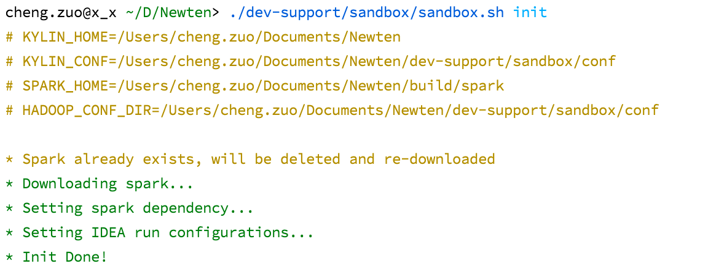

*自动装载 IDEA Debug 配置如图：*

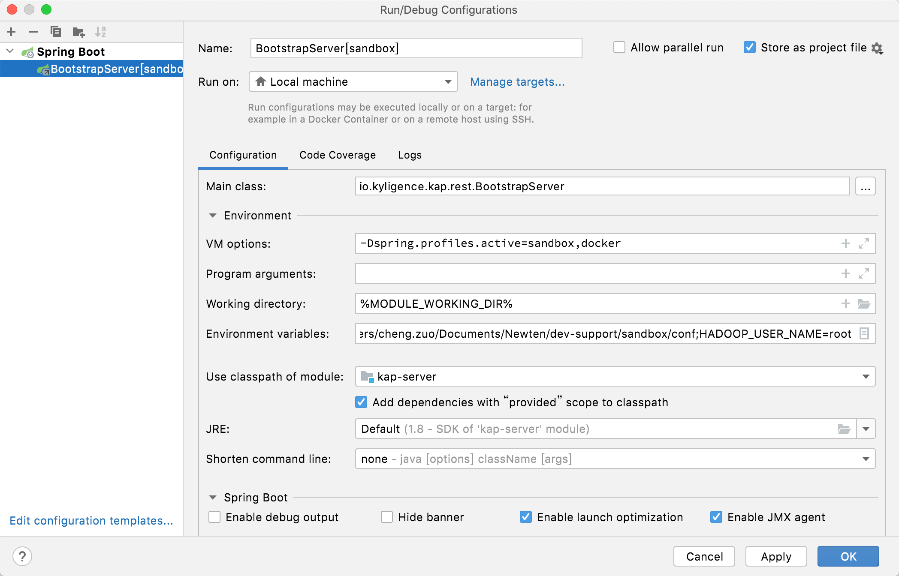


3）执行 `./dev-support/sandbox/sandbox.sh up` 下载镜像并启动容器。

- 执行过程完成 KE 元数据库的创建，如果失败，可以按照提示手动创建（默认会自动重试 5 次）

*容器启动成功如图：*

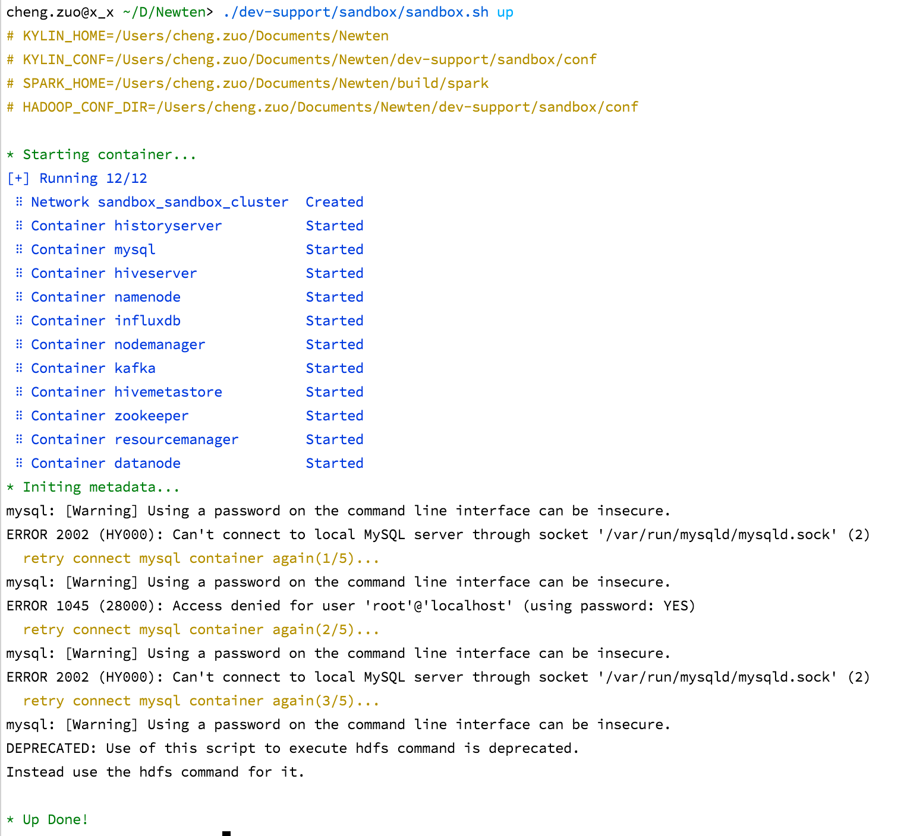


4）启动 IDEA Debug，启动成功后访问 `http://resourcemanager:8088/` 能够看到 Sparder 已经启动，如图：

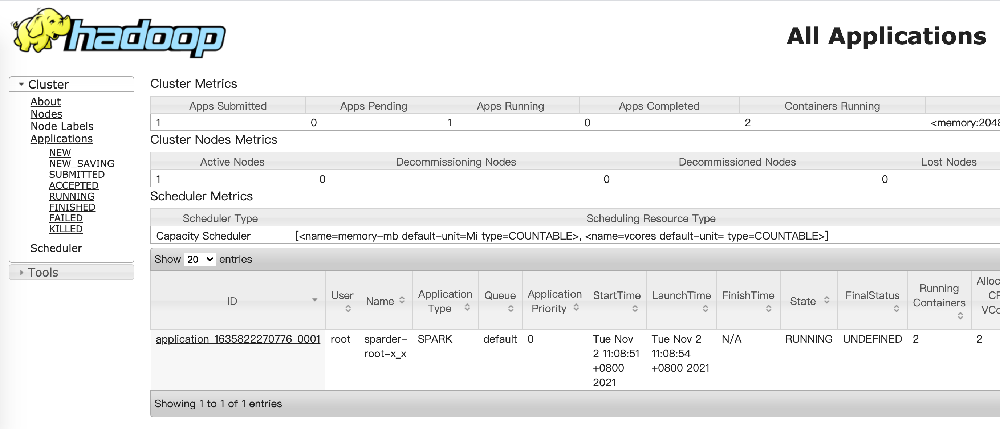


5）执行 `./dev-support/sandbox/sandbox.sh sample` 加载 SSB 数据

- 该过程会往 Hive 和 Kafka 里面分别灌入 SSB 数据


*进入到 KE 数据源页面，能够正常加载 Hive 数据：*

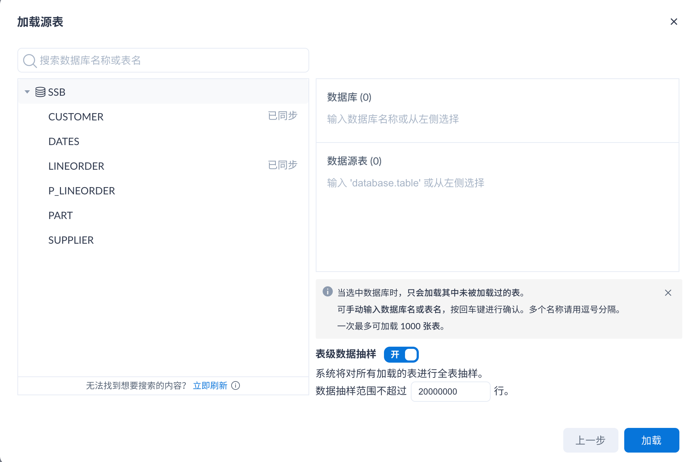


*查看批数据任务列表，数据采样成功*

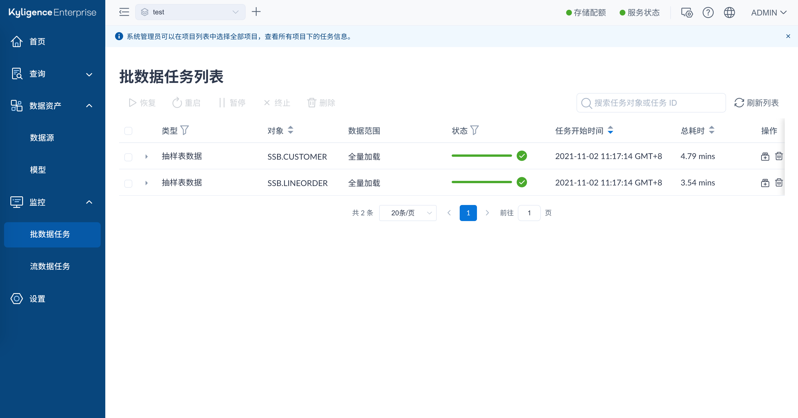


*在查询分析页面，也能正常 Pushdown 到 Hive 获取数据*

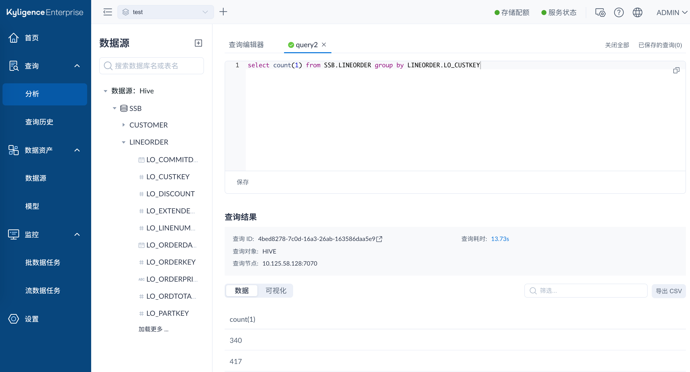


*创建模型并构建索引*

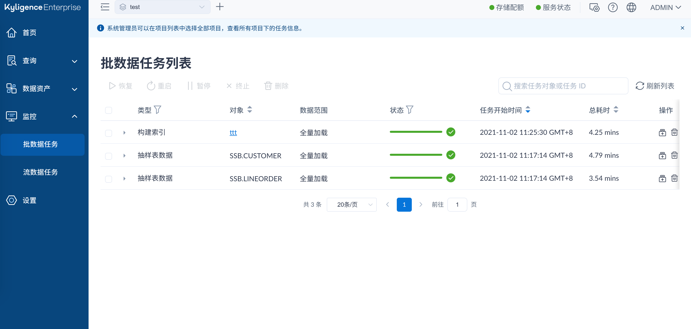


*重新查询数据，能够正常命中索引*

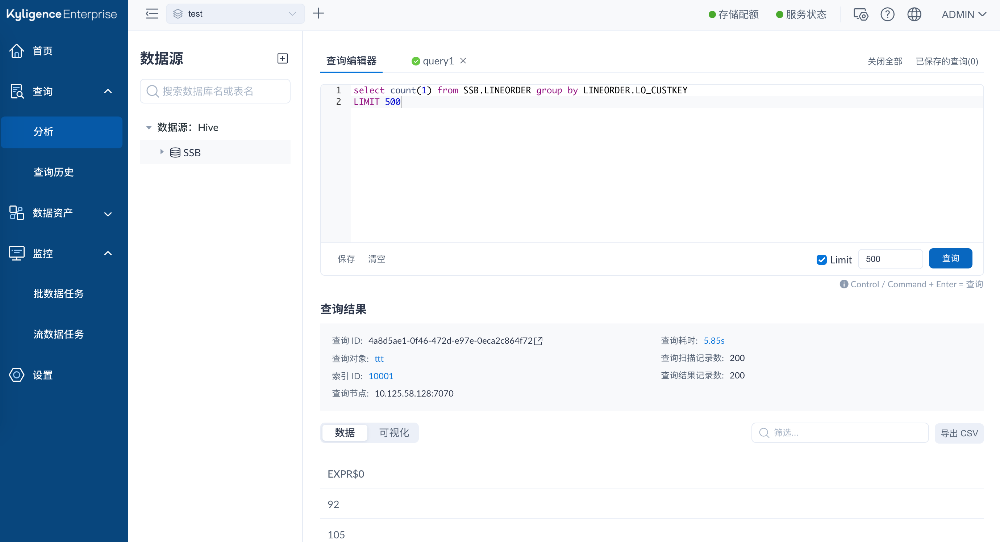


### 其他使用方式

1）`./dev-support/sandbox/sandbox.sh stop` 停止正在运行的所有容器

2）`./dev-support/sandbox/sandbox.sh start` 启动所有停止了的容器

3）`./dev-support/sandbox/sandbox.sh ps` 查看所有正在运行的容器

4）`./dev-support/sandbox/sandbox.sh down` 停止所有容器，并删除它们

5）`./dev-support/sandbox/sandbox.sh interactive` 进入指定容器

### FAQ

1）当出现如下图 `No Filesystem for schema: hdfs` 时，重新刷新 Maven Profile 即可

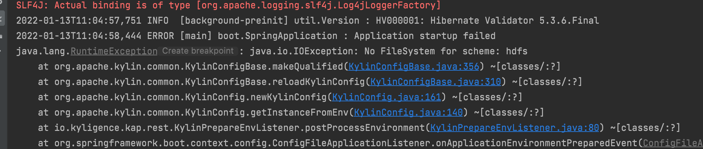

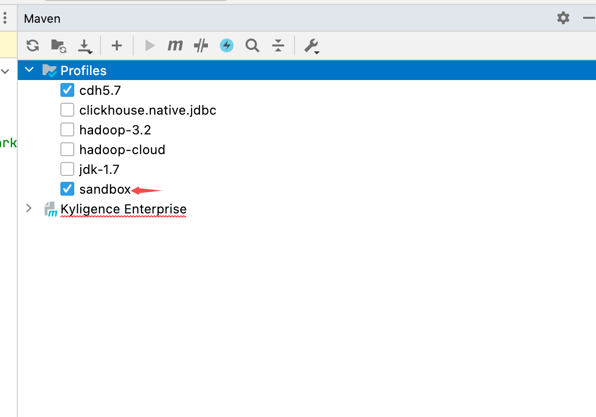

2）当执行 `sandbox.sh init` 后，runConfiguration 没有生成可用的配置时，替换 `.idea/runconfigurations/BootstrapServer_sandbox_.xml` 中的 `type="SpringBootApplicationConfigurationType" factoryName="Spring Boot"` 为 `type="Application" factoryName="Application"`

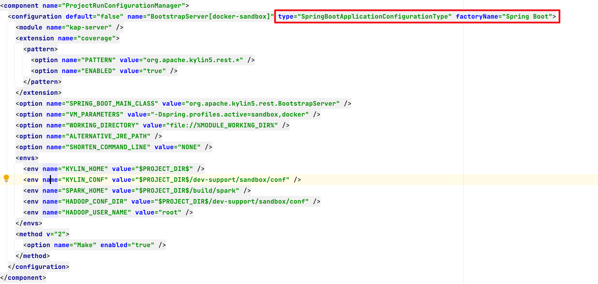

3）当在本地开发和 Spark 相关功能时，需要访问 Spark Web UI，可以临时修改 `KylinSession.scala` 中的代码，如图：

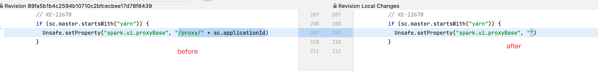
