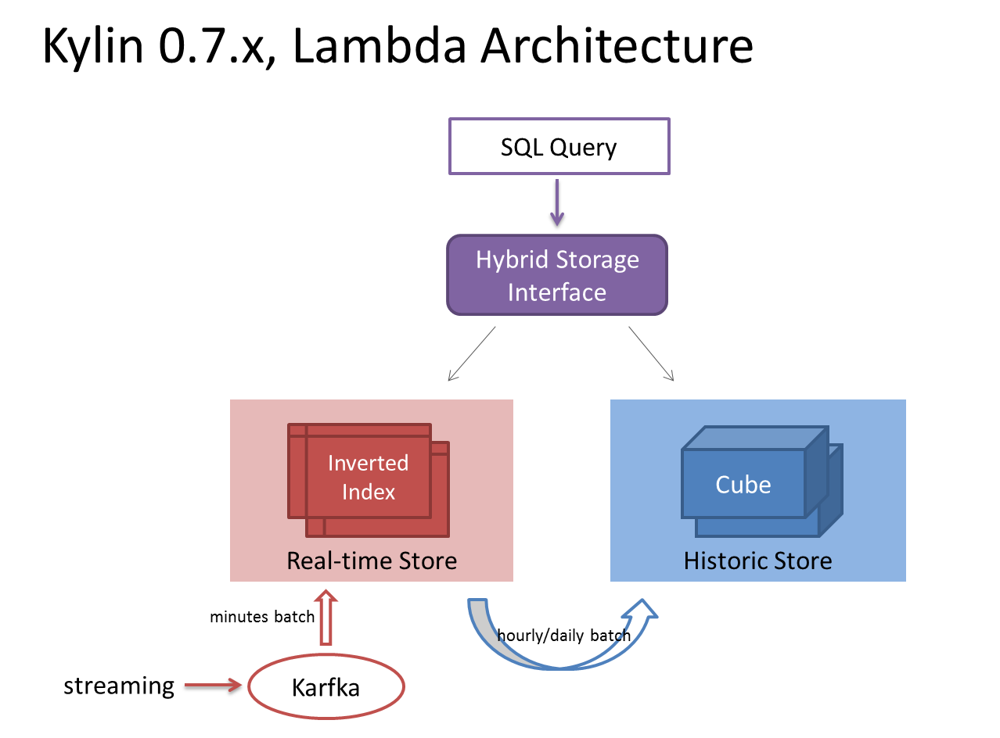

Kylin 0.7 Lambda Architecture
===

Start from 0.7, Kylin adopts a [Lambda Architecture](http://en.wikipedia.org/wiki/Lambda_architecture) to support near real-time analysis from streaming input.

* Data is separated into Young and Aged.
* The young generation is batch loaded from streaming (e.g. every minute) and saved in a real-time storage with inverted index.
* Aged generation is batch loaded from real-time storage to historic storage daily or hourly. Aged generation is stored as OLAP cube with pre-calculation.
* A hybrid storage interface sits on top of the real-time and historic storage, and provides a view of complete data set for SQL queries.
* The combination of inverted index and OLAP cube enables subsecond query latencies on near real-time data with huge history.

