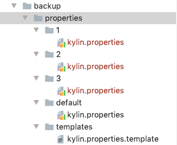
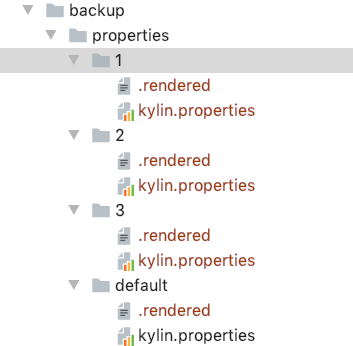

## Configs

#### I. Configure the `kylin_configs.yaml`

**Required parameters**:

- `AWS_REGION`: Current region for EC2 instances.
- `IAMRole`: IAM role which has the access to aws authority. This parameter will be set to the created **name** of the IAM role.
- `S3_URI`: the prefix path of storing `jars/scripts/tar`. For example, this parameter will be set to `s3://.../kylin4-aws-test`.
- `KeyName`: Security key name is a set of security credentials that you use to prove your identity when connecting to an instance. This parameter will be set to the created **name** of key pair`.
- `CIDR_IP`:  An inbound rule permits instances to receive traffic from the specified IPv4 or IPv6 CIDR address range, or the instances associated with the specified security group.
- `DB_IDENTIFIER`: this param should be only one in the `RDS -> Databases`. And it will be the name of created RDS database.
- `DB_PORT`: this param will be the port of created RDS database, default is `3306`.
- `DB_USER`: this param will be a login ID for the master user of your DB instance, the default is `root`.
- `DB_PASSWORD`: this param will be the password of `DB_USER` to access the DB instance. default is `123456test`, it's strongly suggested you change it.

#### II. Configure the `kylin.properties` in `backup/properties` directories.

> About the indexes of clusters:
>
> 1. **Tool will deploy a cluster which will mark to `default` if a user does not specify a cluster to deploy.**
> 2. The range of cluster indexes must be in `CLUSTER_INDEXES` which is configured in the `kylin_configs.yml`.
> 3. **`CLUSTER_INDEXES` is for users to create multiple clusters as READ-WRITE separation mode**,  such as a user may want to create 2 query nodes of Kylin and 2 job nodes of Kylin.
>    1. User can modify the `CLUSTER_INDEXES` to be `(1, 3)`, then as following steps of this module to modify the `kylin.properties` file for clusters.
>    2. User can mark the Kylin node of the `default` cluster to be `query` mode and the Kylin node of the cluster whose index is `1` to be `query` mode.  User can mark the Kylin node of the cluster which index is `2` to be `job` mode and the Kylin node of the cluster which index is `3` to job mode.
>    3. User can also modify the `CLUSTER_INDEXES` to be `(1, 4)`, and mark the Kylin node of clusters whose index is `1` and `2` to be `query` mode and the Kylin node of clusters whose index is `3` and `4` to be `job` mode. Just don't use `default` to mark a cluster and execute exactly deploy cluster commands. For details about commands, please check to [deploy multiple clusters](./Commands.md#deploycluster).
> 4. The list of mark name for clusters will be [`default`, `{cluster ID}` ...] and `{cluster ID}` is in the range of `CLUSTER_INDEXES`.
> 5. For example, if `CLUSTER_INDEXES` is (1, 3) means that tool can deploy a cluster and it can be marked as `default` or `1` or `2` or `3`.  And tool can execute to deploy total 1(`default`)  + 3(clusters which mark name can be `1`, `2`, `3`) = 4 clusters.
> 6. Every cluster contains 3 `Zookeepers Node`, 1 `Kylin Node`, 1 `Spark Master Node,` and 3 `Spark Slaves Node` after deployed and it can scale needed nodes of Kylin and Spark workers.
> 7. **The difference between clusters only can be the index or customized configs of EC2 instances or customized properties of Kylin (and spark and zookeeper).**

1. The `kylin.properties` is for starting kylin instance in the cluster.
2. The default cluster will check the `kylin.properties` in the `backup/properties/default`, and other specific clusters will check the related num directory such as `1`, `2,` and `3`.
3. User needs to create a new dir for the cluster ID in `backup/properties`, and name it to the `${cluster ID}`, such as `1`, `2` ,`3` and so on.
4. Following the step `2`, copy the `kylin.properties.template` which is in `backup/properties/templates` to the related `${cluster ID} ` directories， and rename the template to `kylin.properties`.
5. The range of cluster IDs must match the config `CLUSTER_INDEXES`, such as `CLUSTER_INDEXES: (1, 3)` then the directories must be `1`, `2`,`3` in the `backup/properties`.

6. Customize the config which you want to change except the config which contains `{{ }}` mark.

7. If the related `kylin.properties` was filled with cluster information, a file named `.rendered` will create in the directory.

8. **(Important !!!)** If you want to re-fill the `kylin.properties` for a `kylin` node in a specific cluster,  you need to remove the `.rendered` file and re-copy the `kylin.propertie.template`. Redo steps from `3` to `6`.