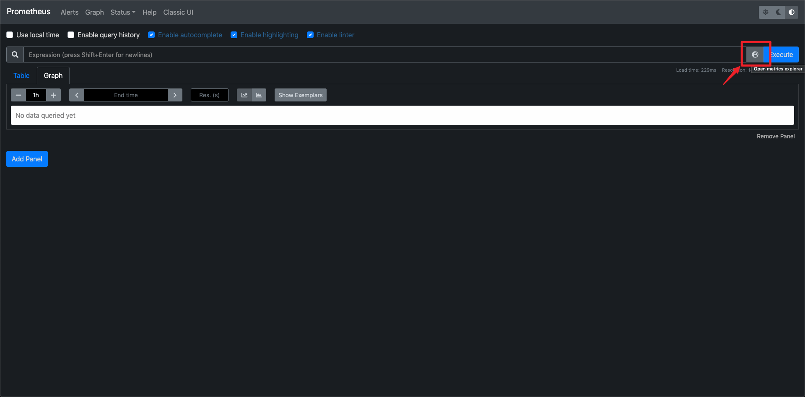
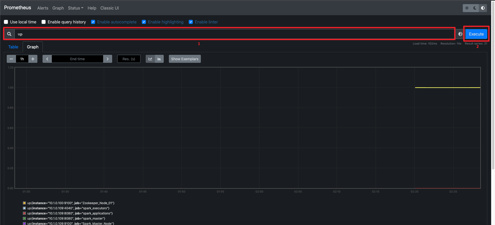
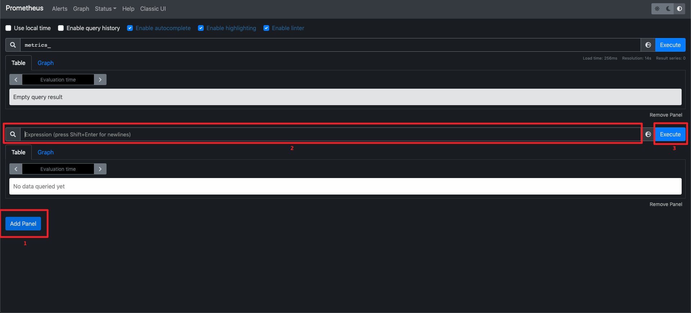
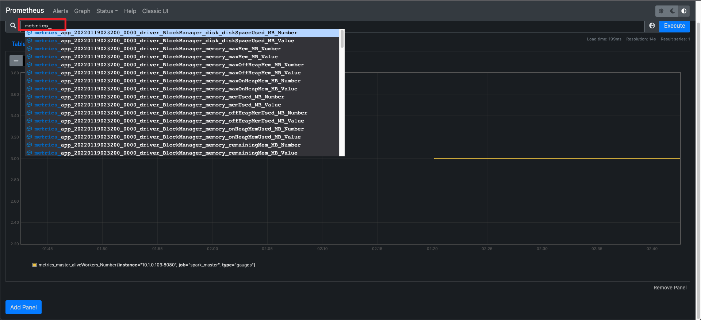
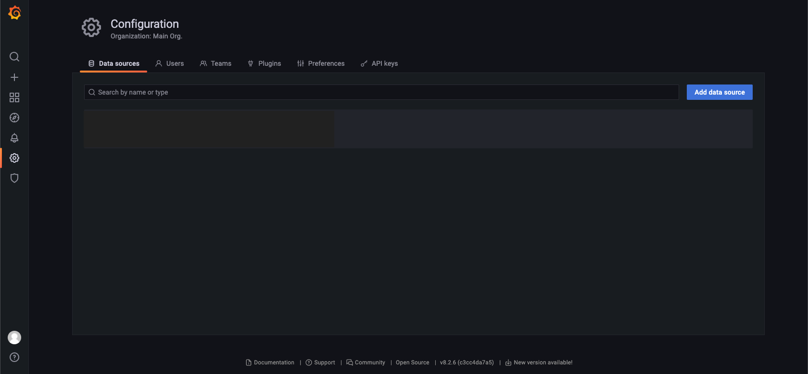
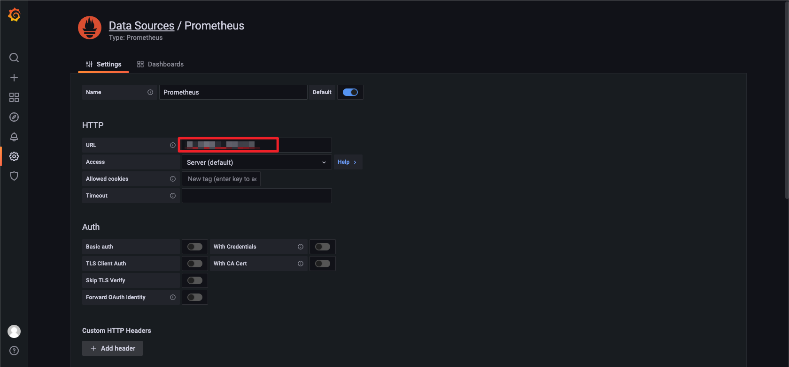
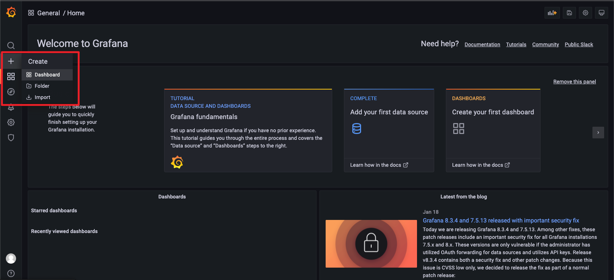
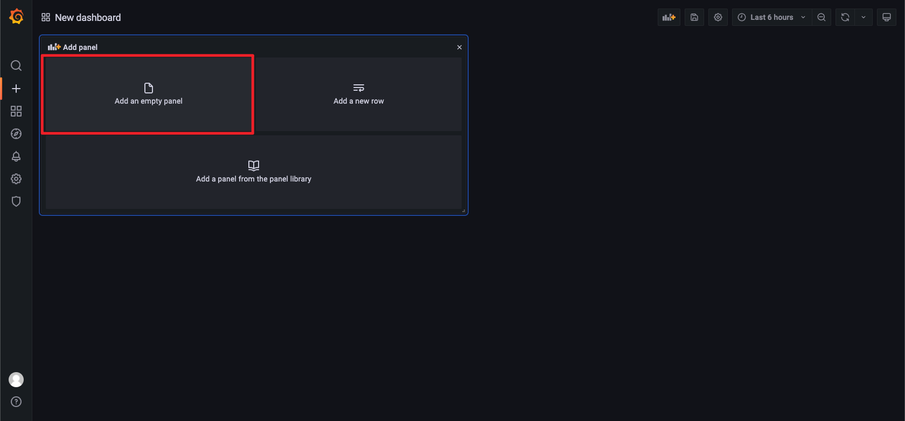
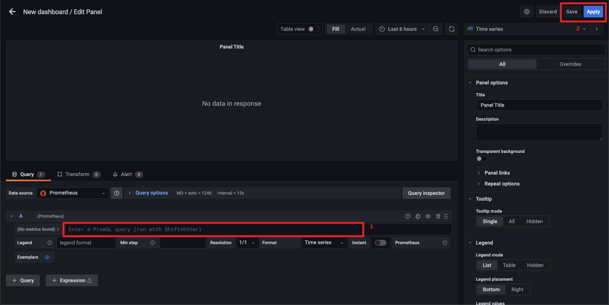

## Monitor

Current tool also support the feature of monitor for cluster.

1. User can execute `python ./deploy.py --type list` to get the `public ip` of `Static Service` .
2. User can access the `public ip` of `Static Service` and the port is `9090` to access `Prometheus` server.
3. User can access the `public ip` of `Static Service` and the port is `3000` to access `Granfana` server.

### Quick Start For Prometheus

1. Input a `Metric`, user can get the available metric from the metric exploer.

2. Execute a query to generate a dashboad.

3. Add a new panel for a new query.

More details about `PromQL` for metric exploer, please check [official website](https://prometheus.io/docs/prometheus/latest/querying/).

#### Spark Metric In Prometheus

>  Note:
>
>  1. Current tool support to monitor spark metrics, more detail in [Spark Metrics](https://spark.apache.org/docs/3.1.1/monitoring.html#executor-metrics).
>  2. Spark metrics is start with `metrics` in Prometheus server.
>
>  

 ### Quick Start For Granfana

1. Login into dashboard with default user and password which are all `admin` at the first time.
2. Configure the connection to prometheus server.

> Just config the url with syntax `http://${private ip of static service}:9090` . The `private ip of static service` can be from the `python ./deploy.py --type list` command.

3. Add a new panel.

4. Add a new panel or other.

5. Edit & Apply the panel.

More details about the usage of Granfana in [official website](https://grafana.com/docs/grafana/latest/).