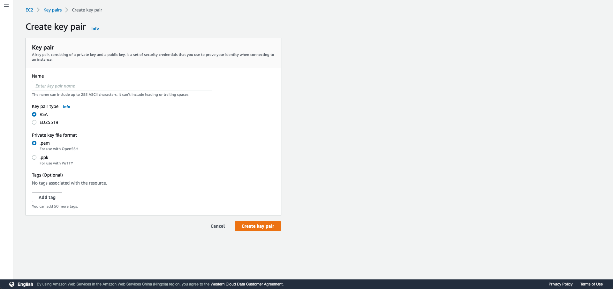
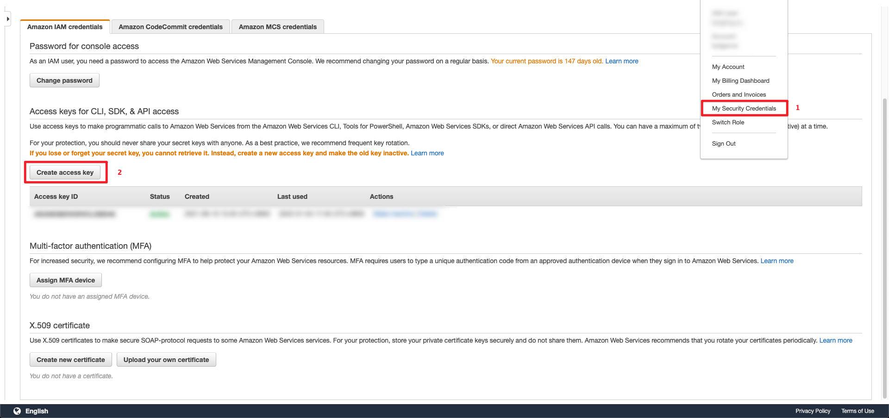
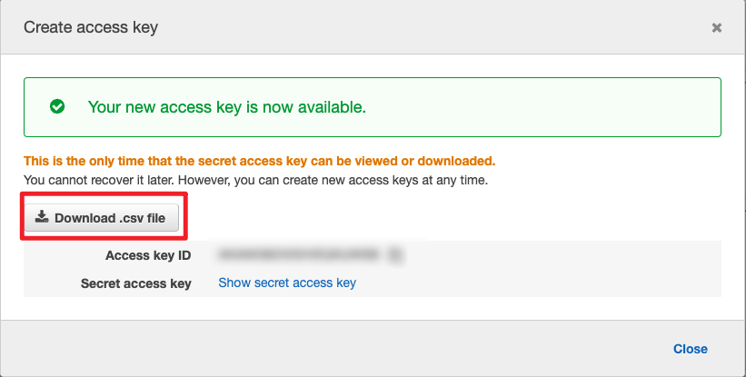
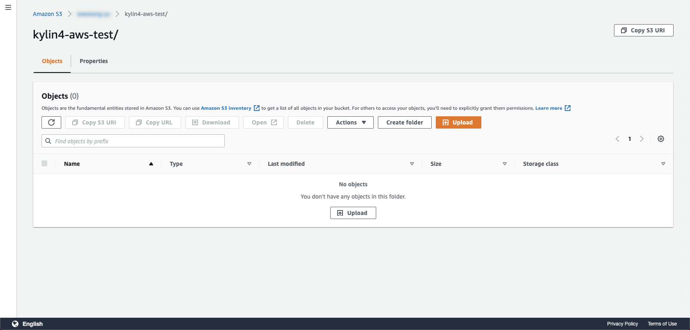
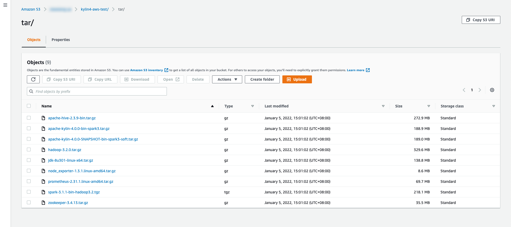
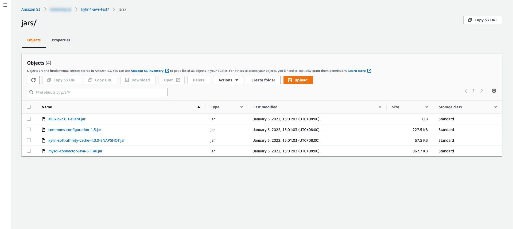
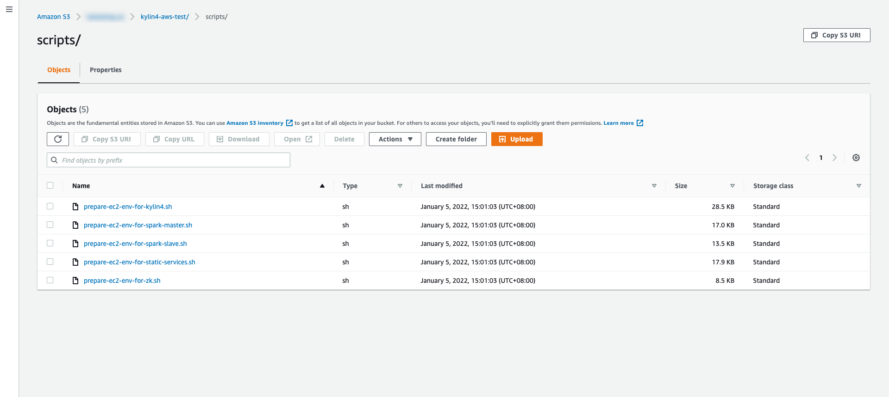

## Prerequisites 

### Download source code & checkout to branch of `deploy-kylin-on-aws`

commands:

```shell
git clone https://github.com/Kyligence/kylin-tpch.git && cd kylin-tpch && git checkout deploy-kylin-on-aws
```

### Initiliaze an AWS Account

#### I. Create an `IAM` role<a name="IAM"></a> 

> Note: 
>
> ​	`IAM` role must have the access  which contains `AmazonEC2RoleforSSM` , `AmazonSSMFullAccess` and `AmazonSSMManagedInstanceCore`.
>
> ​	This `IAM` Role will be used to initialize every ec2 instances which are for creating an kylin4 cluster on aws. And it will configure in `Initilize Env of Local Mac` part.

#### II. Create a `User` 

> Note:
>
> ​	The `User` who is created in aws will be used to execute some operations on EC2 instance. So the `User` must has some authorities as below.

| Services            | Access level                                           | Resources     | Request condition |
| ------------------- | ------------------------------------------------------ | ------------- | ----------------- |
| **Cloudformation**  | **Limited**: List, Read,Write                          | All Resources | None              |
| **EC2**             | **Limited**: Read                                      | All Resources | None              |
| **IAM**             | **Limited**: List, Read, Write, Permissions management | All Resources | None              |
| **RDS**             | **Limited**: List, Write, Tagging                      | All Resources | None              |
| **S3**              | **Limited**: Write, Permissions management, Tagging    | All Resources | None              |
| **SNS**             | **Limited**: List                                      | All Resources | None              |
| **STS**             | **Limited**: Write                                     | All Resources | None              |
| **Systems Manager** | **Limited**: Write                                     | All Resources | None              |

#### III. Login the created `User` to create key pair and Access Key<a name="keypair"></a>

> Note:
>
> ​	To deploy EC2 instances for Kylin4 Cluster need key pair and access key.

##### 1. Create a new `Key Pair` in the `EC2 -> Key pairs`



##### 2. Genrate a new `Access Key` which in the `My Security Credentials`

> Note: 
>
> ​	Please download the generated the csv file of `Access Key`  immediately. Get the `Access Key `  and `Secret Key` to initilize local mac to access aws.







### Initialize a S3 direcotry<a name="S3"></a> 

#### I. Create a directory on S3

> Note: 
>
> ​	This directory will store tars, scripts and jars below. And it will also be the root path of working dir for kylin4.

Example: make a directory named `kylin4-aws-test` . You can also create a directory named what you like.




#### **(Optional)** II. Manually Download packages & Upload them to the S3 path which suffix is `*/tar`

> Note:
>
> ​	This step will automatically do by tools. So you can skip this step, or you want to check packages by yourself.


> Create the directory named `tar` **in the path which was created by yourself**.  
>
> As example, the full path would be `s3://.../kylin4-aws-test/tar`.

1. Download Kylin4 package by [official website](https://kylin.apache.org/download/).
2. Download Hadoop, [version 3.2.0](https://archive.apache.org/dist/hadoop/common/hadoop-3.2.0/hadoop-3.2.0.tar.gz).
3. Download Spark with hadoop3.2, [version 3.1.1](https://archive.apache.org/dist/spark/spark-3.1.1/spark-3.1.1-bin-hadoop3.2.tgz).
4. Download Hive, [version 2.3.9](https://archive.apache.org/dist/hive/hive-2.3.9/apache-hive-2.3.9-bin.tar.gz).
5. Download Zookeeper, [version 3.4.9.](https://archive.apache.org/dist/zookeeper/zookeeper-3.4.9/zookeeper-3.4.9.tar.gz)
6. Download JDK, [version 1.8_301](https://www.oracle.com/java/technologies/javase/javase8u211-later-archive-downloads.html).
7. Download Node Exporter, [version 1.3.1.](https://github.com/prometheus/node_exporter/releases/download/v1.3.1/node_exporter-1.3.1.linux-amd64.tar.gz)
8. Download Prometheus Server, [version 2.31.1](https://github.com/prometheus/prometheus/releases/download/v2.31.1/prometheus-2.31.1.linux-amd64.tar.gz).
9. Download Kylin4 package with local cache + soft affinity feature by [public website.](https://s3.cn-north-1.amazonaws.com.cn/public.kyligence.io/kylin/tar/apache-kylin-4.0.0-bin-spark3-soft.tar.gz)


> Note: 
> 	If you want to use Kylin4 with local cache + soft affinity feature, please download the `experimental` package above.




#### (Optional) III. Upload  `kylin-tpch/backup/jars/*` to the S3 Path which suffix is `*/jars`

> Note:
>
> ​	This step will automatically do by tools. So you can skip this step, or you want to check jars by yourself.


> Create the directory named `jars` **in the path which was created by yourself**.  
>
> As example, the full path would be `s3://.../kylin4-aws-test/jars`.

Kylin4 needed extra jars

- Basic jars
  - commons-configuration-1.3.jar
  - mysql-connector-java-5.1.40.jar
- Local Cache + Soft Affinity feature needed jars
  - alluxio-2.6.1-client.jar
  - kylin-soft-affinity-cache-4.0.0-SNAPSHOT.jar



#### (Optional) IV. Upload `kylin-tpch/backup/scripts/*` to the S3 Path which suffix is `*/scripts`

> Note:
>
> ​	This step will automatically do by tools. So you can skip this step, or you want to check scripts by yourself.


> Create the directory named `scripts` **in the path which was created by yourself**.  
>
> As example, the full path would be `s3://.../kylin4-aws-test/scripts`.

Scripts:

- prepare-ec2-env-for-kylin4.sh
- prepare-ec2-env-for-spark-master.sh
- prepare-ec2-env-for-spark-slave.sh
- prepare-ec2-env-for-static-services.sh
- prepare-ec2-env-for-zk.sh



### Initilize Env Of Local Mac

#### I.  Initilize an aws account on local mac to access AWS<a name="localaws"></a>

> Use `Access Key` and `Secret Key ` above to Initilize a aws account on local mac. 

```shell
$ aws configure
AWS Access Key ID : *************
AWS Secret Access Key : *************
Default region name : cn-northwest-1
Default output format : json
```

> Note:
>
> 1. If this command got the response `-bash: aws: command not found`, please check in  [Getting started with the AWS CLI](https://docs.aws.amazon.com/cli/latest/userguide/cli-chap-getting-started.html).
> 2. Region name can be in [Available Regions](https://docs.aws.amazon.com/AWSEC2/latest/UserGuide/using-regions-availability-zones.html#concepts-available-regions).
> 3. Default output format is `json`.

#### II. Init a Python virtual env

> Note: 
>
> ​	Make sure that your mac already has a Python which version is 3.6.6 or later.  

commands: 

```shell
$ ./bin/init.sh
```

> Note: Follow the information after `./bin/init.sh` to activate the python virtual env.

#### III. Configure the `kylin-tpch/kylin_configs.yaml`

**Required parameters**:

- `AWS_REGION`: Current region for EC2 instances.
- `IAMRole`: IAM role which has the access to aws authority. This parameter will be set to created **name** of IAM role.
- `S3_URI`: the prefix path of storing `jars/scripts/tar`. As example, this parameter will be set to `s3://.../kylin4-aws-test`.
- `KeyName`: Security key name is a set of security credentials that you use to prove your identity when connecting to an instance. This parameter will be set to created **name** of  `key pair` .
- `CIDR_IP`:  An inbound rule permits instances to receive traffic from the specified IPv4 or IPv6 CIDR address range, or from the instances associated with the specified security group.
- `DB_IDENTIFIER`: this param should be only one in the `RDS -> Databases` . And it will be the name of created RDS database.
- `DB_PORT`: this param will be the port of created RDS database, default is `3306`.
- `DB_USER`: this param will be a login ID for the master user of your DB instance, default is `root`.
- `DB_PASSWORD`: this param will be the password of `DB_USER` to access DB instance. default is `123456test`, it's strongly suggest you to change it.

#### IV. Configure the `kylin.properties` in `backup/properties` directories.<a name="cluster"></a>

1. The `kylin.properties` is for starting kylin instance in the cluster.
2. Default cluster will check the `kylin.properties` in the `kylin-tpch/backup/properties/default`, and other specific cluster will check the related num directory such as `1`, `2` and `3`.
3. User need to create new dir for the cluster num in `kylin-tpch/backup/properties`, and name it to the `${cluster num}`, such as `1`, `2` ,`3`  and so on. The range of cluster num must be in `CLUSTER_INDEXES` which is configured in the `kylin-tpch/kylin_configs.yml`.
4. Follow the `2.` step, copy the `kylin.properties.template` which is in `kylin-tpch/backup/properties/templates` to the related `${cluster num} ` directories， and rename the template to `kylin.properties`. 
5. The range of cluster nums must match the the config `CLUSTER_INDEXES`, such as `CLUSTER_INDEXES: (1, 3)` then the directories must be `1`, `2`,`3` in the `kylin-tpch/backup/properties`.


6. Cusomize the config which you want to change except the config which contains `{{ }}` mark.

7. If the related `kylin.properties` was filled with cluster information, a file named `.rendered` will create in the directory.


7. **(Important !!!)** If you want to re-fill the `kylin.properties` for a `kylin` node in specify cluster,  you need to remove the `.rendered` file and re-copy the `kylin.propertie.template` . Redo steps from `3` to `6`.