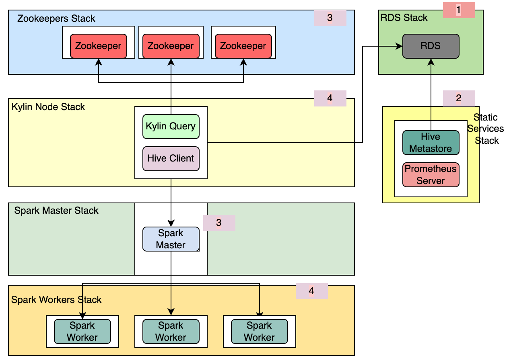
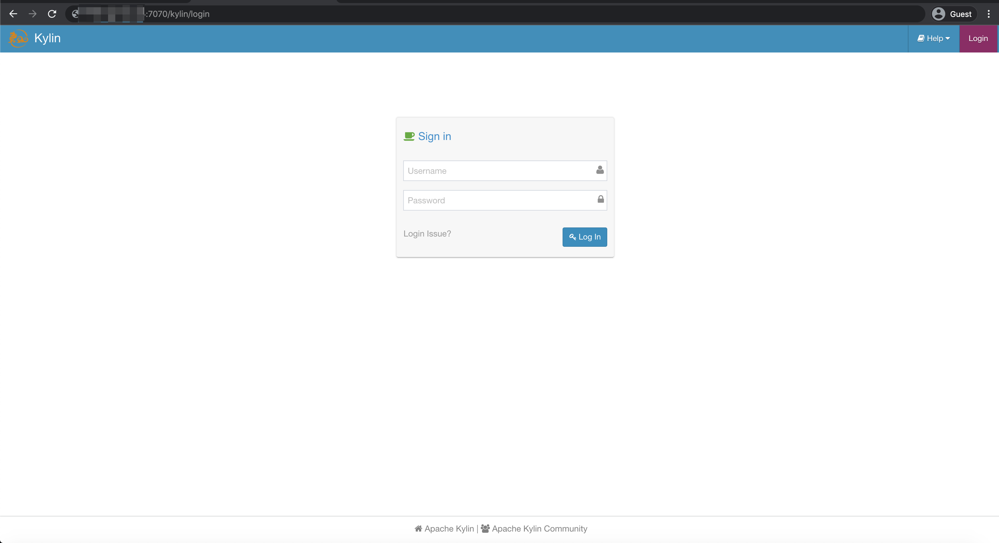

## Architecture In Quick Start



- **Services are created as the number order from 1 to 4.**


## Quick Start

1. Initialize aws account credential on the local machine, please check [details](./prerequisites.md#localaws).

2. Download the source code: 

   ```shell
   git clone https://github.com/apache/kylin.git && cd kylin && git checkout kylin4_on_cloud
   ```

3. Modify the `kylin_config.yml`.

   1. Set the `AWS_REGION`.

   2. Set the `IAMRole`, please check the [details](./prerequisites.md#IAM).

   3. Set the `S3_URI`, please check [details](./prerequisites.md#S3).

   4. Set the `KeyName`, please check [details](./prerequisites.md#keypair).

   5. Set the `CIDR_IP`, make sure that the `CIDR_IP` match the pattern `xxx.xxx.xxx.xxx/16[|24|32]`.

      > Note: 
      >
      > 1. this `CIDR_IP` is the specified IPv4 or IPv6 CIDR address range which an inbound rule can permit instances to receive traffic from.
      >
      > 2. In one word, it will let your mac which IP is in the `CIDR_IP` to access instances.

4. Init local env.

```shell
$ bin/init.sh
```

> Note: Following the information into a python virtual env and get the help messages. 

5. Execute commands to deploy a cluster quickly.

```shell
$ python deploy.py --type deploy
```

After this cluster is ready, you will see the message `Kylin Cluster already start successfully.` in the console. 

>  Note: 
>
> 1. For more details about the properties of kylin4 in a cluster, please check [configure kylin.properties](./prerequisites.md#cluster).
> 2. For more details about the index of the clusters,  please check [Indexes of clusters](./prerequisites.md#indexofcluster).

6. Execute commands to list nodes of the cluster.

```shell
$ python deploy.py --type list
```

Then you can check the `public IP` of Kylin Node.

You can access `Kylin` web by `http://{kylin public ip}:7070/kylin`.



7. Destroy the cluster quickly.

```shell
$ python deploy.py --type destroy
```

> Note:
>
> 1. If you want to check about a quick start for multiple clusters, please referer to a [quick start for multiple clusters](./quick_start_for_multiple_clusters.md).
> 2. **Current destroy operation will remain some stack which contains `RDS` and so on**. So if user want to destroy clearly, please modify the `ALWAYS_DESTROY_ALL` in `kylin_configs.yml` to be `true` and re-execute `destroy` command. 

