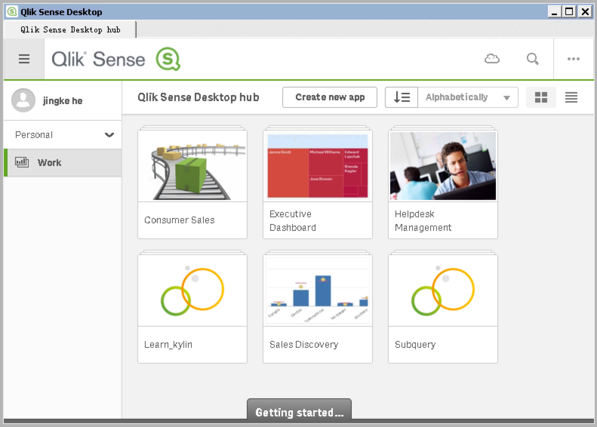
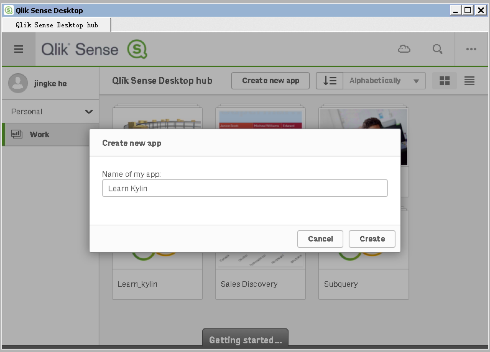
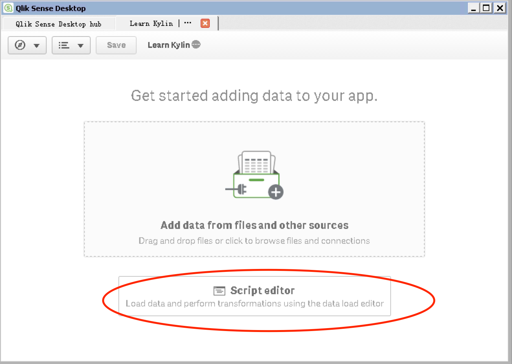
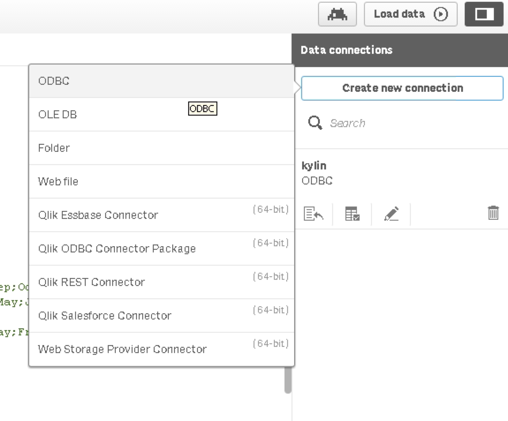
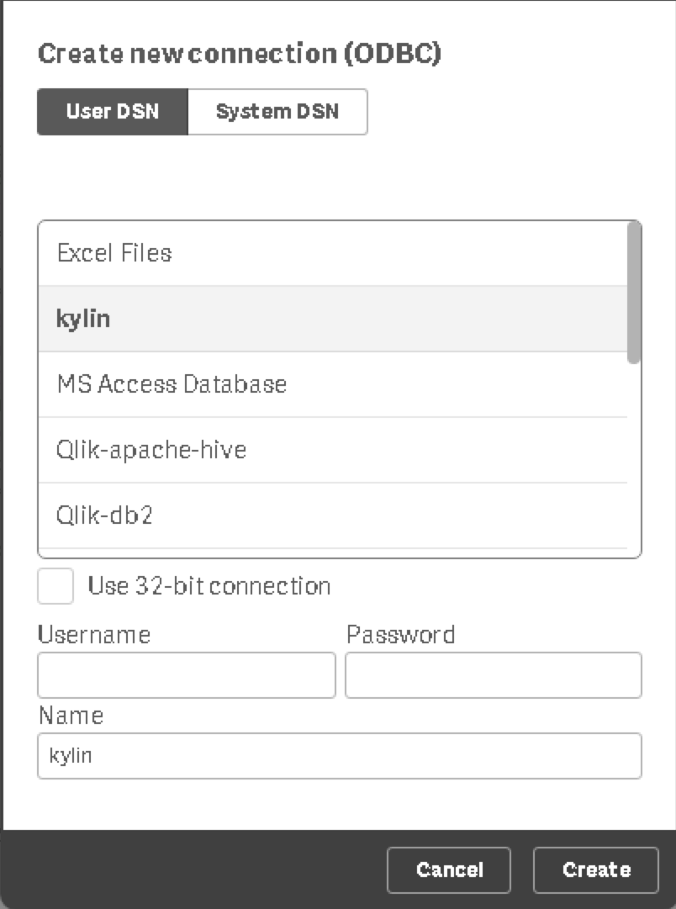
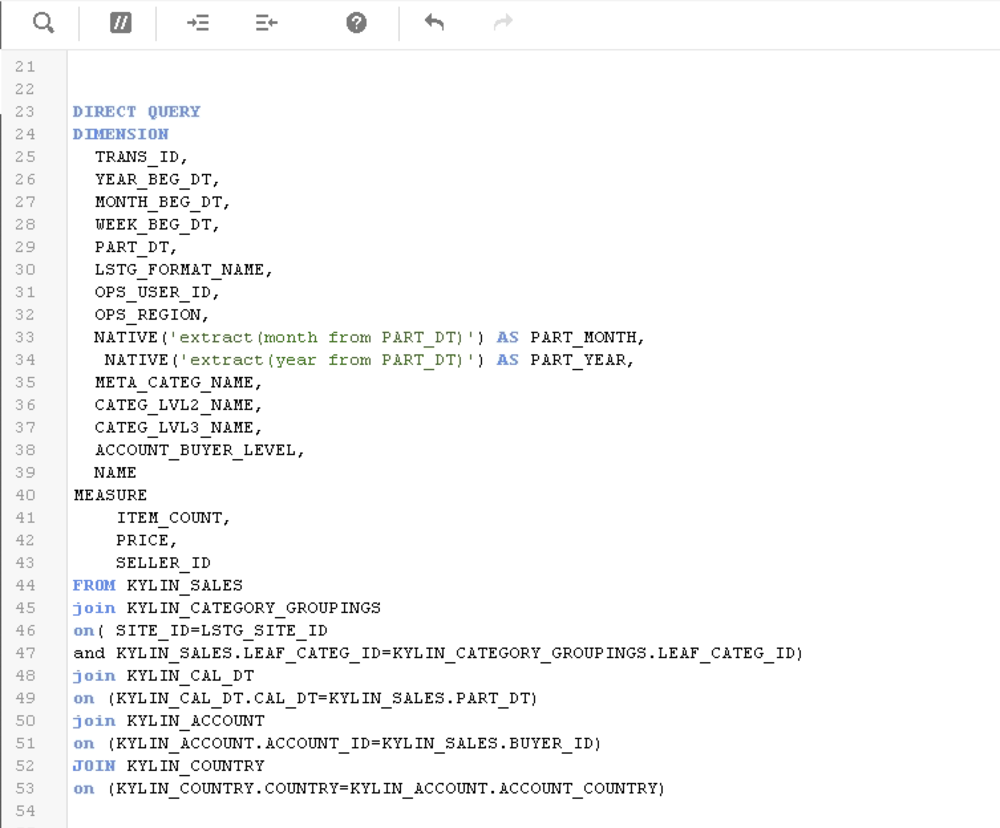
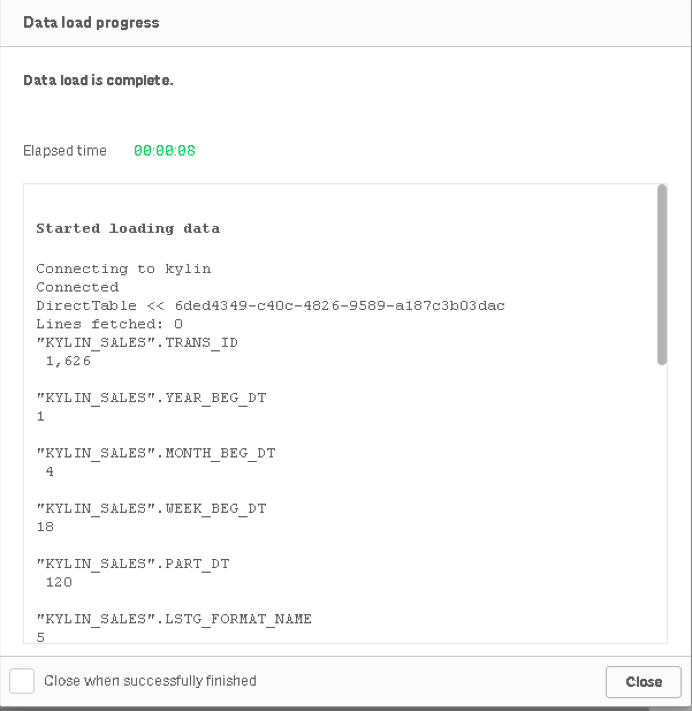
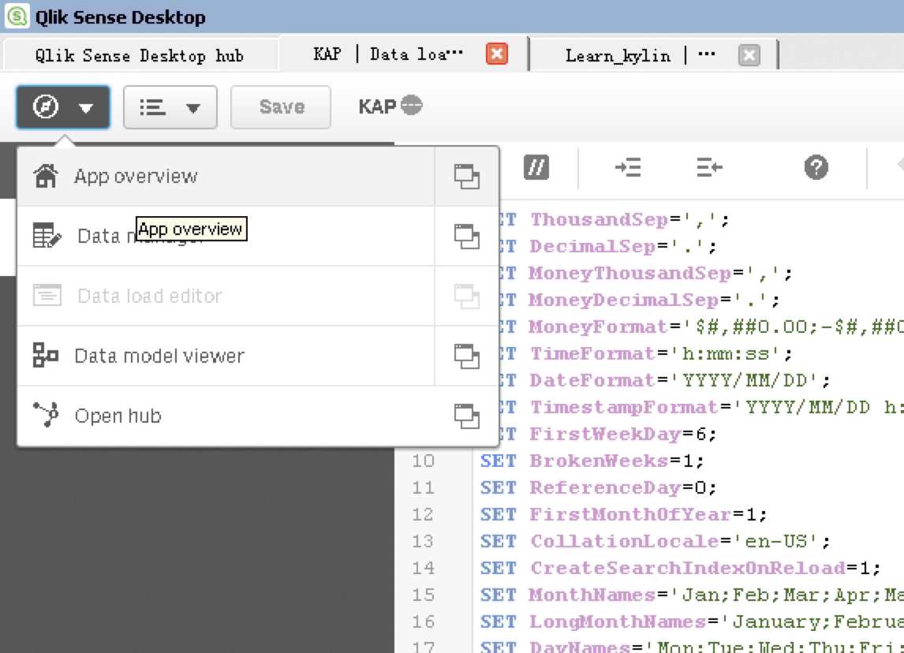
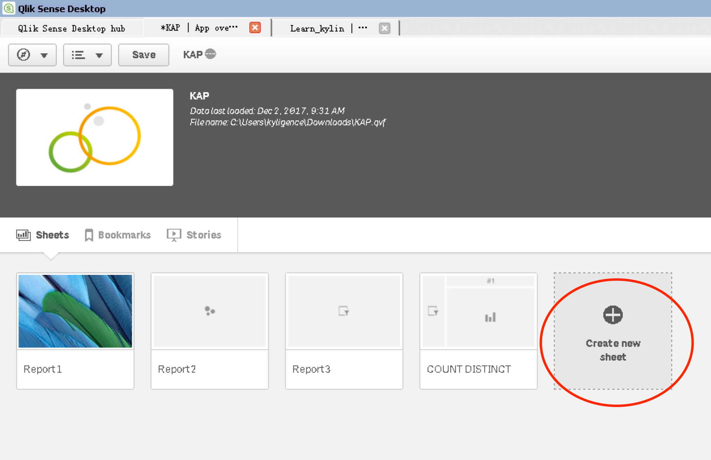
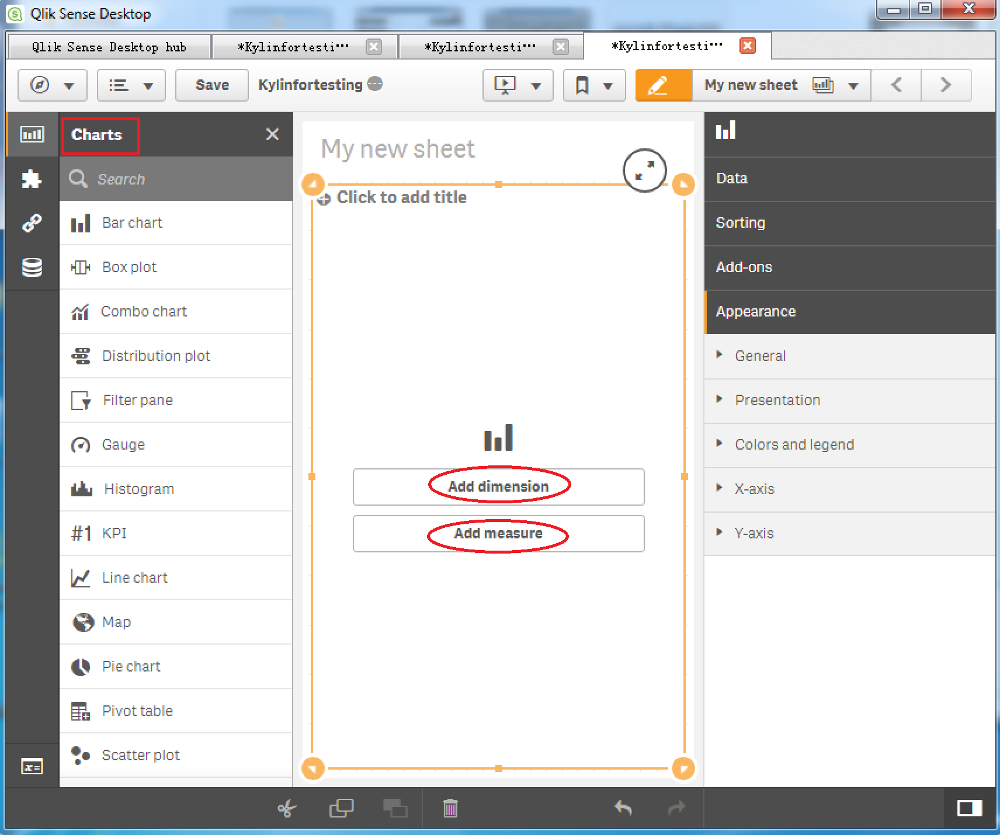

Qlik Sense delivers intuitive platform solutions for self-service data visualization, guided analytics applications, embedded analytics, and reporting. It is a new player in the Business Intelligence (BI) tools world, with a high growth since 2013. It has connectors with Hadoop Database (Hive and Impala). Now it can be integrated with Apache Kylin. This article will guide you to connect Apache Kylin with Qlik Sense.  

### Install Kylin ODBC Driver

For the installation information, please refer to [Kylin ODBC Driver](http://kylin.apache.org/docs24/tutorial/odbc.html).

### Install Qlik Sense

For the installation of Qlik Sense, please visit [Qlik Sense Desktop download](https://www.qlik.com/us/try-or-buy/download-qlik-sense).

### Connection with Qlik Sense

After configuring your Local DSN and installing Qlik Sense successfully, you may go through the following steps to connect Apache Kylin with Qlik Sense.

- Open **Qlik Sense Desktop**.


- Input your Qlik account to log in, then the following dialog will pop up. Click **Create New Application**.



- Specify a name for the new app. 




- There are two choices in the Application View. Please select the bottom **Script Editor**.




- The Data Load Editor window shows. Click **Create New Connection** and choose **ODBC**.




- Select **DSN** you have created, ignore the account information and then click **Create**. 




### Configure Direct Query mode
Change the default scripts of "TimeFormat", "DateFormat" and "TimestampFormat" to:

`SET TimeFormat='h:mm:ss';`
`SET DateFormat='YYYY-MM-DD';`
`SET TimestampFormat='YYYY-MM-DD h:mm:ss[.fff]';`


Given the Peta-byte scale Cube size in a usual Apache Kylin environment, we recommend user to use Direct Query mode in Qlik Sense and avoid importing data into Qlik Sense.

You are able to enable Direct Query mode by typing `Direct Query` in front of your query script in Script editor.

Below is the screenshot of such Direct Query script against *kylin_sales_cube* in *Learn_kylin* project. 



Once you defined such script, Qlik sense can generate SQL based on this script for your report.

It is recommended that you define Dimension and Measure corresponding to the Dimension and Measure in the Kylin Cube.  

You may also be able to utilize Apache Kylin built-in functions by creating a Native expression, for example: 

`NATIVE('extract(month from PART_DT)') ` 

The whole script has been posted for your reference. 

Make sure to update `LIB CONNECT TO 'kylin';` to the DSN you created. 

```SQL
SET ThousandSep=',';
SET DecimalSep='.';
SET MoneyThousandSep=',';
SET MoneyDecimalSep='.';
SET MoneyFormat='$#,##0.00;-$#,##0.00';
SET TimeFormat='h:mm:ss';
SET DateFormat='YYYY/MM/DD';
SET TimestampFormat='YYYY/MM/DD h:mm:ss[.fff]';
SET FirstWeekDay=6;
SET BrokenWeeks=1;
SET ReferenceDay=0;
SET FirstMonthOfYear=1;
SET CollationLocale='en-US';
SET CreateSearchIndexOnReload=1;
SET MonthNames='Jan;Feb;Mar;Apr;May;Jun;Jul;Aug;Sep;Oct;Nov;Dec';
SET LongMonthNames='January;February;March;April;May;June;July;August;September;October;November;December';
SET DayNames='Mon;Tue;Wed;Thu;Fri;Sat;Sun';
SET LongDayNames='Monday;Tuesday;Wednesday;Thursday;Friday;Saturday;Sunday';

LIB CONNECT TO 'kylin';


DIRECT QUERY
DIMENSION 
  TRANS_ID,
  YEAR_BEG_DT,
  MONTH_BEG_DT,
  WEEK_BEG_DT,
  PART_DT,
  LSTG_FORMAT_NAME,
  OPS_USER_ID,
  OPS_REGION,
  NATIVE('extract(month from PART_DT)') AS PART_MONTH,
   NATIVE('extract(year from PART_DT)') AS PART_YEAR,
  META_CATEG_NAME,
  CATEG_LVL2_NAME,
  CATEG_LVL3_NAME,
  ACCOUNT_BUYER_LEVEL,
  NAME
MEASURE
	ITEM_COUNT,
    PRICE,
    SELLER_ID
FROM KYLIN_SALES 
join KYLIN_CATEGORY_GROUPINGS  
on( SITE_ID=LSTG_SITE_ID 
and KYLIN_SALES.LEAF_CATEG_ID=KYLIN_CATEGORY_GROUPINGS.LEAF_CATEG_ID)
join KYLIN_CAL_DT
on (KYLIN_CAL_DT.CAL_DT=KYLIN_SALES.PART_DT)
join KYLIN_ACCOUNT 
on (KYLIN_ACCOUNT.ACCOUNT_ID=KYLIN_SALES.BUYER_ID)
JOIN KYLIN_COUNTRY
on (KYLIN_COUNTRY.COUNTRY=KYLIN_ACCOUNT.ACCOUNT_COUNTRY)
```

Click **Load Data** on the upper right of the window, Qlik sense will send out inspection query to test the connection based on the script.



### Create a new report

On the top left menu open **App Overview**.



 Click **Create new sheet** on this page.



Select the charts you need, then add dimension and measurement based on your requirements. 



You will get your worksheet and the connection is complete. Your Apache Kylin data shows in Qlik Sense now.


Please note that if you want the report to hit on Cube, you need to create the measure exactly as those are defined in the Cube. For the case of *Kylin_sales_cube* in Learn_kylin project. We use `sum(price)` as an example. 
