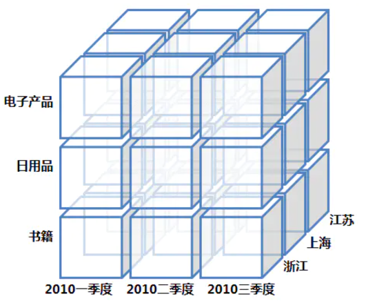
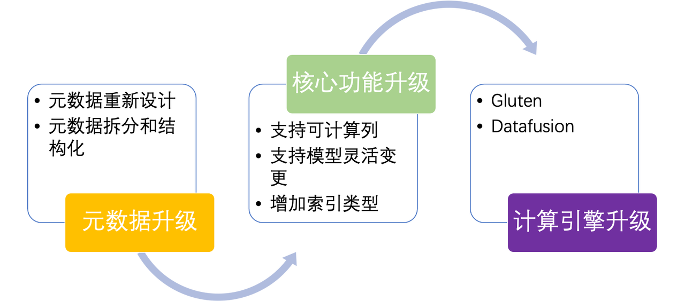
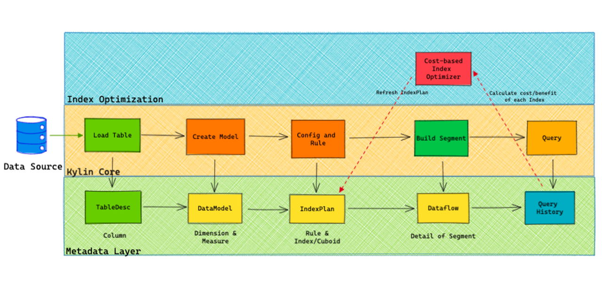
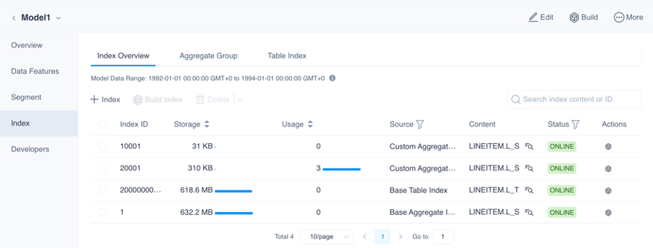
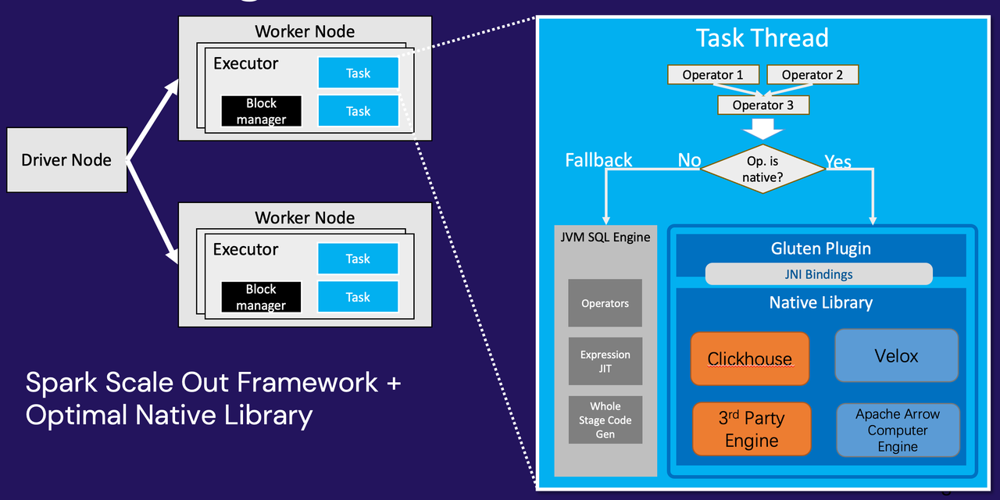
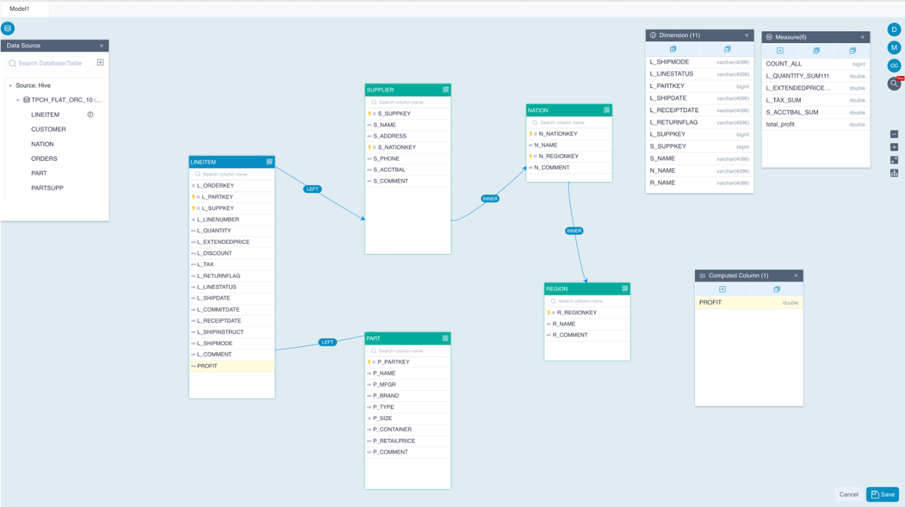
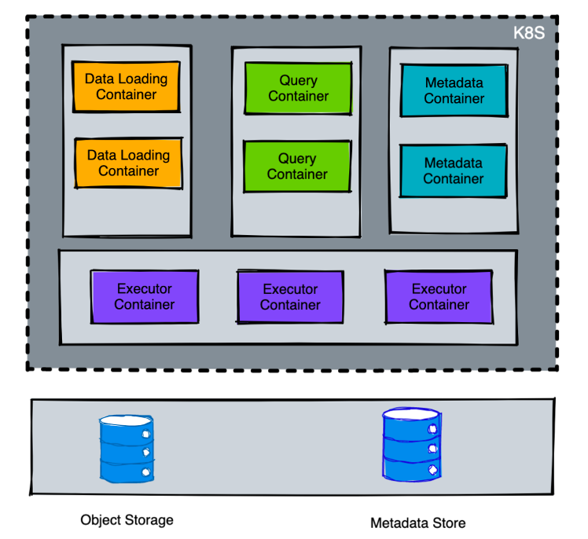

:::tip Before your read 
**Target Audience**
- 对新一代 Kylin 感兴趣的开发者和用户
- 对 OLAP 技术有兴趣的大数据爱好者

**What will you learn**
- 了解最新版本的 Kylin 的设计思路
- 了解最新版本的 Kylin 的开发路线和发布计划

💬 Kylin 5.0 相对于上个版本有了更长足的进步，尤其是在使用场景的扩充和构建查询的性能提升上。
这篇 Kylin 5.0 社区路线图，将帮助大家了解社区开发者在面对 Kylin 4 尚未解决的问题，是如何在 Kylin 5 上进行全面的重新设计并且实现新功能，并且会分析这些新功能，诸如“Native Engine”、“Schem Change”、“可计算列”、“明细索引”给用户带来的全新体验。
:::

## 今天的 Apache Kylin
  
### Apache Kylin 是什么？
  Apache Kylin™ 是一个开源的分析型数据仓库，为 Hadoop 等大型分布式分析平台之上的超大规模数据集（PB级）通过标准 SQL 查询及多维分析 ( OLAP ) 功能，提供亚秒级的交互式分析能力。

### Apache Kylin 的基本原理
  
Cube 是 OLAP ( Online Analytical Processing ) 的核心数据结构，把维度和度量抽象为一个多维模型，赋予了OLAP 新的数据组织和存储形式，并可以快速、高效地完成 OLAP 的多维分析操作。

我们可以想象有一个三个维度的 Cube，它包含了商品种类、时间和地点。在存储中我们可以把某一个具体的小方块想象成一个特定维度组合的度量，左下角的小方块存储了（浙江，2010 第一季度，书籍）这个组合下我们关心的业务指标，
s这可能是成交总量、平均价格等等。基于这样的数据结构，我们可以完成钻取、上卷、切片、切块和旋转的操作，这样就可以进行一些数据分析、数据探索，帮我们去解答这些业务的问题。并且由于不需要现场进行扫描和聚合，所以查询响应一般很快。

Apache Kylin 通过构建引擎和查询引擎来分别生成和查询预计算数据文件，并且基于分布式计算引擎如 Apache Spark 来扩展构建引擎和查询引擎的计算能力。对于用户，Kylin 提供不同的接口如 SQL/HTTP/BI/Excel 等方式来进行数据分析，可以使得用户可以对 PB 级数据集实现秒级查询。

### 当前版本的限制
- 模型修改的使用方式有限制，对于建好的 Model/Cube，不能随意添加维度和度量，需要先清理现有的预计算索引（Cuboid）才能添加；为了增加新的度量和维度，用户需要创建新的 Cube，增加了管理成本，并且浪费了计算和存储资源。
- 预计算索引的构建不够灵活，用户只能选择构建全部的预计算索引，一旦构建完成用户无法自主选择添加和删除部分预计算索引（只能通过 Cube Planner 的算法进行筛选）。
- 构建和查询性能仍有提升空间，Kylin 使用 Apache Spark 作为执行/计算引擎，没有利用到向量加速、指令级优化等技术。
- 维度数量有上限，最多支持 63 个维度。这是由于元数据存储中是用 Long 型来保存的 Cuboid ID 而造成的。
- 长期使用后元数据存储膨胀，非核心元数据（任务历史等）会占用大量的空间，造成元数据读取写入性能下降，从而引起 Kylin 整体服务性能不佳。

## Kylin 5 的设计思考

### Kylin 5 的整体目标

我们希望 Kylin 5 是一个统一、灵活、高性能、可扩展、云原生的大数据分析平台，可以做到在一个平台上完成很多的数据分析工作，能够对接各种数据源，支持多种查询接口，也可以可插拔地替换各种计算引擎，包括支持性能有明显提升的 Native Engine，可以为现代企业的海量数据上的数据分析和指标管理提供一个坚实可靠的底座。

同时我们也希望未来 Kylin 5 可以支持在 K8S 上部署，Kylin 5 将以微服务的方式进行拆分和部署，应对不同的负载可以支持灵活快捷地进行扩缩容。

### Kylin 5 的设计方向

#### No.1 重新设计核心元数据

这里涉及到元数据 Schema 和元数据存储的升级，通过对元数据进行重构使得 Kylin 的使用限制得以消除；元数据的存储会把元数据进行结构化（而不是现在的键值存储形式），以提升元数据读写性能。

#### No.2 核心功能升级改造

基于新的元数据的设计，我们进一步去改造构建引擎和查询引擎，使我们能够更加灵活的创建和刷新索引，在添加新的度量和维度时，可以不用清空现有的所有的预计算索引，给 Kylin 带来使用灵活性的提升。

Kylin 5 抽象了索引的类型以提供索引类型的可扩展性，Kylin 5 可以同时支持聚合查询和明细查询。

除此以外，还计划会支持更多类型的连接关系（例如多对多）、支持索引的多级分区、支持拉链表、支持（自动适应）表元数据变更等生产场景。

#### No.3 计算引擎性能提升

Kylin 需要使用分布式计算引擎来构建和扫描预计算索引文件，计算引擎的速度快慢很大程度上影响用户的体验。对于 Kylin 5.0，Kylin 5 将继续使用 Apache Spark 作为基础的计算引擎，除此以外，社区开发者正在尝试使用一些 Native Engine 来扩展（或者代替） Spark，包括 Gluten + Clickhouse 或者 Datafusion。

##  Kylin 5 开发路线图
###  元数据 Schema 升级
1. 将 Model 和 Cube 二者合并为新的 Model ，Cube 将从元数据和界面中被舍弃；在 Kylin 5 中，用户不再需要先创建模型（Join Relationship），再定义 Cube（维度和指标），而是将两个步骤合并为了一个步骤（即创建 Model），简化了流程，方便了用户。
2. 新增元数据 Index 和 Layout 。其中新增的 Index 可以提升 Kylin 的扩展性，除聚合索引外还添加了明细索引；而 Layout 可以使得对于指定 Index 可以具有不同的数据特征（Shard Key 和 Sort Key），这样可以在查询时使用最合适的 Layout 来进行查询加速。并且新的 Index 没有 63 个维度的数量限制。
3. 引入 IndexPlan，IndexPlan 根据用户的模型设计和静态规则生成索引（RuleBasedIndex），并且这些 IndexPlan 也可以用来适应各种因素（内置策略、外部修改）引起的索引增减：一方面 IndexPlan 的引入使得应对模型变更或者表元数据的变更变得简单，另一方面 IndexPlan 也为基于代价的索引优化器提供了设计上的支持。
4. 将 CubeInstance 改为 DataFlow。
5. 新增元数据审计日志，可以用于实现元数据操作审计、开发者调试和元数据缓存的节点间同步机制。

####  元数据同步机制升级
和之前的基于广播的元数据同步机制不同的是，在新的元数据同步机制下，每个节点会基于元数据变化信息进行主动同步，让元数据缓存同步的可靠性得到提升。（相关技术细节请期待后续的系列技术文章）
   

### 灵活的索引管理和支持 Schema Change
相比之前的版本（Kylin 4.X），Kylin 5 提供了灵活的索引管理能力，支持对部分索引进行构建刷新和删除等。

- 场景一：随着数据分析师的查询 Pattern 变化，用户的大量新增查询无法被 Excatly Match，故只能被 base cuboid 所回答，所以用户可能希望手动增加（或者减少）某一些索引，来适配新的查询。

   在 Kylin 4 中，用户只能选择克隆了一个新的 Cube（在 Kylin 5 上 用户创建的），然后在新的 Cube 上进行编辑然后触发任务重头构建。但是在 Kylin 5 上，用户可以选择在现有的 Model 上面直接创建新的 Index，使用十分快捷。

- 场景二：随着数据分析师关注业务方式的变化，用户要求在 Cube 上增加新的维度和度量，从而增加对商业行为的洞见。

   在 Kylin 4 中，用户同样也不能在原有的 Model/Cube 上进行编辑以增删维度和度量；但是在 Kylin 5 上，借助新的元数据设计（Model & IndexPlan），直接编辑以增删维度和度量这种行为变得轻而易举，任何随着模型编辑而失效的 Index 会自动变为无效，并且会在下次垃圾清理作业中被清除，任何随着模型编辑而需要构建的 Index 可以通过一键提交任务构建出来。

- 场景三：随着公司业务演进，数仓事实表和维度表的 Schema 也很有可能随之变化，Kylin 管理员希望 Kylin 的 Table/Model 能够平滑地同步来自数仓的元数据变更，并且尽可能减少 Schema Change 带来的手动修复工作。 

   在 Kylin 4 中，大部分 Schema Change 场景同样不能很好地被处理，Kylin 管理员可能被迫选择重新操作整个建模流程以同步新的表元数据。对于 Kylin 5，大部分 Schema Change 场景（包含增加删除列、重命名列、修改列的数据类型等）都能被很好地识别并且尽可能地自动化处理冲突。

### 明细查询
明细查询一直是 Kylin 的短板，最新的 Kylin 通过物化（部分）平表来加速明细查询，同时可以根据查询语句特征来设置 ShardKey 和 SortKey 来优化性能，从而可以提升高基数列过滤查询的性能。这个功能在 Kylin 5 初步称为 Table Index。

### 可计算列
通过在模型上定义表达式，Kylin 支持了轻量 ETL，用户可以把新的表达式当做普通的列，基于它们定义新的维度和度量，使得这部分的计算工作也被预计算引擎所加速。

### 计算引擎 Native 化
Kylin 4 依赖 Spark 作为构建和查询引擎，而 Spark 的基本算子如 HashAgg、TableScan 等，近年来性能提升改变不大。为了进一步加强 Kylin 的构建和查询性能，Kylin 5 计划引入了全新的 Native Engine。

在 Native Engine，社区有不同的选择，其中选择之一是 Gluten，在内部测试中，对于 TPC-H 查询集，Gluten + CH 的组合相对于 Apache Spark 有一倍以上的性能提升。

### 全新的界面交互
前端界面全新升级，优化用户操作，通过更直观的画布建模方式，让用户一目了然，降低了使用门槛。

在下面的截图中，我们能看到建模的主要工作都集中在一个画布里完成，包括了定义 Join Relationship、Dimension、Measure、Computed Column、Partition Column 等。

### Kylin on K8S
Kylin 5 会进行微服务化、容器化改造，Kylin 现有的 Job/Query Node 会拆分为 DataLoading，Query，Metadata 等多个服务模块，使得每个模块可以单独扩容以适应实际需求。

此外，计算引擎会依赖于 K8S，数据存储会依赖于对象存储如 S3，元数据服务可以依赖于元数据服务（例如 AWS Glue）。相信基于新的 Kylin on K8S 方案，未来在公有云上部署 Kylin 服务将变得部署快速、低成本和低门槛。

### 详细的查询历史
Kylin 5 新增了详尽的查询历史信息，为每个查询存储了 Kylin 和 Spark 和查询相关的详尽的 Metrics，这些数据作为索引优化/剪枝策略的输入，为社区未来开发 Cube Planner（Cost based Index Optimizer） 提供了支持。

## Kylin 5 发布时间表
1. ✅核心功能开发完毕：2022/09，完成
2. ✅代码正式开源到 Github：2022/09 - 2022/10，完成
3. ⌛基于代价的索引优化器：2022/10，开发中
4. ✅用户手册和开发者文档：2022/10 - 2022/12，基本完成
5. ✅核心功能测试：2022/10 - 2022/12，基本完成
6. ⌛技术预览版发布：2023/01，进行中，期待您的试用~
7. Kylin 5 正式发布：2023（依赖试用反馈和问题修复速度）
8. Kylin 5 集成 Native Compute Engine：2023（依赖 Gluten 项目和 Datafusion 项目的进展）

### Kylin 5 官网和试用链接
- 初版 Kylin 5.0 用户文档：https://kylin.apache.org/5.0
- Kylin 5.0 社区开发路线：https://kylin.apache.org/5.0/docs/development/roadmap
- Kylin 5.0 预览版 Standalone Docker Image：https://kylin.apache.org/5.0/docs/quickstart/intro

## 社区未来展望

我们在上面介绍了很多 Kylin 5 的新特性，但是希望读者了解有更多的特性由于篇幅原因没有介绍到，还有更多的特性在设计和开发中。

我们希望随着 Kylin 5 的正式发布，Kylin 5 将是一个性能有大幅提升，用户使用体验得到显著改善，支持的业务场景得到广泛扩充的 OLAP 平台。在这些基本目标完成后，Native Engine 和 Kylin 的云上部署都会在 Kylin 社区的开发计划上，直到 Kylin 5 成为一个统一、灵活、高性能、可扩展、云原生的大数据分析平台。

期待大家对 Kylin 5 技术预览版的试用和反馈，一起帮助 Kylin 变得越来越好。