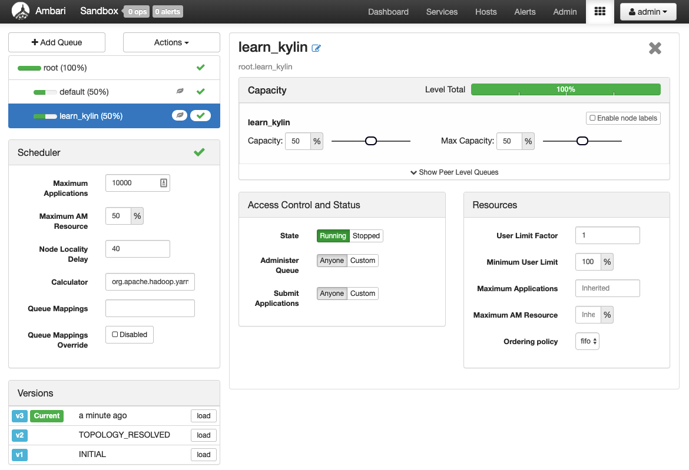
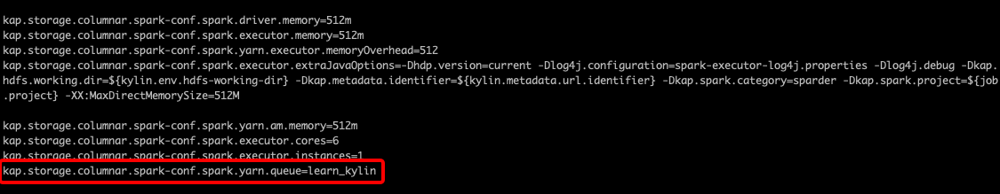
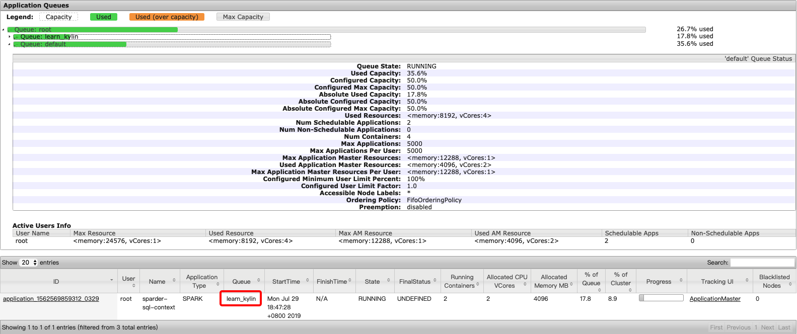

In the case of a multiple-tenants environment, to securely share a large cluster, each tenant needs to have the allocated resources in a timely manner under the constraints of the allocated capacities. To achieve computing resources allocation and separation, each Kylin instance or project can be configured to use a different YARN queue.  


### <span id="instance">Instance-level YARN Queue Setting</span>

To achieve this, first create a new YARN capacity scheduler queue. By default, the job sent out by Kylin will go to the default YARN queue.

In the screenshot below, a new YARN queue `learn_kylin` has been set up.



Then you may modify `kylin.properties` to configure the YARN queue used in Kylin for building or querying (you will need to change the YOUR_QUEUE_NAME to your queue name).

```shell
Building configuration: kylin.engine.spark-conf.spark.yarn.queue=YOUR_QUEUE_NAME
Querying configuration: kylin.storage.columnar.spark-conf.spark.yarn.queue=YOUR_QUEUE_NAME
```



In this example, the queue for querying has been changed to `learn_kylin` (as shown above). You can test this change by triggering a querying job.

Now, go to YARN Resource Manager on the cluster. You will see this job has been submitted under queue `learn_kylin`. 




Similarly, you may set up YARN queue for other Kylin instances to achieve computing resource separation.


### <span id="project">Project-level YARN Queue Setting</span>

The system admin user can set the YARN Application Queue of the project in **Setting -> Advanced Settings -> YARN Application Queue**, please refer to the [Project Settings](../operations/project-operation/project_settings.md) for more information.
