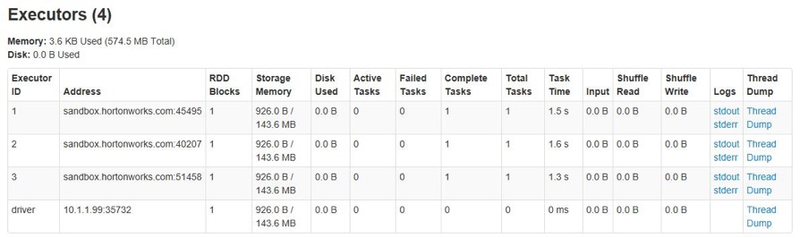
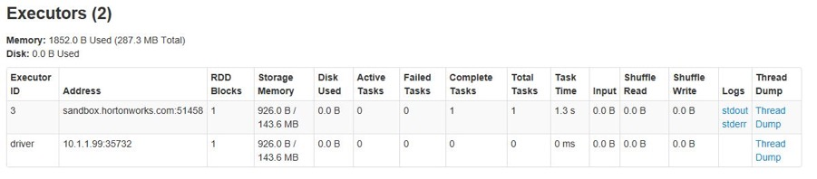
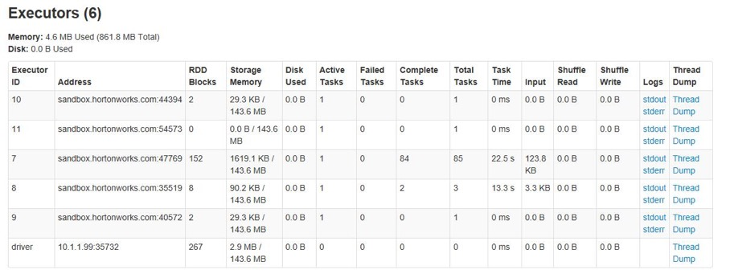

In Spark, the resource unit is executor, something like containers in YARN. Under Spark on YARN, we use num-executors to specify the executor numbers. While executor-memory and executor-cores will limit the memory and virtual CPU cores each executor consumes.

Take Kylin as sample, if user choose fixed resource allocation strategy and set num-executor to 3. Then each Kylin instance will always keep 4 YARN containers(1 for application master and 3 for executor). These 4 containers will be occupied until user log out. While we use Dynamic Resource Allocation, Spark will dynamically increase and reduce executors according to Kylin query engine workload which will dramatically save resource.

Please refer to official document for details of Spark Dynamic Allocation:

http://spark.apache.org/docs/2.4.1/job-scheduling.html#dynamic-resource-allocation

### Spark Dynamic Allocation Config

#### Overview
There are two parts we need to configure for Spark Dynamic Allocation:
1.  Resource Management for cluster, it will be diversed due to different resource manager(YARN、Mesos、Standalone).
2.  Configure file spark-default.conf, this one is irrespective of the environment.

#### Resource Manager Configuration
##### CDH

1. Log into Cloudera Manager, choose YARN configuration and find NodeManager Advanced Configuration Snippet(Safety Valve) for yarn-site.xml, config as following：

```
<property>
 <name>yarn.nodemanager.aux-services</name>
 <value>mapreduce_shuffle,spark_shuffle</value>
</property>
<property>
 <name>yarn.nodemanager.aux-services.spark_shuffle.class</name>
 <value>org.apache.spark.network.yarn.YarnShuffleService</value>
</property>
```

2. Copy the `$KYLIN_HOME/spark/yarn/spark-<version>-yarn-shuffle.jar` and put it under path /opt/lib/kylin/ of Hadoop node.

   Find NodeManager Environment Advanced Configuration Snippet  (Safety Valve) in Cloudera Manager, Config:

   `YARN_USER_CLASSPATH=/opt/lib/kylin/*`

   Then yarn-shuffle.jar will be added into the startup classpath of Node Manager.

3. Save the config and restart
   In Cloudera Manager, choose actions --> deploy client configuration, save and restart all services.

##### HDP
1. Log into Ambari management page, choose Yarn -> Configs -> Advanced, find following configurations via filter and update: 
   `yarn.nodemanager.aux-services.spark_shuffle.class=org.apache.spark.network.yarn.YarnShuffleService`

2. Save the config and restart all services.


#### Kylin configuration
To enable the Spark Dynamic Allocaiton, we will need to add some configuration items in Spark config files. Since we can override spark configuraion in kylin.properties, we will add following configuration items in it:

`kylin.storage.columnar.spark-conf.spark.dynamicAllocation.enabled=true`

`kylin.storage.columnar.spark-conf.spark.dynamicAllocation.maxExecutors=5`

`kylin.storage.columnar.spark-conf.spark.dynamicAllocation.minExecutors=1`

`kylin.storage.columnar.spark-conf.spark.shuffle.service.enabled=true`

`kylin.storage.columnar.spark-conf.spark.dynamicAllocation.initialExecutors=3`

More configurations please refer to: 
http://spark.apache.org/docs/latest/configuration.html#dynamic-allocation

### Spark Dynamic Allocation Verification
After above configurations, start Kylin and monitor current executor numbers in Spark Executor page.



The executors will keep idle, so they will be reduced after a while until reaching the minimum number in configuration item.



Submit multi-thread queries to Kylin via Restful API. The executors will be increase but never exceed the maximum number in configuration item. 


