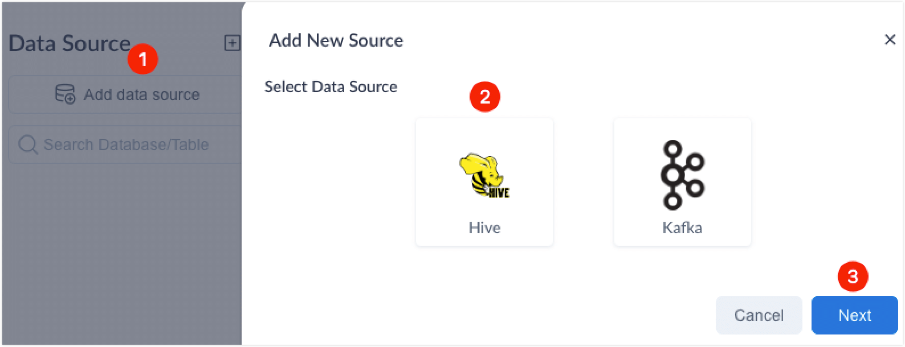
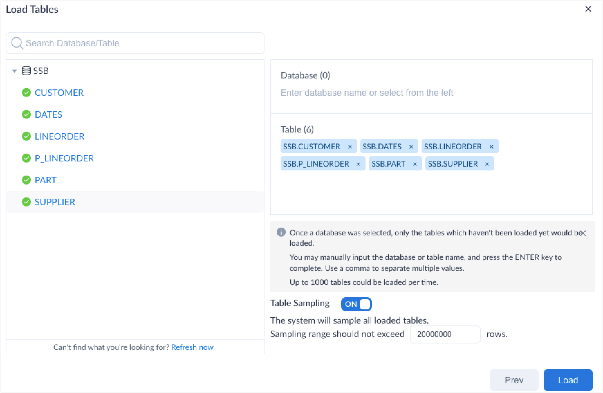

In the context of digital transformation, companies need to dig out the most valuable data to support their business decisions and growth, which is really hard to achieve with traditional data warehouses, as they can only provide minute-level or even hour-level query latency when dealing with massive data. 

Leveraging the capability of Apache Hive, Kylin has effectively solved the query latency issue with its sub-second query response time on PB-level data. 

Apache Hive is a distributed, fault-tolerant data warehouse software that enables analytics at a massive scale. With Apache Hive to map structured data into tables and precomputation offered by Kylin, you can easily identify and manage your business' most valuable data, and uncover new insights from any size dataset, at any time, and from anywhere. 

This article introduces how to load Hive data source to a Kylin [project](../operations/project-operation/project_management.md) for [model designing](../modeling/intro.md) and [data analysis](../query/intro.md). 

### Notes

- Hive data types including Map, Array, Struct, and Binary are not supported. Columns of these data types will be skipped during data loading. 

- Views with user-defined functions (UDF) in Hive 3 are not supported.

### Operation steps

1. Log in to Kylin as any of the following roles:
   - System admin
   - Management of the target project or Admin

2. In the project list at the top of the page, select the target project.

   Create a new project if you have not created any projects yet. For more information, see [Create project](../operations/project-operation/project_management.md).

3. In the left navigation panel, click **Data Assets** > **Data Source**.

4. Click **Add data source**. In the **Add New Source** dialog box, select **Hive** and click **Next**.

5. Select the target database/table (use the filter to quickly locate), and then click **Load**.   

6. Below we will use Kylin's [sample dataset](../quickstart/sample_dataset.md) to show how to load Hive data source.

   

   > [!NOTE]
   >
   > [Data sampling](data_sampling.md) is enabled at the table level by default. Kylin uses table sampling to collect statistical information of source tables, such as column cardinality and formats, so you can check the distribution for column values for better model designing.

### FAQ

- Question: Why cannot I find the Hive database/table prepared in advance during data loading?

  Answer: Kylin will obtain the source table metadata periodically. If a table cannot be found during data loading, it's likely that the source table metadata is changed. To solve this issue, click **Refresh now** so the system can get the latest metadata information.

- Question: How to load Hive transactional tables? 

  Answer: Before loading, you need to add `kylin.build.resource.read-transactional-table-enabled=true` to the configuration file, and configure parameter `kylin.source.hive.beeline-params`. For more information, see [Configure basic parameters](../configuration/configuration.md). 

- Question: Besides Hive data source, what other data sources does Kylin support?

  Answer: Kylin supports various data sources, including Hive and [Kakfa](import_kafka.md). Meanwhile, you can also [connect to other data sources by extending the data source SDK](../developer/rdbms_sdk/rdbms_sdk.md), for example, GBase. 

### Next step 

[Model](../modeling/intro.md)

