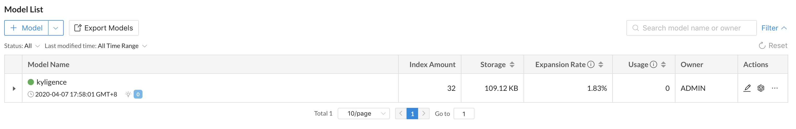
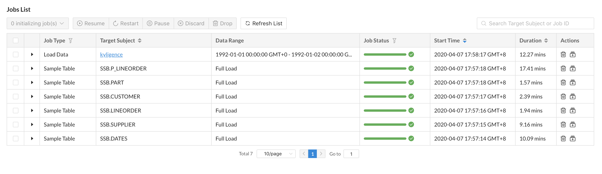
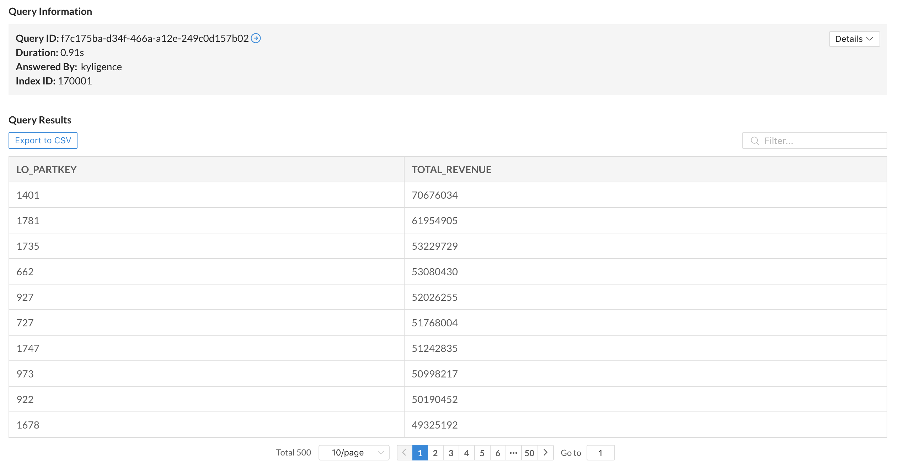

Kylin uses the open source **SSB** (Star Schema Benchmark) dataset for star schema OLAP scenarios as a test dataset. You can verify whether the installation is successful by running a script to import the SSB dataset into Hive. The SSB dataset is from multiple CSV files.

This section verifies installation with the following steps:

- [Import Sample Data](#ssb)
- [Validate Product Functions](#function)
- [Validate Query Analysis](#query)


### <span id="ssb">Import Sample Data</span>

Run the following command to import the sample data:

```shell
$KYLIN_HOME/bin/sample.sh
```

The script will create 1 database **SSB** and 6 Hive tables then import data into it.

After running successfully, you should be able to see the following information in the console:

```shell
Sample hive tables are created successfully
```

We will be using SSB dataset as the data sample to introduce Kylin in several sections of this  product manual. The SSB dataset simulates transaction data for the online store, see more details in [Sample Dataset](#TODO). Below is a brief introduction.


| Table        | Description                 | Introduction                                                         |
| ----------- | -------------------- | ------------------------------------------------------------ |
| CUSTOMER    | customer information           | includes customer name, address, contact information .etc.                       |
| DATES       | order date          | includes a order's specific date, week, month, year .etc. |
| LINEORDER   | order information           | includes some basic information like order date, order amount, order revenue, supplier ID, commodity ID, customer Id .etc. |
| PART        | product information           | includes some basic information like product name, category, brand .etc.                           |
| P_LINEORDER | view based on order information table | includes all content in the order information table and new content in the view   |
| SUPPLIER    | supplier information        | includes supplier name, address, contact information .etc.          |

### <span id="function">Validate Product Functions</span>

On the **Data Asset -> Model** page, you should see an example model with som storage over 0.00 KB, this indicates the data has been is loaded for this model.



On the **Monitor -> Job** page, you should see all jobs have been completed successfully. 



### <span id="query">Validate Query Analysis</span>

When the metadata is loaded successfully, at the **Insight** page, 6 sample hive tables would be shown at the left panel. User could input query statements against these tables. For example, the SQL statement queries different product group by order date, and in descending order by total revenue: 

```sql
SELECT LO_PARTKEY, SUM(LO_REVENUE) AS TOTAL_REVENUE
FROM SSB.P_LINEORDER
WHERE LO_ORDERDATE between '19930601' AND '19940601' 
group by LO_PARTKEY
order by SUM(LO_REVENUE) DESC 
```

The query result will be displayed at the **Insight** page, showing that the query hit the sample model.



You can also use the same SQL statement to query on Hive to verify the result and response time of this query.
