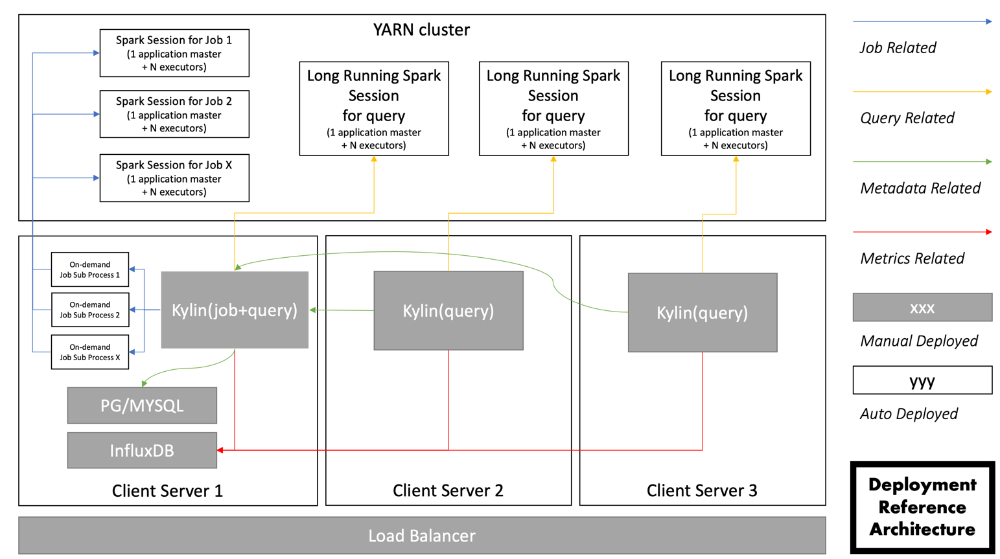

All Kylin state information instance is stored in a RDBMS database, so running Kylin on multiple nodes in a cluster is good practice for better load balance and higher availability. Currently, we only support deployment with one `all` node and multiple `query` nodes.



In the above diagram, the components which require user deployment are below:

- RDBMS as Metastore（PostgreSQL/MySQL）
- Time-Series Database (InfluxDB)
- Kylin nodes
- Load Balancer

We will go through each one of them:

### RDBMS and Time-Series Database Introduction

Kylin uses RDBMS to store metadata, please refer to [Use RDBMS as Metastore](../rdbms_metastore/intro.md).

Kylin uses Time-series database to store metrics (mostly for monitor purpose), please refer to [Use InfluxDB as Time-Series Database](../../../operations/monitoring/influxdb/influxdb.md). 

### Kylin Nodes Introduction

Currently, Kylin supports multiple nodes deployment. Queries will be distributed through all nodes and jobs can be submitted by all types of nodes. However, the building jobs will be submitted to job engine node ( `all` node and `job` node).

- `query` node: You can submit queries or building jobs on `query` nodes but the jobs cannot be executed.
- `job` node: This node can execute jobs and metadata operations
- `all` node: `all` node can perform all the work of `query` and `job` node.

### Kylin Instance Configuration

**Note**: 

- Please deploy Kylin nodes in the same Hadoop cluster. If you need to deploy a read/write separation environment, please refer to [Read/Write Separation Deployment](rw_separation.md) chapter.
- It is recommended not to start multiple `all` nodes at the same time.

### Kylin Multi-Active Job Engines

Kylin job engine is used to execute building jobs, schedule jobs and metadata operations. Normally, users will configure one or more node as job engine in the cluster deployment.

Since Kylin 5.0, Kylin works "Multi-Active" mode, which meanings every healthy `all` and `job` node can execute building tasks. When one job engine is stopped, the other job engines will take over the running task on it. That will ensure the high availability of Kylin services.

It should be noted that, due to the existence of project locks, when jobs are allocated to nodes, the project is the smallest unit of allocation, that is, all jobs in a project can only be executed on one job engine. Different projects and jobs can be executed on different job engines.

If you want to enable this function, add `kylin.server.mode=all` or `kylin.server.mode=job` into `$KYLIN_HOME/conf/kylin.properties` for more than one node.

The related config items are shown below:
```properties
kylin.server.leader-race.heart-beat-timeout=60
kylin.server.leader-race.heart-beat-interval=30
kylin.job.ssh-username=username
kylin.job.ssh-password=password
```
`kylin.server.leader-race.heart-beat-timeout` stands for heart beat timeout，default value is 60, in seconds. When an job engine node didn't send heartbeat for more than this value, this node will be marked as unavailable.
`kylin.server.leader-race.heart-beat-interval` stands for heart beating's time interval，default value is 30, in seconds, which means each job engine node will send heartbeat for every 30 seconds.
`kylin.job.ssh-username` stands for ssh login username between Kylin nodes, if passwordless is not configured.
`kylin.job.ssh-password` stands for ssh login password between Kylin nodes, if passwordless is not configured.


**Known Limitations**

1. Enable session sharing is required when using Kylin HA. Add `spring.session.store-type=jdbc` into `$KYLIN_HOME/conf/kylin.properties` for each node.
2. Please make sure there is no clock skew in the cluster. You can use `ntp` service to sync the clock in the cluster.
3. When a Kylin job engine node is down, may lead to all projects owned by this node send metadata related requests, the hint is: `System is trying to recover, please try again later.`
4. When all Kylin job engine nodes are down, you may see the hint when you trying to send metadata related requests in the `query` node: `There is no active All node, please contact to your administrator to check and fix.`.
5. It is necessary to configure password-free login between each node, or ensure that the ssh login information between each node is consistent.

**Note:**

- The "Multi-Active" mode is enabled by default. If there is only one `all` or `job` node, this mode should be turned off because of performance considerations. If you want to disable this feature, please add `kylin.server.leader-race.enabled=false` in `$KYLIN_HOME/conf/kylin.properties` for the `all` or `job` node.
- If you want to enable it again, please update the relationship between projects and the job engines. After that, you need call Rest API to update the data. For details, please refer to [Project Settings API](../../../restapi/project_api.md)
