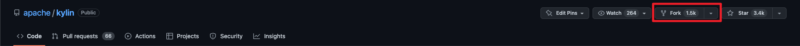
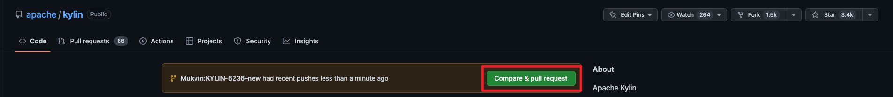
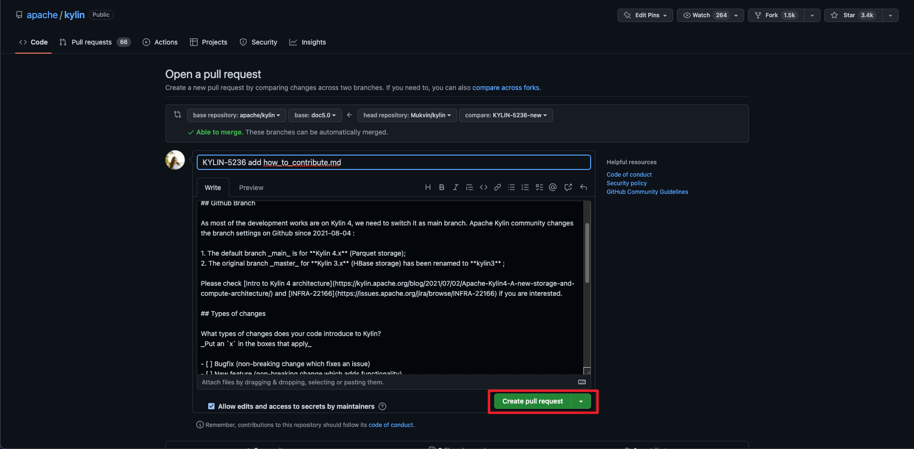

Apache Kylin is always looking for contributions of not only code, but also usage document, performance report, Q&A etc. All kinds of contributions pave the way towards a Kylin Committer. There is opportunity for everyone, especially for those come from analysis and solution background, due to the lacking of content from user and solution perspective.


## Source Branches
Both code and document are under Git source control. Note the purpose of different branches.

* `kylin5`: Development branch for a certain major release for v5.x
* `doc5.0`: Document branch for V5.x

* `main`: Maintenance branch for a certain major release for v4.x
* `2.[n].x`: Maintenance branch for a certain major release for v2.x
* `3.[n].x`: Maintenance branch for a certain major release for v3.x
* `document`: Document branch for V4.x and before

## Pick a task
There are open tasks waiting to be done, tracked by JIRA. To make it easier to search, there are a few JIRA filters.

* [A list of tasks](https://issues.apache.org/jira/issues/?filter=12339895) managed by Yang Li.
* [A list of tasks](https://issues.apache.org/jira/issues/?filter=12341496) opened by Ted Yu, important small bugs and some are easy fixes.
* Also you can search for tag "newbie" in Kylin JIRA.

Do not forget to discuss in [mailing list](#TODO) before working on a big task.

If create a new JIRA for bug or feature, remember to provide enough information for the community:

* A well summary for the problem or feature
* A detail description, which may include:
    - the environment of this problem occurred
    - the steps to reproduce the problem
    - the error trace or log files (as attachment)
    - the metadata of the model or cube
* Related components: we will arrange reviewer based on this selection.
* Affected version: which Kylin you're using.

## Making Code Changes
* [Setup development environment](how_to_debug_kylin_in_ide.md)
* Raise a JIRA, describe the feature/enhancement/bug
* Discuss with others in mailing list or issue comments, make sure the proposed changes fit in with what others are doing and have planned for the project
* Make changes in your fork
    * No strict code style at the moment, but the general rule is keep consistent with existing files. E.g. use 4-space indent for java files.
    * Add test case for your code change as much as possible.
    * Make sure "mvn clean package" and "mvn test" can get success.
    * Sufficient unit test and integration test is a mandatory part of code change.
* [Run tests](how_to_test.md) to ensure your change is in good quality and does not break anything. If your patch was generated incorrectly or your code does not adhere to the code guidelines, you may be asked to redo some work.
* Generate a patch and attach it to relative JIRA.

## Create a pull request

It is recommended to [create a pull request from a fork](https://docs.github.com/en/pull-requests/collaborating-with-pull-requests/proposing-changes-to-your-work-with-pull-requests/creating-a-pull-request-from-a-fork).

* Fork [Apache Kylin Repo](https://github.com/apache/kylin) to your repository.



* Clone the fork repo to your local system.

```shell
git clone https://github.com/<YourUserName>/kylin.git
```

Once the repo is cloned, you need to do two things:

1. Create a new branch by issuing the command:

```shell
git checkout -b new_branch
```

2. Create a new remote for the upstream repo with the command:

```shell
git remote add upstream https://github.com/apache/kylin.git
```
> In this case, "upstream repo" refers to the original repo which is [Apache Kylin Repo](https://github.com/apache/kylin.git).

Now you can make changes to the code. The following code creates a new branch, makes an arbitrary change, and pushes it to **new_branch**:

```shell
# After making changes to the code ...
git commit -m "Modify some code to new_branch"
git push origin new_branch
```

* Click the ___Compare & pull request___ button.

Once you push the changes to your repo, the Compare & pull request button will appear in GitHub.


* Click ___Create pull request___ to open a new pull request.



> Note:
> 
>   1. Please add a detailed description in the `Proposed changes` of a pull request.
> 
>   2. Click the `Types of changes` that you have made.
> 
>   3. Check the `Checklist`.

## Code Review
The reviewer needs to review the patch from the following perspectives:

* _Functionality_: the patch MUST address the issue and has been verified by the contributor before submitting for review.
* _Test coverage_: the change MUST be covered by a UT or the Integration test, otherwise it is not maintainable. Execptional case includes GUI, shell script, etc.
* _Performance_: the change SHOULD NOT downgrade Kylin's performance.
* _Metadata compatibility_: the change should support old metadata definition. Otherwise, a metadata migration tool and documentation is required.
* _API compatibility_: the change SHOULD NOT break public API's functionality and behavior; If an old API need be replaced by the new one, print warning message there.
* _Documentation_: if the Kylin document need be updated together, create another JIRA with "Document" as the component to track. In the document JIRA, attach the doc change patch which is againt the "document" branch.

A patch which doesn't comply with the above rules may not get merged.

## Patch +1 Policy

Patches that fit within the scope of a single component require, at least, a +1 by one of the component’s owners before commit. If owners are absent — busy or otherwise — two +1s by non-owners but committers will suffice.

Patches that span components need at least two +1s before they can be committed, preferably +1s by owners of components touched by the x-component patch.

Any -1 on a patch by anyone vetoes a patch; it cannot be committed until the justification for the -1 is addressed.

## Making Document Changes
Check out [How to Write Document](how_to_write_doc.md).
