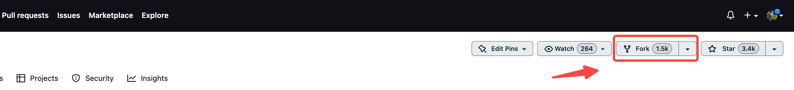
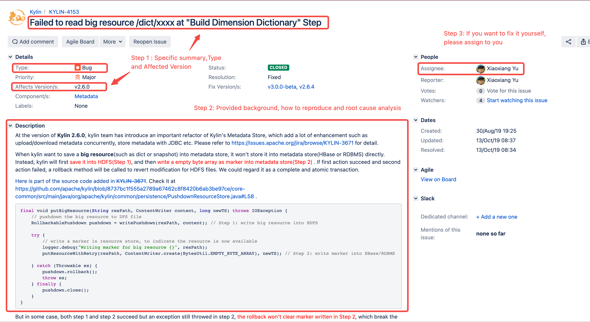

Apache Kylin is always looking for contributions of not only code, but also user document, [performance report](https://cwiki.apache.org/confluence/display/KYLIN/Performance+Benchmark+Report+of+Kylin+4.0.0+vs+Kylin3.1.2+on+Hadoop), 
[Q&A](https://cwiki.apache.org/confluence/display/KYLIN/FAQ+Kylin+4.X) etc. All kinds of contributions pave the way towards a [Apache Committer](https://www.apache.org/foundation/how-it-works.html#committers). 
There is opportunity for [newcomers](https://community.apache.org/newcomers/index.html), especially for those come from analysis and solution background, due to the lacking of content from user and solution perspective.

### <span id="branch_table">Source Branches</span>
Both code and document are under Git source control. Note the purpose of different branches.

| Branch            | Category           |                 Comment                | 
|:------------------|--------------------|:---------------------------------------|
| **kylin5**        | Development branch | **Active** development branch for v5.x |
| **doc5.0**        | Document branch    | Document branch for v5.x               |
| **main**          | Maintenance branch | Maintenance branch for v4.x            |
| **kylin3**        | Maintenance branch | Maintenance branch for v3.x     |
| **document**      | Document branch    | Document branch for v4.x and before    |

-----

## Guide for Contributor 

:::info 
Want to know what do different role(like contributor, committer and PMC member) means in ASF? Check this for [official explanation](https://www.apache.org/foundation/how-it-works.html#roles) .
:::

### Overall steps
1. [Fork Kylin Repo to your repository](#fork_repo) (https://github.com/apache/kylin).
2. [Clone the fork repo to your local](#clone_repo).
3. [Create a new development branch locally](#create_branch).
4. [Setup development environment](how_to_debug_kylin_in_ide.md)
5. [Pick or Create a JIRA](#open_issue), describe the feature/enhancement/bug.
6. [Discuss with others in mailing list](#discuss_proposal) or issue comments, make sure the proposed changes fit in with what others are doing and have planned for the project.
7. Make code changes in your development branch
   - [ ] No strict code style at the moment, but the general rule is keep consistent with existing files. E.g. use 4-space indent for java files.
   - [ ] Add test case for your code change as much as possible.
   - [ ] Make sure [Run tests](how_to_test.md) can get success, this will ensure your change is in good quality and does not break anything.
8. Read [Code Review Guidelines](#CodeReviewGuideline) and check if your code does **adhere to the guidelines**, you may be asked to redo some work later if you forgot them.
9. [Create a pull request](#open_pull_request) for you code change.
10. If you need to update doc, please check out [How to Write Document](./how_to_write_doc) for help.

### Detailed Description

#### <span id="fork_repo">Step 1: Fork Apache Kylin Repo</span> 
Visit https://github.com/apache/kylin in your browser, and click the **Fork** button.


#### <span id="clone_repo">Step 2: Clone the fork repo</span>
```shell
git clone https://github.com/<YourUserName>/kylin.git 
```

#### <span id="create_branch">Step 3: Create a new development branch</span>

The **base_branch** is determined by which version of Kylin you want to work on and [branches table](#branch_table). For better understanding of Git operations, please check [Contributing to a Project](https://www.git-scm.com/book/en/v2/Distributed-Git-Contributing-to-a-Project).
```shell
## check out to base branch you want to work on
git checkout <base_branch>

## create a development branch based on base branch
git checkout -b <development_branch>
```

For example, if I want to fix some issue for Kylin 5.0.0-alpha, you could execute following command:
```shell
git checkout kylin5
git checkout -b fix_some_issue
```

#### <span id="open_issue">Step 5: Pick or create a task</span>
There are open tasks waiting to be done, tracked by [KYLIN JIRA](http://issues.apache.org/jira/browse/KYLIN).
If you want to create a new JIRA for bug or feature, remember to provide enough information for the community:

* A well **summary** for the problem or feature, like "Failed to read big resource /dict/xxxx at 'Build Dimension Dictionary' Step"
* A correct **Type** of issue, choose 
  - _New Feature_ , if you want to develop a brand-new function/feature by yourself
  - _Improvement_ , if you find a way to improve an existent function/feature
  - _Bug_ , if you find an existent function not works well as expected
  - _Wish_ , if you want to a new function/feature and wish it will be developed by someone else
* **Affected version**: which Kylin you're using.
* A detailed **description**, which may include:
  - the environment of this problem occurred
    - Kylin version
    - Hadoop/Spark version ...
  - the steps to reproduce the problem
  - the [thread stack](https://issues.apache.org/jira/secure/attachment/13048219/image-2022-08-17-13-17-40-751.png), exception stacktrace or log files (as attachment)
  - the metadata of the model or cube (as attachment)
  - **Root cause**: For bug reports, provide root cause analysis if it is possible, here is an [example for root cause analysis](https://issues.apache.org/jira/browse/KYLIN-4153).



:::caution report a possible vulnerability
For a possible vulnerability, do not use JIRA, please follow the guide https://apache.org/security/committers.html#report .
:::

#### <span id="discuss_proposal">Step 6: Discuss your proposal</span>
Do not forget to discuss in [mailing list](https://www.apache.org/foundation/mailinglists.html) before working on a big task.
For how to discuss your idea/proposal in mailing list, please check [guide for ask good question](https://infra.apache.org/contrib-email-tips.html#usefulq) and [example for development's proposal](https://lists.apache.org/thread/gtcntp4s8k0fz1d4glospq15sycc599x) .

:::caution subscribe a mailing list
1. Before you sending mail to mailing list, please make sure you have subscribed a mailing list. Please [**check this guide**](how_to_subscribe_mailing_list) if you don't know how to subscribe a mailing list.
2. If you do not [receive the confirmation email](https://www.apache.org/foundation/mailinglists.html#request-confirmation) after sending email to the mail list, the email maybe is shown in your trash mail.
:::

   
#### <span id="open_pull_request">Step 9: Create a pull request</span>

* Push your code change to your personal repo

Now you can make changes to the code. Then you need to push it to your remote :

```shell
# After making changes to the code ...
git commit -m "KYLIN-0000 COMMIT SUMMARY"
git push origin <development_branch>
```

* Click the ___Compare & pull request___ button in browser

Once you push the changes to your repo, the Compare & pull request button will appear in GitHub.


* Fill the message and click ___Create pull request___ to open a new pull request.

:::caution Before you create pull request
1. Please add a detailed description in the `Proposed changes` of a pull request.
2. Click the `Types of changes` that you have made.
3. Check the `Checklist`.
:::


-----

## Guide for Reviewer
### <span id="CodeReviewGuideline">Code Review Guideline</span>
The reviewer needs to review the patch from the following perspectives:

* _Functionality_: the patch MUST address the issue and has been verified by the contributor before submitting for review.
* _Test coverage_: the change MUST be covered by a UT or the Integration test, otherwise it is not maintainable. Execptional case includes GUI, shell script, etc.
* _Performance_: the change SHOULD NOT downgrade Kylin's performance.
* _Metadata compatibility_: the change should support old metadata definition. Otherwise, a metadata migration tool and documentation is required.
* _API compatibility_: the change SHOULD NOT break public API's functionality and behavior; If an old API need be replaced by the new one, print warning message there.
* _Documentation_: if the Kylin document need be updated together, create another JIRA with "Document" as the component to track. In the document JIRA, attach the doc change patch which is againt the "document" branch.

:::danger Rules must be obeyed
A patch which doesn't comply with the above rules may not get merged.
:::

### Patch +1 Policy

Patches that fit within the scope of a single component require, at least, a +1 by one of the component’s owners before commit. If owners are absent — busy or otherwise — two +1s by non-owners but committers will suffice.

Patches that span components need at least two +1s before they can be committed, preferably +1s by owners of components touched by the x-component patch.

Any -1 on a patch by anyone vetoes a patch; it cannot be committed until the justification for the -1 is addressed.