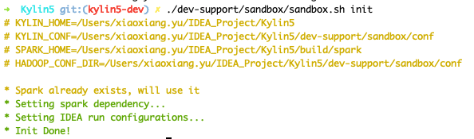
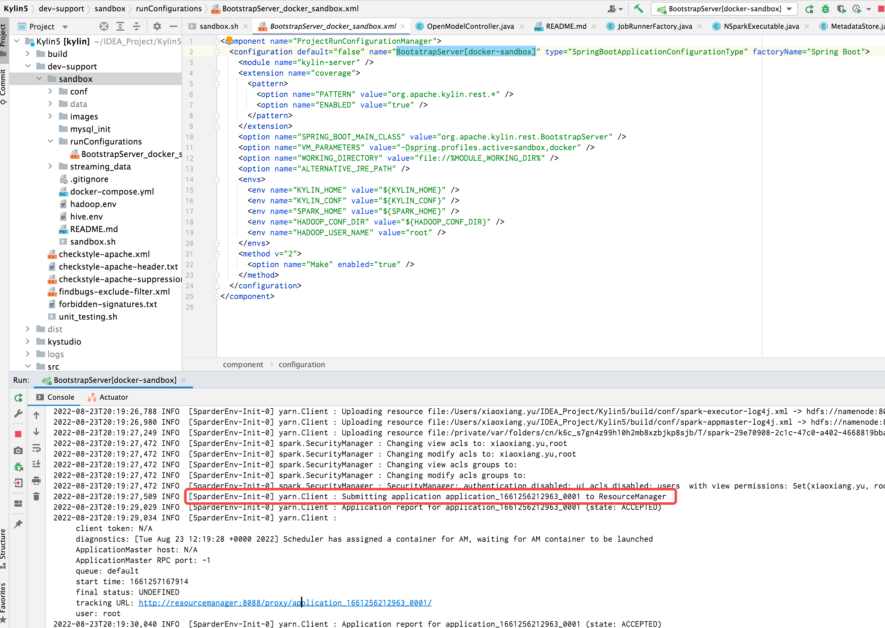

# How to debug Kylin in IDEA using docker

### Background

#### Why debug Kylin in IDEA using docker
This article aims to introduce a simple and useful way to develop and debug Kylin for developer, and provided similar deployment to user's real scenario. 

This guide **assumes** you have to the following:

- Use a **laptop** with MacOS installed to do development work, and have another **remote linux server** for testing and deployment purpose.
- Docker Desktop on Mac(Windows is not verified at the moment)
- Docker Engine on Linux Server(optional)
- IntelliJ IDEA Community Edition
- kylin's source code is cloned into some directory in your laptop

#### Deployment architecture
Following is architecture of current deployment.


### Prepare IDEA and build source code

#### Software Requirement

Please visit [software_reqiurement](how_to_package#software_reqiurement).

#### Build source code
- Build back-end source code before your start debug.
```shell
cd <path-to-kylin-source>
mvn clean install -DskipTests
```

- Build front-end source code. 
(Please use node.js v12.14.0, for how to use specific version of node.js, please check [how to package](./how_to_package.md) )
```shell
cd kystudio
npm install
```

#### Prepare IDEA configuration
- Download spark and create running IDEA configuration for debug purpose.
```shell
./dev-support/sandbox/sandbox.sh init
```

- Following is the shell output.



### Prepare the Hadoop Cluster

#### Deploy Hadoop Cluster
- Install latest docker desktop in your laptop
- [**Optional**] Install docker engine on remote machine (https://docs.docker.com/engine/install/)
- [**Optional**] If you want to deploy hadoop cluster on remote machine, please set correct `DOCKER_HOST`

:::tip
It is recommended to use **remote server** other than laptop to deploy Hadoop Cluster, because 7-8 containers may consume a lot of hardware resources and cause your laptop run slower than before.
:::

```shell
# see more detail at : https://docs.docker.com/compose/reference/envvars/#docker_host
export DOCKER_HOST=ssh://${USER}@${DOCKER_HOST}
```

- Check available resource of your docker engine which you want to deploy Hadoop Cluster, make sure you leave 6 CPUs and 12 GB memory at least .

Following is the setting page of Docker Desktop of MacBook.


- Deploy hadoop cluster via docker compose on laptop(or on remote machine)

```shell
./dev-support/sandbox/sandbox.sh up
```


#### Check status of hadoop cluster
- Wait 1-2 minutes, check health of hadoop, you can use following command to check status

```shell
./dev-support/sandbox/sandbox.sh ps
```

Following output content shows all hadoop component are in health state.


- Edit `/etc/hosts`. (if you deployed Hadoop cluster on remote machine, please use correct ip address other than `127.0.0.1` .)
```shell
127.0.0.1 namenode datanode resourcemanager nodemanager historyserver mysql zookeeper hivemetastore hiveserver 
```

- Load sample SSB data into HDFS and Hive
```shell
./dev-support/sandbox/sandbox.sh sample
```

- Check hive table


### Debug Kylin in IDEA

#### Start backend in IDEA

- Select "BootstrapServer[docker-sandbox]" on top of IDEA and click **Run** .

![click BootstrapServer[docker-sandbox]](images/how-to-debug-05.png)

- Wait and check if Sparder is start succeed.



- Check if SparkUI of Sparder is started.


#### Start frontend in IDEA

- Set up dev proxy
```shell
cd kystudio
npm run devproxy
```


#### Validate Kylin's core functions

- Visit Kylin WEB UI in your laptop


- Validate Cube Build and Query function


### Command manual
1. Use `./dev-support/sandbox/sandbox.sh stop` to stop all containers
2. Use `./dev-support/sandbox/sandbox.sh start` to start all containers
3. Use `./dev-support/sandbox/sandbox.sh ps` to check status of all containers
4. Use `./dev-support/sandbox/sandbox.sh down` to stop all containers and delete them

### Q&A

// todo
