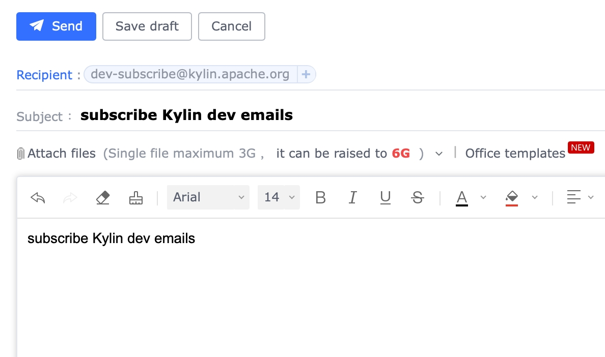
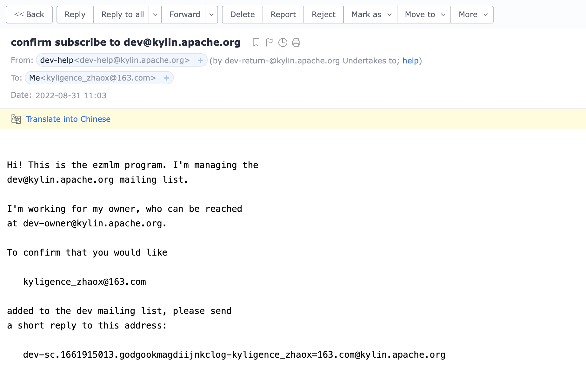
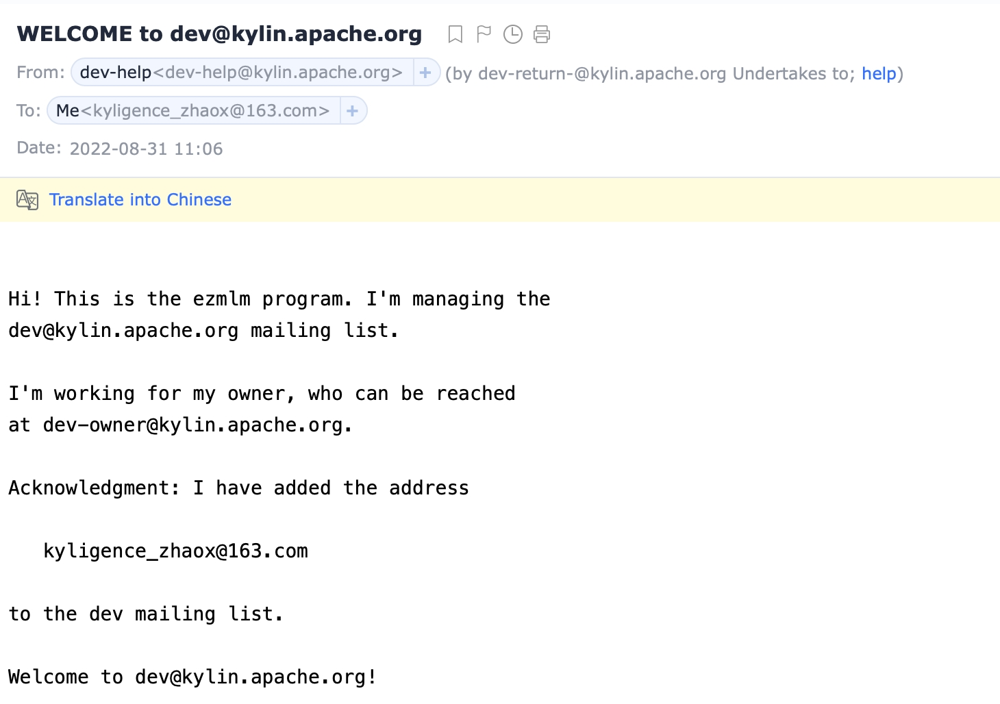

### Mailing List Table
These are the mailing lists that have been established for the Kylin project. For each list, there is a subscribe, unsubscribe, and archive link.

| Mailing List |                    Subscribe Link                    |                     Unsubscribe Link                     |                               Archive Link                                |
|:------------:|:----------------------------------------------------:|:--------------------------------------------------------:|:-------------------------------------------------------------------------:|
|     user     | [subscribe](mailto:user-subscribe@kylin.apache.org)  | [unsubscribe](mailto:user-unsubscribe@kylin.apache.org)  | [mail archive](https://lists.apache.org/list.html?user@kylin.apache.org)  |
|     dev      |  [subscribe](mailto:dev-subscribe@kylin.apache.org)  |  [unsubscribe](mailto:dev-unsubscribe@kylin.apache.org)  |  [mail archive](https://lists.apache.org/list.html?dev@kylin.apache.org)  |
|    issue     | [subscribe](mailto:issue-subscribe@kylin.apache.org) | [unsubscribe](mailto:issue-unsubscribe@kylin.apache.org) | [mail archive](https://lists.apache.org/list.html?issue@kylin.apache.org) |

### Subscribe mailing list

#### Step 1: Send subscription request
You click the _Subscribe Link_ in the above table and send the simple request(it is ok to leave the title and body with a very short sentence) to the appropriate address.

#### Step 2: Receive confirmation reply from ezmlm
The mailing list management program, [ezmlm](http://untroubled.org/ezmlm/), will send you a reply in 2-10 minutes, asking you to **confirm your subscription**.

Following is a successful case.

#### Step 3: Send a confirmation request by replying to the previous email
Reply to the previous email(it is ok to leave the title and body with a short sentence)

#### Step 4: ezmlm acknowledges your confirmation request
You will receive "Welcome to user/dev@kylin.apache.org" in 2-10 minutes. From now, you have the right to send and receive mail from all subscribers of the current mailing list.

Following is a successful case.

### Unsubscribe mailing list
todo

----

This doc is rewrite based on [apache mailing list doc](https://www.apache.org/foundation/mailinglists.html#subscribing).