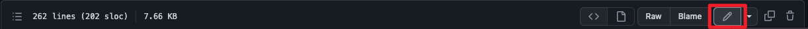
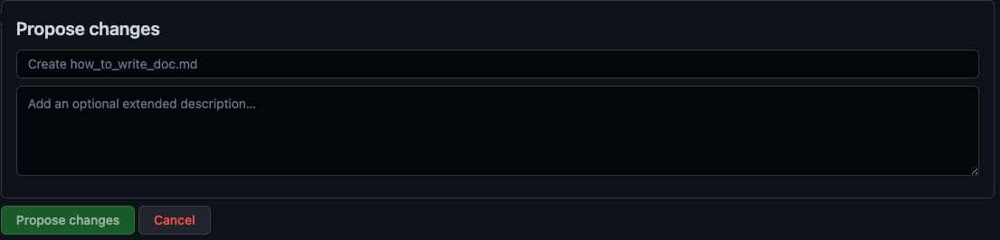

From Kylin 5.0, Kylin community proposed to write documents using [Docusaurus](https://docusaurus.io/). Please note multi-version and i18n(multi-language) is in our plan, but it is not supported right now.

### Shortcut: Edit a single existent page

:::info Shortcut for non-programme
1. This shortcut/way is extreme useful for **non-programmer**. If you found some minor typos or mistakes on a **single** page, you can edit document in browser in this way in 3-15 minutes without preparation.
2. But if you want to more complex works, like add/edit **several** pages, upload images, or change global config files, please jump to next paragraph: [**Before your work**](#Before_your_work).
:::

1. Just scroll down the page to the bottom and click the `Edit this page`.


2. Edit this file in browser.


3. Raise a pull request for your changes.


### <span id="Before_your_work">Before your work</span>

Before you add new documentation, please deploy the document compilation environment.

There are two steps:

- [Install Node.js](#Install)
- [Clone Github Repo](#Download)

#### <span id="Install">Install Node.js</span>

First, make sure [Node.js](https://nodejs.org/en/download/) version 16.14 or above (which can be checked by running node -v) is installed on your machine. You can use [nvm](https://github.com/nvm-sh/nvm) for managing multiple Node versions on a single machine installed.

When installing Node.js via **Windows/macOS Installer**, you are recommended to check all checkboxes related to dependencies. 

#### <span id="Download">Clone Github Repo</span>

1. Clone the doc repo to any path you prefer.

```shell
cd /path/you/prefer/to
git clone --branch doc5.0 https://github.com/apache/kylin.git # Or git clone -b doc5.0 https://github.com/apache/kylin.git
```

2. Install dependencies for prerequisite of doc. More about requirement about [Docusaurus](https://docusaurus.io/), please refer to [Docusaurus Installation](https://docusaurus.io/docs/installation).
   
```shell
cd website
npm install
```

To check if that environment works well, run:

```shell
npm run start
```
   
then, homepage (`http://localhost:3000`) will automatically open in your default browser and no errors occurred.


### How to create new document

#### Step 1: Create a new markdown file with metadata

Create a new markdown file with editor, copy and paste following **Head metadata template** to the top your file. 
After that, replace actual literal with variable like `${TITLE OF NEW DOC}` etc.

```
---
title: ${TITLE OF NEW DOC}
language: en
sidebar_label: ${TITLE OF NEW DOC}
pagination_label: ${TITLE OF NEW DOC}
toc_min_heading_level: 2
toc_max_heading_level: 6
pagination_prev: null
pagination_next: null
keywords:
    - ${KEYWORD OF NEW DOC}
draft: false
last_update:
    date: ${DATE of YOUR COMMIT}
    author: ${YOUR FULL NAME}
---
```

:::caution 
Please note that each doc need the ___Head metadata___. More details about `Head metadata` of a doc, please refer to [Head metadata](https://docusaurus.io/docs/markdown-features/head-metadata).
:::

#### Step 2: Add content for your new doc

Add text and pictures as you needs.

#### Step 3: Add new page to the sidebar

For example: if you want to add the sidebar of new doc(`how_to_write_doc.md`) to be the children menu of `development`.

Then, modify the `DevelopmentSideBar` block in `sidebars.js` and add a new block to the tail of `items` of `DevelopmentSideBar`.

```shell
DevelopmentSideBar: [
    {
        ...
        items: [
            {...},
            ...,
            {
                type: 'doc',
                id: 'development/how_to_write_doc'
            },
        ],
    },
],              
```


#### Step 4: Preview in your local machine
You can preview in your browser, please run following commands in the `website` directory, then access [doc5.0](http://127.0.0.1:3000) in your browser:

```
npm run start
```

:::caution Checklist
- [ ] Whether **look and feel** meet your expectation?
- [ ] Whether the link/pictures works fine?
- [ ] Whether the most important part was highlighted? You may [check this to highlight a paragraph](#highlight_paragraph).
:::

#### Step 5: Create a pull request
If everything is normal, create a pull request to [Apache Kylin Repo](https://github.com/apache/kylin) and target branch is `doc5.0`.

----

### Documentation Specification

#### About [Docusaurus](https://docusaurus.io/)

[Docusaurus](https://docusaurus.io/) is a static-site generator. It builds a single-page application with fast client-side navigation, leveraging the full power of React to make your site interactive. It provides out-of-the-box documentation features but can be used to create any kind of site (personal website, product, blog, marketing landing pages, etc).

Apache Kylin's website and documentation is using [Docusaurus](https://docusaurus.io/) to manage and generate final content which avaliable at [http://kylin.apache.org](http://kylin.apache.org).

#### Kylin document structure and navigation menu

The Kylin [website material](https://github.com/apache/kylin/tree/doc5.0) is maintained under the `doc5.0` branch.

1. __Home Page__: Home page of Docs
2. __Document__: General docs about Apache Kylin, including _Installation_, _Tutorial_, etc.
3. __Development__: _"development"_ For developer to contribute, to develop, integration with other application and extend Apache Kylin
4. __Download__: _"Download"_ Apache Kylin packages
5. __Community__: Apache kylin Community information
6. __Blog__: Engineering blogs about Apache Kylin

#### Full doc structure

The full doc structure about the newest Apache Kylin:

```shell
doc5.0
.
├── README.md
├── babel.config.js
├── blog
│ ├── ...
├── docs
│ ├── community.md
│ ├── configuration
│ │ ├── ...
│ ├── datasource
│ │ ├── ...
│ ├── deployment
│ │ ├── ...
│ ├── development
│ │ ├── ...
│ ├── download.md
│ ├── integration
│ │ └── intro.md
│ ├── intro.md
│ ├── modeling
│ │ ├── ...
│ ├── monitor
│ │ ├── ...
│ ├── operations
│ │ ├── ...
│ ├── powerBy.md
│ ├── query
│ │ ├── ...
│ ├── quickstart
│ │ ├── ...
│ ├── restapi
│ │ ├── ...
│ ├── snapshot
│ │ ├── ...
│ └── tutorial
│     ├── ...
├── docusaurus.config.js
├── package.json
├── sidebars.js
├── src
│ ├── components
│ │ └── ...
│ ├── css
│ │ └── ...
│ └── pages
│     ├── ...
├── static
│ └── img
│     ├── ...
```

More details about structure which managed by Docusaurus, please refer to [Project structure rundown](https://docusaurus.io/docs/installation#project-structure-rundown).

#### Sidebar
The Sidebar is managed by __sidebars.js__ , please refer to [Sidebar](https://docusaurus.io/docs/sidebar).

#### How to add image in doc
All image should be put under _images_ folder, in your document, please using below sample to include image:

```

```

#### How to link to another page
Using relative path for site links, check this [Markdown links](https://docusaurus.io/docs/markdown-features/links)


#### How to add source code in doc
We are using [Code Blocks Doc](https://docusaurus.io/docs/markdown-features/code-blocks) to highlight code syntax, check this doc for more detail sample.

#### <span id="highlight_paragraph">How to highlight a sentence/paragraph</span>
We recommend you to use [admonitions feature](https://docusaurus.io/docs/markdown-features/admonitions) to highlight a sentence/paragraph, following is a example:

```
:::caution
Some **content** with _Markdown_ `syntax`. Check [this `api`](#).
:::
```
