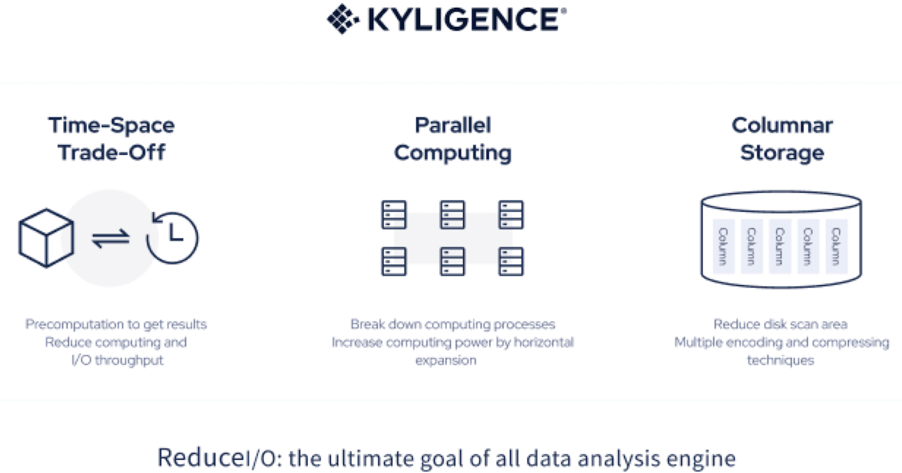
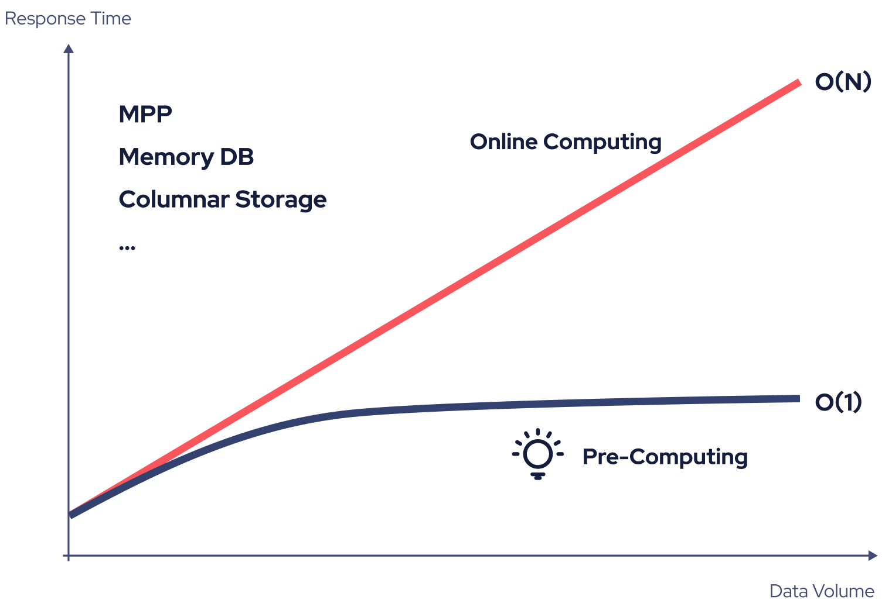

Kylin model consists of multiple tables and their join relations. Kylin follows multidimensional modeling theory to build star or snowflake schemas based on tables. Kylin also leverages pre-computation technique and will reuse the pre-computed results to answer queries, so there's no need to traverse all data when there is a query, thus achieving sub-second query times on PB-level data.

### Challenges when dealing with massive data

When analyzing massive data, there are some techniques to speed up computing and storage, but they cannot change the time complexity of query, that is, query latency and data volume are linearly dependent. 

If it takes 1 minute to query 100 million entries of data records, querying 10 billion data entries will take about 1 hour and 40 minutes. When companies want to analyze all business data piled up over the years or to add complexity to query, say, with more dimensions, queries will be running extremely slow or even time out. 

### Accelerate query with Kylin pre-computation

Kylin leverages pre-computation to avoid the computing pressure brought by the growing data volume. That is, Kylin will precompute the combinations of defined model dimensions and then store the aggregated results as indexes to shorten query latency. In addition, Kylin uses parallel computing and columnar storage techniques to improve computing and storage speed.  

With pre-computation, the number of indexes will be determined by the dimension cardinality only, and will no longer undergo exponential growth as data volume increases. Taking the data analysis of online transactions as an example, with Kylin pre-computation, even if the volume of transaction data increases by 10 times, the query speed against the same analytical dimensions changes little. The computing time complexity can be kept at O(1), helping enterprises to analyze data more efficiently. 

### How to design model and indexes

#### Manual modeling 

In addition to intelligent modeling, Kylin also supports users to design their own models and indexes based on their business needs. Kylin provides step-by-step guidance on how to complete basic model settings, including dimensions, measures, join relationships, and indexes. For details, see [Manual modeling](manual_modeling.md). 

#### Advanced model design 

Kylin offers various advanced features around models and indexes to help users quickly dig out the most valuable data. These features include: 

- Accelerated model design: Kylin offers built-in [advanced measures](model_design/measure_design/intro.md) like count distinct and Top N to speed up modeling.  

For more information, see [Advanced model design](model_design/advance_guide/intro.md). 

### Basic concepts 

Kylin follows multidimensional modeling theory and decomposes complex concepts into specific functional modules to make modeling easier. Below are some of the basic concepts used in Kylin: 

- Dimension: Dimension is a perspective of viewing data, which can be used to describe object attributes or characteristics, for example, product category.

- Measure: Measure is an aggregated sum, which is usually a continuous value, for example, product sales. 

- Model: Model consists of multiple tables and their join relations, as well as defined dimensions and measures.

- Pre-computation: Pre-computation is the process of aggregating data based on model dimension combinations and of storing the results as indexes to accelerate data query.

- Index: Index is used to accelerate data query. Indexes are divided into:
  - Aggregate Index: Aggregate index is an aggregated combination of multiple dimensions and measures, and can be used to answer aggregate queries such as total sales for a given year.
  - Table Index: Table index is a multi-level index in a wide table and can be used to answer detailed queries such as the last 100 transactions of a certain user. 
