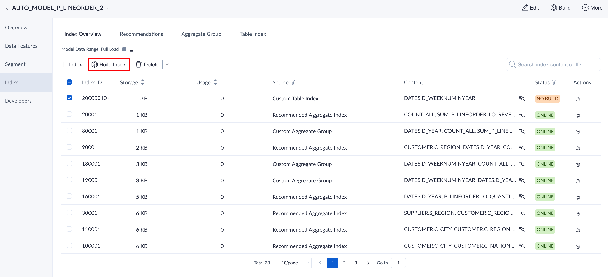
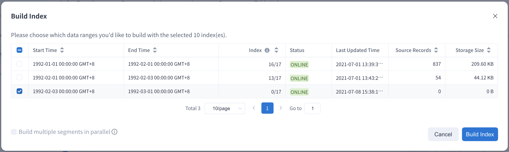
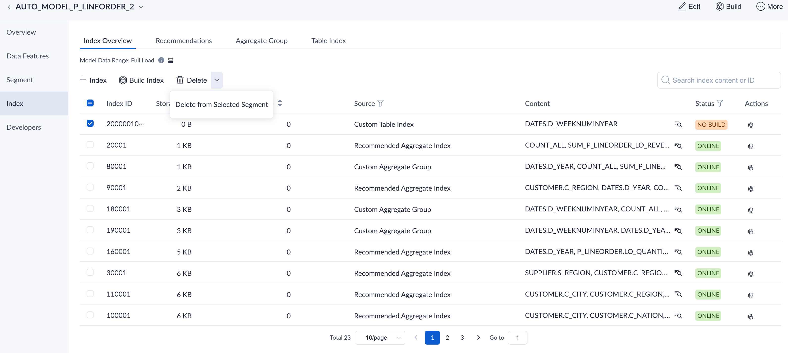
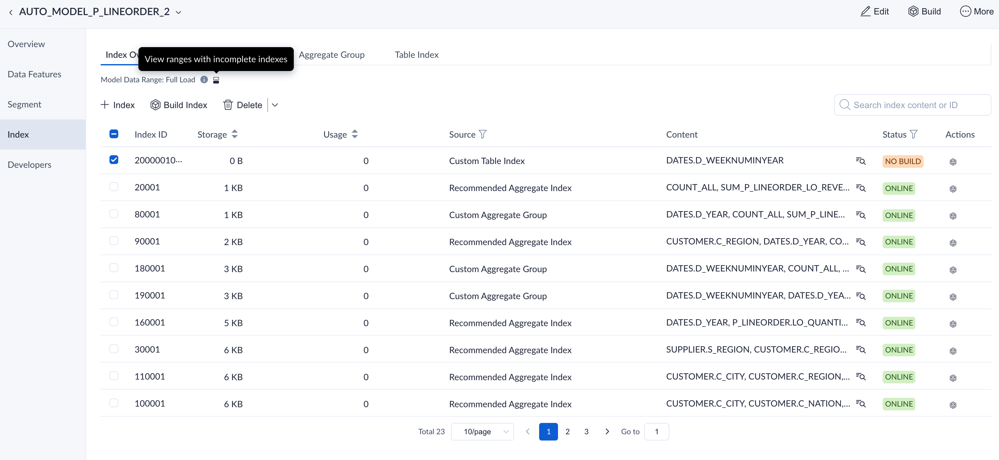
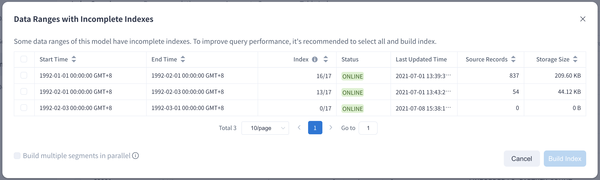

As the business scenario changes, some of the indexes in the model need to be retained only in latest months for saving building and storage costs. Therefore, Kylin provides a more flexible way to build indexes since the 5.0 released.

### Build Index

In the **Index Overview** tab, we can see the index list and some basic information. In the **Index List**, we can filter some indexes by the keyword or ids and then only build them in selected segments. For example, some new columns are added in the source table because of the business demands. Therefore, we need to add some new indexes for those columns in the latest one month for analysis and cost saving. As shown in the figure below, we can select all the new and NO BUILD indexes, and then click the **Build Index** button.

After that, please select the segment with the latest month and click the Build Index button to generate the building job. If you want to build the segments concurrently to improve the efficiency, you can also check the **Generate multiple segments in parallel** box. Then, the system will generate multiple jobs according to the number of selected segments.

### Delete Index

Similar to the building index, you can also delete some indexes in selected segments. For example, deleting some low frequent usage indexes in last year. As shown below, we can choose some of the indexes and click the **Delete** button to choose delete from all segments or parts of them.

Note: If the indexes are deleted from segments, it may influence the query performance because some of query may route to the pushdown engine due to the lack of index.

### Build All Index

To support more flexible index building, it may expect that different indexes will be included in different segments. In order to ensure the stable query performance, we recommend you build all index among all segments after a period of time. Therefore, if the index is incomplete, we can quickly build all indexes by clicking the icon after the index data range.

As shown below, all the segments with incomplete indexes will be shown after clicked the icon. Then, you can select all the segments and click **Build Index** to ensure segments with all indexes.

