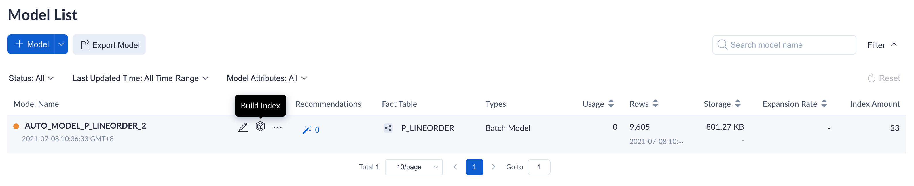
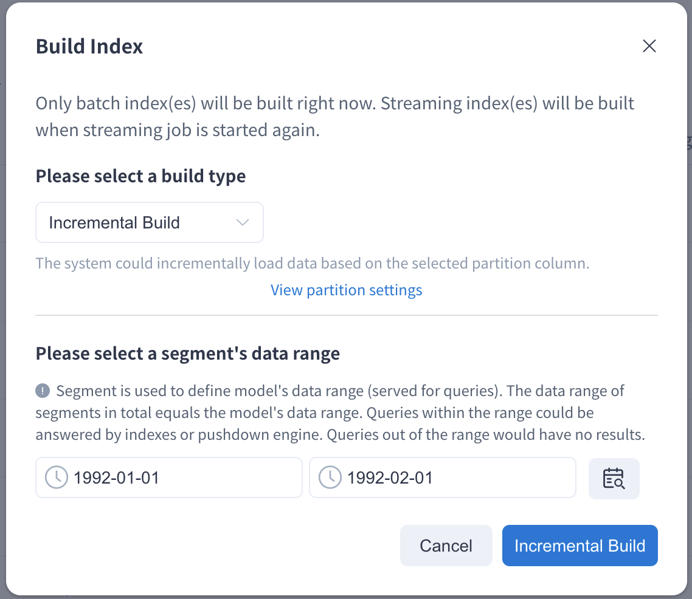
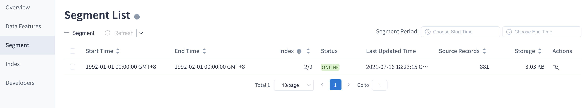
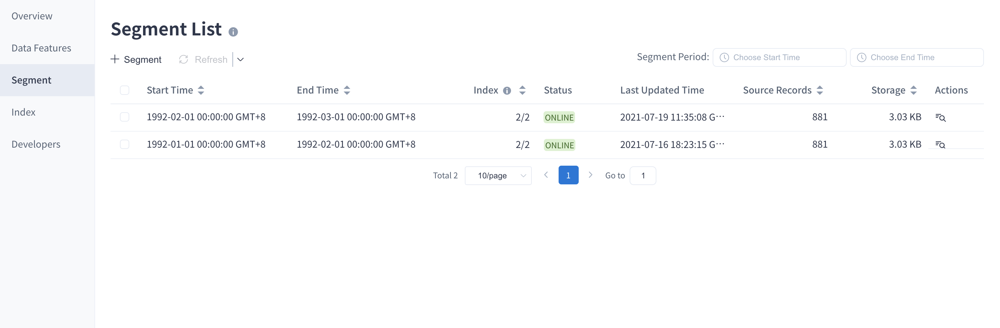
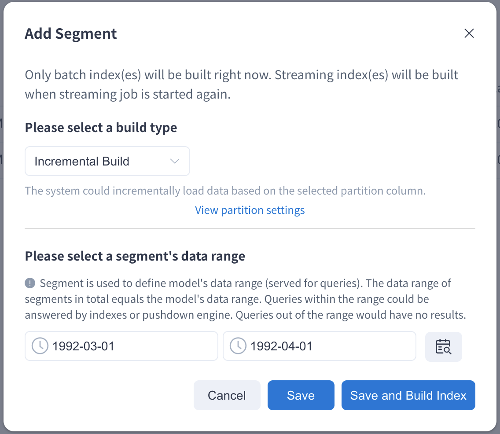
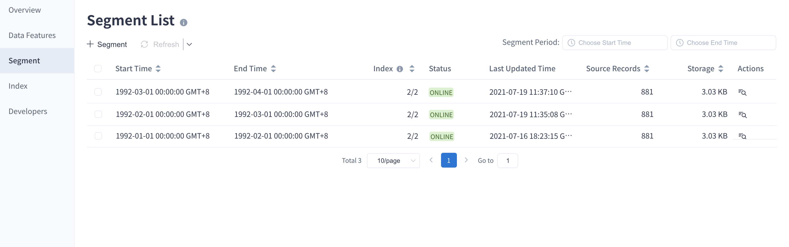

As your business data grows over time, you can choose to load data by date / time. The main contents are as follows:

### Load by Date/Time

If you have set a time partition column for your model, you can load data by date / time each time on the **Data Asset -> Model** page.

1. **First Load**
   Open Kylin web UI and access the project. Select the model that needs to load in the model list page. 

   **Step 1:** Click the **Build Index** button.

   

   **Step 2:**  Select the load range in the pop-up window and click the **Incremental Load** button. This action will trigger the job of **Load Data**.

   >  **Note**: 
   >
   > - You can click the icon on the right side of the load range to automatically detect the latest available range. When your mouse is hovering over the Icon **Detect available range** is displayed.
   > - When you load historical data at the first time and the data volume is too large, it may lead to a long loading time. Please be sure to set the load range according to your data volume, model complexity, and available resources.

   

### Known limitations
The start time range of Segment should greater than `1970-01-02`.

   **Step 3:** After submission, go to the **Monitor -> Job** page, a list of running jobs will be displayed. The first job is the job we just submitted and **Data Range** is displayed as the selected load range in step 2.

   **Step 4:** When all steps are complete, the status of the job will become **Finished**. You can view the details in the model list. There is a Segment in the **Segment** tag and it is marked the **Start Time** and **End Time**.

   

2. **Incremental Load**

   After the first segment is built, we can build more segments incrementally to accommodate new data. The time range of two segments cannot overlap.

   The steps for incremental load are consistent with the steps described above. Click the **Build Index** button then select the load range in the pop-up window. To ensure continuity, a new segment always starts from the end of the last segment. 

   When load completes, go to the model detail page and check there are two segments under the model.

   

3. **Add Segment**
   
   Besides the above methods, you can also increase the model data range by adding a new segment. Click the **+ Segment** button under segment list. Then click the **Save and Build Index** button in the pop-up window. After that, a building job will be submitted and the third segment will be shown when the job is finished.

   Note: If you want to use this function, you need to enable **Creating Reserved Segments**. Please refer to [Project Settings](../../operations/project-operation/project_settings.md) for more information.
   
   
   
