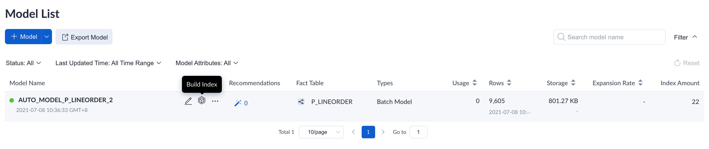
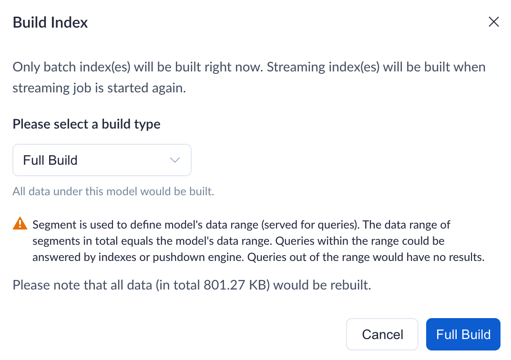
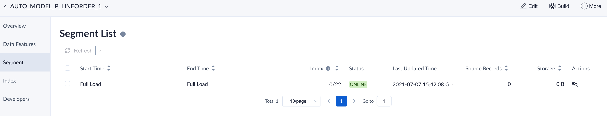

If you want to load all the data in the source table, you can choose full load. The main contents are as follows:

- [Full Load](#full-load-in-ai-augmented-mode-project)

### Full Load

If you do not set a time partition column for your model, it will be full load each time.

You cannot merge segments in a full load type model since there should be only one segment.

Here we will introduce how to do a full load in the Web UI:

1. Select the model that needs the full load in the model list. Click the **Build Index** button.

   

2. You will be prompted to load all data, including the data already loaded in the model.

   

   > **Note**: If you load data for a model for the first time, the storage size in the above prompt will be 0.00 KB because the model has not been loaded (there is no data in the model). 

3. After that, you can view the build index job via the **Monitor -> Job** page.

4. When the data is loaded, you can view the details in the model list. There is only one Segment in the **Segment** tag, and it is marked as full load.

   
