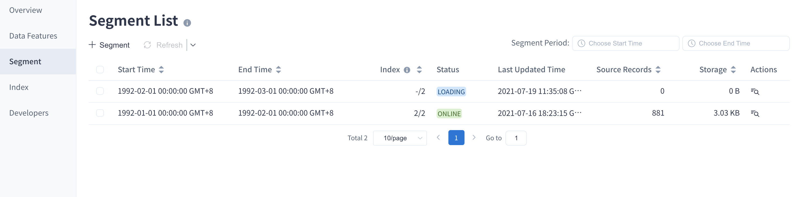

Model (index group) consists of one or more segments. Each segment contains a range of data. Segment is created by building index or loading data with a selected data range on the partition columns.

The main contents are as follows:

### View Segment

User can access the Segment management interface by following these steps:

1. Open **Data Asset -> Model** page, and click the model (index group) name.
2. Select **Segment** tag.

The model list page in the AI augmented mode project is shown as below.

Field description of the Segment list:

- Start time: The start time of the data in the Segment. If it is loaded in full **"Full Load"** is displayed.

- End time: The end time of the data in the Segment. If it is loaded in full **"Full Load"** is displayed.

- Index: Indexes in this segment / Total indexes

- Status: Segment status. You can find a detailed introduction [Segment Status](#status) section.

- Last Updated Time: Segment last updated time.

- Source Records: The source records of the data in the segment.

- Storage: The storage size of the data in the segment.

  > Tip: When the tiered storage is turned on, the storage size of the data loaded into the tiered storage (ClickHouse) will be displayed.

- Actions: The operation of the segment. Currently only **Show Detail** is supported.

### Segment Status

You can view the segment status in the segment list. There are 6 types of segment statuses. See below:

- **ONLINE**: Segment can serve the query by indexes loaded data or pushdown engine.
- **WARNING**: The data in the segment has been loaded and can serve the query. However, the source data might be changed which might cause the data inconsistent. It's highly recommended to refresh all indexes within this segment.
- **LOCKED**: Segments that are refreshing or merging will be locked.
- **LOADING**: The data in the segment is loading.
- **REFRESHING**: A new segment is automatically generated when you refresh the specified segment. This new segment is marked as *REFRESHING*. When the refresh is complete the old segment will be automatically deleted.
- **MERGING**: A new segment is automatically generated when you merge the specified segments. This new segment is marked as *MERGING*. When the merge is complete the old segment will be automatically deleted.

### Segment Operation

You have 6 types of segment operations on the **Data Asset -> model **page.

- **+ Segment**: Add segments to define the model’s data range for serving queries. Queries within the range could be answered by indexes or pushdown engine. Queries out of the range would have no results. The button is located above the segment list.

> **Note:** In **Setting -> Basic Settings -> Segment Settings**, enable **Creating Reserved Segments**, then the **+ Segment** operation button will appear.

- **Show Detail**: You can click the icon on the right side of the segment list. When your mouse is hovering over the icon **Show Detail** is displayed. You can view details such as storage size, the data range and more.

- **Refresh**: Refresh the data in the segment. This operation supports batch refresh. The **Refresh** button is located above the segment list.

    >**Note**: Only ONLINE and WARNING status segments can be refreshed.

- **Merge**：Merge multiple segments as a new one.  The **Merge** button is located above the segment list.
  
    > **Note**: Only ONLINE and WARNING status segments can be merged.
  
- **Delete**: Delete the segment. This operation supports batch deletion. The **Delete** button is located above the segment list.
  
- **Fix**: Fix the discontinuous segments. This button will be only displayed above the Segment list when the holes exists in Segment ranges.

###  Segment Settings

You can set some to manage segments automatically in the **Setting -> Segment Settings** page. Please refer to [Project Settings](../../../operations/project-operation/project_settings.md) for the specific requirements.
