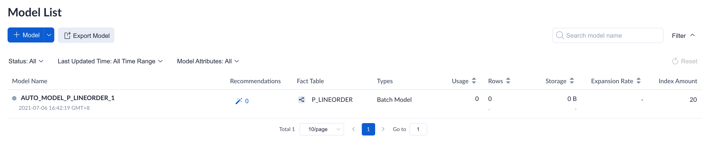
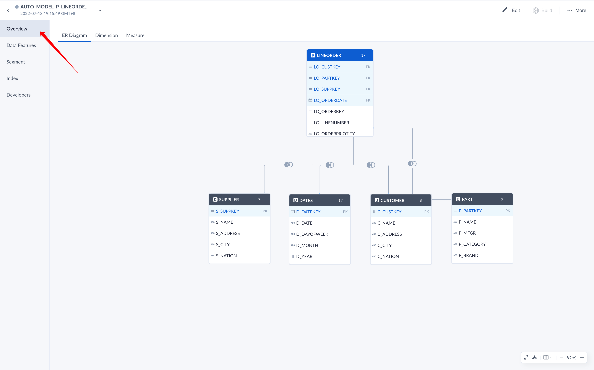
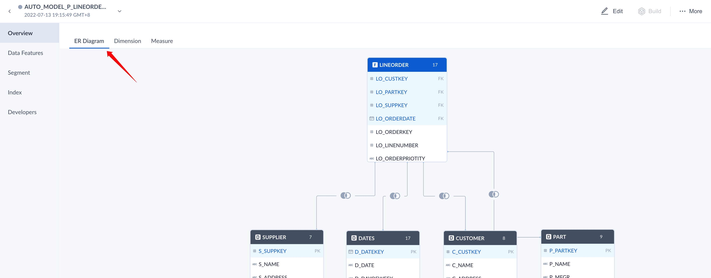
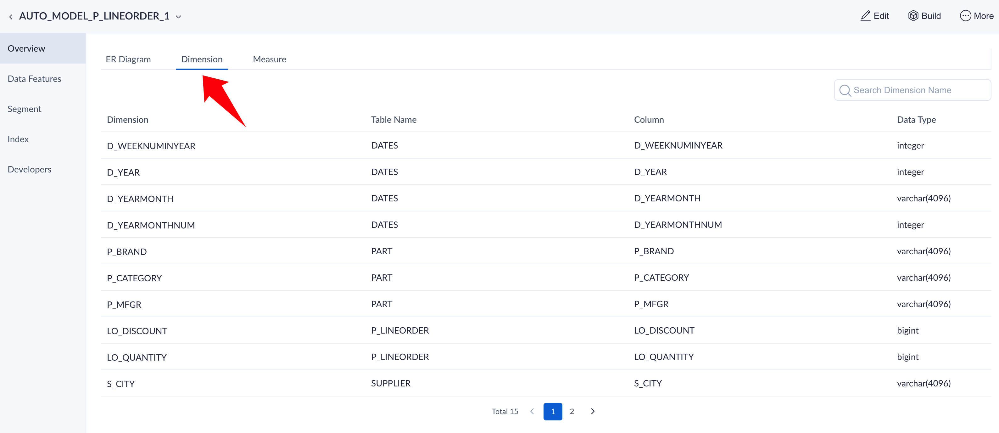
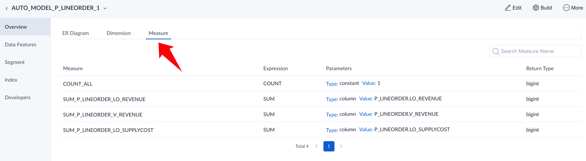

Model design refers to build the star model or snowflake model based on data table and multidimensional modeling theory. The main contents of model design are as follows:

- Define Fact Table and Dimension Table
- Define the Association Relationship between Tables
- Define Dimension and Measurement

### Model List

 You can create and design models manually. Below are the main content of model list:

1. Log in to Web UI, switch to a project.

2. Navigate to **Data Asset -> Model** page, where models are shown in a list. The picture below is the index group list in AI augmented mode:

	
	
	**Fields Explanation:**
	
	- **Model Name**: Model's name.
	
	  - **Status**: There are four statuses.
      - *ONLINE* indicates this model is online and is able to answer queries.
	    - *OFFLINE* indicates this model is offline and not available to answer queries. We recommend using offline when you need to edit the model. 
	    - *BROKEN* indicates this model is broken and not available. Mostly happens when the schemas of related source tables have changed, for instance, a related source table is deleted.
	    - *WARNING* indicates this model is warning and can only server parts of queries. Mostly happens when the segments exist holes or indexes are waiting to build.
	  - **Last Updated Time**: The lastest time to update model.
	
	- **More Actions**: The **More Actions** button will appear when you are hovering on model name area, please refer to [Model Operations](#operation) for details.
	
	- **Owner**: The user who created this model.
	
	- **Description**: Model description.

	- **Fact Table**: The fact table of this model.
	
	- **Types**: Model types, which include *Batch Model*, *Streaming Model*, *Fusion Model*
	
	- **Usage**: Hit count by SQL statements in the last 30 days. Update every 30 minutes.

	- **Rows**:  The rows of loaded data in this model.
	
	- **Storage**: The storage size of loaded data in this model, which combines the storage size of all Segments data.
	
	  > Tip: When the tiered storage is turned on, the total storage size of the data loaded into the tiered storage (ClickHouse) will be displayed.
	
	- **Expansion Rate**: The ratio of the storage size of the built data to the storage size of the corresponding source table data under the model. Expansion Rate = Storage Size / Source Table Size.
	      
	  
	> Notice: The expansion rate won't show if the storage size is less than 1GB.
	
	- **Index Amount**: The amount of indexes in this model.

### Model Operation

You are only allowed to operate on models in **AI augmented mode**. You can hover on the righ tmost column **Actions** of the model list to get the action names. Specific actions are listed below:

- **Edit**: Click on the pencil shape button, enter into the model editing page.

- **Build Index**: Loads data for models. You can choose the data range in the pop-up window.

- **Model Partition**: Set partition column for the model.

- **Export Model**: Export single model metadata.

  > **Note**: Since the locked indexes will be deleted after the new indexes have been built, the exported model metadata will not include the locked index.

- **Export TDS**: Export TDS file of the model .

- **Rename**: Renames the model.

- **Clone**: Clones an identical model. You can give a new name for this new model. The new model has the same fact table, dimension tables, join relationship, dimensions, measures, computed columns, date partition column, aggregate indexes, table indexes, etc. as the origin model. But the new model does not have data, you need to load data for this cloned model manually.

  > **Note**: Since the locked indexes will be deleted after the new indexes have been built, the cloned model will not include the locked index.

- **Change Owner**：Change model owner. Only system administrators and project administrators have the authority to modify model owner.

- **Delete**: Deletes the model, remove the loaded data at the same time.

- **Purge**: Purges all loaded data in this model.

- **Offline**: Makes a *Online / Warning* model offline. An offline model cannot answer any queries.

- **Online**: Makes a *Offline* model online. An online model should be able to answer related queries.

> **Note:** If the model is in *BROKEN* status, only the delete operation is allowed.

### Model Details

Models contain Segments and indexes. You can click model name to unfold the detailed information, as shown below:

- **Overview**: Check Overview details, please refer to [Model Overview](#overview) for more.
- **Data Features**: Check data features.
- **Segment**: Check Segment details, please refer to [Segment Operation and Settings](load_data/segment_operation_settings.md) for more.
- **Index**: Review the model indexes.
  - **Index Overview**: Check index overview.
  - **Aggregate Group**: Add or check defined aggregate indexes, please refer to [Aggregate Index](model_design/aggregation_group.md) for more details.
  - **Table Index**: Add or check defined table indexes, please refer to [Table Index](model_design/table_index.md) for more details.
- **Developers**: Check information for developers.
  - **JSON**: Kylin describes the information of models (index groups) in `JSON` format, such as design, dimensions, measures, etc.
  - **SQL**: The SQL statement consists of related information about tables and columns in the model, such as the join conditions between the tables.

### Model Overview

After expanding the model information, you can see the model overview page, which will help you to quickly get the model information.

On this page, you can view the ER diagram of the model.

What's more, you can view the dimensions and measures information contained in the model.

