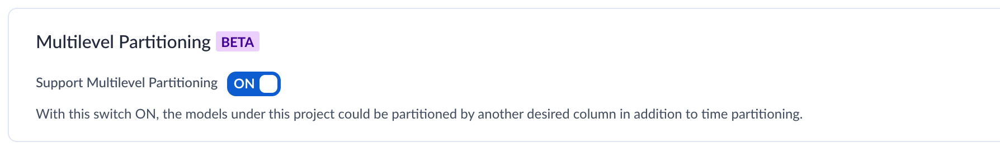
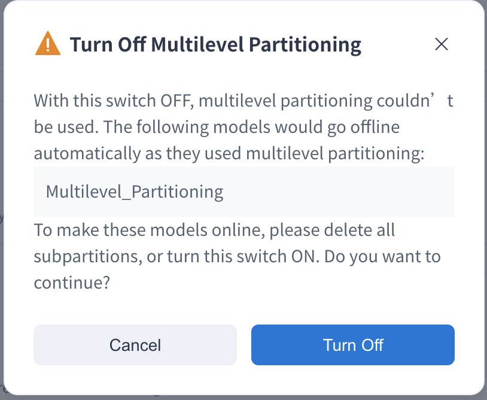
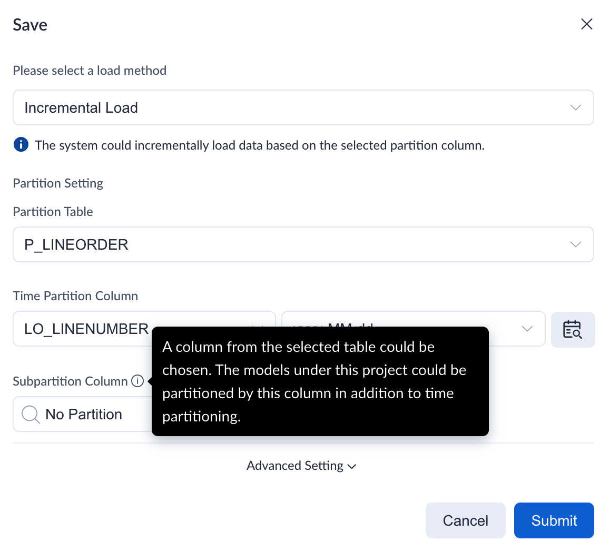
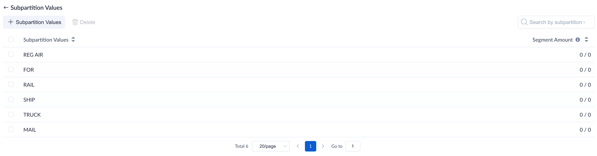
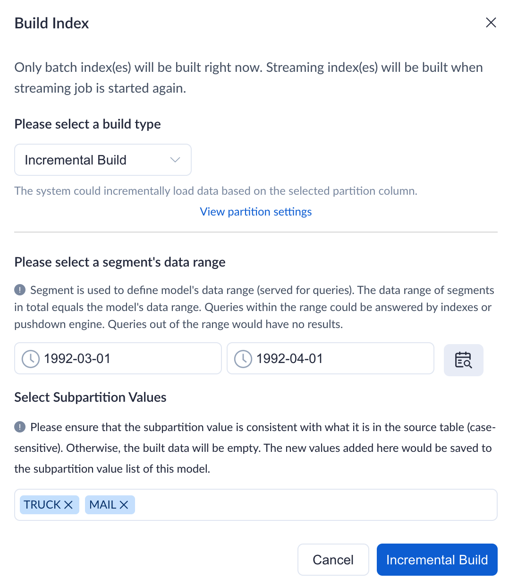
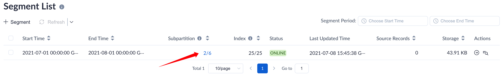
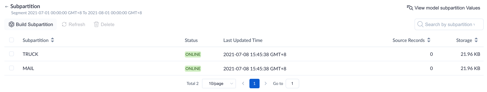
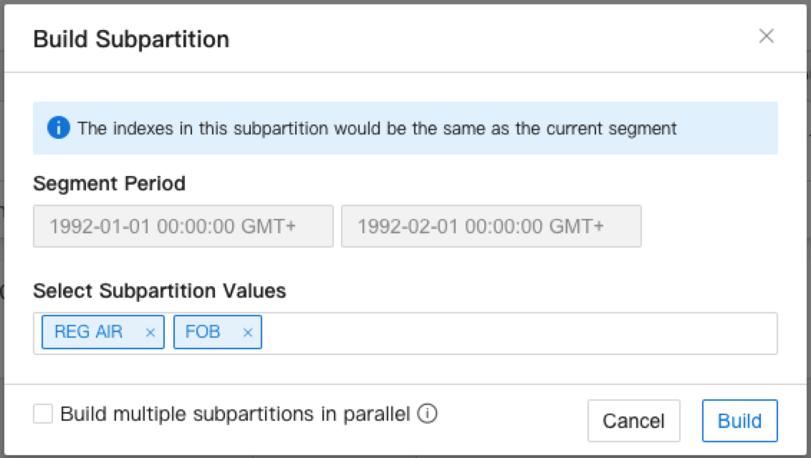
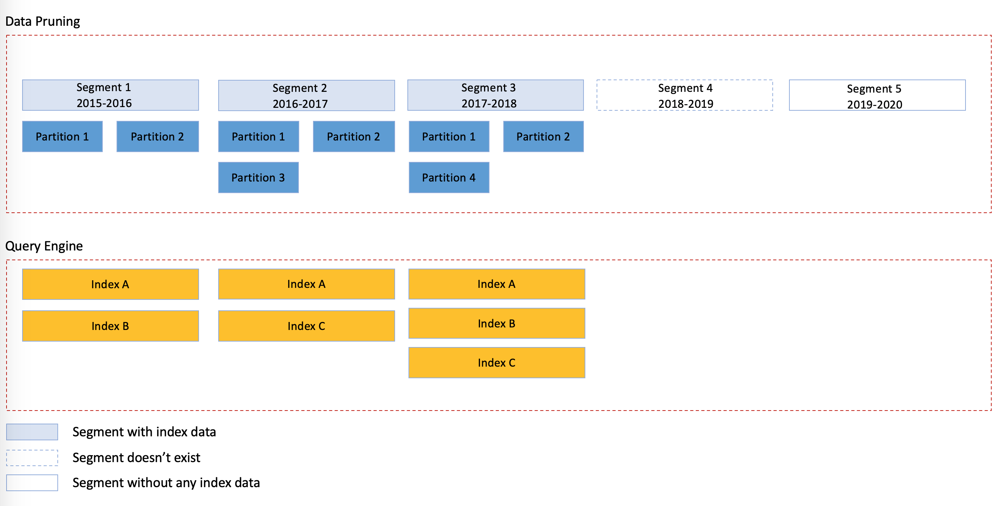

### What is a multi-level partition

Kylin multi-level partitioning means that in addition to partition management based on **time partition column**, the model can also be partitioned based on **sub-partition**.

In some analysis scenarios, in addition to partition management based on date or time, it is also necessary to perform partition management based on other dimensions, such as region, branch, etc. We call this sub-partition. For example, for some users who conduct business across regions, the time for data preparation varies in different regions due to differences of business end time. Users can set a region as a sub-region. When the data in a certain region is completed, the data in the current region can be constructed immediately, and the query and analysis of the region can be served after the construction is completed. This reduces the interdependence between sub-partitions, and makes data construction and query more flexible.

Kylin multi-level partition currently only supports two level partition.

### How to enable the multi-level partition function

You can enable or disable support for multi-level partitioning in the model **Settings-Advanced Settings-Multi-level Partitioning**.

**Note:** When the multi-level partitioning of the model is closed, the model using the multi-level partitioning will be automatically offline. If you need to go online, you need to delete the sub-partition before going online or turn on this option.

### Set model sub-partition

After enabling multi-level partitioning, you can create a model in **Data Asset- Model- +Model**. Then you can choose to add sub-partition columns when saving the model, and the types currently supported as sub-partition columns are **tinyint,smallint,int/integer,bigint,double,decimal,timestamp,date,varchar,char,boolean**.

Or you can adjust the sub-partition column in **Model List-...(More Actions)-Model Partition**.

### Manage model sub-partition values

You can also add, delete or search for sub-partition values in **Model List-...(More Actions)-Manage Sub-Partition Values**.

When adding sub-partition values, the system does not check the correctness. The system allows adding sub-partition values ​​that do not yet exist. When querying, the sub-partition value must be exactly the same with the sub-partition value to match (case sensitive, wildcards matching is not supported). Please ensure that the added sub-partition value meets your expectations.

### Build sub-partition

When constructing a Segment of a new time range, you can click **Model List-Build Index** and specify the sub-partition value during construction

When the segment already exists, but only some sub-partitions under the segment have been constructed, you can click the model name to enter the model information page. You can click **Segment** to view the constructed sub-partitions in **Subpartition**, or continue to build sub-partitions that have not been constructed

If you need to merge Segments, you need to ensure that the sub-partition values are consistent.

The sub-partition has three states, namely:

- **ONLINE**: indicates that the construction has been completed and can serve the query
- **LOADING**: means under construction
- **REFRESHING**: indicates that it is being refreshed, and it can still serve the query during refreshing

### Query behavior under multi-level partition

When Kylin system answers queries, there are mainly the following rules:

- Segment time range defines the time range that the model can answer. When the query specifies an undefined time range, this part of the data returns empty.
- Segment sub-partition defines the range of sub-partition values that the model can answer. If the query specifies a sub-partition value that is not defined by the model, this part of the data returns empty. If the query specifies a sub-partition that is not built under the included time range, query pushdown will be used.
- If the index is in the time range and sub-partition value range in the Segment, if all of them can be satisfied and serve the query, the index will be used first, and if all of them cannot be satisfied, the pushdown query will be used (prerequisite for enabling pushdown).

The following common cases help understand. Suppose there are 4 Segments in the model, and the project has been opened for query pushdown

- Segment 1, the time range is [2015-2016), the sub-partitions constructed are Partition 1, Partition 2, including indexes Index A and Index B
- Segment 2, the time range is [2016-2017), and the sub-partitions constructed are Partition 1, Partition 2, Partition 3, including indexes Index A and Index C
- Segment 3, the time range is [2017-2018), and the sub-partitions constructed are Partition 1, Partition 2, Partition 4, including indexes Index A ,Index B and Index C
- Segment 4, the time range is [2018-2019), does not exist in the system, for ease of understanding, the code is Segment 4
- Segment 5, the time range is [2019-2020), reserved Segment, does not include subpartitions and indexes

When there are the following modes of query, the system will answer the query in this way:

**Case 1: Query without any time partition conditions**

The system will answer the query results of the total time range of all Segments, in this example the time range of Segment 1, Segment 2, Segment 3, Segment 5

**Case 2: The query specified a specific time partition [2015-2016), but did not specify any model sub-partition value**

The system will judge whether Index A and Index B can answer the query, if they can be answered, the index will answer, otherwise the query will be answered by the pushdown query engine

**Case3: The query specifies a specific time partition [2015-2017), and specifies that the model sub-partition value is  Partition 1, Partition 2**

The system will judge whether Index A, Index B, Index C can answer the query, if it can be answered, the index will answer, otherwise the query will be answered by the pushdown query engine

**Case4: The query specifies a specific time partition [2015-2016), and specifies that the model sub-partition value is equal to Partition 3**

The query specifies Partition 3 that is not built under Segment 1, and the system will need to answer through the pushdown query engine

**Case5: The query specifies a specific time partition [2015-2018), and the model sub-partition value is equal to Partition 5**

**Partition 5** is not defined in the model, the system will return No Data

**Case6: The query specifies a specific time partition [2015-2019), and the model sub-partition value is equal to Partition 1**

At this time, the query contains an undefined time range [2018-2019), and this part of the data is empty. According to the range of 2015-2018, within the range of Partition 1, whether Index A, Index B, and Index C can answer the query, and how it can be answered will be answered by the index, otherwise the query pressure engine will answer.

**Case7: The query specifies a specific time partition [2015-2020), and the model sub-partition value is equal to Partition 1**

The query contains a segment that has not built any index data. It can be judged that the index must not fully meet the time range included in the query, and the system will answer through the  pushdown query engine.

### Known limitation

- Kylin multi-level partition currently only supports two le partition.
- If you need to merge Segments, you need to ensure that the sub-partition values are consistent.
- Please control the number of sub-partition values within 2000. If the number of partition values or the average length of which is too large, when submitting the building job or making other operations, the packet size limit during metastore communication may be exceeded and an error will be reported. For more detailed information, please refer to the FAQ below.

### FAQ
**Q: When there are too many sub-partition values, errors related to `max_allowed_packet` or `innodb_log_file_size` may occur, then what should I do? **

Error One:

Prompt: `The result packet of MySQL exceeds the limit. Please contact the admin to adjust the value of “max_allowed_packet“ as 256M in MySQL.`.

Reason: The default value of metastore MySQL configuration `max_allowed_packet` is small, which will limit the data packet size when Kylin node communicates with MySQL. When the number of sub-partition values is too large, the packet size in actual communication will exceed this limit.
For more information, please refer to Mysql [Official Document](https://dev.mysql.com/doc/refman/8.0/en/packet-too-large.html)

Solution: You can adjust MySQL configuration as `max_allowed_packet=256M` to avoid this problem.

Error Two:

Prompt: The build fails. The kylin.log log prompts `The size of BLOB/TEXT data inserted in one transaction is greater than 10% of redo log size. Increase the redo log size using innodb_log_file_size`

Reason: The amount of data written to mysql redo log in a single transaction exceeds 10% of innodb_log_file_size.

Solution: Refer to Mysql [official document](https://dev.mysql.com/doc/refman/8.0/en/innodb-parameters.html#sysvar_innodb_log_file_size) to increase the configuration item of `innodb_log_file_size`. You need to restart the mysqld service, please be cautious.
