Curse of dimensionality is an infamous problem for all OLAP engines based on precalculation. In Kylin, we designed the aggregation group mechanism to fix this issue.


### <span id="background">Introduction</span>

It is a known fact that Kylin speeds up query performance by pre-calculating aggregate index group (different combination of all dimensions, aka index). The problem is that indices grow exponentially with the dimension. For example, there are a total of 7 possible indices for an aggregate index group with 3 dimensions, however there are 15 possible cuboids for a aggregate index with 4 dimensions. Kylin is using scalable computation framework (Spark) and distributed storage (HDFS) to compute and store the aggregate index group. However an issue arises when the aggregate index group size becomes bigger than the original data source.


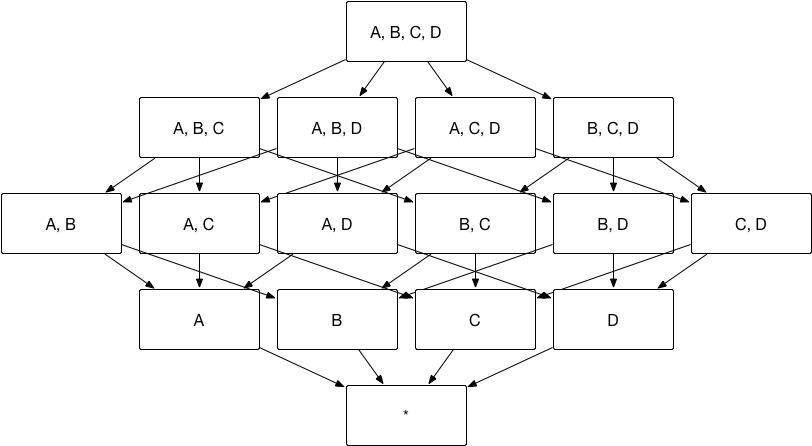


To alleviate the pressure on index building, Kylin has released a series of advanced settings to help users filter on only those indices being used. These advanced settings include **Aggregate Group**, **Joint Dimension**, **Hierarchy Dimension**, and **Mandatory Dimension**.  


### <span id="edit">Edit Aggregate Index</span>

In the **Data Asset -> Model** page, click the model name to get more information, you can click **Index**, then click **Aggregate Group** button under **+ Index** in the **Index Overview** tab to enter the  aggregate index editing page. Or you can click **+** (Add Aggregate Group) button in the **Aggregate Group** tab to enter the page. Then you can edit the aggregate index in the pop-up window shown below, and define dimensions and measures in different aggregate groups according to your business scenario.


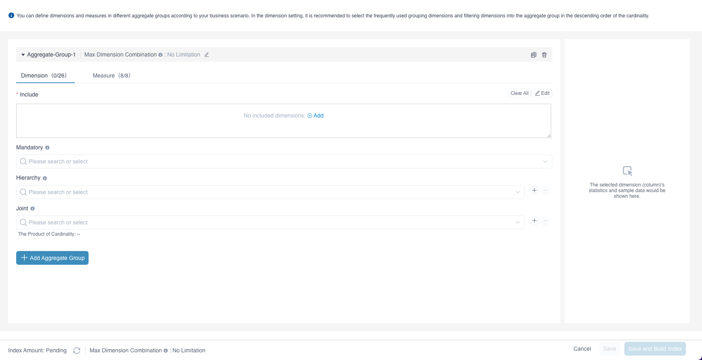

**Step 1: Dimension Setting**

The initial interface is to edit *Aggregation Group 1*. First you need to set the dimension, select **include **, click **Edit** and select from the list all the dimensions included by *Aggregation Group 1*. The items in the list is the dimensions you added in model. Kylin will build different combinations of all the dimensions you choose, this is called "build aggregate index".

Users can then set **Mandatory Dimension**, **Hierarchy Dimension**, and **Joint Dimension** in the *Aggregate Group 1*. Dimensions under these three settings have to be included in **Include** under this aggregate group first. You can add aggregate groups as needed. After editing all the aggregate groups, click the button beside **Index Amount** on the bottom left corner, estimated index number will be calculated and displayed beside the name of the aggregate group, the total estimated index number will be calculated and displayed on the bottom left corner. This can help you to understand the complexity of the aggregate index. 

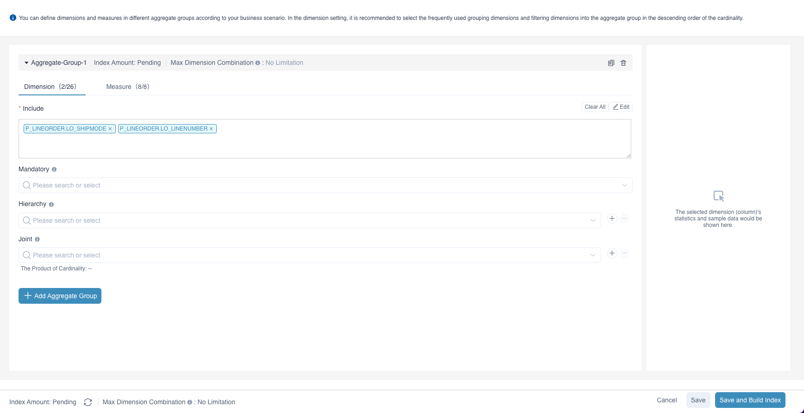

We recommend selecting frequently paired grouping dimensions and filtering dimensions into the aggregate group according to the cardinality from high to low. For example, you often query for the supplier ID `SUPPKEY` and the product ID `PARTKEY`, by adding the dimension `SUPPKEY` and dimension `PARTKEY` into the aggregate group, you can view the cardinality of these two relevant columns in **Data Asset-Data Source**. If the cardinality of `SUPPKEY` is greater than the cardinality of `PARTKEY`, we recommended selecting `SUPPKEY` into **Include** first.

**Step 1: Measure Setting**

In the measure settings, all measures defined in the model are selected by default. You can define the measures corresponding to the selected dimensions in the aggregate group according to the business scenario. The aggregate index contains only the measures selected in the aggregate group. Whether or not you manually add a measure to the model, there is at least one measure `COUNT_ALL` in the aggregate group, which means ` COUNT(*) `.

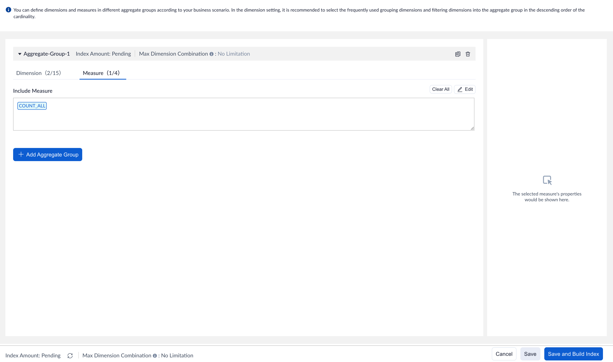

Next, we will explain the mechanism of these advanced settings and provide use cases in the following sections. 


### <span id="agg">Aggregate Group</span>

You can divide combination of dimensions and measures they focus on in several groups, and these groups are called **Aggregate Group.**  

As the aggregate index group shows at the begining of this chapter, if you only need dimension combination of `[Dimension AB - Measure M1]` and `[Dimension CD - Measure M2]`, then aggregate index group can be divided into two aggregate groups, group AB-M1 and group CD-M2. As shown below, the number of index can be reduced from 15 to 7. 


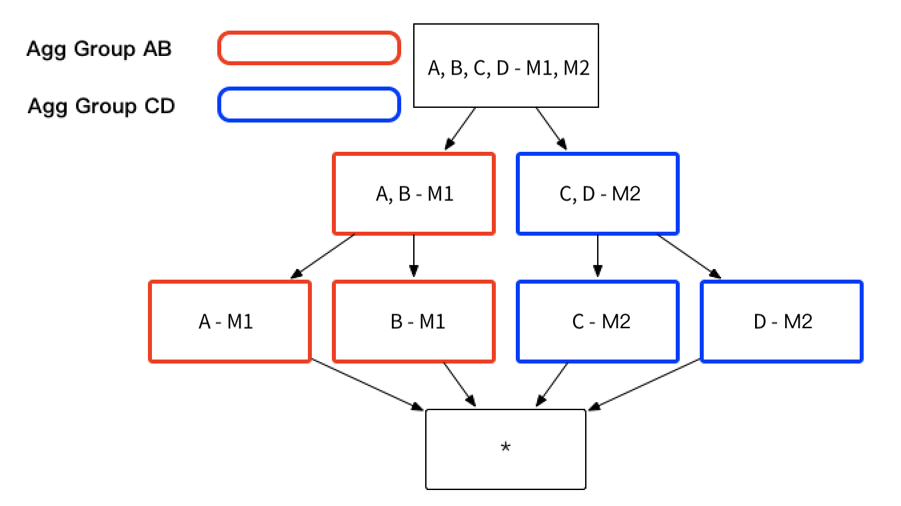

The aggregate groups that end users need might contain overlapping dimensions, for example, aggregate group ABC and aggregate group BCD both contain dimension B and C. If these two aggregate groups contain the same measures, these aggregate groups will derive the sample index, for example aggregate group ABC will derive index BC and so does aggregate group BCD. An index will not be generated multiple times, if it can be derived from more than one aggregate group, as shown below.

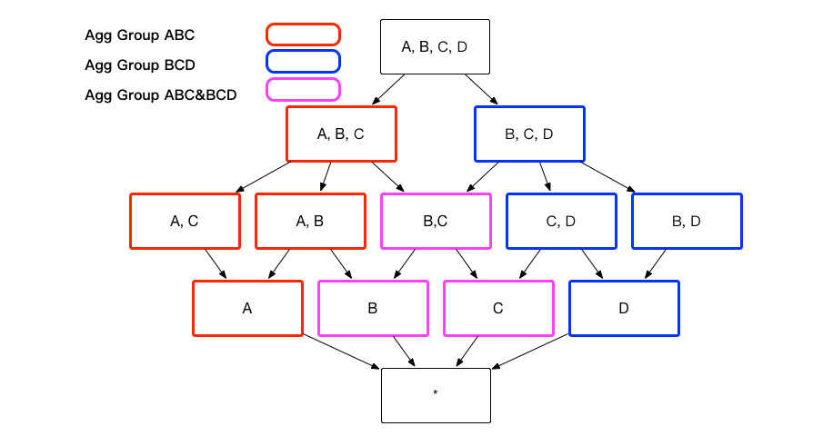


According to your business scenario, you can decide whether to add an index that contains dimensions and measures defined in all aggregate groups. The index can answer queries across multiple aggregate groups, but this will impact query performance. In addition to this, there are some storage and building costs by adding this index. You can define it by clicking **+** (Add Setting Item) and setting the item `is-base-cuboid-always-valid` in **Setting -> Model Settings**.

With aggregate groups, you can filter the granularity of index to get the dimensionality you want.                     


#### Use Case of Aggregate Group

Assume a transactional aggregate index, which contains these dimension: Customer ID `buyer_id`, Transaction Date `cal_dt`, Payment Type `pay_type`and Customer City `city`. Sometimes, analyst need to group dimension City, Cal_dt and Pay_Type to understand different payment type in different cities. There are other times analysts need to group dimension city, cal_dt andbuy_id together to understand customer behavior in different cities. As shown in the example above, we recommend building two aggregate groups, including dimensions and groups, see below:


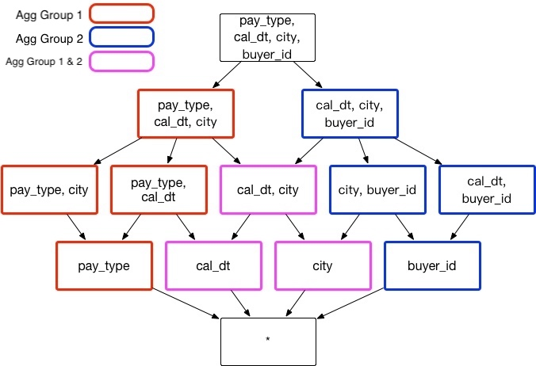


Aggregate Group 1:  `[cal_dt,city, pay_type]`

Aggregate Group 2: `[cal_dt,city, buyer_id]`

Regardless of other situations, those two aggregate groups can reduce 3 unnecessary index: [pay_type, buyer_id]、[city,pay_type, buyer_id] and [cal_dt, pay_type, buyer_id], so storage space and build time can be saved. 


Case 1: 
```sql
Select cal_dt, city, pay_type, count(*) from table
Group by cal_dt, city, pay_type
```
will hit on index [cal_dt, city, pay_type]


Case 2: 

```sql
Select cal_dt, city, buyer_id, count(*) from table
Group by cal_dt, city, buyer_id 
```
will hit on index [cal_dt, city, buyer_id]

Case 3: If one unusual query occur

```sql
Select pay_type, buyer_id,count(*) from table
Group by pay_type, buyer_id
```
No index can be hit, so Kylin will calculate the result based on existing index on-demand. 


### <span id="mandatory">Mandatory Dimension</span>

Sometimes you might be interested in analysis with one or more specific dimensions, any queries will include one specific dimension. In this case, this dimension can be set as **Mandatory Dimension**. Once set only the index with this dimension will be calculated. In the example at the begining of this chapter, if dimension A is set as mandatory, then index will be calculated as shown below. The number of index will be reduced from 15 to 8.
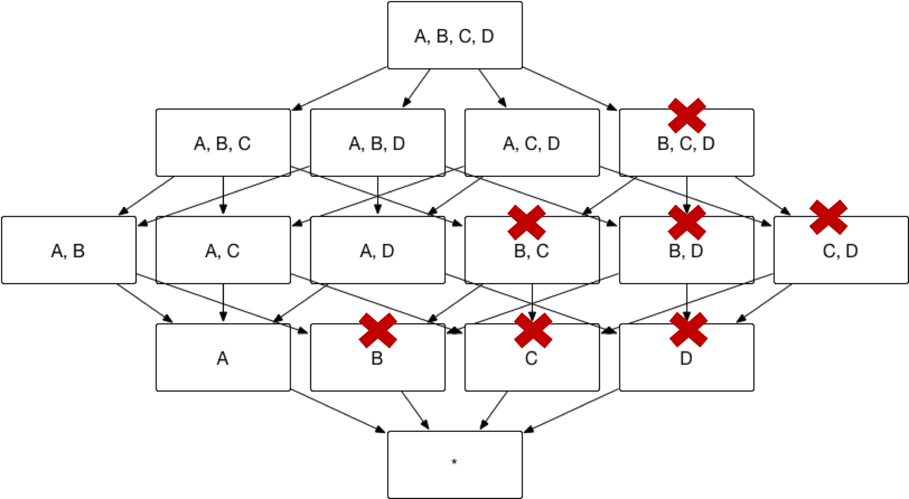


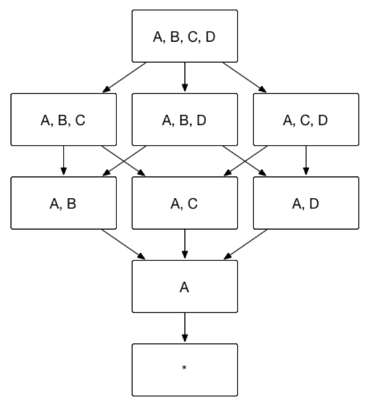


#### Use Case of Mandatory Dimension
Assume a transactional aggregate index that includes transaction date, transaction location, product, payment type. Transaction date is a frequently used group by dimension. If transaction date is set as a mandatory dimension, the combination of dimensions will be calculated as shown below:

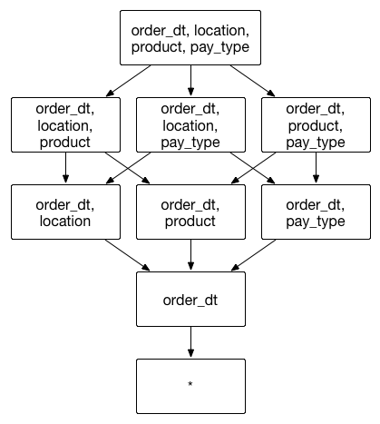


### <span id="hierarchy">Hierarchy Dimension</span>

End users will usually use dimensions with hierarchical relationship, for example, country, province, and city. In this case, a hierarchical relationship can be set as **Hierachy Dimension**. From top to bottom, country, province and city are one-to-many relationship. These three dimensions can be grouped into three different combinations：

1. group by country

2. group by country, province（equivalent to group by province）

3. group by country, province, city（equivalent to group by country, city or group by city）
    
    In the aggregate index group shown below, assume dimension A = Country, dimension B = Province and dimension C = City, then dimension ABC can be set as a hierarchy dimension. And index [A, C, D] = index [A, B, C, D]，index [B, D] = index [A, B, D], thus, index [A, C, D] and index [B, D] can be pruned.

    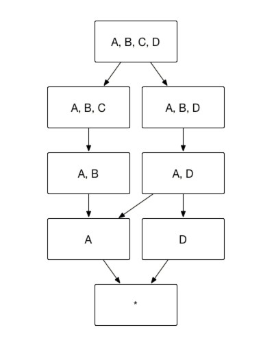

    As the diagram below illustrates, based on the method above, Kylin can prune redundant index, hence reducing index from 15 to 7.

    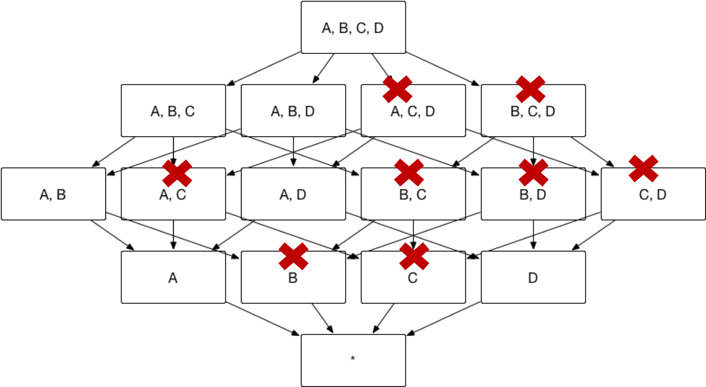


#### Use Case of Hierarchy Dimension
Assume a transactional aggregate index that includes dimensions transaction city `city`, transaction province `province`, transaction country `country` and payment type `pay_type`. Analysts will group transaction country, transaction province, transaction city, and payment type together to understand customer payment type preference in different geographical locations. In the example above, we recommend creating hierarchy dimensions in existing aggregate group (Country / Province / City) that include dimension and combinations shown below:

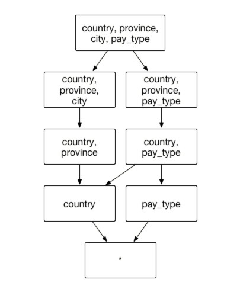

Aggregate Group: `[country, province, city，pay_type]`

Hierarchy Dimension: `[country, province, city]`


Case 1: 

Analysts want to understand city level customer payment type preferences

```sql
SELECT city, pay_type, count() FROM table GROUP BY city, pay_type
```

can be retrieved from index [country, province, city, pay_type].


Case 2: 

Analysts want to understand province level customer payment type preferences

```sql
SELECT province, pay_type, count() FROM table GROUP BY province, pay_type
```

can be retrieved from index [country, province, pay_type].


Case 3: 

Analysts want to understand customer's payment type preferences from country level

```sql
SELECT country, pay_type, count() FROM table GROUP BY country, pay_type
```

can be retrieved from index [country, pay_type].


Case 4: 

Analysts want to reach a different granularity level using the geographical dimension:

```sql
SELECT country, city, count(*) FROM table GROUP BY country, city
```


will retrieve data from index [country, province, city].


### <span id="joint">Joint Dimension</span>

Sometimes you don’t need details of all possible combination dimensions. For example, you might query dimension A, B, C together in most cases but not dimension A, C or dimension C alone. To enhance performance in this case, **Join Dimension** can be used. If A, B, and C are defined as Joint Dimension, Kylin will only build index ABC but not index AB, BC and A. Finally, indices will be built as below. The number of indices can then be reduced from 15 to 3.

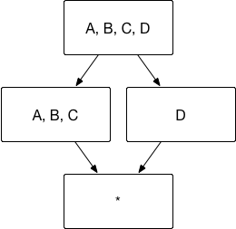


#### Use Case of Joint Dimension
Assume a transactional aggregate index that includes dimension transaction date `cal_dt`, transaction city `city`, customer gender `sex_id`, payment type `pay_type`. Analysts usually need to group transaction date, transaction city, and customer gender to understand consumption preference for different genders in different cities, in this case, `cal_dt, city, sex_id `will be grouped together. In the case above, we recommend assigning them to joint dimensions based on existing aggregate groups that include the following dimension and combination as shown below:

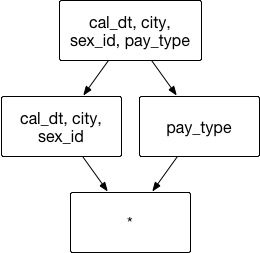

Aggregate Group: `[cal_dt,city, sex_id，pay_type]`

Joint Dimension:  `[cal_dt, city, sex_id]`


Case 1: 

```sql
SELECT cal_dt,city, sex_id, count(*) FROM table GROUP BY cal_dt, city, sex_id
```
can retrieve data from index [cal_dt, city, sex_id].

Case 2: 

```sql
SELECT cal_dt, city, count(*) FROM table GROUP BY cal_dt, city
```
then no index can be hit, Kylin will leave calculate result based on existing index. 

**Dimensional cardinality product **

Dimensional cardinality product: refers to the product of each dimension field cardinality in the joint dimension. The data of dimension cardinality comes from the sampling results of the source data table. The dimension cardinality product is used to represent the maximum number of permutations and combinations of dimensions in the joint index (i.e. the maximum number of pieces of this index).

The dimension cardinality product does not participate in the index creation process, but is only used to assist in the creation of the union dimension of the aggregate group. In general, in order to ensure the query performance of the dimensions in the union dimension, the dimension cardinality product of a union dimension is not recommended to exceed 100,000, and in special cases (the dimensions in the union dimension must be queried together) can not pay attention to the value of the dimension cardinality product.


### <span id="mdc">Max Dimension Combination</span>

The use of aggregate groups helps to avoid index number explosion. However, in order to achieve index optimization, modelers need to have a certain understanding of the data model, which is hard for the junior modelers.

This chapter will introduce another simple index pruning tool named *Max Dimension Combination (MDC)*, which represents the maximum number of dimensions in every index. This tool limits the dimension number in a single index, which means indexes containing too many dimensions will not be built in index building process. This tool fits well in the situation where most queries only touch no more than N dimensions, where N is the MDC threshold that is configurable.

> **Note**: MDC is only available from version 5.0.

#### Dimensions Count in Query

Next we introduce the method of counting the number of dimensions in a query. The number of dimensions in a query means the number of dimensions in the corresponding index of the query. For ordinary dimensions, one dimension is counted as 1. We treat a group of joint dimension or hierarchy dimension as one dimension when counting dimensions in a query, and ignore mandatory dimensions. For example,

```sql
select count(*) from table group by column_mandatory, column_joint1, column_joint2, column_hierarchy1, column_hierarchy2, column_normal
```

There is one mandatory dimension, two dimensions belonging to one joint dimension, two dimensions belonging to one hierarchy dimension and one normal dimension. So we treat them as 3 dimensions in index pruning.

#### Schematic Diagram of Pruning


This is an index sprouting graph  which has 7 dimensions and some details are hidden in order to help understanding.

When MDC = 4, the indexes which have over 4 dimensions will be pruned, such as *ABCDEF*, *ABCDEG*, *ABCDE*, and *ABCDF*.

When MDC = 3, the indexes which have over 3 dimensions will be pruned, such as *ABCDEF*, *ABCDEG*, *ABCD*, *ABCE*.

Considering the performance in index building, if you choose to generate an index in the model settings that contains dimensions and measures defined in all aggregate groups, this index will not be pruned. At the same time, according to the calculation method of query dimensions mentioned before, we treat a group of joint dimension or hierarchy dimension as one dimension, and ignore mandatory dimensions. Therefore, when using the pruning tool, it is necessary to consider the actual number of dimensions included in the index when the joint dimensions or hierarchy dimensions or necessary dimensions are included.

#### Set Max Dimension Combination (MDC)

We'll introduce how to set Max Dimension Combination (MDC) in this section. Click **+** (Add Aggregation Group), you can set **Aggregate index-level MDC** for all aggregate groups and **Aggregate group-level MDC** for a single aggregate group on the Edit Aggregation Index page, as shown in the figure below. Enter a positive integer in the input box and click OK to save the MDC setting.

> **Note**: The setting of MDC will not take effect until you submit the Edit Aggregate Index page.

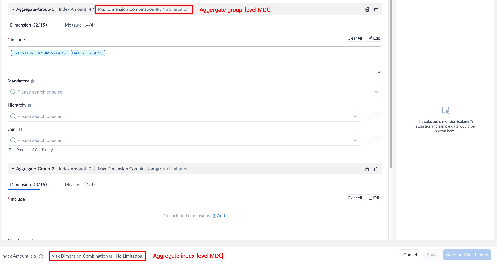

Aggregate index-level MDC affects all aggregate groups. Aggregate group-level MDC takes effect only for a single aggregate group. The priority of the aggregate group-level level MDC is higher than that of aggregate index-level MDC. The specific setting rules are as follows:

1. If there is no MDC setting for a single aggregation group, the MDC of this aggregate group will be overridden by the aggregate index-level MDC. It can be seen that after the aggregate index-level MDC is set to 2, the number of indexes of the aggregate group decreases from 32 to 19, and the total number of indexes becomes 20. Except for an index that contains dimensions and measures defined in all aggregate groups, indexes that contain more than 2 dimensions are pruned.

   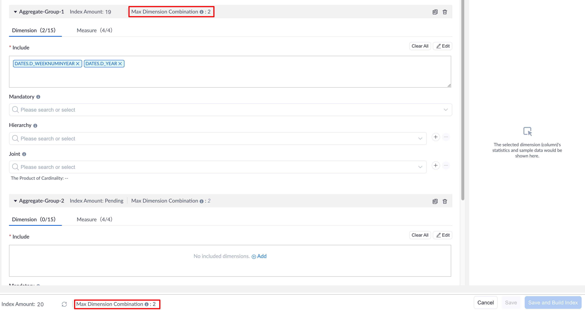

2. If a single aggregate group has set its aggregate group-level MDC, the number of index dimensions for this aggregate group is limited only by its own MDC.

   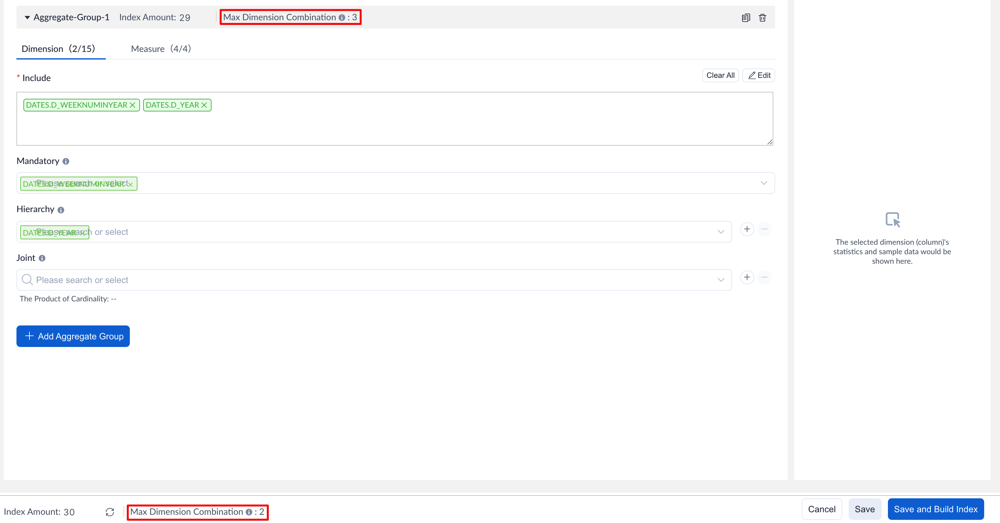

3. If the Aggregate index-level MDC is left blank, it means that you have turned off the setting of the MDC for all aggregate groups. There is no limit to the number of dimensions in the index generated by an aggregation group that has not individually set the aggregate group-level MDC at this time. Aggregate groups that have set the aggregate group-level MDC are not affected.

#### Benefit and Trade-off

On one hand, MDC dimension pruning tool reduces the index number and storage size significantly. On the other hand, some complex queries that cover more dimensions may hit large indexes, hence online calculation cannot be avoided, which may make query response slower. Like other index optimization tools, it's a kind of trade-off. If most queries touch fewer dimensions in your case, MDC deserves a shot.

At the same time, according to laboratory test data, it is found that when the number of dimensions in the aggregate group is large, it may take several minutes to check index amount. During this period, there may be web UI lags, please be patient. The following are laboratory test data results for reference only. Please judge according to the actual scene:

- 1 aggregate group with 1000 dimensions. When the aggregate index-level MDC is set to 1, the average time for checking index amount is 3.1 minutes.
- 1 aggregate group with 1500 dimensions. When the aggregate index-level MDC is set to 1, the average time for checking index amount is 13.9 minutes.
- 3 aggregate groups, each containing 500 dimensions. When the aggregate index-level MDC is set to 1, the average time for checking index amount is 3 minutes.

### <span id="index">View Aggregate Index</span>

Click **Data Asset -> Model** in the left navigation bar to enter the **Model List** page, then click the model name and  you can view the details of aggregate index in **Index-Index Overview**. 


You can enter the index ID or index content in the **Search** box to filter the index. Index content includes the dimensions, measures, and columns contained in the index, the index content is fuzzy filtering, and the index ID is precisely filtered. You can click the button in the **Content** column to view the index details. What's more. you can edit and delete Custom(Table Index), and for other kinds of indexes, you can only delete.
On the top of the list, you can see data range. Once you have already build index, it will show the time range of the data loaded in the index.If it is **full load**, the data range will show **full load**.

If you need to delete some indexes, first you can select the indexes to be deleted, then click the **Delete** button above the list to delete.

If you need to add base indexes when there is no base index or when a base index is missing. Click **+ Index** to add the base indexes in the drop-down box.

**Fields Explanation:**

- Index ID: Index ID.

- Storage: The storage size of the precomputed data in the index.

- Usage: The frequency of queries having hit this index.

- Source: **Recommended** indicates that the index is derived from the system recommendation, and **Custom** indicates that the index is defined by user.

- Status: The status of the index, divided into four types:

  - NO BUILD: Index not yet been built. You can click the **Build Index** button to build all NO BUILD indices;

  - BUILDING: Index being built. You can see the corresponding building job being executed in the job monitor page;

  - ONLINE: Index has been built and can serve queries;

  - LOCKED: Due to the modification of the aggregate group, the index to be deleted may be in LOCKED status. It can still serve queries.

    > Tip: When you modify an aggregate group and save it, some aggregate indices may be refreshed. For example, adding a measure to an aggregate group will refresh all the aggregate indices corresponding to the aggregate group. In Kylin, the corresponding behavior is to delete the original indices and add new indices. In order to ensure that your service is available, especially the query service is available, the original indices will be placed in LOCKED status before the new indices are built successfully. Your query can still be answered by the LOCKED indices. When the new indices are built successfully, the corresponding LOCKED indices will be deleted, at this time, your query will be answered by the new indices.
    >
    > If modifying the aggregate groups will only cause some indices to be deleted, there will be no LOCKED indices. An index cannot be restored after it has been deleted.

- Content: Index content.

- Action: The actions that can be performed on the current index, such as **Build Index**.

The details page shows the combination of dimensions and all measures in the index. For aggregate indexes, the order is the dimension first, the measure is after, the dimension appears as  table. column, and for the table index, you will see all the columns in this index, the order, and the shardby columns.

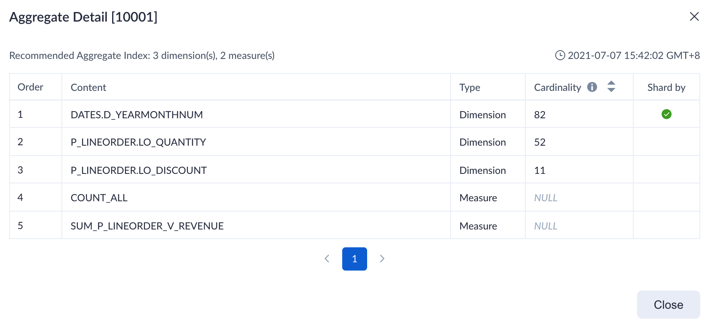

**Fields Explanation:**

- Last Updated Time: The last time to update the index.
- Content: Dimension name or measure name or columns.
- Type: Dimension or Measure.
- Cardinality: Cardinality of the column, which can be fetched by table sampling.
- Shard by: ShardBy column of the index.

### <span id="advanced">Advanced Settings</span>

In the aggregate index, you can set the ShardBy column, and the data will be stored according to the column fragmentation to improve query efficiency. You can set the filter dimension or grouping dimension frequently used in the query as the ShardBy column according to the cardinality from high to low. In current version, you can only set one ShardBy column.

> Note: The ShardBy column is applied to all custom aggregate indexes.

In the navigation bar **Data Asset -> Model ** page, click the icon to the left of the specified model to expand the model for more information. You can see the **Advanced Setting** button in the **Index-> Aggregate Group**.

In the **Advanced Setting**, you can select the dimensions that need to be set as the ShardBy column. 

Updating the ShardBy column will invalidate all aggregate indices that contain ShardBy columns and rebuild these indices to take effect. Checking **Build index now** when saving will trigger a new index build job. If not checked, you can click **Build** button to create building.

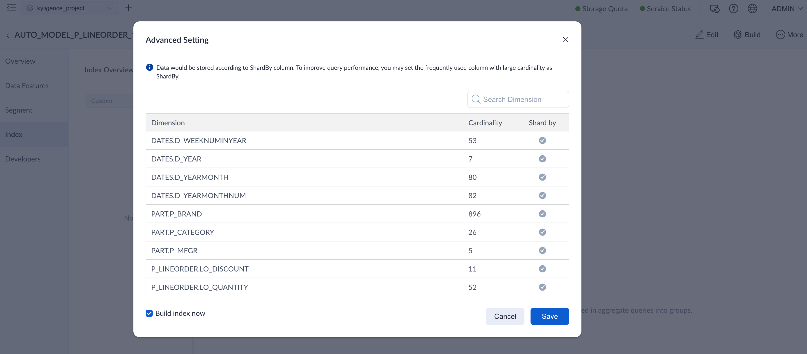

#### Optimize Join with ShardBy Column
Sometimes the subqueries of a join can match two indexes, Kylin will get data from the two indexes and do the join operation. When the cardinality of the subquery is high, the join operation may be time consuming. And user can optimize the join operation in such case by making the join key the ShardBy column.

To enable this feature (it is enabled by default), user need to edit `kylin.properties` file and add the following line
```
kylin.storage.columnar.expose-sharding-trait=true
```
When this feature is enabled, Kylin will expose the sharding information to Spark. Join two large datasets in spark usually requires a data shuffle infront to make the data hash partitioned. As the ShardBy column already sharding the data, the shuffle stage can be skipped during the Join.

##### Limitations
1. As there can only be one ShardBy column for one model, the optimization applys for join on the single ShardBy column only.

##### Example
```
select org_id, cust_id, sum1, sum2
from (
	select org_id, cust_id, sum(....) sum1
	from fact
	where dt = ...
	group by org_id, cust_id
) T1
inner join (
	select cust_id, sum(...) sum2
	from fact
	where dt = ...
	group by cust_id
) T2 on T1.cust_id = T2.cust_id
```
The above SQL can be queried by joining two aggregate indexes. To optimize the join operation, user can set the join key - `cust_id` as the ShardBy column. In that case the shuffle stage can be skipped for the join operation.

