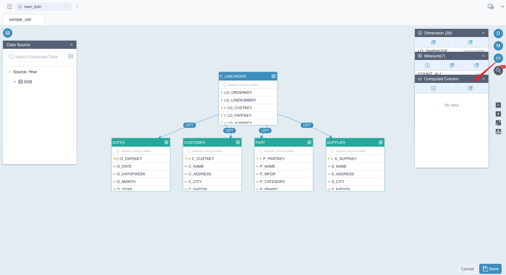
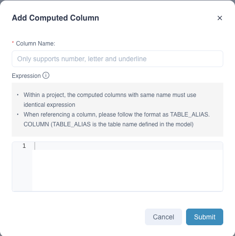
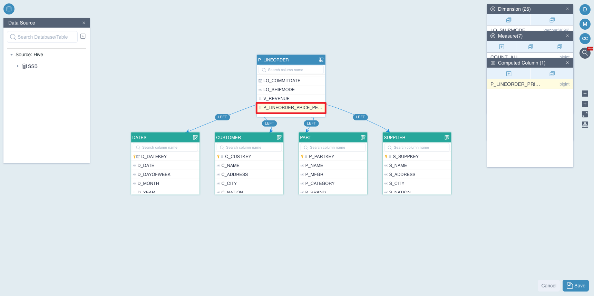
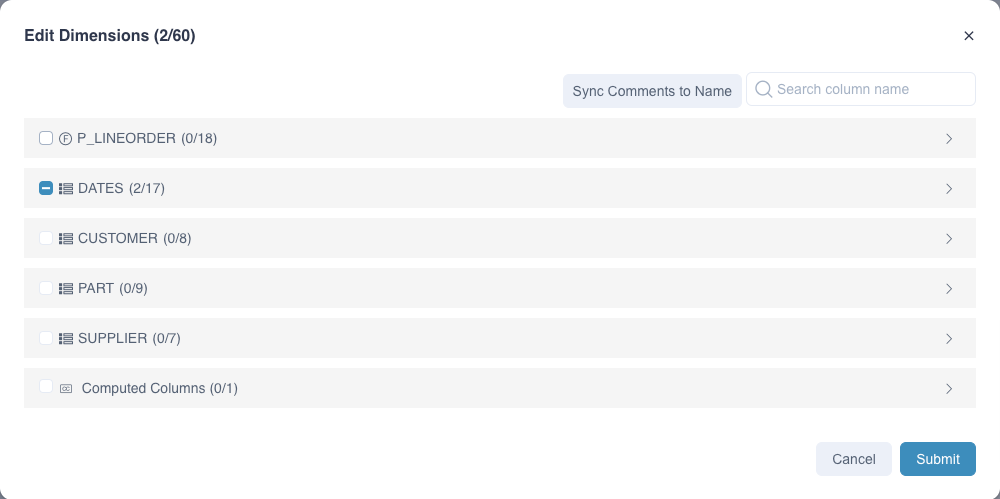
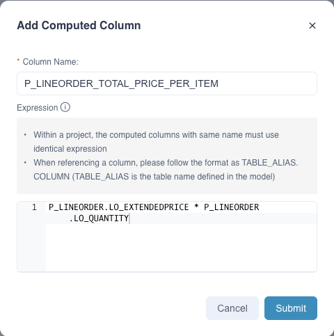
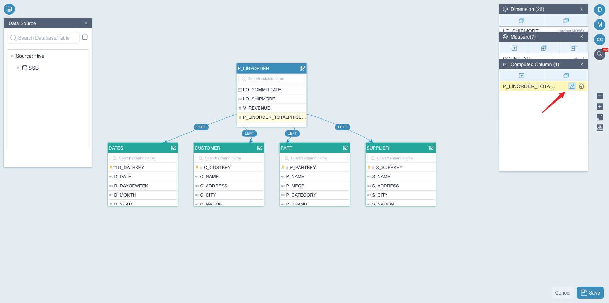
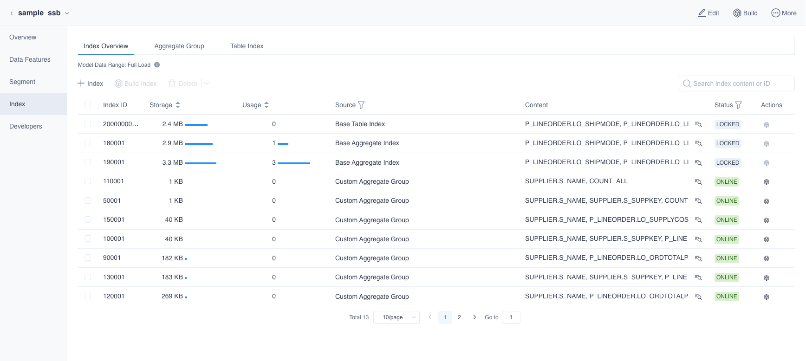
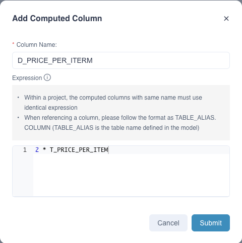

**Computed Column** allows you to predefine actions such as data transformation and calculation in models. It enhances the data semantic abstraction according to various business scenarios. By replacing runtime calculation with offline index construction, the pre-calculation capability of Kylin is fully utilized. As a result, query performance willl improve significantly. It supports Hive UDF in computed columns, so existing business codes can be reused.

This section will describe the supported computed columns in Kylin, which includes the basic concepts, usage of computed columns and supported functions in computed columns.

- [Basic Concepts](#concept)
- [Create Computed Columns](#create)
- [Edit Computed Columns](#edit)
- [Use Computed Columns in Indices](#index)
- [Query on Computed Column](#query)
- [Nested Computed Columns](#nested)
- [Advanced Functions](#function)

### <span id="concept">Basic Concepts</span>

- **Naming convention:** 
  
  Only letters, digits and underscores are supported. Pure digits or starting with underscores are NOT allowed.
  
- **Expression:** 
  
  Calculating logic. Expression of the computed column can contain columns across a fact table and a lookup table in current model.
  
- **Re-use and reference:**
  
  - Computed columns are separated by model and implicitly subjected to a fact table, thus, one expression cannot generate multiple computed columns on different models with different names.
  - Strictly, computed columns cannot be reused across models in the same project. If you want to reuse a computed column in another model, you need to create a computed column with the same name and expression in the model.
  - Nested computed column is also supported too, i.e. you can use available computed column to produce a new one.
  
- **Special notes:** 

  One expression cannot generate multiple computed columns. Say we have two models `M1` and `M2` in the same project: 

  - If both `M1` and `M2` share the same fact table `T1`, and the computed column `CC1 = T1.C1 + T1.C2` is defined on `M1`, you can create a computed column `CC1 = T1.C1 + T1.C2` rather than `CC2 = T1.C1 + T1.C2` on `M2`;
  - If both `M1` and `M2` share the same fact table `T1`, and the computed column `CC1 = T1.C1 + T1.C2` is defined on `M1`, you can create a computed column `CC2 = T1.C1 * T1.C2` rather than `CC2 = T1.C1 + T1.C2` on `M2`;

- **Others:**
  - Computed columns can only be defined on the fact table by default. Only column expression, not column name, can be edited again after being created.
  - Computed column can use either columns of fact table or dimension table. However, if columns in different table share the same name, please make sure that used columns are in the form of `table_alias.column_name`.
  - Unexpected errors may occur when the computed column share the same name with other columns.
  - Aggregate functions such as `SUM`, `MIN`, `MAX`, etc. are not allowed when defining the computed column expression.
  - Expression only containing constants is not recommended to create computed column, such as  `POWER(CAST(2 AS DOUBLE), 2)`.
  - If a function expression contains a column using the keywords as column name, it cannot be recommended as a computed column. For more details about keywords, please refer the **Keywords** section in  [SQL Specification](../../query/insight/sql_spec.md). 
  - Computed columns only support `Hive` data source in current version.
  - Computed columns cannot be used as time partition columns and join keys.
  - If a function expression contains a table name or column name that is not started with letters or includes special characters, need to double quote this name. For example: `"100_KYLIN_SALES"."100_PRICE" * "100_KYLIN_SALES"."200_ITEM_COUNT"`

### <span id="create">Create Computed Column</span>

To help you master how to create a computed column, we demonstrate an example scenario below. Say you have a fact table named `P_LINEORDER` with following columns:

- `LO_EXTENDEDPRICE`: transaction price
- `LO_QUANTITY` transaction quantity
- `LO_ORDERDATE` transaction date

We want to define two computed columns on this fact table, `T_PRICE_PER_ITEM` to calculate the total transaction price for each item, and `YEAR_OF_ORDER` to indicate the year of the order. Concrete expressions are as follows:

- `T_PRICE_PER_ITEM = P_LINEORDER.LO_EXTENDEDPRICE * P_LINEORDER.LO_QUANTITY` 
- `YEAR_OF_ORDER = YEAR(P_LINEORDER.LO_ORDERDATE)`

First, click the button **CC** marked in the picture. Then a window of **Computed Column** will pop up. 



Secondly, click the button **+** in this window,  and a dialog box of **Add Computed Column** will pop up. Please fill in the following information:

- `Column name`: Defines the name of the computed column.
- `Expression`: Calculates the calculation logic for the column.



Third, click the button **Submit**, the system will verify whether the name or the expression of the computed column is legal. If anything is wrong, the system will give you a tip, please correct it and resubmit. Once the computed column is created, you will see it on the fact table. As shown below, `T_PRICE_PER_ITEM` appears in the fact table `P_LINEORDER`.



Finally, after creating the computed column, click the button **+** in the window of **Dimension** to add a new dimension which is based on the computed column `YEAR_OF_ORDER`, as shown below:



Also, click the button **+** in the window of **Measure** to add a new measure `TOTAL_PRICE` which is based on computed column `T_PRICE_PER_ITEM`, as shown below:




### <span id="edit">Edit Computed Columns</span>

In some cases, we need to change the expression to adapt some business scenario changes. At this point, we can modify the expressions of the computable columns directly by editing the model.



However, there are few limitations and attentions.  Please read the following limitations carefully before using it:

- **NOT** support modifying the name of computed column
- **NOT** support modifying the nested computed column. If the computed column has been used as a nested computed column. It will be failed to modify the expression and the following message will be shown: `model [model_name] nested computed column [column_name] still contains computed column [column_name]`.
- The changes might rebuild **related indexes** under model, which will pop up a message for users to confirm.
- The changes might cause measures to be invalid, then delete the measures, related aggregation groups and layouts, which will also pop up a message for users to confirm.

### <span id="index">Use Computed Columns in Indices</span>

Now we have defined two computed columns in our mode and produced a new dimension and a new measure. If we want to take advantage of precalculation of index, we need to use it when creating indexes. 

You can use computed columns in an aggregate index or in a table index. Let's take an example. 

Firstly, click the model name to get more information in the **Data Asset->Model** page. Then we need to click **Index** to enter the **Index Overview** page as shown below. Click **+ Index** to add index.



After the submission is successful, we have completed the basic usage about computed columns including:

* Creates a computed column.
* Creates dimensions and measures based on computed columns.
* Defines computed columns in the index.

### <span id="query">Query on Computed Column</span>

A computed column is logically appended to the table's column list after creation. You can query the computed column as if it was a normal column as long as it is precalculated in an index.

In order to improve query performance with computed columns, you need to define computed columns when creating an index.

1. **Query Pushdown**

   If a computed column neither used as a dimension nor defined in indices, the query performance will not be improved. However, if **QUERY PUSHDOWN** is enabled, users can also use this computed column. Specifically, Kylin will analyze and translate this query into a queryable SQL to calculation engine. 

   Say if there defines a computed column named `T_PRICE_PER_ITEM`, corresponding expression is `LO_EXTENDEDPRICE * LO_QUANTITY`, then if you query the SQL statement below:

   ```sql
   select sum(T_PRICE_PER_ITEM) from SSB.P_LINEORDER
   ```

   It will be translated to a new queryable SQL as below:

   ```sql
   select sum(LO_EXTENDEDPRICE * LO_QUANTITY) from SSB.P_LINEORDER
   ```

   Then, it will be pushed down to the calculation engine. 

   > **Note** : if you wish to query the computed column, the complete join relations defined in the model that defines the computed column must be supplied in the SQL.

2. **Explicit Query**

   If the name of computed column appears as a field or a parameter of functions, in a SQL statement. We call it **Explicit Query** on computed columns. For example:

   ```sql
   select sum(T_PRICE_PER_ITEM) from SSB.P_LINEORDER
   ```

3. **Implicit Query:** 

   If the expression of computed column appears as a field or a parameter of functions, in a SQL statement. We call it **Implicit Query** on computed columns. For example:

   ```sql
   select sum(LO_EXTENDEDPRICE * LO_QUANTITY) from SSB.P_LINEORDER
   ```

   In Kylin 4.x, expression of `LO_EXTENDEDPRICE * LO_QUANTITY` will be converted to `T_PRICE_PER_ITEM`. Then the original query will be translated to the query as shown below:

   ```sql
   select sum(T_PRICE_PER_ITEM) from SSB.P_LINEORDER
   ```

   If measure `sum(T_PRICE_PER_ITEM)` has been precalculated in an Aggregate Index, the query performance will be greatly improved.

   


### <span id="nested">Nested Computed Columns</span>

Expression of computed column can be nested by other computed columns. You can define a new computed column based on an existing computed column; this is called **Nested Computed Column**. The expression specification for nested computed columns is the same as normal computed columns.

Here, we will introduce how to create a nested computed column. For example, we want to create column `D_PRICE_PER_ITEM = 2 * T_PRICE_PER_ITEM`. `D_PRICE_PER_ITEM` is the name of this nested computed column and  `T_PRICE_PER_ITEM` is a predefined computed column. 

First, define a computed column named `T_PRICE_PER_ITEM`, click **Submit**


Second, define a computed column named `D_PRICE_PER_ITEM` and the expression is `2 * T_PRICE_PER_ITEM`.



After clicking **Submit** button, it will automatically validate the computed column expression. Then you will see the computed column information shown in the figure above.

When creating nested computed columns, please make sure that the input computed column actually exists and the name is correct. Otherwise you will receive a prompt message that  `Computed Column ${Computed Column Name} use nonexistent column(s):${Column Name}`. You can re-submit after correction.


### <span id="function">Advanced Functions</span>

Computed column is pushed down to data source and Spark SQL is the query push-down engine in Kylin 4.x. Thus, the syntax of computed column expression should follow the grammar of Spark SQL.
