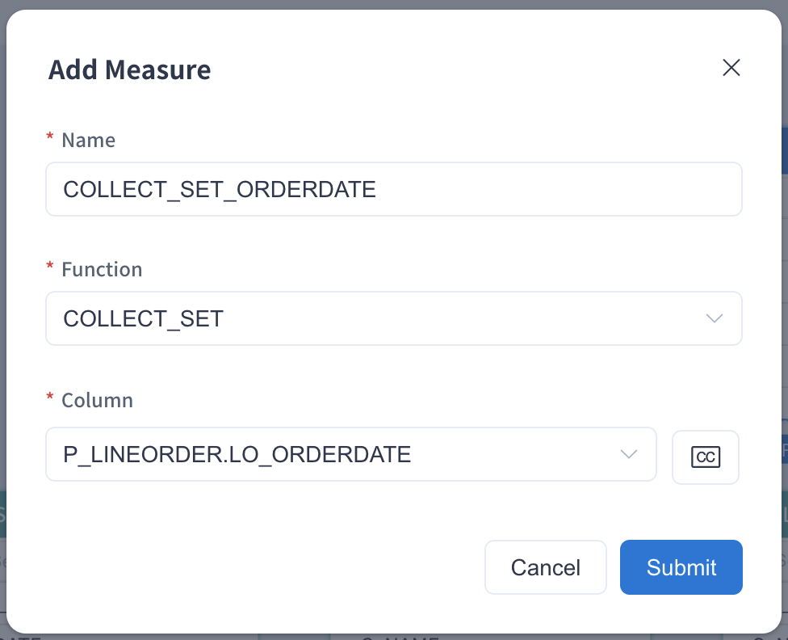
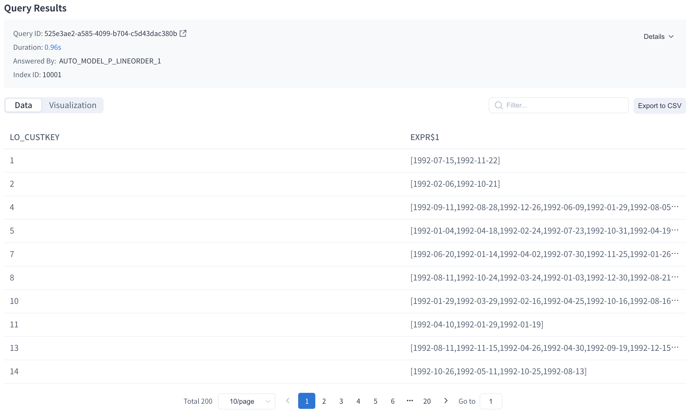
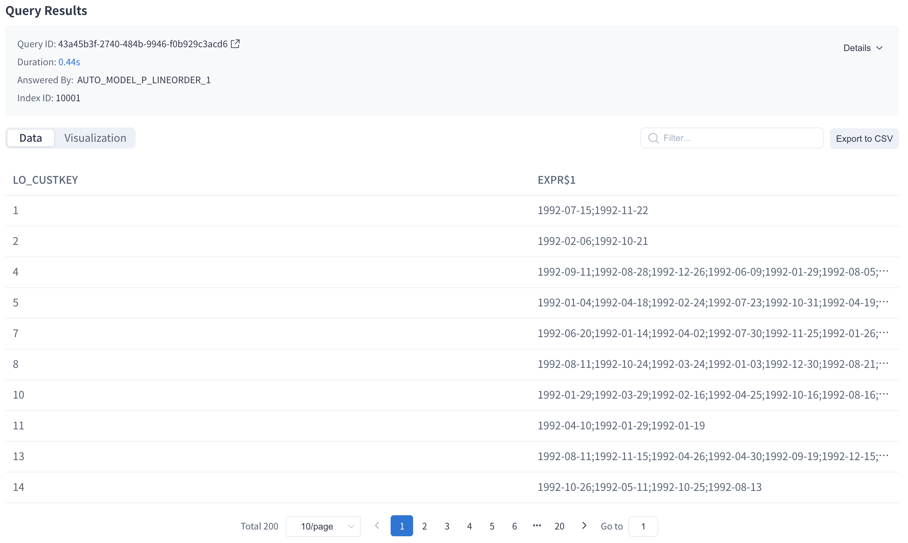

From v5, Kylin supports the COLLECT_SET function, which returns a set of unique elements as an array. The syntax is `COLLECT_SET(column)`. In smart mode, the product recommends the index containing the COLLECT_SET measure based on your query. In AI augmented mode the COLLECT_ SET measure is customizable.


### Use Case

Let’s use the project created in the chapter [Tutorial](../../../quickstart/expert_mode_tutorial.md) as an example to introduce COLLECT_ SET measure settings. This project uses the SSB Dataset and needs to complete the model design and index build (including data load). A model won't be able to serve any queries if it has no index and data. You can read [Model Design Basics](../data_modeling.md) to understand more about the methods used in model design. 

We will use the fact table `SSB.P_LINEORDER`. This sample table is a mockup of transactions that can happen in an online marketplace. It has a couple of dimension and measure columns. For easy understanding, we will only use two columns: `LO_CUSTKEY` and `LO_ORDERDATE`. The table below gives an introduction of these columns.

| Column       | Description |
| :----------- | :---------- |
| LO_CUSTKEY   | Customer ID |
| LO_ORDERDATE | Order Date |

We want to query the order date combination of each customer. The order date will be returned as an array with deduplicated values. The query example is below:

```sql
SELECT LO_CUSTKEY, COLLECT_SET(LO_ORDERDATE)
FROM SSB.P_LINEORDER 
GROUP BY LO_CUSTKEY
```

Before the **COLLECT_SET** measure is added, the query will pushdown to Hive. According to the data amount of source tables, the result may return in several minutes or more.


### How to Use

Please add a measure in the model editing page as follows. Please fill in the measure **Name**, for example `COLLECT_SET_ORDERDATE`, select **Function** as **COLLECT_SET**. Finally select the target column from the dropdown list, for example `P_LINEORDER.LO_ORDERDATE`.



Once the measure is added and the model is saved, click **Add Index** in the pop-up window to enter the **Model Index** page. You need to click **+**（Add Aggregate Group) under the **Aggregate Group** tab, add the corresponding dimensions and measures to the appropriate aggregate group according to your business scenario, and the new aggregate index will be generated after submission. In this example, the new index will contain the dimension `LO_CUSTKEY` and the measure ` COLLECT_SET(LO_ORDERDATE) `, you need to build index and load data to complete the precomputation of the target column. You can check the job of Build Index in the **Job Monitor** page. After the index is built, you can use the **COLLECT_SET** measure in the query and use the precomputation data.

Resubmit the above SQL query in the **Query -> Insight** page, and you will find the result as below:



If you need to create a model from the very beginning and add a COLLECT_SET measure, please add some indexes and load data into the model. A model won't be able to serve any query if it has no index and data. You can read this chapter [Model Design Basics](../data_modeling.md) to understand the method of model design.

In actual application scenarios, you can use the COLLECT_SET function in combination with other functions to apply more analysis scenarios. For example, the following query combines the CONCAT_WS function, which  the values in the array of order date into a string and splits it with `;`:

```sql
SELECT LO_CUSTKEY, CONCAT_WS(';', COLLECT_SET(LO_ORDERDATE))
FROM SSB.P_LINEORDER 
GROUP BY LO_CUSTKEY
```



> **Note**: The CONCAT_WS function is only supported in conjunction with the COLLECT_SET function when querying.
