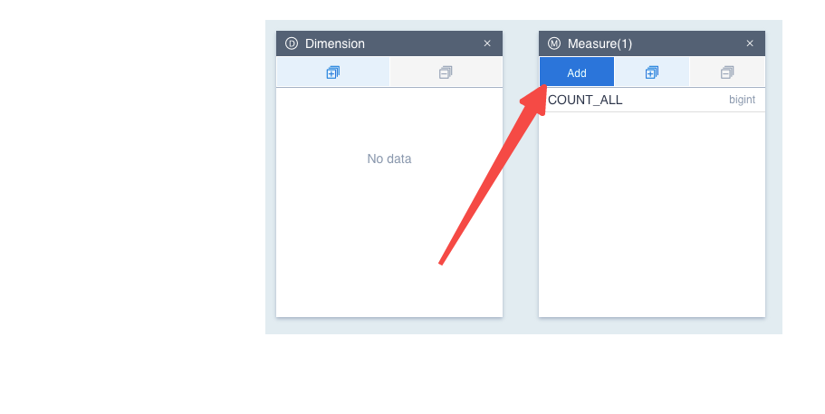
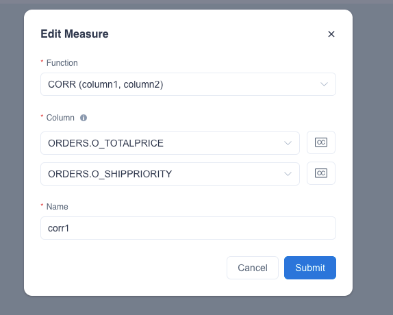
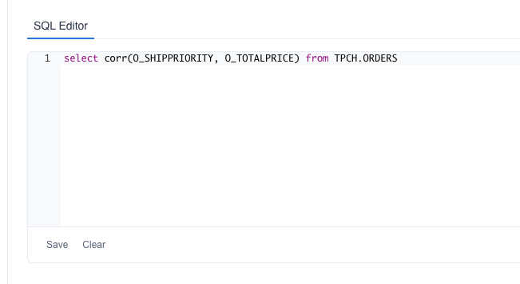

Correlation coefficient is used in statics to measure how strong a relationship is between two variables. The Correlation coefficient is using Pearson correlation underneath.


### CORR Introduction

CORR function will return a value to find the relationship between the two variables. The value is between -1 and 1, where 1 indicates a strong positive relationship. For example, for every positive increase in one variable, there will be a positive increase in another variable. 0 means that there is no relationship between the two variables and -1 means that when one variable has a positive increase, another one will have a negative decrease. Its syntax is as below:

> corr({col1},{col2}), col1, col2 is the column to calculate the correlation. It should note that, in the current version, the parameter return type for function CORR must be one of *real*, *bigint*, *integer*, *int4*, *long8*, *tinyint*, *smallint*, *decimal*, *double*, *float* and *numeric*. Date column is not supported to calculate now.
>

The query example in Kylin is as below:

```sql
SELECT corr(LO_ORDTOTALPRICE, LO_SHIPPRIOTITY)
FROM SSB.P_LINEORDER
```


### How to Use 

Step 1, in the model edit view, click *Add* in the *Measure* sheet



Step 2, select the *CORR* function and corresponding columns



Step 3, after saving the model and building the indexes, users can do queries in the *Insight* page



### Notes
1. The *CORR* measure may need to create a bunch of internal measuers (which are hidden from the end user) and computed columns on the model. Kylin will create and manage those internal measures itself underneath. If you wish to delete the auto generated computed columns, you should remove the corresponding corr measure first.
2. The correlation result might be inaccurate if there are null values in the input columns. Users are suggested to put *Data Filter Conditions* when saving models to filter out the null values if there is a *CORR* measure.

