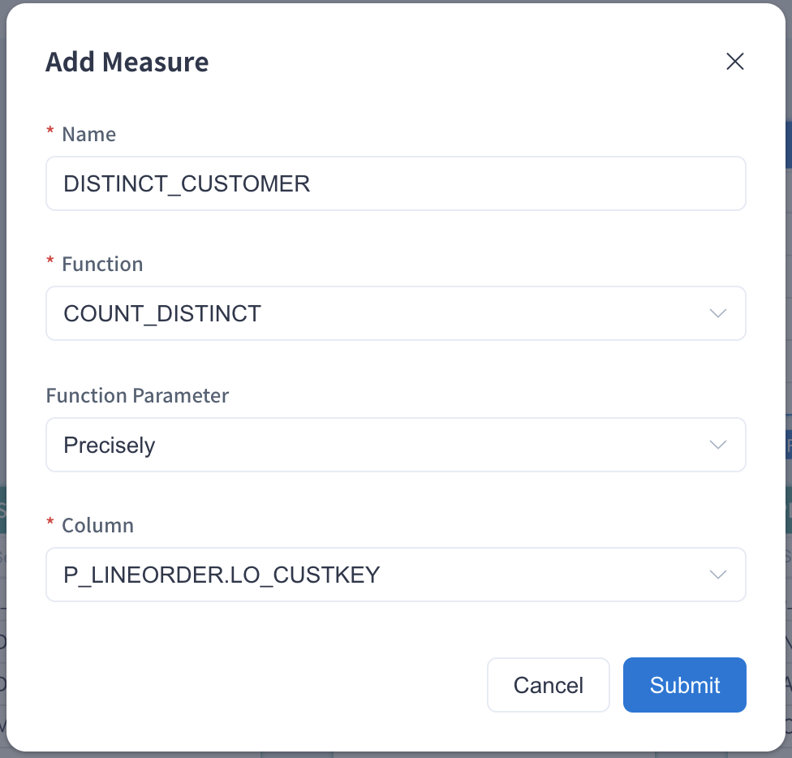

Count Distinct is a frequently used function for many data analysts. We implement precise Count Distinct based on bitmap. For the data with type tiny int(byte), small int(short) and int, the value projects onto the bitmap directly. For the data with type long, string, and others, encode the value as String onto a dict and project the dict id onto the bitmap. The resulting measure is the serialized data of the bitmap, not just the count value. This ensures results are always correct within any segment, even roll-up across segments.

In the project of Kylin 5, the Count Distinct (Precise) measure is customizable.

### Prerequisite

Before using the Count Distinct query, you need to clarify if the target column is ready. Click **Data Asset->Model**, select a model and click **Edit** to enter the model edit page. Then click **M** in the top right page to extend **Measure** table. You can get measure information in this table.  If the measure desired has been pre-calculated on precise Count Distinct syntax (here requires both `Function` to be count_distinct and `Return Type` to be bitmap) then this measure is ready for the Count Distinct query. Otherwise, you need to add a new measure Count Distinct (Precise) first. 

### Count Distinct Precision Setting 

Let’s use the project created in the chapter [Tutorial](../../../quickstart/expert_mode_tutorial.md) as an example to introduce count distinct precision measure settings. This project uses the SSB Dataset and needs to complete the model design and index build (including data load). A model won't be able to serve any queries if it has no index and data. You can read [Model Design Basics](../../data_modeling.md) to understand more about the methods used in model design. 

Please add a measure in the model editing page as follows. Please fill in the measure **Name**, such as `DISTINCT_CUSTOMER`, select **Function** as **COUNT_DISTINCT**, select accuracy requirement from **Function Parameter**, and finally select the target column from the drop-down list.

Kylin offers both approximate Count Distinct function and precise Count Distinct function. To get the pre-calculated precise Count Distinct value, select the `Function Parameter: Precisely` based on the bitmap, it will return a no error result if the storage resource is sufficient. For instance, when the Count Distinct is value over millions, the one result size might be hundreds of megabytes. 

> **Note:** The query of precise Count Distinct is based on bitmap, so it will consume more resources. 

Once the measure is added and the model is saved, you need to go to the **Edit Aggregate Index** page, add the corresponding dimensions and measures to the appropriate aggregate group according to your business scenario, and the new aggregate index will be generated after submission. You need to build index and load data to complete the precomputation of the target column. You can check the job of Build Index in the Job Monitor page. After the index is built, you can use the **Count Distinct (Precise)** measure to do some querying. 

If you need to create a model from the very beginning and add a Count Distinct (Precise) measure, please add some indices and load data into the model. A model won't be able to serve any query if it has no index and data. You can read this chapter [Model Design Basics](../../data_modeling.md) to understand the methods used in model design.

For more information about approximate Count Distinct function, please refer to [Count Distinct (Approximate)](count_distinct_hllc.md) Introduction.
