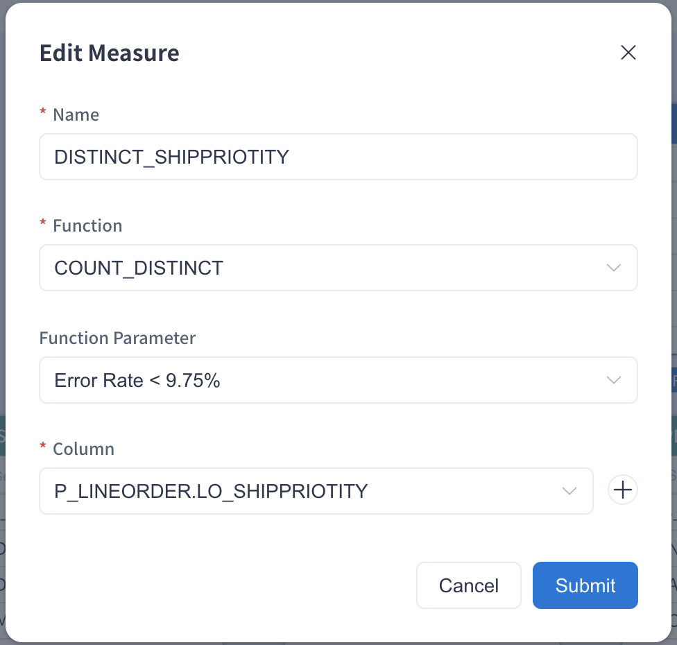

Count Distinct is a frequently used function for many data analysts, which is used to calculate the number of unique elements in a (multiple) set. However, it will spend lots of resources to calculate the exact Count Distinct value in big data scenario. Since v2.1, this product implements approximately Count Distinct using [HyperLogLog](https://hal.inria.fr/hal-00406166/document) algorithm, offers serveral precisions, with the error rates from 9.75% to 1.22% to support different query needs.

> **Note:** If you don't require a particularly precise result, this approximate Count Distinct query will return a good approximation with limited storage resources.

In the project of Kylin 5, you can customize Count Distinct (Approximate) measure with 5 accurracy options:

- Error Rate < 9.75%
- Error Rate < 4.88%
- Error Rate < 2.44%
- Error Rate < 1.72%
- Error Rate < 1.22%


### Prerequisite

Let’s use the project created in the chapter [Tutorial](../../../quickstart/expert_mode_tutorial.md) as an example to introduce approximate count distinct measure settings. This project uses the SSB Dataset and needs to complete the model design and index build (including data load). A model won't be able to serve any queries if it has no index and data. You can read [Model Design Basics](../../data_modeling.md) to understand more about the methods used in model design. 

Before using Count Distinct query, you need to check the target column is ready. You can get measure information in the model editing page. If the desire measure has been pre-calculated on approximate Count Distinct syntax (requires both `Function` to be count_distinct and `Return Type` to be hllc), then this measure is ready for Count Distinct querying. Otherwise, you need to add a new measure Count Distinct (Approximate) first.

### Measure Edit

Please add a measure in the model editing page as follows. Please fill in the measure **Name**, such as `DISTINCT_SHIPPRIOTITY`, select **Function** as **COUNT_DISTINCT**, select accuracy requirement from **Function Parameter**, and finally select the target column from the drop-down list.



Once the measure is added and the model is saved, click **Add Index** in the pop-up window to enter the **Model Index** page. You need to click **+**（Add Aggregate Group) under the **Aggregate Group** tab, add the corresponding dimensions and measures to the appropriate aggregate group according to your business scenario, and the new aggregate index will be generated after submission. You need to build index and load data to complete the precomputation of the target column. You can check the job of Build Index in the **Job Monitor** page. After the index is built, you can use the **Count Distinct (Approximate)** measure in queries, such as the query below:

```sql
SELECT COUNT(DISTINCT P_LINEORDER.LO_SHIPPRIOTITY)
FROM SSB.P_LINEORDER
```
If you need to create a model from the very beginning and add a Count Distinct (Approximate) measure, please add some indices and load data into the model. A model won't be able to serve any query if it has no index and data. You can read this chapter [Model Design Basics](../../data_modeling.md) to understand the method of model design.

More information about precise Count Distinct function, please refer to [Count Distinct (Approximate)](count_distinct_bitmap.md) Introduction.
