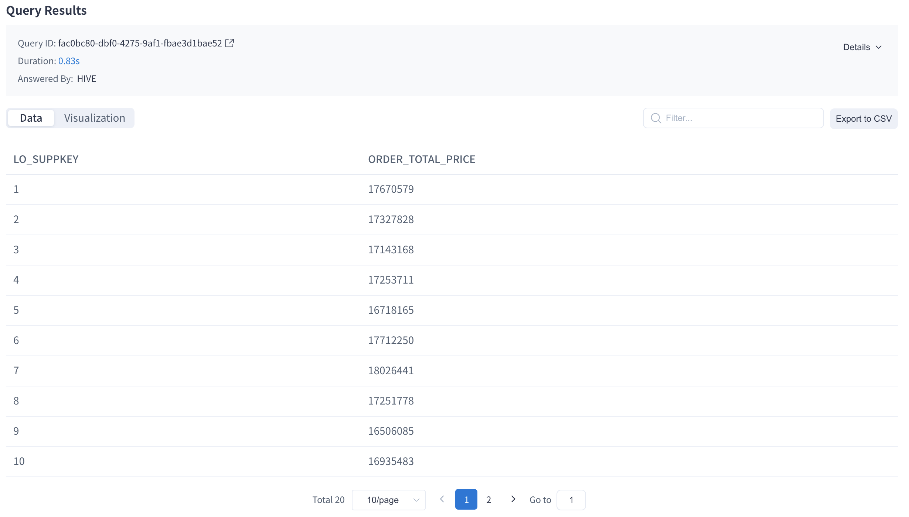
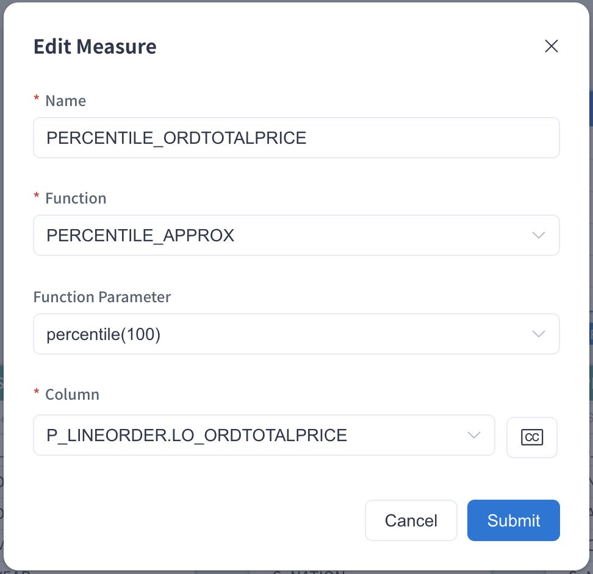
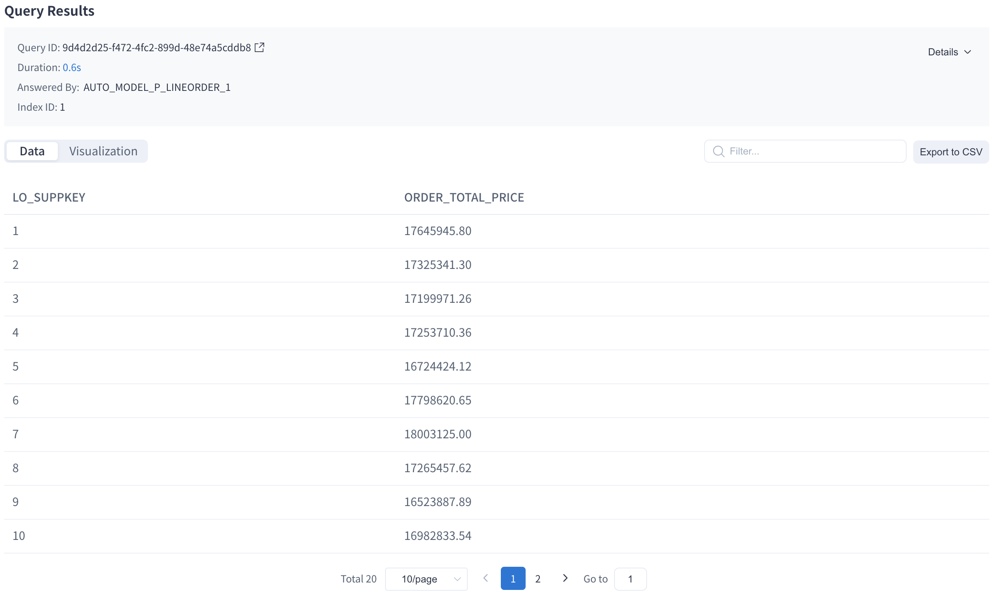

This product supports the function **percentile**. Some previous versions refer to it as **percentile_approx**. They have the same algorithm (thus result). If the percentile measure is predefined, the SQL query will enable sub-second query latency. 

This function has three return types: 'percentile(100)', 'percentile(1000)' and 'percentile(10000)'. The higher return value means higher accuracy and higher storage resources are occupied. We recommend using percentile(100) in most scenarios.

In the project of Kylin 5 the Percentile (Approximate) measure is customizable.


### Percentile_Approx Introduction

Percentile_approx returns the value of below which a given percentage of observations in a group of observations fall. For example, the 20th percentile is the value below which 20% of the observations may be found. Its syntax is as below:

- percentile_approx({measure},p,B)

*measure* is the measure to query. *p* is number between 0 to 1, inclusive. *B* controls the Approximate Accuracy. The higher the value, the higher the accuracy of the result. percentile_approx uses the interpolation method to determine the value of the nth percentile. 


### Use Case

Let’s use the project created in the chapter [Tutorial](../../../quickstart/expert_mode_tutorial.md) as an example to introduce percentile_approx measure settings. This project uses the SSB Dataset and needs to complete the model design and index build (including data load). A model won't be able to serve any queries if it has no index and data. You can read [Model Design Basics](../data_modeling.md) to understand more about the methods used in model design. 

We will use the fact table `SSB.P_LINEORDER`. This sample table is a mockup of transactions that can happen in an online marketplace. It has a couple of dimension and measure columns. For easy undersatning, we will only use two columns:  `LO_SUPPKEY` and `LO_ORDTOTALPRICE`. The table below gives an introduction to these columns.

| Column           | Description |
| ---------------- | ----------- |
| LO_SUPPKEY       | Supplier ID |
| LO_ORDTOTALPRICE | Sold amount |

We want to query the value of the 50th percentage for each supplier's sold amount. The query example is below:

```sql
SELECT LO_SUPPKEY, percentile_approx(LO_ORDTOTALPRICE, 0.5) AS ORDER_TOTAL_PRICE
FROM SSB.P_LINEORDER
GROUP BY LO_SUPPKEY
```

Before the **PERCENTILE_APPROX** measure is added, the system will pushdown the query to Hive if the query pushdown function is enabled.



### How to Use

Please add a measure in the model editing page as follows. Please fill in the measure **Name** for example `PERCENTILE_ORDTOTALPRICE`, select **Function** as **PERCENTILE_APPROX**, select **Function Parameter** as 'percentile(100)', 'percentile(1000)' or 'percentile(10000)' on demand. The Function Parameter means B listed in the above syntax. Higher value means higher accuracy and higher storage resources are occupied. Finally select the target column from the dropdown list.



Once the measure is added and the model is saved, click **Add Index** in the pop-up window to enter the **Model Index** page. You need to click **+**（Add Aggregate Group) under the **Aggregate Group** tab, add the dimensions and measures to the aggregate groups according to your business scenario, and the new aggregate indices will be generated after submission. In this example, the new index will contain the dimension `LO_SUPPKEY` and the measure ` percentile_approx(LO_ORDTOTALPRICE, p, 100) `, you need to build index to make the indices available. You can check the job status in **Job Monitor** page. After the index is built, you can use the **PERCENTILE_APPROX** measure for querying. 

Resubmit the above SQL query in the **Query -> Insight** page, and you will find the result returns the value of the 50th percentage for each supplier's sold amount.


