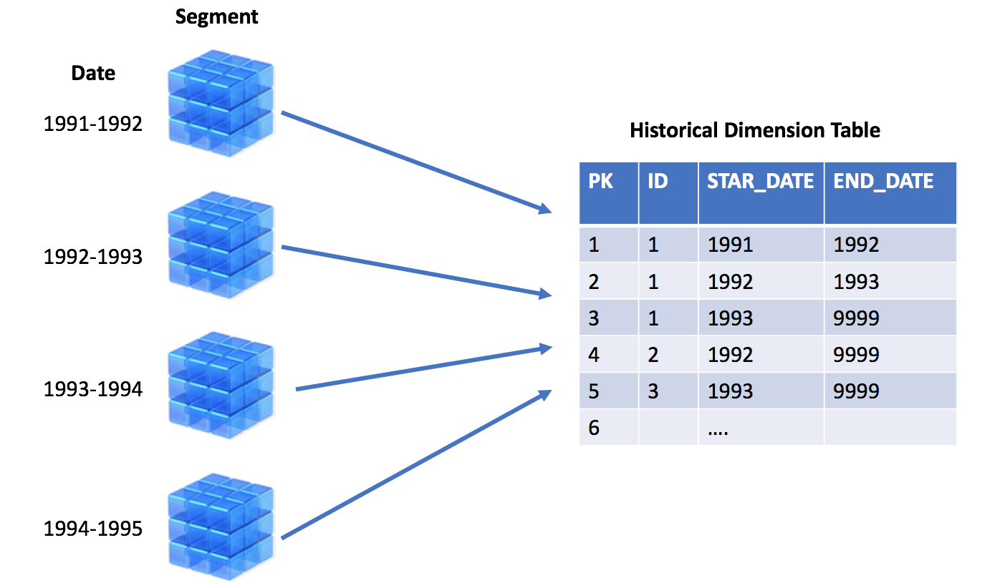
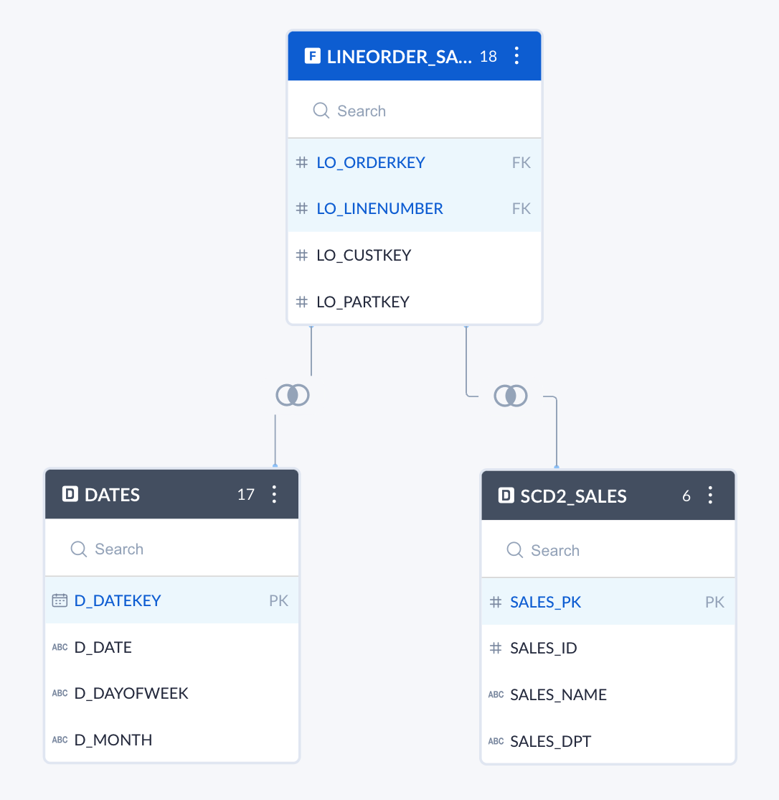
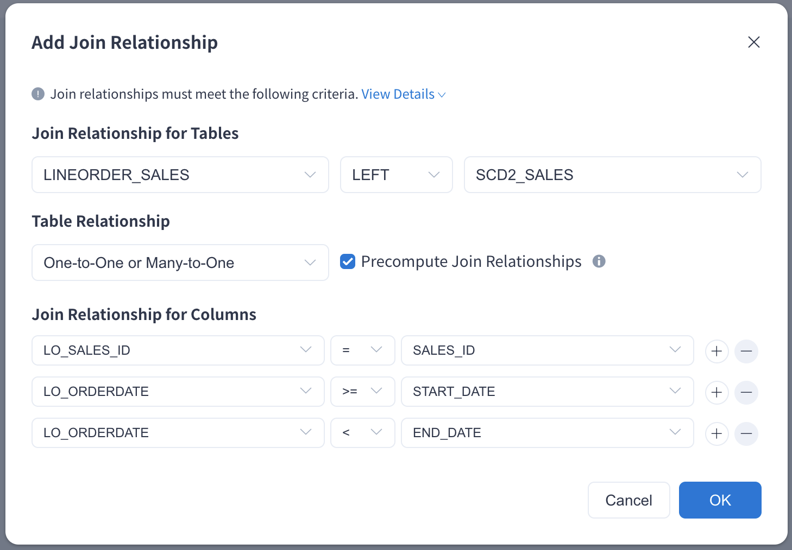

In most multi-dimensional OLAP scenarios, lookup table might change unpredictably, rather than according to a regular schedule. For example product category of one specific product might get changed in product table, or segmentation of some customers might be changed in customer table. As product category or customer segmentation are modeled as dimensions in a cube, they are so called **Slowly Changing Dimension**, or SCD in short. Detailed introduction reference [wikipedia](https://en.wikipedia.org/wiki/Slowly_changing_dimension#Type_0:_retain_original)。

Dealing with this issue involves SCD management methodologies referred to as Type 0 through 6. But the most commonly seen are **Type 1** and **Type 2**:

- Type 1: overwrite. This methodology overwrites old with new data, and therefore does not track historical data. This is also called "latest status".

- Type 2: add new row. This method tracks historical data by creating multiple records for a given natural key in the dimensional tables with separate surrogate keys and/or different version numbers. Unlimited history is preserved for each insert. This is also called "historical truth".

For SCD Type 2（subsequently referred to as "SCD2"), Only supports the model based on the History Table, Below screen-shot illustrates the basics:

### History Table

The History Table stores the basic information of the record and the life cycle of each record. Changes to the record will add a new row and modify the life cycle of the historical record. Through the life cycle of the record, you can query historical records, and you can also query the latest records.

For example, in the SCD2_SALES table below, the time interval of the salesperson in the corresponding business area (SALES_DPT) is [START_DATE,END_DATE).

| SALES_PK | SALES_ID | SALES_NAME | SALES_DPT | START_DATE | END_DATE |
| ---- | ---- | ---- | ---- | -------- | -------- |
| 1    | 1    | Zhang San | Sourth area | 1992/1/1 | 1993/1/1 |
| 2    | 2    | Li Si | North area | 1992/1/1 | 1994/1/2 |
| 3    | 3    | Wang Wu | East area | 1992/1/1 | 1995/1/3 |
| 4    | 1    | Zhang San | North area | 1993/1/1 | 1994/1/1 |
| 5    | 2    | Li Si | East area | 1994/1/2 | 9999/1/1 |
| 6    | 3    | Wang Wu | Sourth area | 1995/1/3 | 9999/1/1 |
| 7    | 1    | Zhang San | West area | 1994/1/1 | 9999/1/1 |

It can be seen from the table that Zhang San:

- Worked in sourth area from 1992/1/1 to 1993/1/1

- Worked in the north area from 1993/1/1 to 1994/1/1

- And he has been working in the West area since 1994/1/1

Every time Zhang San change his work location, the History Table adds a new line of records and modifies the END_DATE of the previous record.

### Join condition based on History Table

In order to be able to query the historical information of the History Table, the fact table is often used to filter the start and end dates of the History Table records, like`LO_ORDERDATE>=START_DATE AND LO_ORDERDATE<END_DATE`
As shown below:

In order to use the History Table to meet the demand for slow dimensions, you can click **Setting -> Advanced Settings -> Support History Table** to turn on the function of supporting History Table. As shown below:

- **When it is turned on, you can use non-equal join conditions (≥，<) could be used for modeling, building and queries.**

- **When it is turned off, the old SCD2 model will be offline** 

The current join conditions based on the History Table have the following restrictions:
- **Can’t define multiple join conditions for the same columns**
- **Join condition ≥ and < must be used in pairs, and same column must be joint in both conditions**
- **Join condition for columns should include at least one equal-join condition (=)**
- **Two tables could only be joined by the same condition for one time**
- **Currently, recommendations are not supported for the History Table model**
- **By default, even if you use LEFT JOIN, you need to exactly match the model before you can use the model that contains the History Table to answer queries.**

### SCD2 model based on History Table

For SCD2 model, the purpose of historical traceability can be achieved through the join conditions based on the History Table.
As shown in the figure below, in order to query the total sales revenue of the seller at each work location, the order date is associated with the working time interval.

For seller Zhang San, the total sales revenue of orders in different area from 1992 to the present can be queried, as shown in the following table:

| D_YEAR | SALES_NAME | SALES_DPT | TOTAL_REVENUE |
| ------ | ---------- | --------- | ------------- |
| 1992   | Zhang San       | Sourth area      | 3711706590    |
| 1993   | Zhang San       | North area      | 3882401031    |
| 1994   | Zhang San       | West area      | 3626302199    |
| 1995   | Zhang San       | West area      | 3733096229    |
| 1996   | Zhang San       | West area      | 3487903587    |
| 1997   | Zhang San       | West area      | 3725031606    |
| 1998   | Zhang San       | West area      | 2101112606    |
