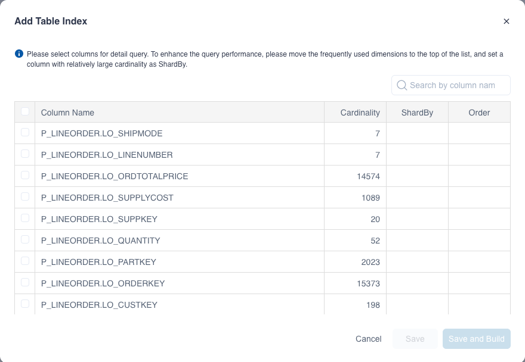
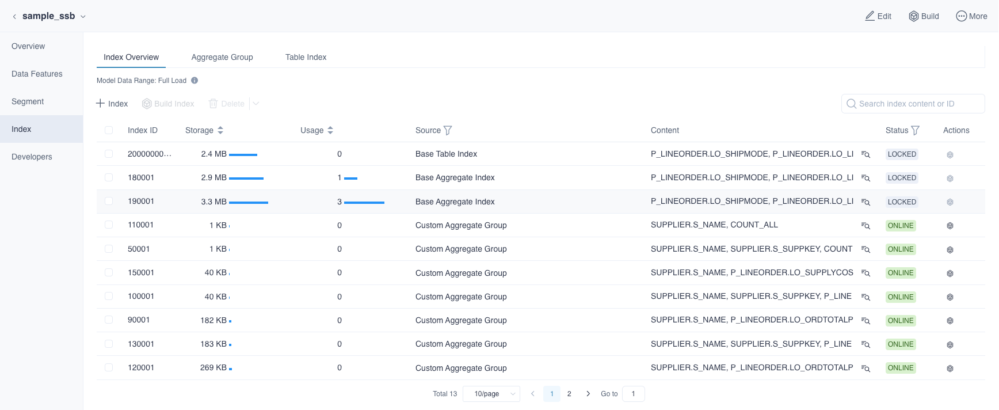

Kylin provides table index function to support querying on raw data. To create a table index, similar to a table, you need to select fields that are often queried on the transaction level. For customized queries, this product leverages well-designed aggregate index to efficiently process them. For queries not within the scope, **Query Pushdown** plays a supplementary role. 

### Create Table Index

In the **Data Asset -> Model** page, click the model name，then click **Index** and click **Table Index** button under **+ Index** in the **Index Overview** tab or **+**(Add Table Index) button in the **Table Index** tab to enter the **Add Table Index** page. You can edit the table index in the pop-up window shown below and put the required column in a table index.

The fields are defined as follows:

1. **Column Name**

   All the columns defined as **dimension** or referenced by **measure** in the model.

2. **Cardinality**

   Cardinality of the column.

3. **Order**

  Reasonably setting a certain column as SortBy could substantially increase query efficiency of table index. When you select the column ABC, you can click the arrows in **Order** to adjust the column order.

  Those top columns in the order of SortBy list will provide more efficiency benefits they are used as a filter condition in queries. We suggest you arrange SortBy columns in order of frequency they will be used as a filter condition. Do not set too many SortBy columns because tail columns do to little help performance.

4. **ShardBy**

   If you want to set a column as the ShardBy column, select it and click the icon below the **ShardBy**.

   When configuring table index you can set one column as ShardBy or simply zero.  If you set a certain column as the ShardBy column, the raw data will be sharded according to values of that column. If you don't explicitly specify an ShardBy column, sharding will be done taking into consideration all the column values.
   
   Select an appropriate ShardBy column could distribute raw data into multiple shards, which can increase concurrency, and achieve a better query performance. We suggest you choose columns with relatively large cardinality as the ShardBy column to prevent heterogeneous data distribution. 
   

You can add multiple table indices. After building the table index and loading data, you can query for corresponding raw data.

### View Table Index

In the **Data Asset -> Model** page, click the model name and click **Index**. Under the **Index Overview** tab, you can view the details of table index.

You can click the icon beside the status and see the details in View Index Details, such as the columns in the table index, the order, and the shardby column. For the custom table index, you can click the edit button to edit it, or click the delete button to delete it. You can also delete the recommended table index, but can not edit it.

If you need to add base indexes when there is no base index or when a base index is missing. Click **+ Index** to add the base indexes in the drop-down box.

For more information about the Index List, such as the index status, please refer to the [Aggregate Index](aggregation_group.md) section.
