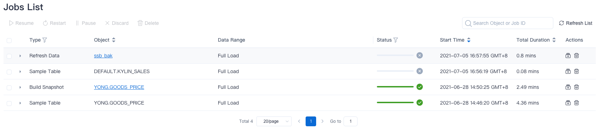
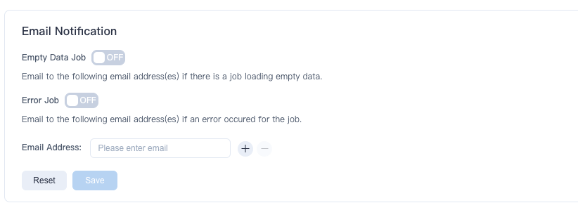

You will build different jobs as you work with Kylin. In this section, we will introduce the types and settings of jobs. The main contents are as follows:

### Types of Jobs

Kylin has these types of jobs：

- Build Index: Job for building new Index.
- Load Data: Job for incrementally loading data on existing models/indices.
- Merge Data: Job for merging segments.
- Refresh Data: Job for refreshing segments.
- Sample Table: Job for table sampling.
- Build Snapshot: Job for building new Snapshots.
- Refresh Snapshot: Job for refreshing snapshots.
- Build Sub-partitions Data: Job for loading sub-partition data of Multi-level partition model.
- Refresh Sub-partitions Data: Job for refreshing sub-partition data of Multi-level partition model.
- Load Data to Tiered Storage: Job for loading data on existing models to the tiered storage.
- Delete Tiered Storage - Project: Job for deleting the loaded data of projects from the tiered storage.
- Delete Tiered Storage - Model: Job for deleting the loaded data of models from the tiered storage.
- Delete Tiered Storage - Segment: Job for deleting the loaded data of segments from the tiered storage.
- Delete Tiered Storage - Index: Job for deleting the loaded data of base table index from the tiered storage.

You can view the job details in the navigation bar **Monitor -> Job**. As shown below, We have created various kinds of jobs.

1. **Build Index**: Job for building new index and loading data.

   - In the navigation bar **Data Asset -> Model**, creating new models will trigger this job.

     > **Tips**: For details on how to build an index, please see [Aggregate Index](../modeling/model_design/aggregation_group.md).

2. **Load Data**: Job for incrementally loading data on existing models/indices.

   > **Attention**: The start time of loading data must be greater than the end time of the loaded data.

   - In AI augmented mode, in the navigation bar **Data Asset -> Model**, loading data within a time range of the model will trigger the job.

3. **Merge Data**: When the system detects a sufficient number of segments, it will automatically trigger the job of merging data. You can set the parameters of merging segments in the navigation bar **Setting -> Segment Settings**. For detailed message, you can refer to [Segment Operation and Settings](../modeling/load_data/segment_operation_settings/intro.md).

4. **Refresh Data**: Job for refreshing segments.

   - In AI augmented mode, in the navigation bar **Data Asset -> Model**, refreshing data of a specified segment in the specified model will trigger the job.

     > **Attention**：If you refresh n segments at the same time, it will trigger n jobs to refresh the data, and arrange them in the job queue according to the chronological order of original segments. You can view them in the **Monitor -> Job** bar.
     
   
5. **Sample Table**: Job for data sampling of a table. This job can obtain characteristics of the table data. Table sampling jobs can be triggered automatically or manually.

   - Automatically: The job is automatically triggered when you add a data source in the navigation bar **Data Asset -> Data Source**.

     > **Attention**: Table sampling is enabled by default. If you manually turn it off, this job will not be triggered.

   - Manually: You can trigger a table sampling job in the navigation bar **Data Asset -> Data Source**. Click on the **Sample** button or **Reload** button to trigger this kind of jobs.

     > **Attention**：The "Reload" button will reload the data from the table.
   
6. **Build Snapshot**：Job for building new Snapshots. This job only appears when you manually add a snapshot after snapshot management is enabled.

7. **Refresh Snapshot**：Job for refreshing snapshots. This job only appears when you manually refresh a snapshot after snapshot management is enabled.

8. **Build Sub-partitions Data**: Enable multi-level partition, and the model is a multi-level partition model, job for loading sub-partition data.

9. **Refresh Sub-partitions Data**:Enable multi-level partition, and the model is a multi-level partition model, job for refreshing sub-partition data.
### Details of Jobs

In the navigation bar **Monitor -> Job**, click the triangle button on the left to expand and view the job details. 
Some of the elements include job steps, waiting time and executing time, log output and job parameters, etc:

1. **Job Steps**:
   According to job type, the job is subdivided into the first and second level job steps, so that users can better understand the job execution.
   
   Take the job of building index and loading data type as an example, the first-level job steps are:
   - Detect Resource
   - Load Data to Index
   - Update Metadata
   - Upload Data to Tiered Storage

   The **Load Data to Index** step is subdivided into second-level job steps:
   - Waiting for yarn resources
   - Build or refresh snapshot
   - Materialize fact table view
   - Generate global dictionary
   - Generate flat table
   - Get flat table statistics
   - Build indexes by layer
   - Update flat table statistics

   Note: Depending on the actual situation, the job may only perform some of the above steps.
3. **Waiting time and Executing time**:

   Job waiting time is the waiting time due to concurrency restrictions or resource restrictions.

   Job executing time is the actual execution time of the job, excluding the job suspension time.

4. **Log output**: The job-related logs in `kylin.log`, it can assist in the diagnosis of job abnormalities.
5. **Job parameters**: Spark parameters related to the job, it can assist in the diagnosis of job abnormalities.
> Tip: Subdivided second-level job steps and job parameters have been introduced since Kylin version 4.5.3.

### Settings of Jobs

You can modify settings about **Email Notification** in the navigation bar **Setting -> Advanced Settings**, as shown below: 

You can fill in your email and choose to open different types of job notification.

> **Tips**: You can make different job notifications for different projects.

### FAQ

**Q: Why is my job suspended without error?**

We set the priority of jobs according to the influence of different types of jobs on the actual business, and the details is as follows:

- High priority job: Loading Data
- Secondary priority job: Building Index, Merging Data, Refreshing Data

When a job with a secondary priority reports an error, other jobs with the same priority of this model/index will be suspended. However, jobs of different models/indices will not be affected.

**Q: Why did my previously completed jobs disappear from the job list?**

Up to 30 days of job records are kept in the Kylin. Job records more than 30 days can be queried in the deployment file of the installation package.

**Q: Is there a limit on the number of concurrent jobs for Kylin? What should I do if I exceed the number of concurrency allowed by the system when submitting a job?**

By default, Kylin automatically controls the number of concurrency based on the system resources available. You can turn it off by modifying the parameter `kylin.job.auto-set-concurrent-jobs` in the system configuration file `kylin.properties`.

When auto-control is turned off, the maximum concurrency in a single project is **20** by default, which can be changed by modifying the parameter `kylin.job.max-concurrent-jobs` in the system configuration file `kylin.properties`.

When submitting a new job, if the number of concurrency exceeds what is allowed, this job will enter the job queue. When a running job is finished, Kylin will schedule a job in the queue to execute in a first-in-first-out (FIFO) manner.
