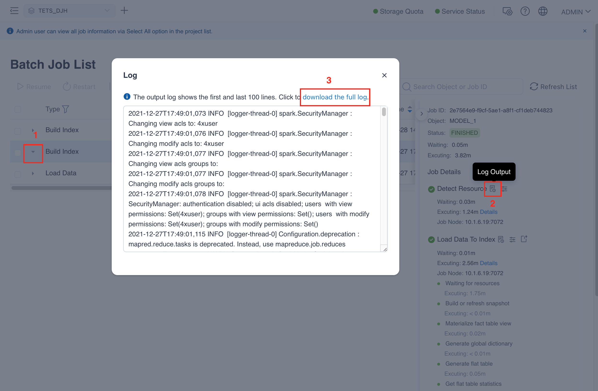
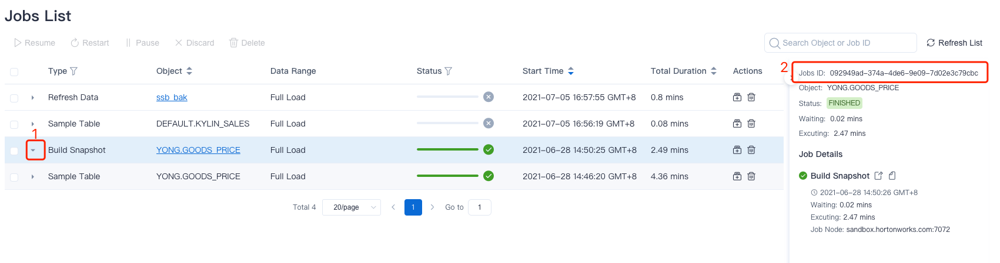
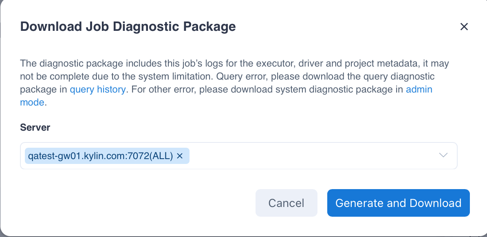

 Job diagnosis may encounter various problems during execution. To help solve these problems efficiently, Kylin provides a task diagnostic function, which can package related problems' log information into a compressed package for operations or Apache Community supports to analyze problems and ascertain the cause.

### View Job Execution Log On Web UI

You can view the job execution log in the ` Monitor -> Batch Job` interface. As shown below, you can click the **Open Job Steps** button at the position 1, and then click the **Log Output** button in the job details to view the first and the last 100 lines of job execution log in a popup window. You can download the full log by clicking the link **download the full log** at the position 3.

> **Tip**: If there are multiple steps in a job, you can view the execution log for each step.

### Generate Job Diagnostic Package By Scripts

In FusionInsight, you need to execute the command `source /opt/hadoopclient/bigdata_env` first. The `hadoopclient` is a variable.

You can execute ` $KYLIN_HOME/bin/diag.sh -job <jobid> ` to generate the job diagnostic package and \<jobid\> need to be replaced with the actual job ID number. You can view the job ID number in the ` Monitor -> Batch Job` interface. You can also click the icon in the position 1 as shown picture below to expand the specified job details that is in the position 2 on the right.

 

 The diagnostic package is stored by default in the `$KYLIN_HOME/diag_dump/` directory.

 After extracting the diagnostic package, you can view the diagnostic package information in the appropriate directory or file.

- `/conf`: configuration information under the `$KYLIN_HOME/conf` directory.
- `/hadoop_conf`: configuration information under the `$KYLIN_HOME/hadoop_conf` directory.
- `/metadata`: metadata files.
- `/logs`: specifies the logs generated during the execution of job.
- `/spark_logs`: specifies all spark executor logs generated during job execution.
- `/system_metrics`: specifies the system metrics during the execution of job.
- `/audit_log`: specifies the audit logs during the execution of job.
- `/job_tmp`: specifies the temporary files, logs and optimization suggestions log of job.
- `/yarn_application_log`: specifies the logs of yarn application of job. 
- `/client`: operating system resources occupied information, hadoop version and kerberos information.
- `/monitor_metrics`：The node monitoring log of the specified task.
- `/write_hadoop_conf`：`$KYLIN_HOME/write_hadoop_conf`, Hadoop configuration of the build cluster. This directory will not be available when Read/Write separation deployment is not configured.
- file `catalog_info`: directory structure of install package.
- file `commit_SHA1`: git-commit version.
- file `hadoop_env`: hadoop environment information.
- file `info`: license, package and hostname.
- file `kylin_env`: Kylin version, operating system information, Java related information, git-commit information.

> **Tips**: If you want to exclude metadata files, please specify `-includeMeta false`.

### Generate Job Diagnostic Package in Web UI

Job diagnostic package includes all diagnostic information of a specific job, and users can generate job diagnostic package on Web UI by following the following steps:

1. In the action bar of a job on the **Jobs List** page, click the **Download Job Diagnostic Package** button in **Actions**.
2. Select **Server**.
3. Click **Generate and Download** button: After the diagnostic package is generated, the downloads will be triggered automatically. If the diagnostic package generation fails, you can view the details of the failure on the interface.
