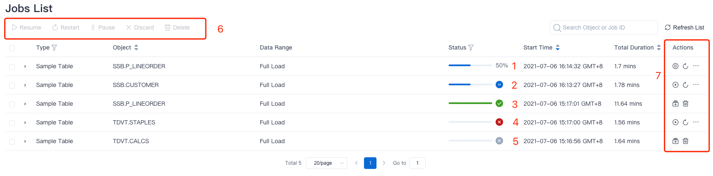

You can perform job operations on Kylin's job monitor page. In this section we will tell you about the status and meaning of jobs. The main contents are as follows:

### Job Status

The job has the following 6 states：

- **PENDING**：The status of the job waits for scheduled execution.

- **RUNNING**：The status of the job means running normally. You can view the progress of the execution and the progress is shown in percentage.

- **PAUSED**：The status of the job suspends normal execution.

- **ERROR**：When the job encountered a problem that cannot be continued, the interface displays the status of the error.

- **DISCARDED**：The job is reported to terminate the execution status. And the terminated job will immediately stop and release all resources.

  > Prompt：When the job's execution object no longer exists or changes, the system will automatically terminate the job.

- **FINISHED**：The status of the job is completed normally.

You can view the job status information in the **Monitor -> Job** interface of navigation bar. As shown below:

- Label 1: Execution status.
- Label 2: Pause status.
- Label 3: Finished status.
- Label 4: Error Status.
- Label 5: Termination Status.
- Label 6: Batch operation for selected jobs.
- Label 7: Operation for a single job.

### Routine Operation

- **Resume**：Start with an intermediate step in the job and continue with the job.

  > Note：If a job is in error status. After the user troubleshoots or solves the problem of the job. The user can retry this execution through this operation.

- **Restart**：Abandon the results of the intermediate steps and re-execute jobs from the beginning.

  > Note：For jobs in error status, if the execution subjects have changed, for instance, the schema of a source table has changed, we'll recommend user to restart the job. And records of jobs before this time will be removed and restart a new job.

- **Pause**：Pause the current job and release all related resources.

- **Discard**: Discard jobs and release all related resources.

  > Note: After discarded the jobs, it cannot be undone or restored by restart operation. 

- **Delete**：Delete jobs.

- **Refresh** ：Refresh job list information.

### Cross-Project Job Operation

In the job monitor page, ADMIN users can view all job information via **Select All** option in the project list. After selecting that, the **Project** column will appear in the job list and you can operate the jobs in batches across projects.
