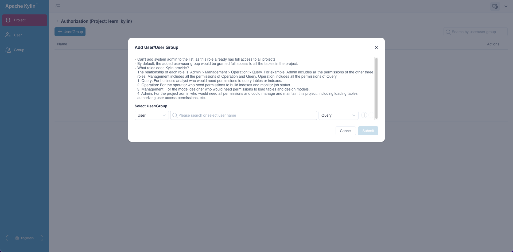

Project ACLs determines whether a user/user group can access a certain project in Kylin. Kylin has four built-in project level permissions, *Admin*, *Management*, *Operation* and *Query*. *Admin* includes the other three permissions, *Management* includes *Operation* and *Query* permissions, *Operation* includes *Query* permissions.

- *QUERY*: Permission to query tables/models in the project. If pushdown is enabled, user/group can query tables loaded to the project when there's no ready model to answer the query.
- *OPERATION*: Permission to build a model in the project, including rebuild a segment, resume or discard jobs. 
- *MANAGEMENT*: Permission to edit/delete models in the project. 
- *ADMIN*: Permission to manage data sources, models in the project.

After the system administrator logs in to Kylin, click the **Admin** button in the global toolbar to enter the system management page, and click the **Project** field to enter the Project Management page.

After the system administrator assigns project access permission to a group, users in the group will inherit the access permission on data source, models and segments accordingly. 

### Grant Project ACL

1. Select the project and click the **Authorization** icon under the **Actions** column on the right to enter the authorization page.
2. Expand a project on the project list.
3. Click **+ User / Group** to grant access for a user / user group.
4. Select the grant type : by **User** or by **User Group**. Then select the user / user group and access permission to be granted, and click **Submit**. 

### Modify Project ACL

1. Select the project and click the **Authorization** icon under the **Actions** column on the right to enter the authorization page.
2. Select the user / user group in the list and click the **Edit** icon under the **Actions** column on the right.
3. Modify user / user group's access permission and click **Submit**. 

### Revoke Project ACL

1. Select the project and click the **Authorization** icon under the **Actions** column on the right to enter the authorization page.
2. Select the user / user group in the list and click the **Delete** icon under the **Actions** column on the right.
