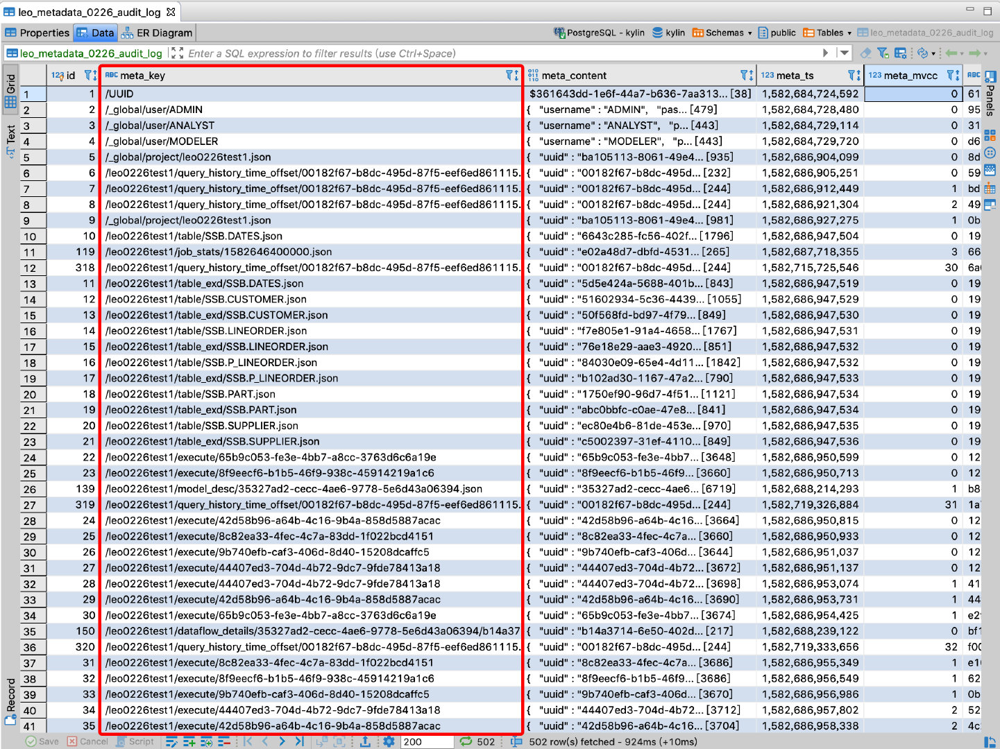
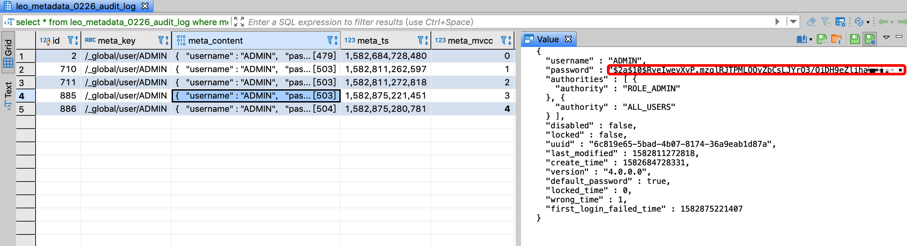
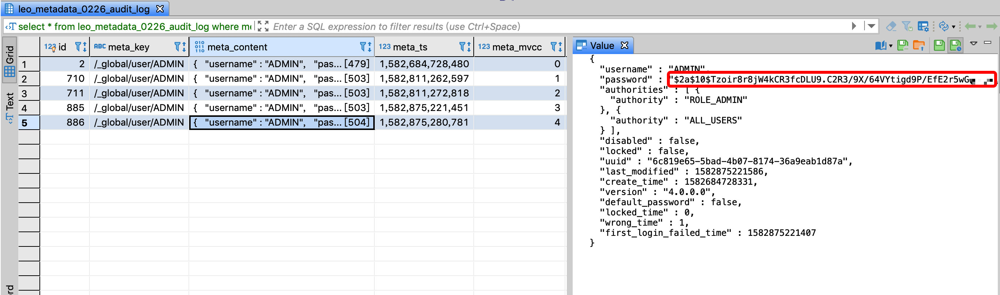
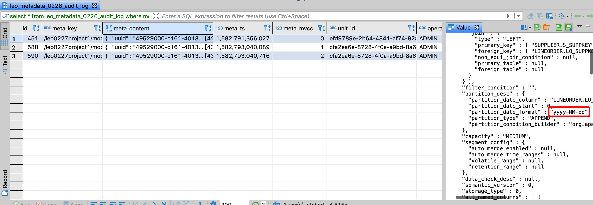
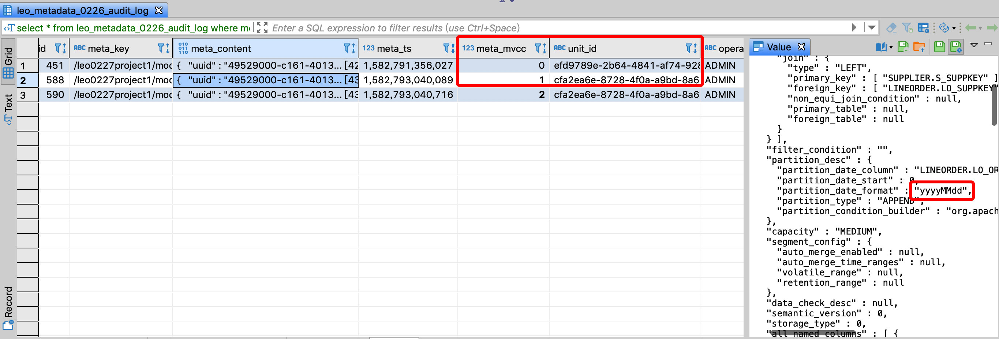

### Basic Concept

In the database, Audit Log is mainly used to monitor and record the operating behavior of data, which is simply understood as a log.

Kylin instances are stateless services. All state information is stored in metadata. All operations that change data will create or modify metadata. Changes to metadata are included in a database transaction. At the same time, every time Modifications to metadata are recorded in the audit log, which is equivalent to a snapshot of each version of the metadata. Audit Log mechanism can not only monitor metadata through the Audit Log, but also help disaster recovery.


> Caution：The Audit Log can only be considered as a log of metadata, used to monitor and troubleshoot problems, and can be used to repair some metadata. If you want to ensure the stability of the system, you need to ensure that the metadata is correct and back up the metadata in a timely manner.


When Kylin is started for the first time, according to the metadata table name you filled in for the configuration item `kylin.metadata.url` in the configuration file` kylin.properties`, create a file named `{identifier} _audit_log` in the metadata database. The audit table has a suffix `_audit_log` compared to the metadata table.


e.g：

`kylin.metadata.url=kylin_metadata@jdbc,driverClassName=org.postgresql.Driver,url=jdbc:postgresql://sandbox:5432/kylin,username=postgres,password=`

The metadata is named `kylin`, the metadata table is named` kylin_metadata`, and the Audit Log table is named `kylin_metadata_audit_log`.


In Kylin, PostgreSQL is used as the metastore by default, and PostgreSQL is used as an example later.


**Audit Log table field descriptions**

| name         | type（postgresql） | type(mysql)  | description                                                  |
| :----------- | ------------------ | ------------ | :----------------------------------------------------------- |
| id           | bigserial          | bigint       | Auto incremental id                                          |
| meta_key     | varchar(255)       | varchar(255) | The key of metadata, corresponding to the META_TABLE_KEY field in the metadata table |
| meta_content | bytea              | longblob     | The content of the current metadata, when the operation is deletion, the value is NULL |
| meta_ts      | bigint             | bigint       | Update timestamp, when the operation is deletion, the value is NULL |
| meta_mvcc    | bigint             | bigint       | The version of the current metadata, when the operation is deletion, the value is NULL |
| unit_id      | varchar(255)       | varchar(255) | Transaction id                                               |
| operator     | varchar(255)       | varchar(255) | The username of operator                                     |
| instance     | varchar            | varchar      | The instance of operator                                     |


### Version Information

The `meta_table_key` field in the metadata table is associated with the `meta_key` in the audit log table.

- Metadata version: In the metadata table, the `meta_table_mvcc` field records the latest version number of each item of metadata;

- Audit log version: In the audit log table, the `meta_mvcc` field records the version number. You can filter and view all historical versions of a certain metadata according to the` meta_key` field;


### Functions

The following functions can be implemented through audit logs:

- View the change history of all / a certain metadata and the corresponding operation user
- View the change of metadata in a transaction
- View the audit log over a period of time
- Facilitates metadata disaster recovery


### Sample

**Tool**

PostgreSQL client tool：DBeaver


**Table description**




As shown in the table, the meta_key field is a metadata item and meta_content is a metadata value. The meta_key value starts with `/ _global` to indicate global metadata,` / project_name` starts to indicate metadata for a project, and `/ UUID` is a globally unique identifier, which serves as an identifier for a piece of metadata.

e.g：

- `_global/user/ADMIN` Represents metadata information of ADMIN users, the specific information is in the meta_content field;
- `_global/project/kylin.json` Represents metadata information for a project named kylin;
- `/${project_name}/model_desc/${model_id}` Model description information representing a project;


**Basic Operations**

1. View the history of an item of metadata

   ```
   select * from kylin_metadata_audit_log where meta_key = '/_global/project/default.json';
   ```

2. View the history of a model

   ```
   select * from kylin_metadata_audit_log where meta_key = '/project/model_desc/49529000-c161-4013-bb80-9a78f4f0248d.json' 
   ```

3. View the change of metadata in a transaction

   ```
   select * from kylin_metadata_audit_log where unit_id = '6090bfb5-2401-4176-8475-fe6fd82bc439';
   ```

4. View audit logs for metadata over a period of time

   ```
   select * from kylin_metadata_audit_log where meta_ts > 1325376000000 and meta_ts < 1328054400000 ;
   ```

5. Associate the metadata table to view the history changes of a user

   ```
   select a.meta_mvcc, a.meta_content, b.meta_table_mvcc, b.meta_table_content from kylin_metadata_audit_log a left join kylin_metadata b on a.meta_key = b.meta_table_key where a.meta_key = '/_global/user/ADMIN'
   ```


**Examples of actual scenarios**

- Monitor if user password is changed

  The ADMIN user is very important. It is not allowed to modify the password by anyone other than the system administrator. You can monitor the content of meta_content whose meta_key is `/_global/user/ADMIN`. One of the fields is password. If this value changes, explained the password modified.

  

  The meta_mvcc field version number increases before and after the password is changed, the password value in the meta_content field changes, and the value of default_password also changes from true to false:

  

  

		

- Monitor if the model has been modified

  Assume that the project name is kylin, and the table connection relationship of model name test_model is not allowed to be modified. You can view the JSON format of a model on the Kylin model page, where uuid represents the model id, then the corresponding meta_key is `/kylin/model_desc/${model_id} `, monitor whether the corresponding meta_mvcc field value increases, if there is a change, the model is modified.

  

  The second record is to change the format of the time partition column of the model, and the unit_id field value of the two records is different, indicating that the two changes were made in different transactions, and the user who checked the operator field was ADMIN:

  

  

  

### Configuration instructions


In the Kylin configuration file `kylin.properties`, there are the following configuration items about the audit log, which can be modified as needed. **Please make sure the disk space of the audit log node is always sufficient.**


- `kylin.metadata.audit-log.max-size=500000`  The audit log stores the latest 500,000 rows by default. By default, the redundant operation log is cleared every morning. You can modify this configuration item to adjust it.


### Export Audit Log

The Audit Log is stored in the database. You can use the tools provided by Kylin to export the data within the specified time range to the local for backup, or export it as an attachment to the Kylin ticket when encountering problems, which is convenient for technology support personnel to locate the problem.

There are two ways to execute commands on the Kylin node:

1. Use the diagnostic package command: `$ {KYLIN_HOME}/bin/diag.sh` 

   - -The Audit Log of the last 3 days will be obtained by default and stored in the `audit_log/${starttime}_${endtime}.jsonl` file in the diagnostic package directory;

     

2. Using the AuditLogTool tool: `${KYLIN_HOME}/bin/kylin.sh org.apache.kylin.tool.AuditLogTool -startTime ${starttime} -endTime ${endtime} -dir ${target_dir}`

   - `${starttime}` and `${endtime}` Retrieves the specified range of Audit Log. The format is timestamp in milliseconds: e.g `1579868382749`;
   - `${target_dir}` specifies the directory where your Audit Log files are stored. The generated Audit Log is stored in the `${target_dir}/${starttime}_${endtime}` file;


### Import Audit Log

If you have the Audit Log file exported locally and want to view and analyze it through the database, you can use the following methods to import.

On a machine that already has a Kylin environment, use the AuditLogTool tool: `${KYLIN_HOME}/kylin.sh org.apache.kylin.tool.AuditLogTool -restore -table ${target_table_name} -dir ${auditlog_dir}`

- The `$ {target_table_name}` parameter specifies the name of the Audit Log table to be generated. Be careful not to duplicate the name of the Audit Log table already in the Kylin environment.
- The `$ {auditlog_dir}` parameter specifies the directory where the Audit Log file is located;

After the execution of the command is completed, the Audit Log table is generated under the metastore specified by the configuration item `kylin.metadata.url` in the` $ {KYLIN_HOME}/conf/kylin.properties` file.

