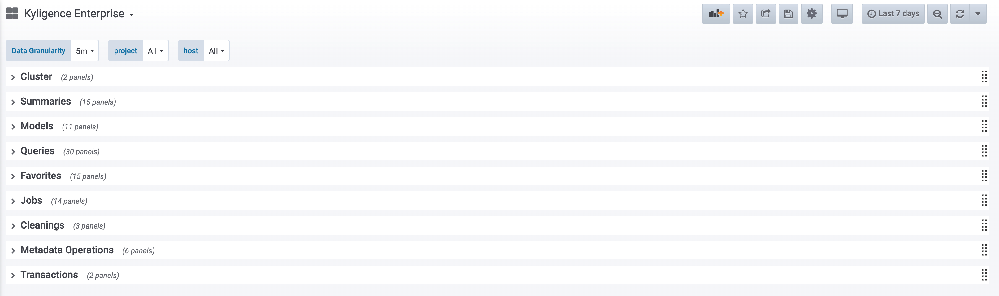
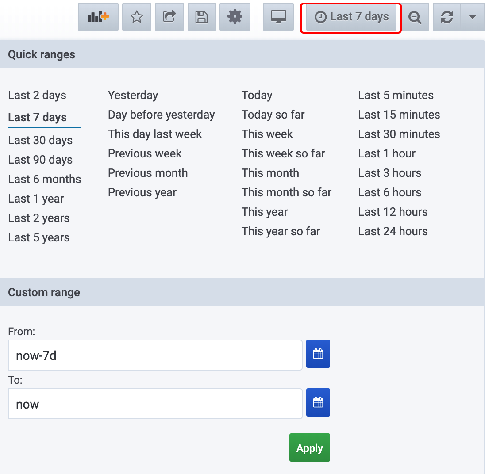

By default, the system collects metric data every minute, including storage, query, job, metadata, and cleanup mechanism. The monitoring data is stored in the specified [InfluxDB](https://www.influxdata.com/time-series-platform/) and displayed through [Grafana](https://grafana.com/grafana). It can help administrators to understand the health of the system in order to take necessary actions.

> **Note**: Since Grafana depends on **InfluxDB**, please make sure that InfluxDB is correctly configured and started according to [Use InfluxDB as Time-Series Database](influxdb/influxdb.md) and download **Grafana** before you use Grafana.

```shell
# Download Grafana
$KYLIN_HOME/sbin/download-grafana.sh
```

> **Note**: The Grafana installation path, will be under the `grafana` directory in the installation directory of Kylin.


### <span id="grafana_startup">Grafana</span>

1. **Working Directory**: ``` $KYLIN_HOME/grafana```
2. **Configuration Directory**: ```$KYLIN_HOME/grafana/conf```
3. **Start Grafana Command**: ```$ KYLIN_HOME/bin/grafana.sh start```
4. **Stop Grafana Command**: ``` $ KYLIN_HOME/bin/grafana.sh stop```

> Changing grafana configuration please refer to [Configuration](https://grafana.com/docs/installation/configuration/).

After the startup is successful, you may access Grafana through web browser with default port: 3000, username: admin, password: admin



### <span id="dashboard">Dashboard</span>

Default Dashboard: ```Kylin 5.0```

The dashboard consists of 10 modules: Cluster, Summaries, Models, Queries, Favorites, Jobs, Cleanings, Metadata Operations, Transactions, among which Summaries module is automatically displayed in detail. Read more details about the modules, please refer to [Metrics Explanation](#explanation). If you want to make some changes for the dashboard, please refer to Grafana official website manual [Provisioning Grafana](https://grafana.com/docs/administration/provisioning/). 

### <span id="panel">Panel</span>

Each indicator monitor corresponds to a specific panel.

### <span id="__interval">Time Range</span>

In the upper right corner of the dashboard, choose the time range. Time range: the time interval in which the indicator was observed.


### <span id="granularity">Data Granularity</span>

Located in the upper left corner of the dashboard, the data granularity: auto, 1m, 5m, 10m, 30m, 1h, 6h, 12h, 1d, 7d, 14d, 30d ('auto' is automatically adjusted according to the time range, such as the time range '30min' corresponding granularity 5min, and the granularity corresponding to the time range of 24h is 4h).

### <span id="explanation">Metrics Explanation</span>

- [**Cluster**: Cluster overiew](#cluster)
- [**Summaries**: Global overview](#summaries)
- [**Models**: Model related metrics](#models)
- [**Queries**: Query related metrics](#queries)
- [**Favorites**: Favorite Query related metrics](#favorites)
- [**Jobs**: Job related metrics](#jobs)
- [**Cleanings**: Cleanup mechanisms related metrics](#cleanings)
- [**Metadata Operations**: Metadata operations related metrics](#metadata)
- [**Transactions**: Transaction mechanisms related metrics](#transactions)

> **Tip **: “Project related” in the following table indicates whether the metric is related to the project, “Y” indicates that the metric is related to the project, and “N” indicates that the metric is not related to the project. "Host related" in the following table indicates whether the metric is related to Kylin nodes, "Y" indicates that the metric is related to the Kylin nodes, "N" indicates that the metric is not related to the host. "all", "job", "query" is Kylin nodes' server mode.

#### <span id="cluster">Cluster: Cluster overview</span>

| Name       | Meaning    | Project related     |
| :------------- | :---------- | :----------- |
| build_unavailable_duration | the unavailable time of building | N |
| query_unavailable_duration | the unavailable time of query | N |

<span id="summaries">**Summaries**: Global overview</span>

| Name       | Meaning    | Project related | Host related     | Remark    |
| :------------- | :---------- | :----------- | :----------- | :----------- |
|  summary_exec_total_times | Times of all indicators collected | N | Y(all, job, query) | The cost of collecting indicators |
|  summary_exec_total_duration | Duration of all indicators collected | N | Y(all, job, query) | The cost of collecting indicators |
| num_of_projects             | Total project number | N | N | - |
|  storage_size_gauge | Storage used of the system | Y | N | - |
| num_of_users                | Total user number | N | N | - |
| num_of_hive_tables          | Total data table number | Y | N | - |
| num_of_hive_databases       | Total database number | Y | N | - |
| summary_of_heap             | The heap size of Kylin | N | Y(all, job, query) | - |
| usage_of_heap               | The ratio of heap of Kylin | N | Y(all, job, query) | - |
| count_of_garbage_collection | The count of garbage collection | N | Y(all, job, query) | - |
| time_of_garbage_collection  | The total time of garbage collection | N | Y(all, job, query) | - |
|  garbage_size_gauge | Storage used of garbage | Y   | N | Refer to the definition of "Garbage" |
|  sparder_restart_total_times | "Sparder" restart times | N | Y(all, job, query) | "Sparder" is the internal query engine |
|  query_load | spark sql load | N | Y(all, query) | - |
|  cpu_cores | The number of cup cores for query configured in kylin.properties | N | Y(all, query) | Refer "Spark-related Configuration" |

####  <span id="models">Models：Model related metrics</span>

| Name       | Meaning    | Project related | Host related     |
| :------------- | :---------- | :----------- | :----------- |
|  model_num_gauge | "Model number: curve with time | Y | N |
|  non_broken_model_num_gauge | "Healthy model number" curve with time | Y | N |
| last_query_time_of_models  | The last query time of models | Y | N |
| hit_count_of_models        | The query hit count of models | Y | N |
| storage_of_models          | The storage of models | Y | N |
| segments_num_of_models     | The num of segments of models | Y | N |
| model_build_duration       | Total build time of models | Y | N |
| model_wait_duration        | Total wait time of models | Y | N |
| number_of_indexes          | indexes number of models | Y | N |
| expansion_rate_of_models   | Expansion rate of models | Y | N |
| model_build_duration (avg) | Avg build time of models | Y | N |

#### <span id="queries">Queries：Query related metrics</span>

| Name       | Meaning    | Project related | Host related    | Remark    |
| :------------- | :---------- | :----------- | :----------- | :----------- |
| count_of_queries                     | Total count of queries | Y | Y(all, query) | - |
| num_of_query_per_host                | The num of query per host | N | Y(all, query) | - |
| count_of_queries_hitting_agg_index   | The count of queries hitting agg index | Y | Y(all, query) | - |
| ratio_of_queries_hitting_agg_index   | The ratio of queries hitting agg index | Y | Y(all, query) | - |
| count_of_queries_hitting_table_index | The count of queries hitting table index | Y | Y(all, query) | - |
| ratio_of_queries_hitting_table_index | The ratio of queries hitting table index | Y | Y(all, query) | - |
| count_of_pushdown_queries            | The count of pushdown queries | Y | Y(all, query) | - |
| ratio_of_pushdown_queries            | The ratio of pushdown queries | Y | Y(all, query) | - |
| count_of_queries_hitting_cache       | The count of queries hitting cache | Y | Y(all, query) | - |
| ratio_of_queries_hitting_cache       | The ratio of queries hitting cache | Y | Y(all, query) | - |
| count_of_queries_less_than_1s        | Total count of queries when duration is less than 1 second | Y | Y(all, query) | - |
| ratio_of_queries_less_than_1s        | The ratio of queries when duration is less than 1 second | Y | Y(all, query) | - |
| count_of_queries_between_1s_and_3s   | Total count of queries when duration is between 1 second and 3 seconds | Y | Y(all, query) | - |
| ration_of_queries_between_1s_and_3s  | The ratio of queries when duration is between 1 second and 3 seconds | Y | Y(all, query) | - |
| count_of_queries_between_3s_and_5s   | Total count of queries when duration is between 3 seconds and 5 seconds | Y | Y(all, query) | - |
| ratio_of_queries_between_3s_and_5s   | The ratio of queries when duration is between 3 seconds and 5 seconds | Y | Y(all, query) | - |
| count_of_queries_between_5s_and_10s  | Total count of queries when duration is between 5 seconds and 10 seconds | Y | Y(all, query) | - |
| ratio_of_queries_between_5s_and_10s  | The ratio of queries when duration is between 5 seconds and 10 seconds | Y | Y(all, query) | - |
| count_of_queries_greater_than_10s    | Total count of queries when duration exceeding 10 seconds | Y | Y(all, query) | - |
| ratio_of_queries_greater_than_10s    | The ratio of queries when duration exceeding 10 seconds | Y | Y(all, query) | - |
| count_of_timeout_queries             | The count of timeout queries | Y | Y(all, query) | - |
| count_of_failed_queries              | The count of failed queries | Y | Y(all, query) | - |
| mean_time_of_query_per_host          | The mean time of queries per host | N | Y(all, query) | - |
| 99%_of_query_latency                 | Query duration 99-percentile | Y | Y(all, query) | - |
|  gt10s_query_rate_5-minute | Query duration exceeding 10s per second over 5 minutes | Y | Y(all, query) | - |
|  failed_query_rate_5-minute | Failed queries per second over 5 minutes | Y | Y(all, query) | - |
|  pushdown_query_rate_5-minute | Pushdown queries per second over 5 minutes | Y | Y(all, query) | - |
| scan_bytes_of_99%_queries            | Query scan bytes 99-percentile | Y | Y(all, query) | - |
| query_scan_bytes_of_host             | Query scan bytes per host | N | Y(all, query) |-|
| mean_scan_bytes_of_queries           | The mean scan bytes of queries | Y | Y(all, query) | - |

#### <span id="favorites">Favorites：Favorite Query related metrics</span>

| Name       | Meaning    | Project related | Host related    | Remark    |
| :------------- | :---------- | :----------- | :----------- | :----------- |
|  fq_accepted_total_times | Favorite Query user submitted total times | Y | Y(all, job, query) | - |
|  fq_proposed_total_times | Favorite Query system triggered total times | Y | N | - |
|  fq_proposed_total_duration | Favorite Query system triggered total duration | Y    | N |-|
|  failed_fq_proposed_total_times | Favorite Query system triggered failed total times | Y | N | Refer to the definition of "pushdown" |
|  fq_adjusted_total_times | Favorite Query system adjusted total times | Y | Y(all, job, query) | - |
|  fq_adjusted_total_duration | Favorite Query system adjusted total duration | Y | Y(all, job, query) | - |
|  fq_update_usage_total_times | Favorite Query usage updated total times | Y | N | - |
|  fq_update_usage_total_duration | Favorite Query usage updated total duration | Y | N | - |
|  failed_fq_update_usage_total_times | Favorite Query usage updated failed total times | Y | N | - |
|  fq_tobeaccelerated_num_gauge	 | Favorite Query to be accelerated | Y | N | - |
|  fq_accelerated_num_gauge | Favorite Query accelerated | Y | N | - |
|  fq_failed_num_gauge | Favorite Query accelerated failed times | Y | N | - |
|  fq_accelerating_num_gauge | Favorite Query accelerating | Y | N | - |
|  fq_pending_num_gauge | Favorite Query pending | Y | N | Favorite Query lacks of necessary conditions, such as missing column names, requiring user intervention |
|  fq_blacklist_num_gauge | Favorite Query in blacklist | Y | N | Refer to the definition of "Blacklist" |

#### <span id="jobs">Jobs：Job related metrics</span>

| Name       | Meaning    | Project related | Host related     |
| :------------- | :---------- | :----------- | :----------- |
| num_of_jobs_created                   | Jobs created total number | Y | Y(all, job) |
| num_of_jobs_finished                  | Jobs finished total number | Y | Y(all, job) |
| num_of_running_jobs                   | The num of running jobs currently | Y | N |
| num_of_pending_jobs                   | The num of pending jobs currently | Y | N |
| num_of_error_jobs                     | The num of error jobs currently | Y | N |
| count_of_error_jobs                   | The total count of error | Y | Y(all, job) |
| finished_jobs_total_duration          | Jobs finished total duration | Y | Y(all, job) |
|  job_duration_99p | Jobs duration 99-percentile | Y | Y(all, job) |
|  job_step_attempted_total_times | Jobs step attempted total times | Y | Y(all, job) |
|  failed_job_step_attempted_total_times | Jobs step attempted failed total times | Y | Y(all, job) |
|  job_resumed_total_times | Jobs resumed total times | Y | Y(all, job) |
|  job_discarded_total_times | Jobs discarded total times | Y | Y(all, job) |
| job_duration                          | The build duration of job | Y | Y(all, job) |
| job_wait_duration                     | The wait duration of job | Y | Y(all, job) |

#### <span id="cleanings">Cleanings：Cleanup mechanisms related metrics</span>

| Name       | Meaning    | Project related | Host related     |
| :------------- | :---------- | :----------- | :----------- |
|  storage_clean_total_times | Storage cleanup total times | N | Y(all, job, query) |
|  storage_clean_total_duration | Storage cleanup total duration | N | Y(all, job, query) |
|  failed_storage_clean_total_times | Storage cleanup failed total times | N | Y(all, job, query) |

#### <span id="metadata">Metadata Operations：Metadata operations related metrics</span>

| Name       | Meaning    | Project related | Host related     | Remark    |
| :------------- | :---------- | :----------- | :----------- | :----------- |
|  metadata_clean_total_times | Metadata cleanup total times | Y | Y(all, job, query) | - |
|  metadata_backup_total_times | Metadata backup total times | Y | Y(all, job, query) | Differentiate projects and global |
|  metadata_backup_total_duration | Metadata backup total duration | Y | Y(all, job, query) | Differentiate projects and global |
|  failed_metadata_backup_total_times | Metadata backup failed total times | Y | Y(all, job, query) | Differentiate projects and global |
|  metadata_ops_total_times | Metadata daily operations total times | N | Y(all, job, query) | Fixed time per day (configurable): automatically backup metadata; rotate audit_log; cleanup metadata and storage space; adjust FQ; cleanup query histories. |
|  metadata_success_ops_total_times | Metadata daily operations failed total times | N | Y(all, job, query) |-|

#### <span id="transactions">Transactions：Transaction mechanisms related metrics</span>

| Name       | Meaning    | Project related | Host related     | Remark    |
| :------------- | :---------- | :----------- | :----------- |:----------- |
|  transaction_retry_total_times | Transactions retried total times | Y | Y(all, job, query) | Differentiate projects, and, global |
|  transaction_latency_99p | Transactions duration 99-percentile | Y | Y(all, job, query) | Differentiate projects, and, global |
