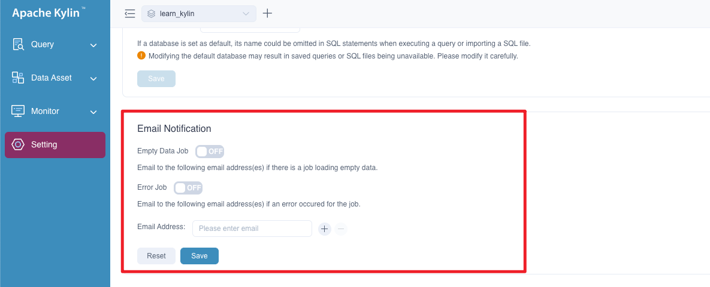

Kylin provides *Job Status Alert* feature that sends emails to system administrator if any job loads empty data or failed. It is very convenient for follow-ups like troubleshooting or incremental building.

Job status alert by email can be enabled by the following steps,

**Step one**: You need to additionally set following properties in the configuration file `$KYLIN_HOME/conf/kylin.properties`,

   ```properties
   kylin.job.notification-enabled=true|false  # set to true to enable the feature
   kylin.job.notification-mail-enable-starttls=true|false 
   kylin.job.notification-mail-host=your-smtp-server  # address of SMTP server
   kylin.job.notification-mail-port=your-smtp-port  # port of SMTP server
   kylin.job.notification-mail-username=your-smtp-account  # SMTP account username
   kylin.job.notification-mail-password=your-smtp-pwd  # SMTP account password
   kylin.job.notification-mail-sender=your-sender-address  # sender address 
   ```

> **Note**: If you need to encrypt `kylin.job.notification-mail-password`, you can do it like this：
>
> i. run following commands in `${KYLIN_HOME}`, it will print encrypted password
>  ```shell
>  ./bin/kylin.sh org.apache.kylin.tool.general.CryptTool -e AES -s <password>
>  ```
> ii. config `kylin.job.notification-mail-password` like this
>  ```properties
>   kylin.job.notification-mail-password=ENC('${encrypted_password}')
>  ```

   Please **Restart Kylin** to make configurations take effect.

**Step two**: Set in the project settings page,

   - Modelers and Analysts need to fill in the **Advanced Settings** --> **Email Notification** with your email addresses.

   
