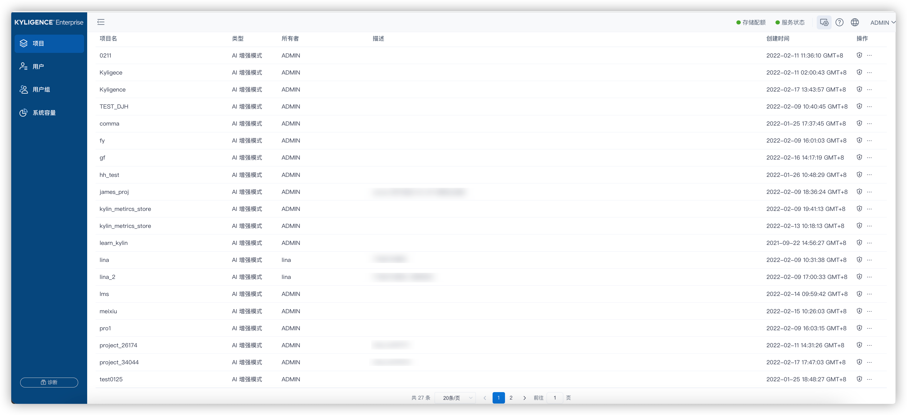
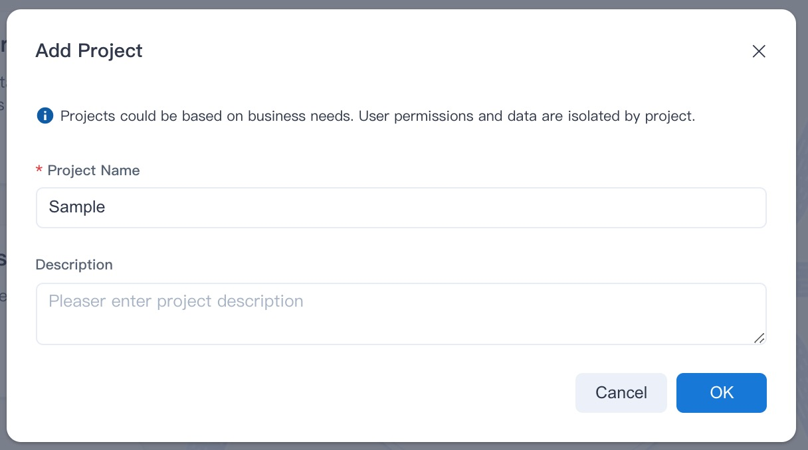

This chapter introduces what a project is and how to manage projects.

### About Projects

Project is the primary management unit of Kylin. In a project, you can design multiple models and perform query analysis.

System settings are isolated at the project level, so you can set different operational preferences for different projects.

### Manage Projects

After the system administrator logs in to Kylin, click the **Admin** button in the top toolbar to enter the system management page, and click the **Porject** field to enter the Project Management page.

**Note**: if no project exist, you will not be allowed to access the **Admin** page. Please add a project firstly and then enter the **Admin** page.

On the project management page, the system administrator can view the project information in the project list, and can also add projects, delete projects, backup projects, or grant user access permissions.

### Add a Project

The system administrator has two ways to add a new project:

- On the **Admin -> Project Management** page, click the **+ Project** button above the project list.
- On the product normal page, click the **+**（Add Project) button at the top toolbar.

Fill in the project name and description in the pop-up window. The project name is mandatory; the project description is optional. A good project description will help with the maintenance of the project in the future.

> **tips:** project name is case insensitive, so duplicate names with existing project names are not allowed.

### Delete a Project

On the Project Management page, select a project to be deleted, click the **...**(More Actions) button under the **Actions** bar on the right, then click **Delete**. 

The system administrator can confirm to delete a project in the prompted window. After the project is deleted, it will not be restored and the related data will be cleared.

If there are jobs in **RUNNING, PENDING, or PAUSED** status in the project, it is needed to terminate the jobs before deleting the project.

### Change Project Owner

On the Project Management page, select a project to change owner, click the **...**(More Actions) button under the **Actions** bar on the right, then click **Change Owner**. Only the system administrator has permission to change the project owner.

### Grant Porject-level Access Rights to User

On the Project Management page, select a project to authorizer, click the **Authorization** button under the **Actions** bar on the right and set permissions for the project. You can find out more at the [Project ACL](../access-control/data-access-control/project_acl.md) section.
