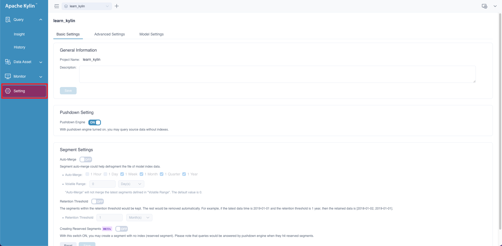
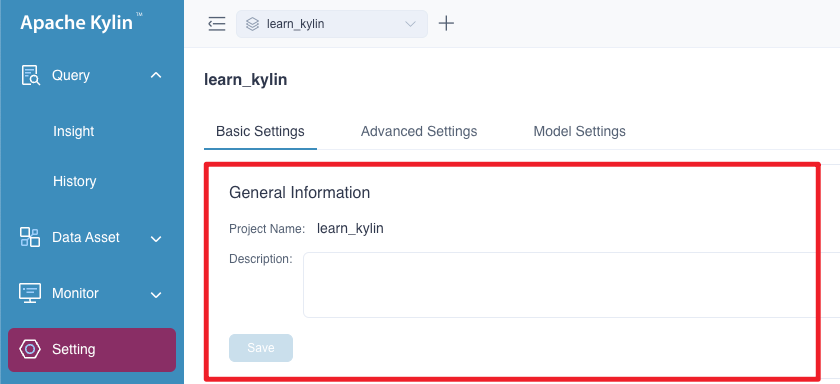
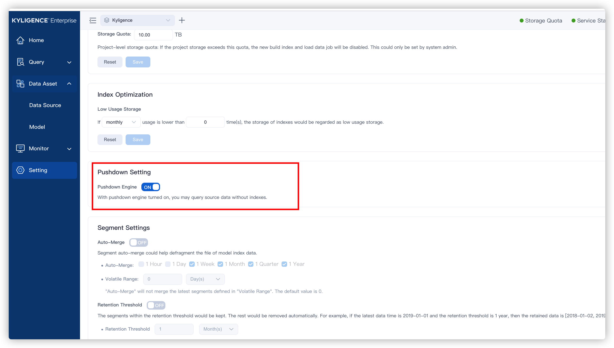
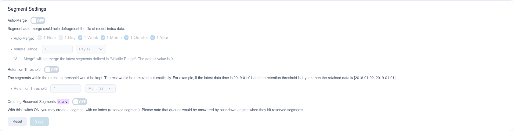
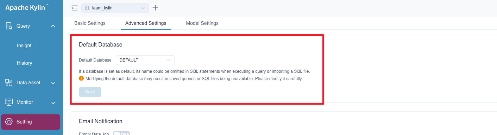
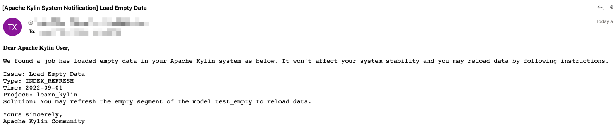
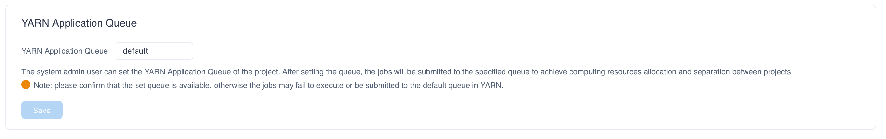
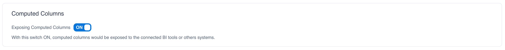
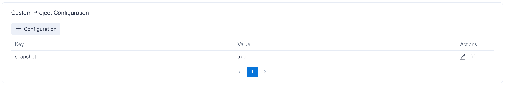
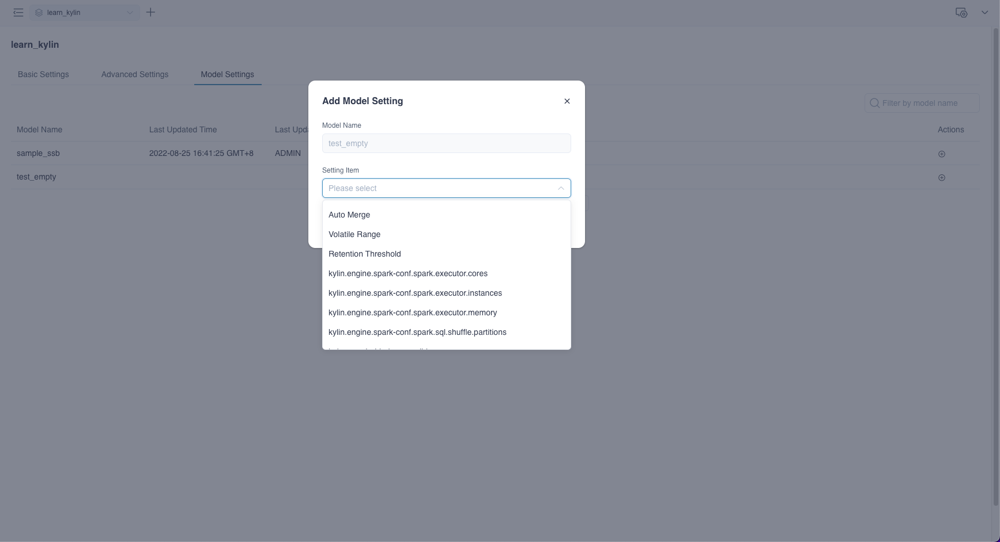

On the left side navigation bar of the page, click **Setting**，you can adjust some settings at the project level on your business demands.

All settings are composed of three main parts:

- [Project Settings](#project-settings)
	- [Basic Settings](#basic-settings)
	- [Advanced Settings](#advanced-settings)
	- [Model/Index Group Rewrite Settings](#modelindex-group-rewrite-settings)

### Basic Settings

#### 1. General Information

In this part, you can check current project's name and description, also, you can modify project description.

#### 2. Pushdown Setting

If you don't have any models or there is no avaliable models to answer your queries, you can use **pushdown** to get results for a more flexible user experience, and your queries will be pushdown to Spark SQL by default. This setting is turned on by default.

#### 3. Segment Settings

This part is about settings of segment, including Segment Merge, Retention Threshold and Creating Reserved Segments.

**Segment Merge** means the system will automatically merge segments when those segments match the rules and contain the same indexes. Below is how to define the rules.

- **Auto-Merge**: You can choose to automatically merge segments within the time range in 1 hour / 1 day / 1 week / 1 month / 1 quarter / 1 year （natural concepts）.
      
        > Example of natural concept: Natural week means Monday to Sunday. Natural month means the first day of a month to the last day of the month.     Civil year means the first day of a year to the last day of the year.

- **Volatile Range**: The system will delay for a period of time (i.e. Volatile Range) to trigger automatic merging of Segments. You can set the time range to N hour(s), day(s), week(s), month(s), quarter(s), and year(s), where day(s), week(s), and month(s) are natural concepts. N is an integer, and the default value is 0.
  
  - Usage scenario: In actual business, due to the delay of the ETL process, for example, the business often needs to refresh the data of the past N days every day. During auto-merge, in order to reduce resource waste, you can set Volatile Range to prevent the system from automatically merging segments to be refreshed for the past N days.
    
> For example: If you build a segment every day and you set the auto-merge time range as 1 week, then you will have 7 segments no.01-07 over last week. 
>
> - Volatile range is 0 day , the system will automatically merge 7 segments.
> - Volatile range is 1 day(i.e. the business needs to refresh no.07 Segment on the next day), therefore, the system will not merge no.01-07 segments; the system will not merge the 01-07 segments until the segment no.08 is added in the second week. 
> - Volatile range is 2 days(i.e. the business needs to refresh no.06-07 Segments on the next day), therefore, the system will not merge no.01-07 segments until the segments no.08-09 are added in the second week.

**Retention Threshold** sets the oldest segment time range. Support setting day, month, or year as units. By default, Kylin only keeps segments for 1 year, segments beyond 1 year will be deleted automatically.

**Creating Reserved Segments** With this switch ON, you may create a segment with no index (reserved segment). Please note that queries would be answered by pushdown engine when they hit reserved segments.

The picture below is the segment setting page.

### Advanced Settings

This module includes 5 parts mainly: default database, job notification, YARN application queue, computed column exposure and custom project configuration.

#### 1. Default Database

After setting the default database, the database name can be omitted in SQL statements when executing a query or importing a SQL file. Modifying the default database may result in saved queries or SQL files being unavailable, historical queries cannot hit the models. Please modify the default database prudently.

The picture below is the default database setting page:

#### 2. Job Notification

If you want to receive notification of abnormal jobs, you can add your email addresses in this page, once there is any job which loads empty data or gets failed, the system will send you a notification email, the example email goes like this:

For specific configuration, please refer to [Job Status Alert](alerting.md) for more details.

#### 3. YARN Application Queue

The system admin user can set the YARN Application Queue of the project. After setting the queue, the jobs will be submitted to the specified queue to achieve computing resources allocation and separation between projects. This queue resource is used for non-query jobs such as refreshing data, merging segments, building indexes, loading data and sampling table.

The system will submit the job to the **default** queue of YARN by default. The name of YARN queue is case sensitive. Please make sure the queue you set is available, otherwise the jobs may fail to execute or be submitted to the default queue according to the current **Scheduler Policy** of YARN.

The picture below is the yarn queue setting page:

#### 4. Computed Column Exposure

This config will control the exposure of the computed columns in current project. If this config is on, Kylin will add computed columns of current project to the table schemas returned. Otherwise, computed columns are hidden from the table schema. This config will influence the table schemas in JDBC, ODBC or BI tools.
You may not want to change this config frequently as it might break the project in your BI tools.

#### 5. Custom Project Configuration

Administrators can add additional project configuration items needed by customizing the project configuration. You can click the **+ Configuration** button, enter the configuration item and parameter value in the pop-up window, and then click **OK**. If you need to modify or delete the added configuration items, you can click the **Edit** or **Delete** button on the right side of the list. These operations take effect immediately.

### Model/Index Group Rewrite Settings

Kylin supports rewriting some specific properties at level, including Auto-Merge, Volatile Range, Retention Threshold, spark executor resource size and Custom Settings.

Click **+** button (Add Setting Item) under the right **Actions** tab:

