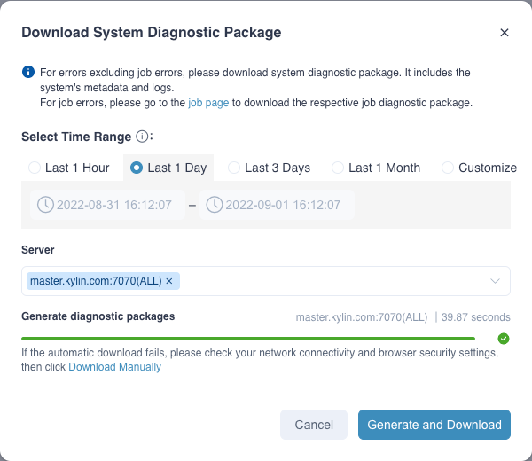
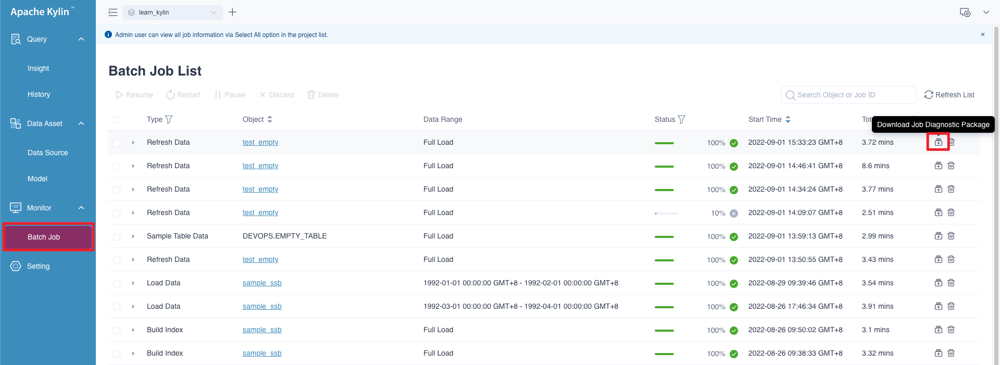
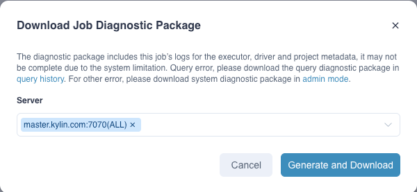
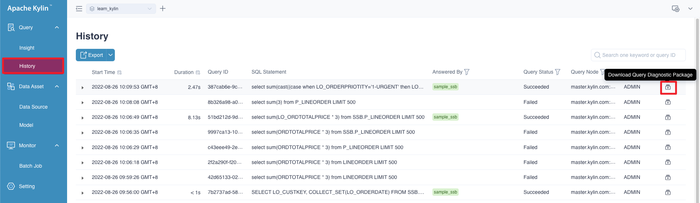
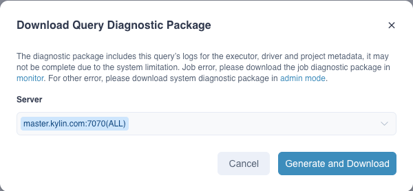

Kylin users may face with many problems during usage, such as  job failure, SQL query failure, SQL query overtime, etc. In order to help solve these problems efficiently, Kylin provides a *Diagnosis* function on Web UI to pack related information into a zip package to help operation staff and Kylin Community to analyze the root cause. 

Diagnosis function includes System, Job and Query Diagnosis. In addition to the method of generating diagnostic package on web UI described in this chapter, you can also generate the diagnostic package through the bash script. For details, please refer to [Diagnosis Tool](../cli_tool/diagnosis.md).

### Generate System Diagnostic Package in Web UI

System diagnostic package includes all diagnostic information of a Kylin instance, and users can generate system diagnostic package on Web UI following the following steps:

1. Enter the **Admin** page and click the **Diagnosis** button in the lower left corner.

   > **Note**: Only the system administrator can generate the system diagnostic package in web ui for the time being.

2. Select **Time Range**: You can select *last one hour*, *last one day*, *last three days* and *last one month*, or self-defined.

   > **Note:** The selected time range must include the period of incidents.

3. Select **Server**.

   > **Note:** If Kylin is deployed on multiple nodes, please locate the specific node on which your issue happened by selecting the right server name, otherwise the generated system diagnostic package may not include useful information about the issue.

4. Click **Generate and Download** button: After the diagnostic package is generated, the downloads will be triggered automatically. If the diagnostic package generation fails, you can view the details of the failure on the interface.

### Generate Job Diagnostic Package in Web UI

Job diagnostic package includes all diagnostic information of a specific job, and users can generate job diagnostic package on Web UI by following the following steps:

1. After logging in to Kylin, click **Monitor** in the left navigation bar. In the action bar of a job on the **Jobs List** page, click the **Download Job Diagnostic Package** button.
2. Select **Server**.
3. Click **Generate and Download** button: After the diagnostic package is generated, the downloads will be triggered automatically. If the diagnostic package generation fails, you can view the details of the failure on the interface.

### Generate Query Diagnosis Package in Web UI

Query diagnosis package includes all diagnostic information of a specific query, and users can generate query diagnosis package on Web UI by following the following steps:

1. After logging in to Kylin, click **Query** in the left navigation bar. In the action bar of a query on the **History** page, click the **Download Query Diagnostic Package** button in **Action**.
2. Click **Generate and Download** button: After the diagnosis package is generated, the downloads will be triggered automatically. If the diagnosis package generation fails, you can view the details of the failure on the interface.

By default, all users with project query permissions can download the query diagnostic package to facilitate query problem diagnosis.
Since the query diagnostic package contains some configuration information, if you want to reduce the relevant permissions for downloading the query diagnostic package, you can add configuration `kylin.security.allow-non-admin-generate-query-diag-package=false` in `$KYLIN_HOME/conf/kylin.properties`, only system administrators and users with project ADMIN permissions are allowed to download the query diagnostic package.

### FAQ

**Q: What are the differences in the contents of the three diagnostic packages?**

For the contents of the three diagnostic packages, please refer to [Diagnosis Package Tool](../cli_tool/diagnosis.md).

**Q: If I failed to generate diagnostic packages because of timeout.**

Please change parameter `kylin.diag.package.timeout-seconds`(in seconds, the default value is one hour) in `$KYLIN_HOME/conf/kylin.properties` and restart Kylin.

**Q: What should I do if the page does not download the diagnostic package automatically after the packaging is completed?**

If the system has generated the diagnostic package successfully but fails to download it automatically, you can click **Download Manually** at the bottom left, select the diagnostic package you want to download, and then click the download button to download manually.

**Q: What should I do if the hostname used by Kylin contains an underscore (`_`) and generates a diagnostic package has exception?**

Please add service discovery parameter `spring.cloud.zookeeper.discovery.instance-host=IP` in `$KYLIN_HOME/kylin.properties.override` and restart Kylin.
