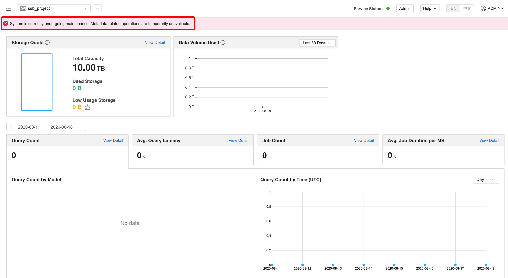
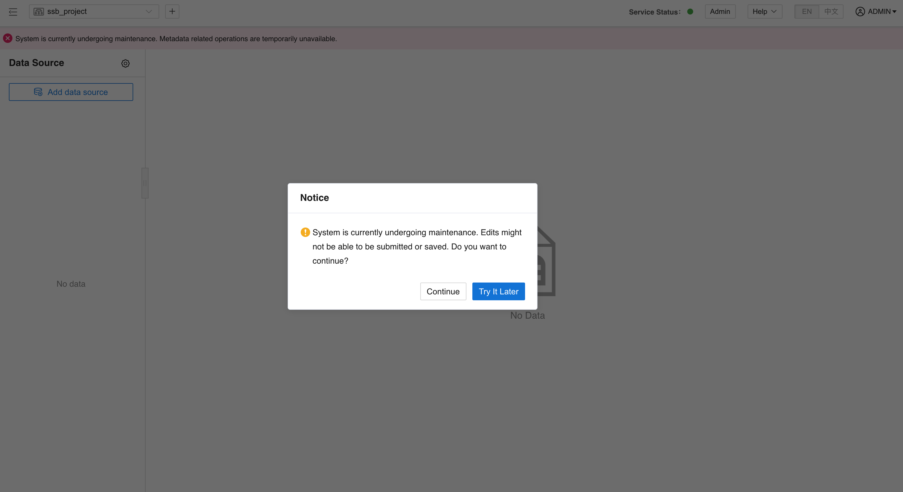
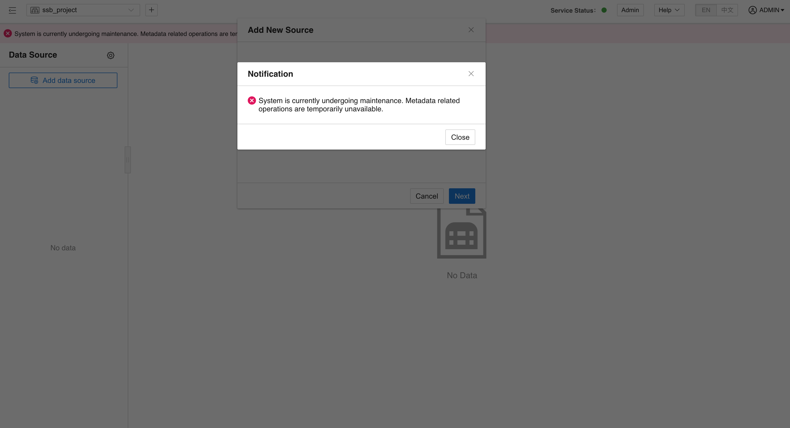
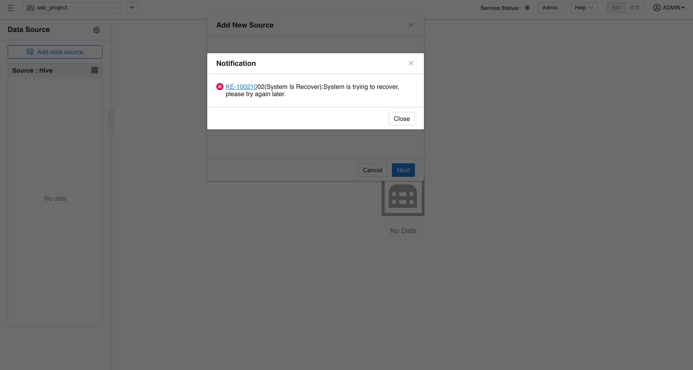

## Basic Concepts

When in maintenance mode, Kylin nodes will not be able to modify metadata, and only read operations such as queries will not be affected

## Entering maintenance mode
  Run the following command to enter maintenance mode:
  ```sh
  ${KYLIN_HOME}/bin/kylin.sh org.apache.kylin.tool.MaintainModeTool -on -reason ${reason}
  ```

  **Note**:

- You need to use the argument -reason to explain why you turn on maintenance mode。

  - When it is in maintenance mode, it is not allowed to enter maintenance mode again. You need to manually exit maintenance mode first
  
- ${reason} refers to the reason for entering maintenance mode. There are no fixed characters. You can enter any word, such as `upgrade`

  When in maintenance mode, you will get following prompt:

  

  metadata modification operations, such as create project, load/unload tables, create/update models, etc., 
  can't be executed.

  If you do the above, the following errors will occur:

  

  

## Exiting Maintenance mode
  Run the following command to exit maintenance mode:
  ```sh
  ${KYLIN_HOME}/bin/kylin.sh org.apache.kylin.tool.MaintainModeTool -off
  ```
  **Note**：While system is already in maintenance mode, the system will prompt you after executing command. In speciality, you can use `-f` or `--force` parameter to force to turn off maintenance mode, 
  to release all occupation of project.

  After the command was executed, you may not modify metadata immediately. It should be waiting Kylin nodes to
  get the resources. You can refer following properties: 
  ```properties
  kylin.server.leader-race.heart-beat-interval=30
  ```
  Its unit is seconds. You should wait up to 30 seconds.

  During the maintenance, if you try to modify metadata, you will get following prompt:

  


## Recommendations for the use of maintenance mode

Maintenance mode is provided to prevent metadata write conflicts in the system.
In principle, users are not recommended to turn on or turn off this function manually.
When running the following commands, the system will automatically turn on the maintenance mode, and turn off the maintenance mode after the operation ends.

 - [reset admin password](../access-control/user_management.md)
 - [junk file clean](junk_file_clean.md)
 - [metadata restore](cli_tool/metadata_tool/metadata_backup_restore.md#metadata-restore----metadata_restore)
