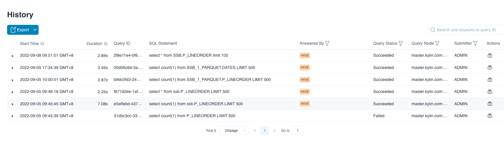
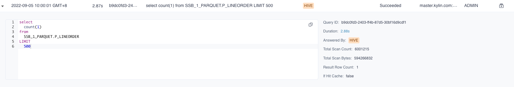
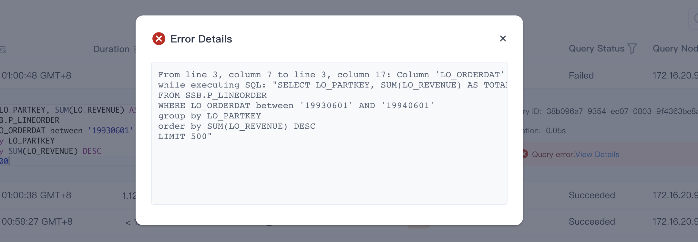
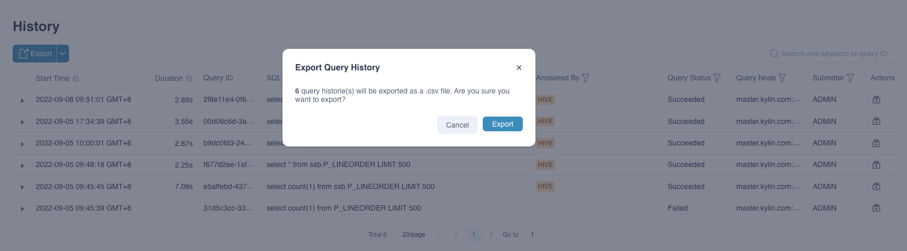
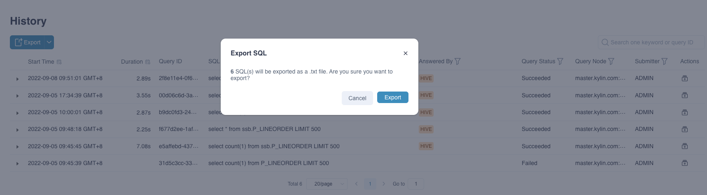

All the queries that you executed in Kylin will be saved in query history, you can check it out in the left side navigation bar **Query -> History**.
This page saves the basic information of queries, such as query time, SQL statement, query user, etc. This helps you to record query behaviors, which enables you to better manage and optimize the models. This chapter will presents you the content of query history page.


### Prerequisite

1. Before introducing **Query History** page, we recommend you to execute several SQL statements.

2. Take the model we built in the quick start as an example. After you complete the quick start, and all the jobs in **Monitor -> Job** are finished, you can execute the following queries in **Query -> Insight** page.


- Query 1：query total revenue.

  ```sql
  select SUM(LO_REVENUE) as TOTAL_REVENUE from SSB.P_LINEORDER
  ```

  > Hint：column *LO_REVENUE* 's SUM measure exists.

- Query 2：query total order price.

  ```sql
  select SUM(LO_ORDTOTALPRICE) from SSB.P_LINEORDER
  ```

  > Hint：column *LO_ORDTOTALPRICE* 's SUM measure not exists.

- Query 3：query name of commodities.

  ```sql
  select P_NAME from SSB.P_LINEORDER
  ```

  > Hint：this is a wrong query，because column *P_NAME* does not exist in table *P_LINEORDER*.


### Query History Page

Please enter the query history page by clicking **Query -> History** in the navigator bar, after executing the above SQL statements, you will see the following content.



Each line in the picture is a query history record. The meaning of the columns are as follows:

- **Start time**: The time the query was submitted.

- **Duration**: The time taken to complete the query. If the query fails, it is displayed as blank.

- **Query ID**: A unique ID number for each query, which is an automatically generated sequence number.

- **SQL Statement**: SQL statement that was executed.

- **Answered By**: There are four query objects. The blue name indicates the query hit model (index group). As shown in the diagram, the model name is *test_model_name1578277468526*, *HIVE* indicates that the query is pushed down to Hive, and *CONSTANTS* indicates Query constant, blank indicates that the query failed.

  There are four types of query objects that a query hits： All Models, HIVE, CONSTANTS, Model Name.

    - All Models： Indicates that the query hits the model

    - Hive： Indicates that the query is pushed down to Hive

    - CONSTANTS： Indicates query constant

    - Model Name： Represents the name of the model hit by the query

- **Query Status**: There are two query statuses. Queries that hit the model and push down show *Succeeded* and queries that have syntax errors, unsupported syntax, and timeouts show *Failed*.

- **Query Node**: The hostname : port of query node.

- **Submitter**: User who submits the query to Kylin.

- **Actions**: Download the query diagnostic package.

When you click on the icon to the left of a query, the execution details of the query will be displayed, as shown below:



On the left is the SQL statement, you can copy and paste and then query. The fields on the right have the following meanings:

- **Query ID**: A unique ID number for each query, which is an automatically generated sequence number.
- **Duration**: The time taken to complete the query. If the query fails, it is displayed as *Failed*. When you need to optimize for slow queries, you should analyze the query's specific execution steps and locate the reasons. It would help if you hovered the mouse over the duration to see the current query's detailed execution steps and duration.
- **Answered By**: The entity who answered the query.
- **Index ID**: The index who answered the query.
- **Total Scan Count**: Total scanned lines of the query.
- **Total Scan Bytes**: Total scanned bytes of the query.
- **Result Row Count**: Total lines of the query result.
- **If Hit Cache**: Whether the query hits the cache.
- **Cache Type**: When the query hits the cache, it displays the type of cache hit. `EHCACHE` stands for EHCACHE cache, `REDIS` stands for REDIS distributed cache.

When you click on the error details to the right of a query failure, the exception details of that query are displayed，as shown below:



> **Note**: When SQL does not wrap, only the first 100 lines of SQL can be seen in the query execution details. When SQL wraps, the details display the first 2000 characters. You can click the copy button in the upper right corner of the SQL statement box to copy the complete SQL statement.

Kylin uses the built-in RDBMS to save information about queries. You can refer to all fields and meanings related to query history in the appendix [Query History Fields Table](../deployment/on-premises/rdbms_metastore/query_history_fields.md).


### Query History Retention

In order to ensure the read and write performance of the query history and database stability, Kylin sets a default retention limit for the query history:

- The default total number of retained records is 10 million, which can be adjusted by configuring `kylin.query.queryhistory.max-size` in `kylin.properties`
    - The default number of retained records in one project is 1 million, which can be adjusted by configuring `kylin.query.queryhistory.project-max-size` in `kylin.properties`
- The total retention time is 30 days, which can be adjusted by configuring `kylin.query.queryhistory.survival-time-threshold` in `kylin.properties`


### Export query history

The query history can be exported as a csv file, as shown in the figure below, the export result is the filtered data.


You can also export the sql in the query history as a text file separately, as shown in the figure below, the export result is also the filtered data.


Query history support configuration export upper limit, the default value is 100000.
```kylin.query.query-history-download-max-size=100000```

